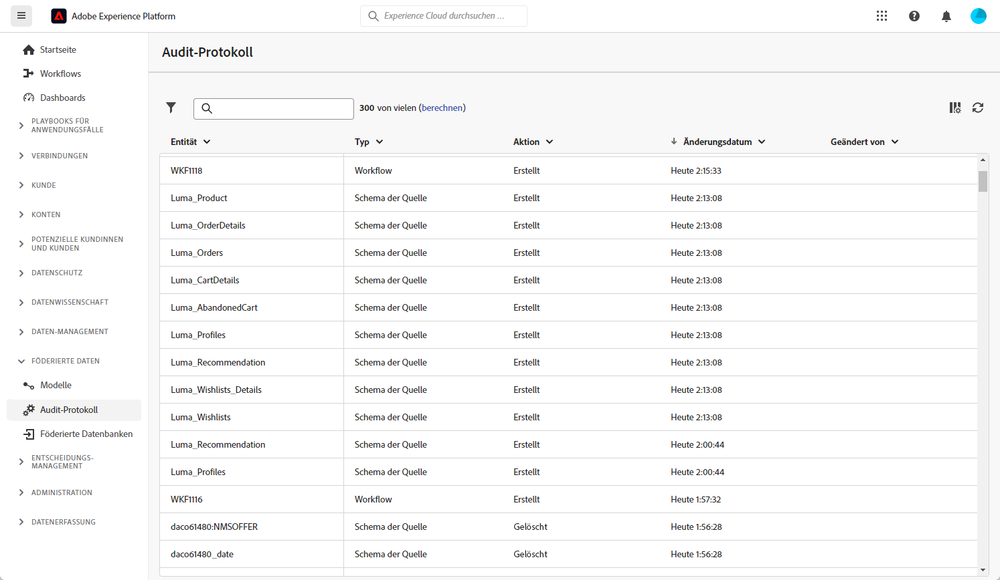

# Audit-Protokoll {#audit-trail}

>[!AVAILABILITY]
>
>Um auf das Audit-Protokoll zugreifen zu können, benötigen Sie die folgende Berechtigung:
>
>-**Audit-Protokoll anzeigen**
>
>Weitere Informationen zu den erforderlichen Berechtigungen finden Sie im [Handbuch zur Zugriffssteuerung](/help/governance-privacy-security/access-control.md).

>[!CONTEXTUALHELP]
>id="dc_audit_trail"
>title="Audit-Protokoll"
>abstract="Die Funktion „Audit-Protokoll“ bietet eine detaillierte und chronologische Aufzeichnung aller Aktionen und Ereignisse, die in Echtzeit an Ihrer Umgebung der Komposition föderierter Zielgruppen in Adobe Experience Platform durchgeführt wurden."

Die Funktion **[!UICONTROL Audit-Protokoll]** zeichnet ständig ein detailliertes Protokoll der Aktionen und Ereignisse auf, die innerhalb der Adobe-Instanz „Föderierte Komposition“ in Echtzeit stattfinden. Dies bietet eine einfache Methode, um auf einen chronologischen Dateneintrag mit Abfragen zuzugreifen, wie zum Status von Workflows, den Personen, die diese geändert haben oder den Aktivitäten, die von Benutzerinnen und Benutzern innerhalb der Instanz ausgeführt wurden.

+++ Weitere Informationen über die verfügbaren Entitäten im Audit-Protokoll

* Mit dem **Audit-Protokoll für Quellschemata** können Sie Aktivitäten und jüngste Änderungen an Ihren Schemata in der Adobe-Instanz „Komposition föderierter Zielgruppen“ zu überwachen.

  Detaillierte Informationen zu Schemata finden Sie auf dieser [Seite](../customer/schemas.md).

* Das **Workflow-Audit-Protokoll** ermöglicht es Ihnen, Aktivitäten und aktuelle Änderungen an Workflows zu verfolgen, einschließlich der aktuellen Status wie:

   * Starten
   * Aussetzen
   * Stoppen
   * Neu starten
   * Bereinigen, was der Aktion „Verlauf bereinigen“ entspricht
   * Simulieren, was der Aktion „Starten“ im Simulationsmodus entspricht
   * Wecken, was der Aktion „Vorgezogene Ausführung der ausstehenden Aufgaben“ entspricht
   * Unbedingter Stopp

  Weiterführende Informationen zu Workflows finden Sie auf [dieser Seite](../compositions/gs-compositions.md).

* Mit **Externes Konto** können Sie Änderungen an externen Konten in der Adobe-Instanz „Zielgruppenkomposition“ überprüfen.

  Weiterführende Informationen zu „Externes Konto“ finden Sie auf [dieser Seite](../connections/home.md).

+++

## Zugriff auf das Audit-Protokoll {#accessing-audit-trail}

So greifen auf das **[!UICONTROL Audit-Protokoll]** Ihrer Instanz zu:

1. Wählen Sie im Menü **[!UICONTROL Föderierte Daten]** die Option **[!UICONTROL Audit-Protokoll]** aus.

1. Das Fenster **[!UICONTROL Audit-Protokoll]** wird mit der Liste Ihrer Entitäten geöffnet. Die Komposition föderierter Zielgruppen protokolliert die Aktionen zum Erstellen, Bearbeiten und Löschen von Workflows, Optionen, Sendungen und Schemata.

   

1. Im Fenster **[!UICONTROL Audit-Entität]** erhalten Sie detailliertere Informationen zu der ausgewählten Entität, z. B.:

   * **[!UICONTROL Typ]**: Workflow, Optionen, Sendungen oder Schemata.
   * **[!UICONTROL Entität]**: Interner Name Ihrer Aktivitäten.
   * **[!UICONTROL Geändert von]**: Benutzername der Person, die diese Entität zuletzt geändert hat.
   * **[!UICONTROL Aktion]**: Letzte Aktion, die für diese Entität ausgeführt wurde, entweder „Erstellt“, „Geändert“ oder „Gelöscht“.
   * **[!UICONTROL Änderungsdatum]**: Datum der letzten Aktion, die an dieser Entität durchgeführt wurde.
