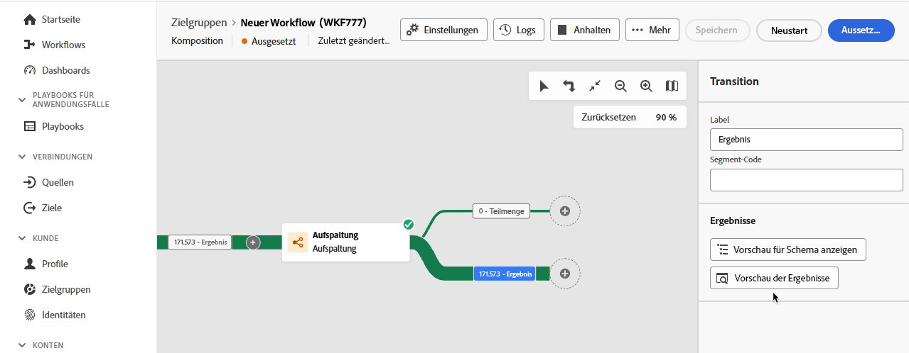

# Aktivitäten – Überblick

In der föderierten Zielgruppenkomposition können Sie Aktivitäten und Transitionen hinzufügen, mit denen Sie Ihre Zielgruppe definieren können.

## Aktivitäten {#activities}

Mit Aktivitäten können Sie die Komponenten in der Zielgruppe definieren.

Es gibt **zwei** verschiedene Arten von Aktivitäten, die innerhalb der Federated Audience Composition verwendet werden können: Zielgruppenbestimmungs- und Flusssteuerungsaktivitäten.

### Aktivitäten zur Zielgruppenbestimmung {#targeting}

Mit Zielgruppenbestimmungsaktivitäten können Sie festlegen, woraus Ihre Audience für die Komposition besteht.

#### Erstellen einer Zielgruppe

>[!CONTEXTUALHELP]
>id="dc_orchestration_build_audience_audienceselector"
>title="Zielgruppe"
>abstract="Wählen Sie die Zielgruppe aus."

Mit **Aktivität** Zielgruppe aufbauen“ können Sie Ihre Zielpopulation für die Komposition definieren. Sie können entweder eine bestehende Zielgruppe auswählen oder den Abfrage-Modeler verwenden, um Ihre eigene Abfrage zu definieren.

+++ Konfigurationsdetails

Nachdem Sie die Aktivität **Zielgruppe aufbauen** zur Arbeitsfläche für die Komposition hinzugefügt haben, geben Sie Ihrer Zielgruppe einen Namen. Jetzt können Sie angeben, ob Sie eine Zielgruppe erstellen oder eine vorhandene verwenden möchten.

>[!BEGINTABS]

>[!TAB Neue Zielgruppe erstellen]

Wählen Sie nach Auswahl **Zielgruppe erstellen** das **Schema** für Ihre Zielgruppe aus. Mit dem Schema können Sie die Population definieren, auf die sich der Vorgang bezieht, z. B. Empfänger, Vertragsbegünstigte, Benutzer oder Abonnenten. Standardmäßig wird das Schema aus den Empfängerinnen und Empfängern ausgewählt. 

Klicken Sie nach Auswahl eines Schemas auf **Weiter**. Sie können jetzt die Definition Ihrer Zielgruppe in der Abfrage-Modeler definieren. Weitere Informationen zur Verwendung der Abfrage-Modeler finden Sie unter [Abfrage-Modeler - Übersicht](../query/home.md).

>[!TAB Vorhandene Zielgruppe verwenden]

Klicken Sie nach **Auswahl von** Zielgruppe lesen **auf „Weiter**.

Sie können jetzt auswählen, welche Zielgruppe Sie für Ihre Komposition verwenden möchten.

>[!ENDTABS]

Nachdem Sie Ihre Optionen ausgewählt haben, können Sie **Ausgehende Transition erzeugen**. Mit dieser Option können Sie eine ausgehende Transition hinzufügen, die am Ende der Ausführung der Aktivität aktiviert wird, wenn die Zielgruppen-Population leer ist.

+++

#### Datenquelle ändern

Mit **Aktivität „Datenquelle ändern** können Sie ändern, welche Datenquelle von Ihrer Komposition verwendet wird.

+++ Konfigurationsdetails

Nachdem Sie die Aktivität **Datenquelle ändern** zu Ihrer Kompositions-Arbeitsfläche hinzugefügt haben, können Sie die Datenquelle definieren, die für die Komposition verwendet wird.

{zoomable="yes"}{width="70%"}

| Quelle | Beschreibung |
| ------ | ----------- |
| Externes FDA-Konto | Eine externe Cloud-Datenbank, die mit der Komposition föderierter Zielgruppen verbunden ist. |

Nach Auswahl des **[!UICONTROL externen FDA-Kontos]** können Sie auswählen, mit welchem externen Konto Sie eine Verbindung herstellen möchten.

{zoomable="yes"}{width="70%"}

+++

#### Dimensionsänderung

>[!CONTEXTUALHELP]
>id="dc_orchestration_dimension_complement"
>title="Erzeugen eines Komplements"
>abstract="Sie können eine zusätzliche ausgehende Transition mit der verbleibenden Population generieren, die als Duplikat ausgeschlossen wurde. Schalten Sie dazu die Option **[!UICONTROL Komplement erzeugen]** ein"

>[!CONTEXTUALHELP]
>id="dc_orchestration_change_dimension"
>title="Aktivität „Dimensionsänderung“"
>abstract="Mithilfe dieser Aktivität können Sie das Schema, auch bekannt als Zielgruppendimension, beim Erstellen einer Zielgruppe ändern. Die Aktivität verschiebt die Achse je nach Datenvorlage und Eingabeschema.  Beispielsweise können Sie vom Schema „Verträge“ zum Schema „Kundinnen und Kunden“ wechseln."

Die **Dimensionsänderung** Aktivität ermöglicht die Änderung des Schemas (auch als Zielgruppendimension bezeichnet) Ihrer Komposition.

+++ Konfigurationsdetails

Nachdem Sie die Aktivität **Dimensionsänderung** zu Ihrer Kompositions-Arbeitsfläche hinzugefügt haben, können Sie ein neues Schema definieren, das das vorherige Schema ersetzt. Während dieser Schemaänderung werden alle Datensätze beibehalten.

Nachdem Sie die Komposition ausgeführt haben, werden Ihre Ergebnisse aktualisiert.

+++

#### Kombinieren

>[!CONTEXTUALHELP]
>id="dc_orchestration_combine"
>title="Die Aktivität „Kombinieren“"
>abstract="Die Aktivität **Kombinieren** ermöglicht die Segmentierung der eingehenden Population. Sie können also verschiedene Populationen vereinen, einen Teil daraus ausschließen oder nur die in mehreren Zielgruppen enthaltenen Datensätze verwenden."

>[!CONTEXTUALHELP]
>id="dc_orchestration_intersection_merging_options"
>title="Optionen für das Zusammenführen von Schnittmengen"
>abstract="Eine **Schnittmenge** dient dazu, nur die Elemente beizubehalten, die den verschiedenen eingehenden Populationen in der Aktivität gemeinsam sind. Aktivieren Sie im Abschnitt **Zusammenzuführende Mengen** alle vorherigen Aktivitäten, die Sie zusammenfügen möchten."

>[!CONTEXTUALHELP]
>id="dc_orchestration_exclusion_merging_options"
>title="Optionen für die Zusammenführung von Ausschlüssen"
>abstract="Mit **Ausschluss** können Sie gemäß bestimmten Kriterien Elemente aus einer Population ausschließen. Aktivieren Sie im Abschnitt **Zusammenzuführende Mengen** alle vorherigen Aktivitäten, die Sie zusammenfügen möchten."

>[!CONTEXTUALHELP]
>id="dc_orchestration_combine_options"
>title="Auswählen des Segmentierungstyps"
>abstract="Auswählen, wie Audiences kombiniert werden sollen: Vereinigung, Schnittmenge oder Ausschluss."

>[!CONTEXTUALHELP]
>id="dc_orchestration_intersection_reconciliation_options"
>title="Abstimmoptionen für Schnittmengen"
>abstract="Wählen Sie den Abstimmtyp aus, um den Umgang mit Duplikaten zu definieren."

>[!CONTEXTUALHELP]
>id="dc_orchestration_combine_reconciliation"
>title="Abstimmoptionen"
>abstract="Wählen Sie den **Abstimmtyp** aus, um festzulegen, wie Duplikate behandelt werden."

>[!CONTEXTUALHELP]
>id="dc_orchestration_exclusion_options"
>title="Ausschlussregeln"
>abstract="Bei Bedarf können Sie die eingehenden Tabellen anpassen. Um eine Zielgruppe aus einem anderen Schema, auch bekannt als Zielgruppendimension, auszuschließen, muss diese Zielgruppe tatsächlich auf dasselbe Schema wie die Hauptzielgruppe zurückgesetzt werden. Wählen Sie dazu **Abschnitt E-Ausschlussregeln**&#x200B;**Regel hinzufügen** und geben Sie die Schemaänderungsbedingungen an. Die Datenabstimmung wird entweder über ein Attribut oder über einen Join durchgeführt."

>[!CONTEXTUALHELP]
>id="dc_orchestration_combine_sets"
>title="Auswählen von Sets, die kombiniert werden sollen"
>abstract="Wählen Sie im Abschnitt **Zusammenzuführende Mengen** die **Hauptmenge** aus den eingehenden Transitionen. Dies ist die Menge, aus der Elemente ausgeschlossen werden. Die anderen Mengen stimmen mit Elementen überein, bevor sie aus der Primärmenge ausgeschlossen werden."

>[!CONTEXTUALHELP]
>id="dc_orchestration_combine_exclusion"
>title="Ausschlussregeln"
>abstract="Bei Bedarf können Sie die eingehenden Tabellen anpassen. Um eine Zielgruppe aus einem anderen Schema, auch bekannt als Zielgruppendimension, auszuschließen, muss diese Zielgruppe tatsächlich auf dasselbe Schema wie die Hauptzielgruppe zurückgesetzt werden. Wählen Sie dazu **Abschnitt** Ausschlussregeln **die Option „Regel hinzufügen** und geben Sie die Schemaänderungsbedingungen an. Die Datenabstimmung wird entweder über ein Attribut oder über einen Join durchgeführt."

>[!CONTEXTUALHELP]
>id="dc_orchestration_combine_complement"
>title="Kombinieren von „Komplement erzeugen“"
>abstract="Aktivieren Sie die Option **Komplement erzeugen**, um die verbleibende Population in einer zusätzlichen Transition zu verarbeiten."

>[!NOTE]
>
>Die Aktivität **Kombinieren** **muss** nach einer anderen Aktivität platziert werden und **kann** nicht am Anfang der Komposition platziert werden.

Die Aktivität **Kombinieren** ermöglicht es, mehrere Zielgruppen auf unterschiedliche Weise zusammenzuführen: Vereinigung, Schnittmenge oder Ausschluss.

- **Vereinigung**: Eine Vereinigung kombiniert die verschiedenen Zielgruppen zu einer einzigen Zielgruppe. Dies entspricht einem OR-Vorgang.
- **Schnittmenge**: Eine Schnittmenge kombiniert die verschiedenen Zielgruppen zu einer einzigen Zielgruppe, wobei nur der **freigegebene** Inhalt beibehalten wird. Dies entspricht einem AND-Vorgang.
- **Ausschluss**: Bei einem Ausschluss werden die verschiedenen Zielgruppen ohne die angegebenen Ausschlussregeln zu einer einzigen Zielgruppe zusammengefasst. Dies entspricht einem XOR-Vorgang.

+++ Konfigurationsdetails

Fügen Sie nach dem Hinzufügen mehrerer Aktivitäten zu mindestens **zwei** verschiedenen Verzweigungen die Aktivität **Kombinieren** am Ende eines der Verzweigungen hinzu. Sie können jetzt eine der Kombinationsoptionen - Vereinigung, Schnittmenge oder Ausschluss - auswählen.

>[!BEGINTABS]

>[!TAB Vereinigung]

Bei Auswahl von **Vereinigung** müssen Sie die Art **Abstimmung** für die Aktivität Kombinieren auswählen. Über den Abstimmtyp können Sie festlegen, wie doppelte Einträge verarbeitet werden.

- **Nur Schlüssel**: Wenn Sie **Nur Schlüssel** auswählen, wird **ein** Element beibehalten, wenn mehrere Elemente denselben Schlüssel haben. Sie können diese Option nur verwenden, wenn die eingehenden Populationen homogen sind.
- **Auswahl von Spalten**: Durch Auswahl von **Auswahl von Spalten** können Sie eine Liste von Spalten definieren, auf die die Datenabstimmung angewendet wird. Sie können den primären Datensatz auswählen, der die Quelldaten enthält, gefolgt von den für den Join zu verwendenden Spalten.

>[!TAB Schnittmenge]

Bei Auswahl von **Schnittmenge** müssen Sie die **Abstimmart** für die Aktivität Kombinieren auswählen. Über den Abstimmtyp können Sie festlegen, wie doppelte Einträge verarbeitet werden.

- **Nur Schlüssel**: Wenn Sie **Nur Schlüssel** auswählen, wird **ein** Element beibehalten, wenn mehrere Elemente denselben Schlüssel haben. Sie können diese Option nur verwenden, wenn die eingehenden Populationen homogen sind.
- **Auswahl von Spalten**: Durch Auswahl von **Auswahl von Spalten** können Sie eine Liste von Spalten definieren, auf die die Datenabstimmung angewendet wird.

Nach der Konfiguration des Abstimmtyps können Sie auch die Option **Komplement erzeugen** auswählen. Beim Generieren eines Komplements wird die verbleibende Population verarbeitet und die Daten (**)** Teil der Schnittmenge enthalten. Der Aktivität wird eine zusätzliche ausgehende Transition hinzugefügt.

>[!TAB Ausschluss]

Wenn Sie **Ausschluss** auswählen, müssen Sie das **Primäre Set** aus Ihren eingehenden Transitionen auswählen. Stellt die Sätze dar, aus denen die Elemente ausgeschlossen werden.

Nachdem Sie die primäre Gruppe ausgewählt haben, können Sie Ihre **Ausschlussregeln** einrichten. Sie können entweder **Übereinstimmung nach Attribut** oder **Zusammenführen** auswählen.

Nachdem Sie Ihre Ausschlussregeln konfiguriert haben, können Sie auch die Option **Komplement erzeugen** auswählen. Beim Generieren eines Komplements wird die verbleibende Population verarbeitet und die Daten (**)** Teil des Ausschlusses enthalten. Der Aktivität wird eine zusätzliche ausgehende Transition hinzugefügt.

+++

#### Deduplizierung

>[!CONTEXTUALHELP]
>id="dc_orchestration_deduplication_fields"
>title="Felder zum Identifizieren von Duplikaten"
>abstract="Klicken Sie im Abschnitt **[!UICONTROL Felder zur Identifizierung von Duplikaten]** auf die Schaltfläche **[!UICONTROL Attribut hinzufügen]**, um die Felder anzugeben, für die die identischen Werte die Identifizierung der Duplikate ermöglichen, z. B.: E-Mail-Adresse, Vorname, Nachname usw. Durch die Reihenfolge der Felder können Sie angeben, welche Felder zuerst verarbeitet werden sollen."

>[!CONTEXTUALHELP]
>id="dc_orchestration_deduplication"
>title="Aktivität „Deduplizierung“"
>abstract="Mithilfe der Aktivität **Deduplizierung** lassen sich Duplikate in Ergebnissen aus eingehenden Aktivitäten löschen. Sie wird hauptsächlich im Anschluss an Zielgruppenbestimmungsaktivitäten und vor Aktivitäten verwendet, die die Verwendung von Zielgruppendaten zulassen."

>[!CONTEXTUALHELP]
>id="dc_orchestration_deduplication_complement"
>title="Erzeugen eines Komplements"
>abstract="Sie können eine zusätzliche ausgehende Transition mit der verbleibenden Population generieren, die als Duplikat ausgeschlossen wurde. Schalten Sie dazu die Option **[!UICONTROL Komplement erzeugen]** ein"

>[!CONTEXTUALHELP]
>id="dc_orchestration_deduplication_settings"
>title="Deduplizierungseinstellungen"
>abstract="Um Duplikate in den eingehenden Daten zu löschen, definieren Sie die Deduplizierungsmethode in den folgenden Feldern. Standardmäßig wird nur ein Eintrag beibehalten. Sie sollten außerdem die Deduplizierungsmethode anhand eines Ausdrucks oder Attributs auswählen. Standardmäßig wird der Eintrag, der von den Duplikaten ausgenommen sein soll, zufällig ausgewählt."

Die Aktivität **Deduplizierung** entfernt alle doppelten Ergebnisse innerhalb der Zielgruppe.

+++ Konfigurationsdetails

>[!NOTE]
>
>Wenn Sie mehrere eingehende Transitionen haben, müssen Sie zunächst das **Primäre Set** aus der Dropdown-Liste auswählen.

Nach dem Hinzufügen **Aktivität** Deduplizierung“ können Sie die Felder auswählen, um Duplikate zu identifizieren. Wählen Sie **Attribut hinzufügen**, um die Felder zu identifizieren, in denen Duplikate auftreten können.

Nachdem Sie Ihre Felder identifiziert haben, können Sie Ihre Deduplizierungseinstellungen konfigurieren.

| Einstellung | Beschreibung |
| ------- | ----------- |
| Beizubehaltende Duplikate | Die Anzahl der doppelten Einträge, die beibehalten werden sollen. Wenn der Wert auf 0 gesetzt ist **werden** doppelte Einträge beibehalten. |
| Deduplizierungsmethode | Die Methode zum Entfernen der doppelten Einträge. <ul><li>**Zufällige Auswahl**: Der entfernte Datensatz wird zufällig ausgewählt.</li><li>**Verwenden eines**: Der entfernte Datensatz basiert auf dem gesendeten Ausdruck. Sie können je nach den Werten, die Sie entfernen möchten, entweder in auf- oder absteigender Reihenfolge sortieren.</li><li>**Nicht leere Werte**: Der entfernte Datensatz basiert auf dem gesendeten Ausdruck. Datensätze, für die der Ausdruck keinen Wert hat, werden entfernt.</li><li>**Nach einer Werteliste**: Der entfernte Datensatz basiert auf dem gesendeten Feld oder Ausdruck. Sie können die verbleibenden Werte zufällig, in aufsteigender oder absteigender Reihenfolge sortieren.</li></ul> |

Darüber hinaus können Sie die Option **Komplement erzeugen** auswählen. Beim Generieren eines Komplements wird die verbleibende Population verarbeitet und die Daten (**)** Teil der Deduplizierung enthalten. Der Aktivität wird eine zusätzliche ausgehende Transition hinzugefügt.

+++

#### Anreicherung

>[!CONTEXTUALHELP]
>id="dc_orchestration_enrichment"
>title="Aktivität „Anreicherung“"
>abstract="Die Aktivität **Anreicherung** ermöglicht es Ihnen, die Zielgruppendaten um zusätzliche Informationen aus der Datenbank zu erweitern. Sie wird in einer Komposition häufig nach den Segmentierungsaktivitäten verwendet."

>[!CONTEXTUALHELP]
>id="dc_orchestration_enrichment_data"
>title="Aktivität „Anreicherung“"
>abstract="Nachdem Anreicherungsdaten zur Komposition hinzugefügt wurden, können sie in den Aktivitäten verwendet werden, die nach der Aktivität **Anreicherung** hinzugefügt wurden, um Profile basierend auf ihren Verhaltensweisen, Voreinstellungen und Auswahlmöglichkeiten in separate Gruppen zu segmentieren."

>[!CONTEXTUALHELP]
>id="dc_orchestration_enrichment_simplejoin"
>title="Verknüpfungsdefinition"
>abstract="Erstellen Sie eine Verknüpfung zwischen den Arbeitstabellendaten und der föderierten Datenbank."

>[!CONTEXTUALHELP]
>id="dc_orchestration_enrichment_reconciliation"
>title="Abstimmung der Anreicherung"
>abstract="Legen Sie die Abstimmparameter fest."

>[!CONTEXTUALHELP]
>id="dc_targetdata_personalization_enrichmentdata"
>title="Anreicherungsdaten"
>abstract="Wählen Sie die zur Anreicherung Ihrer Komposition zu verwendenden Daten aus. Sie können zwei Arten von Anreicherungsdaten auswählen: ein einzelnes Anreicherungsattribut aus dem Schema, auch bekannt als Zielgruppendimension, oder eine Sammlungsrelation, bei der es sich um eine Verknüpfung mit einer 1:n-Kardinalität zwischen Tabellen handelt."

Mit **Aktivität „Anreicherung** können Sie Ihre Komposition verbessern, indem Sie zusätzliche Daten aus Ihrer Federated Database hinzufügen.

Wenn Sie eine Verbindung zum Ziel „Komposition föderierter Zielgruppen“ konfiguriert haben, können Sie mit der Aktivität „Anreicherung“ Daten aus Adobe Experience Platform mit Attributen aus Ihrer externen Datenbank anreichern. [Erfahren Sie, wie Sie Adobe Experience Platform-Zielgruppen mit externen Daten anreichern](../connections/destinations.md)

+++ Konfigurationsdetails

>[!NOTE]
>
>Wenn Sie mehrere eingehende Transitionen haben, müssen Sie zunächst das **Primäre Set** aus der Dropdown-Liste auswählen.

Nachdem Sie die Aktivität **Anreicherung** zu Ihrer Komposition hinzugefügt haben, können Sie **Anreicherungsdaten hinzufügen** auswählen, um das Attribut auszuwählen, das Sie zur Anreicherung Ihrer Komposition verwenden möchten. Sie können auf **Ausdruck bearbeiten** klicken, um einen erweiterten Ausdruck zur Auswahl des Attributs zu erstellen.

+++

#### Abstimmung

>[!CONTEXTUALHELP]
>id="dc_orchestration_reconciliation"
>title="Aktivität „Abstimmung“"
>abstract="Mit der Aktivität **Abstimmung** können Sie die Verknüpfung zwischen den Daten in der Datenbank und den Daten in einer Arbeitstabelle definieren."

>[!CONTEXTUALHELP]
>id="dc_orchestration_reconciliation_field"
>title="Abstimmung – Feld auswählen"
>abstract="Abstimmung – Feld auswählen"

>[!CONTEXTUALHELP]
>id="dc_orchestration_reconciliation_condition"
>title="Abstimmung – Bedingung erstellen"
>abstract="Abstimmung – Bedingung erstellen"

>[!CONTEXTUALHELP]
>id="dc_orchestration_reconciliation_complement"
>title="Abstimmung – Komplement erzeugen"
>abstract="Abstimmung – Komplement erzeugen"

>[!CONTEXTUALHELP]
>id="dc_orchestration_reconciliation_targeting"
>title="Schema"
>abstract="Wählen Sie das neue Schema aus, das auf die Daten angewendet werden soll. Mit einem Schema, auch bekannt als Zielgruppendimension, können Sie die Zielpopulation definieren: Empfängerinnen und Empfänger, Abonnentinnen und Abonnenten der App, Benutzerinnen und Benutzer, Abonnentinnen und Abonnenten usw. Standardmäßig ist das aktuelle Schema der Komposition ausgewählt. "

>[!CONTEXTUALHELP]
>id="dc_orchestration_reconciliation_rules"
>title="Abstimmungsregeln"
>abstract="Wählen Sie die für die Deduplizierung zu verwendenden Abstimmungsregeln aus. Um Attribute zu verwenden, wählen Sie die Option **Einfache Attribute** und dann die Quell- und Zielfelder aus. Um mithilfe des Abfrage-Modelers eine eigene Abstimmbedingung zu erstellen, wählen Sie die Option **Erweiterte Abstimmbedingungen** aus."

>[!CONTEXTUALHELP]
>id="dc_orchestration_reconciliation_targeting_selection"
>title="Auswählen der Zielgruppendimension"
>abstract="Wählen Sie das Schema, auch bekannt als Zielgruppendimension, für Ihre eingehenden Daten zum Abstimmen aus."

>[!CONTEXTUALHELP]
>id="dc_orchestration_keep_unreconciled_data"
>title="Beibehalten nicht abgestimmter Daten"
>abstract="Standardmäßig werden nicht abgestimmte Daten in der ausgehenden Transition beibehalten und stehen in der Arbeitstabelle zur späteren Verwendung zur Verfügung. Um nicht abgestimmte Daten zu entfernen, deaktivieren Sie die Option **Nicht abgestimmte Daten beibehalten**."

>[!CONTEXTUALHELP]
>id="dc_orchestration_reconciliation_attribute"
>title="Abstimmattribut"
>abstract="Wählen Sie das Attribut aus, das zur Abstimmung der Daten verwendet werden soll, und bestätigen Sie den Vorgang."

>[!NOTE]
>
>Standardmäßig werden nicht abgestimmte Daten in der ausgehenden Transition beibehalten und stehen in der Arbeitstabelle für die zukünftige Verwendung zur Verfügung. Wenn **nicht möchten** dass abgeglichene Daten verwendet werden, deaktivieren Sie die Option **Nicht abgeglichene Daten beibehalten**.

Mit **Aktivität** Abstimmung“ können Sie die Relation zwischen den Daten in Ihrer Federated Database und den Daten in einer Arbeitstabelle definieren.

+++ Konfigurationsdetails

Nachdem Sie die Aktivität **Abstimmung** zu Ihrer Komposition hinzugefügt haben, können Sie auswählen, welches Schema für die Abstimmung verwendet werden soll.

Nachdem Sie das Schema ausgewählt haben, müssen Sie Ihre Abstimmregeln einrichten. Sie können zwischen **Einfache Attribute** oder **Erweiterte Abstimmbedingungen** wählen.

>[!BEGINTABS]

>[!TAB Einfache Attribute]

Wählen Sie nach **Auswahl von** Einfache Attribute **die Option „Regel hinzufügen** aus. Sie können jetzt die Abstimmung einrichten, indem Sie die Felder **Source** und **Destination** hinzufügen. Das Feld **Ziel** entspricht den Feldern des ausgewählten Schemas.

Daten werden abgestimmt, wenn Quelle und Ziel identisch sind. Sie können weitere Abstimmkriterien hinzufügen, indem Sie **Regel hinzufügen** auswählen. Wenn mehrere Join-Bedingungen angegeben sind **müssen** alle) überprüft werden, damit die Daten miteinander verknüpft werden können.

>[!TAB Erweiterte Abstimmbedingungen]

Nachdem Sie **Erweiterte Abstimmbedingungen** ausgewählt haben, wählen Sie **Bedingungen erstellen**. Jetzt können Sie mit dem Abfrage-Modellierer Ihre eigene Abstimmbedingung erstellen. Weitere Informationen zur Verwendung der Abfrage-Modeler finden Sie unter [Abfrage-Modeler - Übersicht](../query/home.md)

>[!ENDTABS]

Sie können auch die abgeglichenen Daten filtern. Wählen Sie **Filter erstellen** aus, um mithilfe der Abfrage-Modeler eine benutzerdefinierte Bedingung zu erstellen. Weitere Informationen zur Verwendung der Abfrage-Modeler finden Sie unter [Abfrage-Modeler - Übersicht](../query/home.md)

+++

#### Speichern einer Zielgruppe

>[!CONTEXTUALHELP]
>id="dc_orchestration_save_audience"
>title="Speichern einer Zielgruppe"
>abstract="Mit dieser Aktivität können Sie eine neue Zielgruppe aus der Population erstellen, die im Vorfeld der Komposition ermittelt wurde. Die Zielgruppen werden zur bereits bestehenden Zielgruppenliste hinzugefügt und sind über das Menü **Zielgruppen** zugänglich."

>[!CONTEXTUALHELP]
>id="dc_orchestration_saveaudience_outbound"
>title="Ausgehende Transition generieren"
>abstract="Verwenden Sie diese Option, wenn Sie eine Transition nach der Aktivität **Zielgruppe speichern** hinzufügen möchten."

>[!CONTEXTUALHELP]
>id="dc_orchestration_save_audience_primary_identity"
>title="Feld „Primäre Identität“"
>abstract="Wählen Sie die primäre Identität aus, die für Profile verwendet werden soll."
>additional-url="https://experienceleague.adobe.com/de/docs/experience-platform/xdm/ui/fields/identity#define-a-identity-field" text="Weitere Informationen finden Sie in der Dokumentation zu Adobe Experience Platform"

>[!CONTEXTUALHELP]
>id="dc_orchestration_saveaudience_namespace"
>title="Identity-Namespace"
>abstract="Wählen Sie den Namespace aus, der für Profile verwendet werden soll."
>additional-url="https://experienceleague.adobe.com/de/docs/experience-platform/identity/features/namespaces" text="Weitere Informationen finden Sie in der Dokumentation zu Adobe Experience Platform"

>[!IMPORTANT]
>
>Wenn Ihre Sandbox eine Zusammenführungsrichtlinie mit **Datensatzpriorität** verwendet, wenden Sie sich an die Adobe-Kundenunterstützung, um den Datensatz `Halos UPS` zu Ihrer Zusammenführungsrichtlinie hinzuzufügen.
>
>Weitere Informationen zu Zusammenführungsrichtlinien finden Sie im [Überblick über Zusammenführungsrichtlinien](https://experienceleague.adobe.com/de/docs/experience-platform/profile/merge-policies/overview).

Mit **Aktivität &quot;** speichern“ können Sie eine Zielgruppe erstellen, die auf der Komposition basiert. Nachdem die Zielgruppe erstellt wurde, können Sie sie in Audience Portal in Adobe Experience Platform verwenden. Weiterführende Informationen zur Verwendung von Zielgruppen mit Federated Audience-Komposition finden Sie im Abschnitt [Zielgruppen - Übersicht](../start/audiences.md). Weitere Informationen zu Zielgruppen in Experience Platform finden Sie im Abschnitt [Zielgruppenportal - Übersicht](https://experienceleague.adobe.com/de/docs/experience-platform/segmentation/ui/audience-portal){target="_blank"}.

+++ Konfigurationsdetails

>[!IMPORTANT]
>
>Der Name der Zielgruppe **muss** innerhalb der aktuellen Sandbox eindeutig sein und darf nicht denselben Namen wie eine vorhandene Zielgruppe haben.

Nachdem Sie die Aktivität **Audience speichern** zu Ihrer Komposition hinzugefügt haben, können Sie den Namen Ihrer neu erstellten Audience angeben.

Jetzt können Sie Ihre Zuordnungen angeben, um auszuwählen, welche Felder Sie an die neu erstellte Zielgruppe übertragen möchten. Wählen Sie **Zielgruppenzuordnung hinzufügen** und wählen Sie die Quell- und Zielgruppenfelder aus. Wiederholen Sie dies so oft wie nötig.

Nachdem Sie Ihre Zuordnungen hinzugefügt haben, können Sie die primäre Identität und den Namespace auswählen, um die Zielgruppenprofile in der Datenbank zu identifizieren. Das Feld für die primäre Identität wird verwendet, um die Profile zu identifizieren, während der Identity-Namespace als Schlüssel zur Identifizierung der Identität dient.

+++

#### Aufspaltung

>[!CONTEXTUALHELP]
>id="dc_orchestration_split"
>title="Aktivität „Aufspaltung“"
>abstract="Mit der Aktivität **Aufspaltung** können eingehende Populationen basierend auf unterschiedlichen Auswahlkriterien in mehrere Teilmengen segmentiert werden, z. B. Filterregeln oder Populationsgröße."

>[!CONTEXTUALHELP]
>id="dc_orchestration_split_segments"
>title="Segmente für die Aktivität „Aufspaltung“"
>abstract="Es können beliebig viele Teilmengen hinzugefügt werden, um die eingehende Population zu segmentieren.  Bei Ausführung der Aktivität **Aufspaltung** wird die Population sukzessive in unterschiedliche Teilmengen segmentiert, und zwar in der Reihenfolge, in der diese zur Aktivität hinzugefügt werden. Man sollte sich vor dem Start Ihrer Komposition vergewissern, dass die Teilmengen mithilfe der Pfeilschaltflächen in der passenden Reihenfolge angeordnet wurde."

>[!CONTEXTUALHELP]
>id="dc_orchestration_split_filter"
>title="Filter für die Aufspaltungsaktivität"
>abstract="Um eine Filterbedingung auf die Teilmenge anzuwenden, wählen Sie **[!UICONTROL Filter erstellen]** aus und konfigurieren Sie die gewünschte Filterregel mithilfe des Abfrage-Modellierers. Es können beispielsweise alle Profile aus der eingehenden Population eingeschlossen werden, deren E-Mail-Adresse in der Datenbank vorhanden ist."

>[!CONTEXTUALHELP]
>id="dc_orchestration_split_limit"
>title="Begrenzung der Aufspaltungsaktivität"
>abstract="Um die Anzahl der von der Teilmenge ausgewählten Profile zu begrenzen, muss **[!UICONTROL Grenzwert aktivieren]** aktiviert und die Anzahl oder der Prozentsatz der einzuschließenden Population angegeben werden."

>[!CONTEXTUALHELP]
>id="dc_orchestration_split_sorting"
>title="Sortierung der Aufspaltungsaktivität"
>abstract="Beim Festlegen einer Populationsbegrenzung für eine Teilmenge können die ausgewählten Profile anhand eines bestimmten Profilattributs in auf- oder absteigender Reihenfolge sortiert werden. Dazu die Option **Sortierung aktivieren** einschalten. Teilmengen können z. B. so eingeschränkt werden, dass nur die 50 Top-Profile mit dem höchsten Einkaufsbetrag einbezogen werden."

>[!CONTEXTUALHELP]
>id="dc_orchestration_split_complement"
>title="Aufspaltung – Komplement erzeugen"
>abstract="Nachdem Sie alle Teilmengen konfiguriert haben, kann die verbleibende Population ausgewählt werden, die keiner der Teilmengen entspricht, und in eine zusätzliche ausgehende Transition eingeschlossen werden. Schalten Sie dazu die Option **Komplement erzeugen** ein."

>[!CONTEXTUALHELP]
>id="dc_orchestration_split_generatesubsets"
>title="Alle Teilmengen in derselben Tabelle erzeugen"
>abstract="Diese Option aktivieren, um alle Teilmengen in einer Ausgabetransition zusammenzufassen."

>[!CONTEXTUALHELP]
>id="dc_orchestration_split_emptytransition"
>title="Leere Transition überspringen"
>abstract="Die Option **[!UICONTROL Leere Transition überspringen]** aktivieren, um die ausgehende Transition für diese Teilmenge zu deaktivieren, wenn die Eingangspopulation leer ist."

>[!CONTEXTUALHELP]
>id="dc_orchestration_split_enable_overlapping"
>title="Überschneidung der Ausgabepopulationen zulassen"
>abstract="Die Option **[!UICONTROL Überschneidung der Ausgabepopulationen zulassen]** ermöglicht den Umgang mit Profilen, die in mehreren Teilmengen enthalten sind. Wenn das Kästchen nicht aktiviert ist, stellt die Aufspaltungsaktivität sicher, dass eine Empfängerin oder ein Empfänger nicht in mehreren Ausgangstransitionen vorhanden sein kann, selbst wenn sie bzw. er die Kriterien mehrerer Teilmengen erfüllt. Sie bzw. er befindet sich in der Zielgruppe der ersten Registerkarte mit entsprechenden Kriterien. Wenn das Kästchen aktiviert ist, können die Empfangenden in mehreren Teilmengen gefunden werden, falls sie ihren Filterkriterien entsprechen. "

Die **Aufspaltung**-Aktivität unterteilt die eingehende Population je nach den angegebenen Kriterien in mehrere Teile.

+++ Konfigurationsdetails

>[!IMPORTANT]
>
>Wenn die **Aufspaltung**-Aktivität ausgeführt wird, wird die Population in der Reihenfolge, in der **hinzugefügt werden, über die verschiedenen Teilmengen**. Wenn beispielsweise die erste Teilmenge 70 % der ursprünglichen Population aufteilt, wendet die nächste Teilmenge ihre Auswahlkriterien auf die verbleibenden 30 % an.
>
>Stellen Sie vor dem Ausführen der Komposition sicher, dass Sie die Teilmengen in der Reihenfolge sortiert haben, in der die Aufspaltung ausgeführt werden soll.

Nachdem Sie Ihrer Komposition die **Split**-Aktivität hinzugefügt haben, können Sie jetzt bestimmen, wie Sie Ihre Audience in Untergruppen unterteilen. Wählen Sie **Segment hinzufügen** aus, um Ihre verschiedenen Verzweigungspfade zu erstellen.

Sie können jetzt Details für jeden dieser Unterpfade angeben. Sie können dem Unterpfad einen Namen sowie die Filterbedingungen geben. Um eine Filterbedingung zu erstellen, wählen Sie **Filter erstellen** aus und konfigurieren Sie die Filterregel mithilfe der Abfrage-Modeler. Weitere Informationen zur Verwendung der Abfrage-Modeler finden Sie unter [Abfrage-Modeler - Übersicht](../query/home.md).

Nachdem Sie Ihre Filterbedingung erstellt haben, können Sie die folgenden zusätzlichen Regeln anwenden:

- **Begrenzung aktivieren**: Begrenzt die Anzahl der Profile, die in die Teilmenge aufgeteilt werden dürfen. Sie können dies als eine Zahl oder einen Prozentsatz der Population festlegen.
   - Wenn Sie ein Limit aktivieren, können Sie die ausgewählten Profile auch nach einem bestimmten Profilattribut ordnen. Aktivieren Sie **Sortierung aktivieren** und Sie können die Attribute in auf- oder absteigender Reihenfolge sortieren.
- **Leere Transition überspringen**: Deaktiviert die Transition, wenn die eingehende Population leer ist.

Nachdem die Teilmengen konfiguriert wurden, gibt es einige zusätzliche Optionen, die Sie festlegen können.

| Optionen | Beschreibung |
| ------- | ----------- |
| **Komplement erzeugen** | Erstellt eine ausgehende Transition, die die verbleibende Population enthält. |
| **Überlappung der Ausgabepopulationen zulassen** | Wenn diese Option aktiviert **, kann** Empfänger in mehreren ausgehenden Transitionen vorhanden sein und **nur** in der ersten ausgehenden Transition vorhanden sein. Wenn diese Option deaktiviert ist **kann der Empfänger** mehreren ausgehenden Transitionen angezeigt werden. |
| **Generieren Sie alle Teilmengen in derselben Tabelle** | Gruppiert alle Teilmengen in einer einzigen ausgehenden Transition. |

+++

### Aktivitäten zur Flusssteuerung {#flow-control}

Mit Flusssteuerungsaktivitäten können Sie die Organisation und Koordinierung Ihrer Komposition definieren.

#### Und beitreten

>[!CONTEXTUALHELP]
>id="dc_orchestration_and-join"
>title="Aktivität &quot;UND-Verknüpfung&quot;"
>abstract="Die Aktivität **Und-Verknüpfung** ermöglicht es, die Ausführung verschiedener Kompositionsverzweigungen zu synchronisieren. Sie wird ausgelöst, sobald alle vorangehenden Aktivitäten beendet sind. Auf diese Weise können Sie sicherstellen, dass bestimmte Aktivitäten abgeschlossen sind, bevor Sie mit der Ausführung der Komposition fortfahren."

Die **UND-Verknüpfung** ermöglicht es, mehrere Verzweigungen einer Komposition miteinander zu kombinieren. Diese Aktivität wird erst ausgelöst **wenn** eingehenden Transitionen aktiviert werden.

+++ Konfigurationsdetails

Nachdem Sie mehrere Aktivitäten hinzugefügt haben, um mindestens zwei verschiedene Verzweigungen zu bilden, können Sie die Aktivität **UND-Verknüpfung** an das Ende eines beliebigen der Verzweigungen hinzufügen.

Im Abschnitt **Zusammenführungsoptionen** können Sie alle Aktivitäten auswählen, die Sie synchronisieren möchten. Darüber hinaus können Sie im Dropdown-Menü **Primäre Gruppe&rbrace; auswählen** welche eingehende Transition beibehalten werden soll.

+++

#### Ende

Die **Ende**-Aktivität markiert grafisch das Ende der Komposition und hat keine funktionalen Auswirkungen.

#### Verzweigung

>[!CONTEXTUALHELP]
>id="dc_orchestration_fork"
>title="Aktivität „Verzweigung“"
>abstract="Die Aktivität **Verzweigung** ermöglicht es Ihnen, ausgehende Transitionen zu erstellen, um mehrere Aktivitäten parallel zu starten."

>[!CONTEXTUALHELP]
>id="dc_orchestration_fork_transitions"
>title="Transitionen von Verzweigungsaktivitäten"
>abstract="Standardmäßig werden zwei Transitionen mit einer **Verzweigungsaktivität** erstellt. Wählen Sie die **Transition hinzufügen**, um eine zusätzliche ausgehende Transition zu definieren, und geben Sie ihren Titel ein."

Mit **Aktivität Verzweigung** Sie mehrere ausgehende Transitionen erstellen, die gleichzeitig mehrere Aktivitäten starten.

+++ Konfigurationsdetails

Nachdem Sie Ihrer Komposition die Aktivität **Verzweigung** hinzugefügt haben, werden automatisch zwei ausgehende Transitionen generiert. Sie können diesen ausgehenden Transitionen einen Namen geben. Darüber hinaus können Sie **Transition hinzufügen** auswählen, um eine weitere ausgehende Transition hinzuzufügen.

+++

#### Planung

>[!CONTEXTUALHELP]
>id="dc_orchestration_scheduler"
>title="Aktivität „Planung“"
>abstract="Mit der Aktivität **Planung** können Sie planen, wann die Zielgruppenkomposition gestartet werden soll. Diese Aktivität sollte als geplanter Start betrachtet werden. Sie kann nur als erste Aktivität einer Komposition verwendet werden."

>[!CONTEXTUALHELP]
>id="dc_orchestration_schedule_validity"
>title="Gültigkeit der Planung"
>abstract="Sie können einen Gültigkeitszeitraum für die Planung definieren. Er kann dauerhaft sein (Standard) oder bis zu einem bestimmten Datum gültig sein."

>[!CONTEXTUALHELP]
>id="dc_orchestration_schedule_options"
>title="Planungsoptionen"
>abstract="Definieren Sie die Häufigkeit der Planung. Er kann zu einem bestimmten Zeitpunkt, einmal oder mehrmals pro Tag, Woche oder Monat, ausgeführt werden."

Die **Planung**-Aktivität ermöglicht die Festlegung des Starts der Kompositionsausführung. Sie **müssen** diese als erste Aktivität der Komposition verwenden.

+++ Konfigurationsdetails

Nachdem Sie die Aktivität **Planung** zu Ihrer Komposition hinzugefügt haben, können Sie die **Ausführungsfrequenz** für die Komposition festlegen. Die Optionen umfassen **einmal**, **täglich**, **Mehrmals am Tag**, **Wöchentlich** und **Monatlich**.

>[!BEGINTABS]

>[!TAB Einmal]

>[!NOTE]
>
>Die Zeit ist auf UTC festgelegt.

Wenn Sie **Einmal** auswählen, wird die Komposition nur einmal ausgeführt. Sie können Datum und Uhrzeit der Ausführung der Komposition auswählen.

>[!TAB Täglich]

Wenn Sie **Täglich** auswählen, wird die Komposition einmal täglich ausgeführt. Sie können jedoch im Abschnitt „Tag des Monats“ festlegen, an welchem Tag **Monats** Komposition ausgeführt wird. Mögliche Werte sind **Jeden Tag**, **An Wochentagen**, **Über einen ausgewählten Zeitraum** und **Ausgewählte Wochentage**.

| Tag des Monats | Beschreibung |
| ---------------- | ----------- |
| Täglich | Die Komposition wird jeden Tag ausgeführt. |
| An Wochentagen | Die Komposition wird an jedem Wochentag ausgeführt. |
| Über einen ausgewählten Zeitraum | Die Komposition wird während des ausgewählten Zeitraums täglich ausgeführt. Sie können die Länge des Wiederholungszeitraums sowie das Datum festlegen, an dem der Zeitraum beginnt. |
| Ausgewählte Wochentage | Die Komposition wird an jedem ausgewählten Wochentag ausgeführt. |

Nachdem Sie ausgewählt haben, an welchem Tag des Monats der Zeitplan ausgeführt wird, können Sie **Vorschau der Startzeiten** auswählen, um den Zeitplan der nächsten zehn Ausführungen Ihrer Komposition zu überprüfen.

>[!TAB Mehrmals täglich]

Wenn Sie **Mehrmals am Tag** auswählen, wird die Komposition mehrmals am Tag ausgeführt. Sie können auswählen, ob die Komposition zu bestimmten Zeiten pro Tag oder regelmäßig zu bestimmten Zeiten ausgeführt wird.

Wenn Sie **Ausgewählte Stunden** auswählen, können Sie die spezifischen Zeiten für die Ausführung der Komposition auswählen. Wenn Sie **Periodisch** auswählen, können Sie festlegen, wie oft die Komposition in Stunden oder Minuten und zu welchen Zeiten sie ausgeführt wird. Alle Zeiten sind in UTC.

Nachdem Sie die Stunden ausgewählt haben, können Sie im Abschnitt **Tag des Monats** auswählen, wie oft die Ausführung ausgeführt wird.

| Tag des Monats | Beschreibung |
| ---------------- | ----------- |
| An jedem Wochentag | Die Komposition wird jeden Tag ausgeführt. |
| An bestimmten Wochentagen | Die Komposition wird an jedem ausgewählten Wochentag ausgeführt. |

Nachdem Sie ausgewählt haben, an welchem Tag des Monats der Zeitplan ausgeführt wird, können Sie **Vorschau der Startzeiten** auswählen, um den Zeitplan der nächsten zehn Ausführungen Ihrer Komposition zu überprüfen.

>[!TAB Wöchentlich]

Wenn Sie **Wöchentlich** auswählen, wird die Komposition mit der festgelegten wöchentlichen Häufigkeit ausgeführt. Wenn Sie die wöchentliche Häufigkeit als eine Zahl größer als 1 festlegen, können Sie auch das Datum auswählen, ab dem die Ausführung beginnt.

Nachdem Sie die Auswertungshäufigkeit ausgewählt haben, können Sie im Abschnitt **Tag des Monats“**, wie oft die Ausführung ausgeführt wird.

| Tag des Monats | Beschreibung |
| ---------------- | ----------- |
| An jedem Wochentag | Die Komposition wird jeden Tag ausgeführt. |
| An bestimmten Wochentagen | Die Komposition wird an jedem ausgewählten Wochentag ausgeführt. |

Nachdem Sie ausgewählt haben, an welchem Tag des Monats der Zeitplan ausgeführt wird, können Sie **Vorschau der Startzeiten** auswählen, um den Zeitplan der nächsten zehn Ausführungen Ihrer Komposition zu überprüfen.

>[!TAB Monatlich]

Wenn Sie **Monatlich** auswählen, wird die Komposition mit der festgelegten monatlichen Häufigkeit ausgeführt. Sie können sie entweder auf jeden Monat oder auf bestimmte Monate festlegen.

Nachdem Sie die monatliche Häufigkeit ausgewählt haben, können Sie den **Tag des Monats)** Ausführung auswählen.

| Tag des Monats | Beschreibung |
| ---------------- | ----------- |
| Täglich | Die Komposition wird jeden Tag ausgeführt. |
| An Wochentagen | Die Komposition wird an jedem Wochentag ausgeführt. |
| Über einen ausgewählten Zeitraum | Die Komposition wird während des ausgewählten Zeitraums täglich ausgeführt. Sie können die Länge des Wiederholungszeitraums sowie das Datum festlegen, an dem der Zeitraum beginnt. |
| Ausgewählte Wochentage | Die Komposition wird an jedem ausgewählten Wochentag ausgeführt. |

Nachdem Sie den **Tag des Monats** festgelegt haben, können Sie die Startzeit auswählen. Alle Zeiten sind in UTC.

>[!ENDTABS]

Nach Auswahl der Ausführungshäufigkeit können Sie den **Gültigkeitszeitraum** des Zeitplans auswählen.

| Gültigkeitszeitraum | Beschreibung |
| --------------- | ----------- |
| **Dauerhaft (läuft nie ab)** | Die Komposition läuft nie ab. |
| **Gültigkeitszeitraum** | Die Komposition wird zwischen den angegebenen Datumsangaben ausgeführt. |

+++

#### Warten

>[!CONTEXTUALHELP]
>id="dc_orchestration_wait"
>title="Aktivität „Warten“"
>abstract="Die Aktivität **Warten** wird verwendet, um die Transition von einer Aktivität zu einer anderen zu verzögern."

Die **Warten**-Aktivität hält die Ausführung der Komposition für die angegebene Zeitdauer an.

+++ Konfigurationsdetails

Nachdem Sie die Aktivität **Warten** zu Ihrer Komposition hinzugefügt haben, können Sie sie entweder zu einer **Dauer** oder einer **Festen Zeit** Wartezeit machen.

Wenn Sie Dauer auswählen, können Sie den Zeitraum für die Wartezeit festlegen. Dieser Zeitraum kann in Sekunden, Minuten, Stunden oder Tagen angegeben werden.

Wenn Sie Feste Zeit auswählen, können Sie die Komposition so einstellen, dass bis zum angegebenen Datum und zur angegebenen Uhrzeit gewartet wird. Die Uhrzeit wird auf Ihre **lokale Zeitzone)**.

+++

## Transitionen {#transitions}

In Kompositionen zeigen Transitionen, wie Daten von einer Aktivität zur anderen transportiert werden. Die Transitionen speichern die Daten in einer temporären Arbeitstabelle. Wenn Sie die Transition auswählen, können Sie die folgenden Informationen anzeigen:

- **Vorschau des Schemas**: Sie können dies auswählen, um das Schema für die Arbeitstabelle anzuzeigen.
- **Vorschau der Ergebnisse**: Sie können diese Option auswählen, um die Daten zu visualisieren, die in der ausgewählten Transition übertragen werden. Diese Option ist nur verfügbar, wenn **Zwischen zwei Ausführungen die ermittelte Population beibehalten** aktiviert ist.

## Nächste Schritte {#next-steps}

Nach dem Lesen dieses Handbuchs werden Sie ein besseres Verständnis der Aktivitäten und Übergänge haben, die Sie in einer Komposition verwenden können. Weitere Informationen zu Kompositionen im Allgemeinen finden Sie im Abschnitt [Komposition - Übersicht](./create-composition.md).
