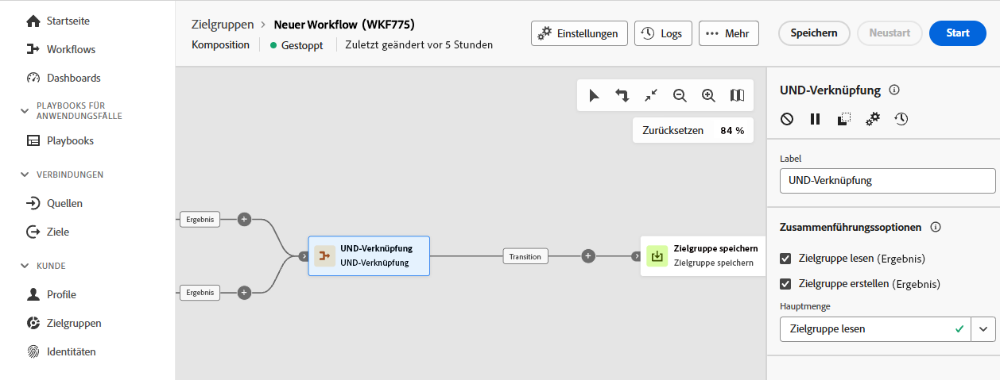

# Und-Verknüpfung {#join}

>[!CONTEXTUALHELP]
>id="dc_orchestration_and-join"
>title="Aktivität &quot;Und-Verknüpfung&quot;"
>abstract="Die Aktivität **Und-Verknüpfung** ermöglicht es, die Ausführung verschiedener Kompositionsverzweigungen zu synchronisieren. Sie wird ausgelöst, sobald alle vorangehenden Aktivitäten beendet sind. Auf diese Weise können Sie sicherstellen, dass bestimmte Aktivitäten abgeschlossen sind, bevor Sie mit der Ausführung der Komposition fortfahren."

Die Aktivität **Und-Verknüpfung** ermöglicht es, die Ausführung verschiedener Kompositionsverzweigungen zu synchronisieren. 

Diese Aktivität löst ihre ausgehende Transition erst aus, wenn alle eingehenden Transitionen aktiviert sind, d. h. wenn alle vorangegangenen Aktivitäten beendet sind. Auf diese Weise können Sie sicherstellen, dass bestimmte Aktivitäten abgeschlossen sind, bevor Sie mit der Ausführung der Komposition fortfahren.

## Konfigurieren der Aktivität „Und-Verknüpfung“ {#and-join-configuration}

>[!CONTEXTUALHELP]
>id="dc_orchestration_and-join_merging"
>title="Konfigurieren der Aktivität „Und-Verknüpfung“"
>abstract="Wählen Sie die Aktivitäten aus, die Sie verknüpfen möchten. Wählen Sie in der Dropdown-Liste **[!UICONTROL Hauptmenge]** die Population der eingehenden Transition aus, die Sie beibehalten möchten."

Führen Sie die folgenden Schritte aus, um die Aktivität **Und-Verknüpfung** zu konfigurieren:

1. Fügen Sie mehrere Aktivitäten hinzu, um mindestens zwei verschiedene Ausführungsverzweigungen zu bilden.
1. Fügen Sie die Aktivität **Und-Verknüpfung** zu einer der Verzweigungen hinzu.

   

1. Aktivieren Sie im Abschnitt **[!UICONTROL Zusammenführungsoptionen]** alle vorherigen Aktivitäten, die synchronisiert werden sollen.
1. Wählen Sie in der Dropdown-Liste **[!UICONTROL Hauptmenge]** die Population der eingehenden Transition aus, die Sie beibehalten möchten. Die ausgehende Transition kann nur eine der eingehenden Populationen enthalten. Wenn die Aktivität nicht konfiguriert ist, wählt die ausgehende Transition eine der eingehenden Populationen zufällig aus.
