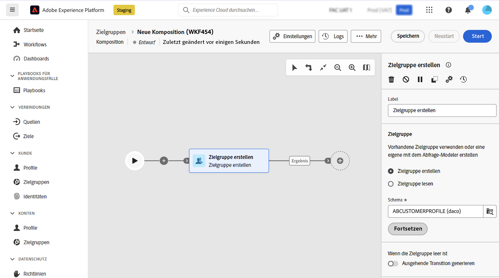
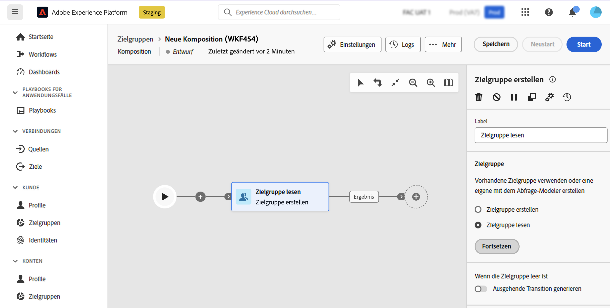

# Zielgruppe erstellen {#build-audience}

>[!CONTEXTUALHELP]
>id="dc_orchestration_build_audience"
>title="Aktivität „Zielgruppe erstellen“"
>abstract="Die Aktivität **Zielgruppe erstellen** ermöglicht das Definieren der Zielgruppe, die in der Komposition aufgenommen wird."

Die Aktivität **Zielgruppe erstellen** ermöglicht Ihnen das Definieren der Zielgruppe, die in der Komposition aufgenommen wird. Zur Definition der Zielgruppenpopulation haben Sie folgende Möglichkeiten:

* Wählen Sie eine bestehende Adobe Experience Platform-Zielgruppe aus.
* Erstellen Sie eine neue Zielgruppe mit dem Abfrage-Modeler, indem Sie Filterkriterien definieren und kombinieren.

## Konfigurieren der Aktivität „Zielgruppe erstellen“ {#build-audience-configuration}

>[!CONTEXTUALHELP]
>id="dc_orchestration_build_audience_audienceselector"
>title="Zielgruppe"
>abstract="Wählen Sie die Zielgruppe aus."

Führen Sie die folgenden Schritte aus, um die Aktivität **Zielgruppe erstellen** zu konfigurieren:

1. Fügen Sie die Aktivität **Zielgruppe erstellen** hinzu.
1. Definieren Sie einen Titel.
1. Geben Sie an, ob Sie eine Zielgruppe erstellen oder eine bestehende Zielgruppe auswählen möchten.
1. Konfigurieren Sie Ihre Zielgruppe anhand der Schritte in den unten stehenden Registerkarten.

>[!BEGINTABS]

>[!TAB Zielgruppe erstellen]

Gehen Sie wie folgt vor, um Ihre eigene Zielgruppe zu erstellen:

1. Wählen Sie **Zielgruppe erstellen** aus.
1. Wählen Sie das **Schema**, auch als „Zielgruppendimension“ bezeichnet. Das Schema ermöglicht die Bestimmung der vom Vorgang betroffenen Population: Empfängerinnen und Empfänger, Vertragsbegünstigte, Benutzerinnen und Benutzer sowie Abonnentinnen und Abonnenten. Standardmäßig wird das Schema aus den Empfängerinnen und Empfängern ausgewählt. 

   

1. Klicken Sie auf **Weiter**.
1. Definieren Sie mithilfe des Abfrage-Modelers Ihre Abfrage und bestätigen Sie sie. [Erfahren Sie mehr über die Arbeit mit dem Abfrage-Modeler](../../query/query-modeler-overview.md)

>[!TAB Zielgruppe lesen]

Gehen Sie wie folgt vor, um eine vorhandene Zielgruppe auszuwählen:

1. Wählen Sie **Zielgruppe lesen** aus.
1. Klicken Sie auf **Weiter**.

   

1. Wählen Sie die Zielgruppe aus.

>[!ENDTABS]

>[!NOTE]
>
>Die Option **Ausgehende Transition generieren** ermöglicht Ihnen, eine ausgehende Transition hinzuzufügen, die am Ende der Aktivitätsausführung aktiviert wird, sofern die Zielgruppenpopulation leer ist.

<!--
## Examples{#build-audience-examples}

Here is an example of a workflow with two **Build audience** activities. The first one targets the poker players audience, followed by an email delivery. The second one targets the VIP clients audience, followed by an SMS delivery.

-->
