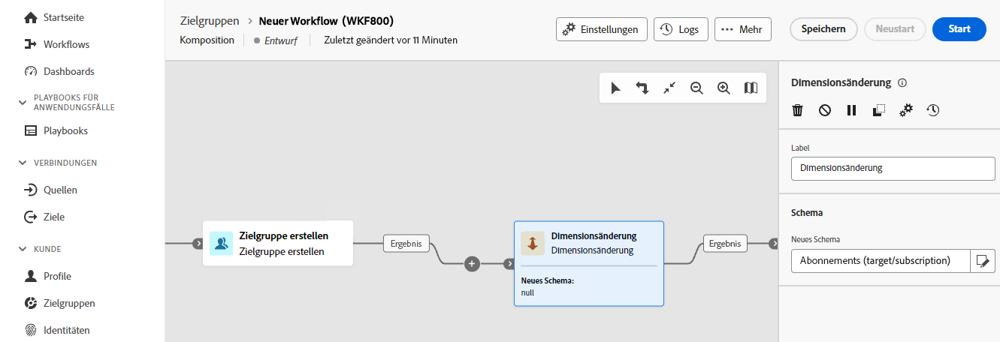

# Ändern der Dimension {#change-dimension}

>[!CONTEXTUALHELP]
>id="dc_orchestration_dimension_complement"
>title="Erzeugen eines Komplements"
>abstract="Sie können eine zusätzliche ausgehende Transition mit der verbleibenden Population generieren, die als Duplikat ausgeschlossen wurde. Schalten Sie dazu die Option **[!UICONTROL Komplement erzeugen]** ein"

>[!CONTEXTUALHELP]
>id="dc_orchestration_change_dimension"
>title="Aktivität „Dimensionsänderung“"
>abstract="Mithilfe dieser Aktivität können Sie das Schema, auch bekannt als Zielgruppendimension, beim Erstellen einer Zielgruppe ändern. Die Aktivität verschiebt die Achse je nach Datenmodell und dem Eingangsschema.  Beispielsweise können Sie vom Schema „Verträge“ zum Schema „Kundinnen und Kunden“ wechseln."

Mit der Aktivität **Dimensionsänderung** können Sie das Schema, die auch als Zielgruppendimension bezeichnet wird, während der Erstellung Ihrer Audience ändern. Die Achse wird je nach Datenvorlage und Eingabeschema verschoben.

## Konfigurieren der Aktivität „Dimensionsänderung“ {#configure}

Gehen Sie folgendermaßen vor, um die Aktivität **Dimensionsänderung** zu konfigurieren:

1. Fügen Sie Ihrer Komposition die Aktivität **Dimension ändern** hinzu.

   

1. Definieren Sie das **neue Schema**. Während der Schemaänderung werden alle Datensätze beibehalten.

1. Führen Sie die Komposition aus, um das Ergebnis anzuzeigen. Vergleichen Sie die Daten in den Tabellen vor und nach der Aktivität **Dimension ändern** und vergleichen Sie die Struktur der Kompositionstabellen.

<!--
## Example {#example}

In this example, we want to send an SMS delivery to all the profiles who have made a purchase. To do this, we first use a **[!UICONTROL Build audience]** activity linked to a custom "Purchase" targeting dimension to target all purchases that occurred.

We then use a **[!UICONTROL Change dimension]** activity to switch the workflow targeting dimension to "Recipients". This allows us to be able to target the recipients who match the query.
-->

