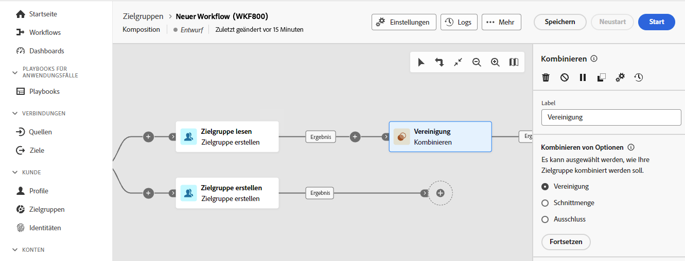
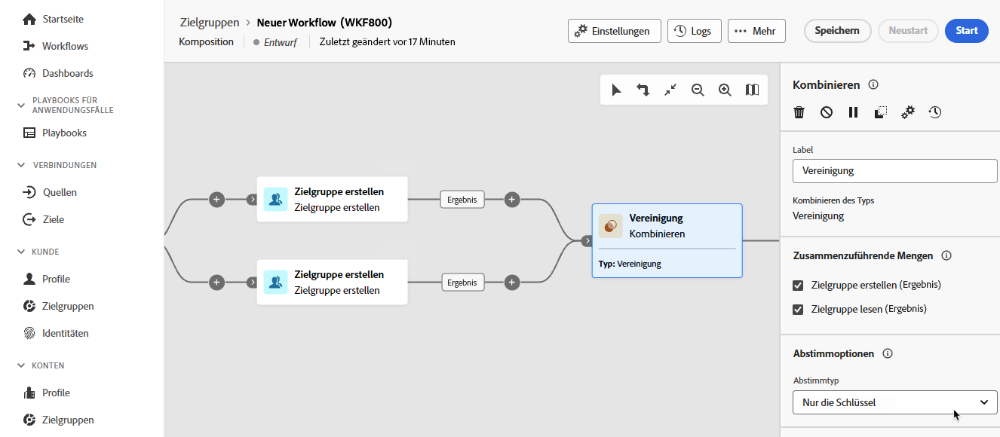
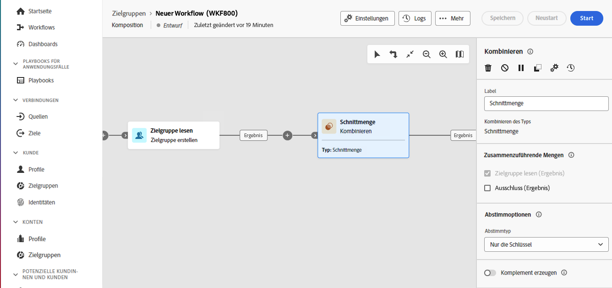
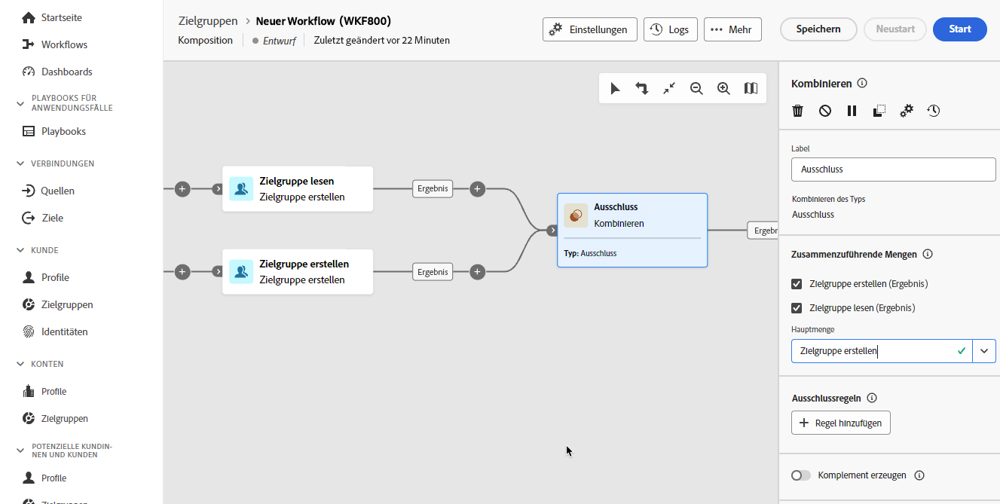

# Kombinieren {#combine}

>[!CONTEXTUALHELP]
>id="dc_orchestration_combine"
>title="Die Aktivität „Kombinieren“"
>abstract="Die Aktivität **Kombinieren** ermöglicht die Segmentierung Ihrer eingehenden Population. Sie können also verschiedene Populationen vereinen, einen Teil daraus ausschließen oder nur die in mehreren Zielgruppen enthaltenen Datensätze verwenden."

Die Aktivität **Kombinieren** ermöglicht die Segmentierung Ihrer eingehenden Population. So können Sie also mehrere Populationen kombinieren, einen Teil davon ausschließen oder nur die Daten behalten, die mehreren Zielgruppen gemeinsam sind.

Die Aktivität **Kombinieren** kann nach jeder anderen Aktivität platziert werden, jedoch nicht am Anfang der Komposition. Jede Aktivität kann nach **Kombinieren** platziert werden.

## Konfigurieren der Aktivität „Kombinieren“ {#combine-configuration}

>[!CONTEXTUALHELP]
>id="dc_orchestration_intersection_merging_options"
>title="Optionen für das Zusammenführen von Schnittmengen"
>abstract="Eine **Schnittmenge** dient dazu, nur die Elemente beizubehalten, die den verschiedenen eingehenden Populationen in der Aktivität gemeinsam sind. Aktivieren Sie im Abschnitt **Zusammenzuführende Mengen** alle vorherigen Aktivitäten, die Sie zusammenfügen möchten."

>[!CONTEXTUALHELP]
>id="dc_orchestration_exclusion_merging_options"
>title="Optionen für die Zusammenführung von Ausschlüssen"
>abstract="Ein **Ausschluss** dient dazu, gemäß bestimmten Kriterien entsprechende Elemente aus einer Population auszuschließen. Aktivieren Sie im Abschnitt **Zusammenzuführende Mengen** alle vorherigen Aktivitäten, die Sie zusammenfügen möchten."

>[!CONTEXTUALHELP]
>id="dc_orchestration_combine_options"
>title="Auswählen des Segmentierungstyps"
>abstract="Wählen Sie aus, wie Zielgruppen kombiniert werden sollen: Vereinigung, Schnittmenge oder Ausschluss."

Führen Sie die folgenden Schritte aus, um mit der Konfiguration der Aktivität **Kombinieren** zu beginnen:

1. Fügen Sie mehrere Aktivitäten hinzu, um mindestens zwei verschiedene Ausführungsverzweigungen zu bilden.

1. Fügen Sie die Aktivität **Kombinieren** zu einer der vorherigen Verzweigungen hinzu.

1. Wählen Sie den Segmentierungstyp aus: [Vereinigung](#union), [Schnittmenge](#intersection) oder [Ausschluss](#exclusion) und klicken Sie auf **Weiter**.

   

1. Aktivieren Sie im Abschnitt **Zusammenzuführende Mengen** alle vorherigen Aktivitäten, die Sie zusammenfügen möchten.

## Union {#combine-union}

>[!CONTEXTUALHELP]
>id="dc_orchestration_intersection_reconciliation_options"
>title="Abstimmoptionen für Schnittmengen"
>abstract="Wählen Sie den Abstimmtyp aus, um den Umgang mit Duplikaten zu definieren."

>[!CONTEXTUALHELP]
>id="dc_orchestration_combine_reconciliation"
>title="Abstimmoptionen"
>abstract="Wählen Sie den **Abstimmtyp** aus, um festzulegen, wie Dubletten behandelt werden."

In der Aktivität **Kombinieren** können Sie eine **Vereinigung** konfigurieren. 

Für die Vereinigung müssen Sie den **Abstimmtyp** auswählen, um festzulegen, wie Dubletten behandelt werden:

* **Nur die Schlüssel** – Standardmodus; die Aktivität behält nur eines der Elemente bei, wenn mehrere aus verschiedenen eingehenden Transitionen stammende Elemente denselben Schlüssel aufweisen. Diese Option kann nur verwendet werden, wenn die eingehenden Populationen homogen sind.
* **Auswahl an Spalten** – Wählen Sie diese Option, um die Liste der Spalten zu definieren, auf die die Datenabstimmung angewendet werden soll. Wählen Sie zunächst die die Quelldaten enthaltende Hauptmenge aus und dann die für die Herstellung der Verknüpfung zu verwendenden Spalten.

## Schnittmenge {#combine-intersection}

In der Aktivität **Kombinieren** können Sie eine **Schnittmenge** konfigurieren. 

Führen Sie hierzu die folgenden zusätzlichen Schritte aus:

1. Wählen Sie den **Abstimmtyp**, um festzulegen, wie Duplikate behandelt werden. Siehe den Abschnitt [Vereinigung](#union).
1. Sie können die Option **Komplement erzeugen** aktivieren, wenn Sie die verbleibende Population verarbeiten möchten. Das Komplement enthält die Vereinigung der Ergebnisse aller eingehenden Aktivitäten abzüglich der Schnittmenge. Der Aktivität wird daraufhin eine zusätzliche ausgehende Transition hinzugefügt.

## Ausschluss {#combine-exclusion}

>[!CONTEXTUALHELP]
>id="dc_orchestration_exclusion_options"
>title="Ausschlussregeln"
>abstract="Bei Bedarf können Sie die eingehenden Tabellen anpassen. Um eine Zielgruppe aus einem anderen Schema, auch bekannt als Zielgruppendimension, auszuschließen, muss diese Zielgruppe tatsächlich auf dasselbe Schema wie die Hauptzielgruppe zurückgesetzt werden. Klicken Sie dazu im Abschnitt **Ausschlussregeln** auf **Regel hinzufügen** und geben Sie die Bedingungen für die Schemaänderung an. Die Datenabstimmung wird entweder über ein Attribut oder über einen Join durchgeführt."

>[!CONTEXTUALHELP]
>id="dc_orchestration_combine_sets"
>title="Auswählen von Sets, die kombiniert werden sollen"
>abstract="Wählen Sie im Abschnitt **Zusammenzuführende Mengen** die **Hauptmenge** aus den eingehenden Transitionen. Dies ist die Menge, aus der Elemente ausgeschlossen werden. Die anderen Mengen stimmen mit Elementen überein, bevor sie aus der Primärmenge ausgeschlossen werden."

>[!CONTEXTUALHELP]
>id="dc_orchestration_combine_exclusion"
>title="Ausschlussregeln"
>abstract="Bei Bedarf können Sie die eingehenden Tabellen anpassen. Um eine Zielgruppe aus einem anderen Schema, auch bekannt als Zielgruppendimension, auszuschließen, muss diese Zielgruppe tatsächlich auf dasselbe Schema wie die Hauptzielgruppe zurückgesetzt werden. Klicken Sie dazu im Abschnitt **Ausschlussregeln** auf **Regel hinzufügen** und geben Sie die Bedingungen für die Schemaänderung an. Die Datenabstimmung wird entweder über ein Attribut oder über einen Join durchgeführt."

>[!CONTEXTUALHELP]
>id="dc_orchestration_combine_complement"
>title="Kombinieren von „Komplement erzeugen“"
>abstract="Aktivieren Sie die Option **Komplement erzeugen**, um die verbleibende Population in einer zusätzlichen Transition zu verarbeiten."

In der Aktivität **Kombinieren** können Sie einen **Ausschluss** konfigurieren. 

Dafür müssen Sie die folgenden zusätzlichen Schritte ausführen:

1. Wählen Sie im Abschnitt **Zusammenzuführende Mengen** die **Hauptmenge** aus den eingehenden Transitionen. Dies ist die Menge, aus der Elemente ausgeschlossen werden. Die anderen Mengen stimmen mit Elementen überein, bevor sie aus der Primärmenge ausgeschlossen werden.

1. Bei Bedarf können Sie die eingehenden Tabellen anpassen. Um eine Zielgruppe aus einem anderen Schema auszuschließen, muss diese Zielgruppe tatsächlich auf dasselbe Schema wie die Hauptzielgruppe zurückgesetzt werden. Klicken Sie dazu im Abschnitt **Ausschlussregeln** auf **Regel hinzufügen** und geben Sie die Bedingungen für die Schemaänderung an. Die Datenabstimmung wird entweder über ein Attribut oder einen Join durchgeführt. <!-- pas compris-->
1. Sie können die Option **Komplement erzeugen** aktivieren, wenn Sie die verbleibende Population verarbeiten möchten. Siehe den Abschnitt [Schnittmenge](#intersection).

<!--
## Examples{#combine-examples}

In the following example, we are using a **Combine** activity and we add a **union** to retrieves all the profiles of the two queries: persons between 18 and 27 years old and persons between 34 and 40 years old.

The following example shows the **intersection** between two query activities. It is being used here to retrieve profiles who are between 18 to 27 years old and whose email address has been provided.

The following **exclusion** example shows two queries configured to filter profiles who are between 18 and 27 years old and have an Adobe email domain. The profiles with an Adobe email domain are then excluded from the first set. 

-->
