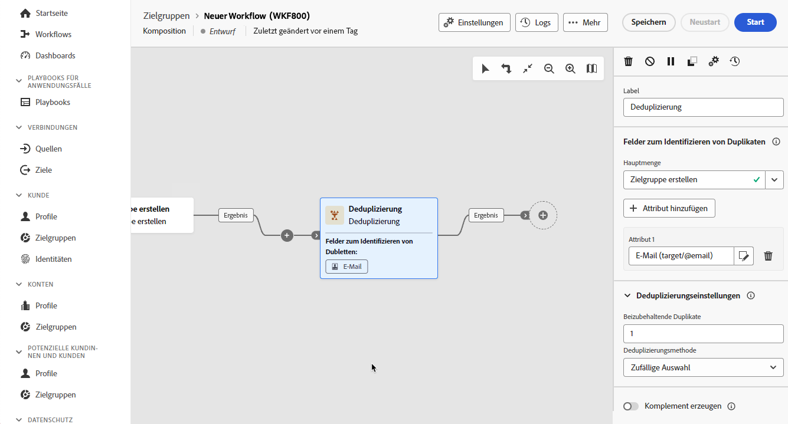

# Deduplizierung {#deduplication}

>[!CONTEXTUALHELP]
>id="dc_orchestration_deduplication_fields"
>title="Felder zum Identifizieren von Dubletten"
>abstract="Klicken Sie im Abschnitt **[!UICONTROL Felder zum Identifizieren von Dubletten]** auf die Schaltfläche **[!UICONTROL Attribut hinzufügen]**, um die Felder anzugeben, für die die Identifizierung von Dubletten aufgrund identischer Werte möglich ist, wie z. B. E-Mail-Adresse, Vorname, Nachname usw. Durch die Reihenfolge der Felder können Sie angeben, welche Felder zuerst verarbeitet werden sollen."

>[!CONTEXTUALHELP]
>id="dc_orchestration_deduplication"
>title="Aktivität „Deduplizierung“"
>abstract="Mithilfe der Aktivität **Deduplizierung** lassen sich Dubletten in Ergebnissen aus eingehenden Aktivitäten löschen. Sie wird hauptsächlich im Anschluss an Zielgruppenbestimmungsaktivitäten und vor Aktivitäten verwendet, die die Verwendung von Zielgruppendaten zulassen."

>[!CONTEXTUALHELP]
>id="dc_orchestration_deduplication_complement"
>title="Erzeugen eines Komplements"
>abstract="Sie können eine zusätzliche ausgehende Transition mit der verbleibenden Population generieren, die als Duplikat ausgeschlossen wurde. Schalten Sie dazu die Option **[!UICONTROL Komplement erzeugen]** ein"

>[!CONTEXTUALHELP]
>id="dc_orchestration_deduplication_settings"
>title="Deduplizierungseinstellungen"
>abstract="Um Dubletten in den eingehenden Daten zu löschen, definieren Sie die Deduplizierungsmethode in den folgenden Feldern. Standardmäßig wird nur ein Eintrag beibehalten. Sie sollten außerdem die Deduplizierungsmethode anhand eines Ausdrucks oder Attributs auswählen. Standardmäßig wird der Eintrag, der von den Dubletten ausgenommen sein soll, zufällig ausgewählt."

Mithilfe der Aktivität **Deduplizierung** lassen sich Duplikate in Ergebnissen eingehender Aktivitäten löschen, z. B. duplizierte Profile in der Empfängerliste. Die **Deduplizierungsaktivität** wird im Allgemeinen im Anschluss an Zielgruppenbestimmungsaktivitäten und vor Aktivitäten verwendet, die die Verwendung von Zielgruppendatum zulassen.

## Konfigurieren der Deduplizierungsaktivität{#deduplication-configuration}

Gehen Sie folgendermaßen vor, um die **Deduplizierungsaktivität** zu konfigurieren:

1. Fügen Sie Ihrer Komposition die Aktivität **Deduplizierung** hinzu.

1. Wenn die Aktivität über mehrere eingehende Transitionen verfügt, wählen Sie die Transition für die Deduplizierung aus der Dropdown-Liste **[!UICONTROL Hauptmenge]** aus.

1. Klicken Sie im Abschnitt **[!UICONTROL Felder zum Identifizieren von Dubletten]** auf die Schaltfläche **[!UICONTROL Attribut hinzufügen]**, um die Felder anzugeben, für die die Identifizierung von Dubletten aufgrund identischer Werte möglich ist, wie z. B. E-Mail-Adresse, Vorname, Nachname usw. Durch die Reihenfolge der Felder können Sie angeben, welche Felder zuerst verarbeitet werden sollen.

   

1. Wählen Sie im Abschnitt **[!UICONTROL Deduplizierungseinstellungen]** die Anzahl der eindeutigen **[!UICONTROL beizubehaltenden Dubletten]** aus. Der Standardwert dieses Felds ist **1**. Der Wert **0** erlaubt es Ihnen, alle Duplikate zu behalten.

   Nehmen wir z. B. den Fall, dass die Datensätze A und B wie Duplikate des Datensatzes Y und ein Datensatz C wie ein Duplikat des Datensatzes Z angesehen werden:

   * Wenn der Wert des Felds **1** lautet: werden nur die Datensätze Y und Z beibehalten.
   * Wenn der Wert des Felds **0** lautet: werden alle Datensätze beibehalten.
   * Wenn der Wert des Felds **2** lautet: werden die Datensätze C und Z beibehalten und von den Datensätzen A, B und Y werden zwei entweder nach dem Zufallsprinzip oder in Abhängigkeit von der im Anschluss ausgewählten Deduplizierungsmethode beibehalten.

1. Wählen Sie die **[!UICONTROL Deduplizierungsmethode]** aus, die verwendet werden soll:

   * **[!UICONTROL Zufällige Auswahl]**: Wählt nach dem Zufallsprinzip unter den Dubletten den Eintrag aus, der beibehalten werden soll.
   * **[!UICONTROL Von einem Ausdruck ausgehend]**: Behält Einträge bei, für die der angegebene Ausdruck den kleinsten oder größten Wert aufweist.
   * **[!UICONTROL Wert nicht leer]**: Behält Einträge bei, für die der Ausdruck nicht leer ist.
   * **[!UICONTROL Gemäß einer Werteliste]**: Definiert eine Priorität nach Wert für ein oder mehrere Felder. Klicken Sie zur Bestimmung dieser Werte auf **[!UICONTROL Attribute]**, um ein Feld auszuwählen, oder erstellen Sie einen Ausdruck und fügen Sie dann den oder die Werte der entsprechenden Tabelle hinzu. Verwenden Sie zum Definieren eines neues Felds die Schaltfläche **[!UICONTROL Hinzufügen]** oberhalb der Werteliste.

1. Aktivieren Sie die Option **[!UICONTROL Komplement erzeugen]**, wenn Sie die verbleibende Population verwenden möchten. Das Komplement besteht aus allen Duplikaten. Der Aktivität wird dann eine zusätzliche Transition hinzugefügt.

<!--
## Example{#deduplication-example}

In the following example, use a deduplication activity to exclude duplicates from the target before sending a delivery. The identified duplicated profiles are added to a dedicated audience that can be reused if necessary. Choose the **Email** address to identify the duplicates. Keep 1 entry and select the **Random** deduplication method.

-->
