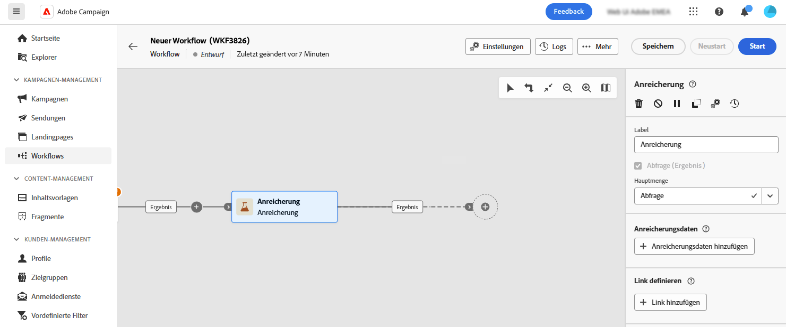
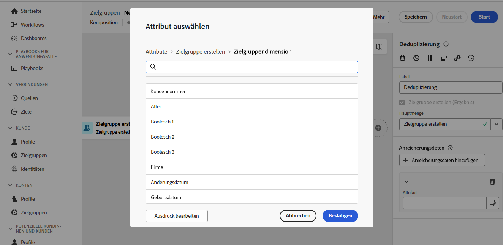

# Anreicherung {#enrichment}

>[!CONTEXTUALHELP]
>id="dc_orchestration_enrichment"
>title="Aktivität „Anreicherung“"
>abstract="Die Aktivität **Anreicherung** ermöglicht es Ihnen, die Zielgruppendaten um zusätzliche Informationen aus der Datenbank zu erweitern. Sie wird in einer Komposition häufig nach den Segmentierungsaktivitäten verwendet."

>[!CONTEXTUALHELP]
>id="dc_orchestration_enrichment_data"
>title="Aktivität „Anreicherung“"
>abstract="Nachdem Anreicherungsdaten zur Komposition hinzugefügt wurden, können sie in den Aktivitäten verwendet werden, die nach der Aktivität **Anreicherung** hinzugefügt wurden, um Profile basierend auf ihren Verhaltensweisen, Voreinstellungen und Auswahlmöglichkeiten in separate Gruppen zu segmentieren."

>[!CONTEXTUALHELP]
>id="dc_orchestration_enrichment_simplejoin"
>title="Link-Definition"
>abstract="Erstellen Sie eine Verknüpfung zwischen den Arbeitstabellendaten und der föderierten Datenbank."

>[!CONTEXTUALHELP]
>id="dc_orchestration_enrichment_reconciliation"
>title="Abstimmung der Anreicherung"
>abstract="Legen Sie die Abstimmparameter fest."

>[!CONTEXTUALHELP]
>id="dc_targetdata_personalization_enrichmentdata"
>title="Anreicherungsdaten"
>abstract="Wählen Sie die zur Anreicherung Ihrer Komposition zu verwendenden Daten aus. Sie können zwei Arten von Anreicherungsdaten auswählen: ein einzelnes Anreicherungsattribut aus dem Schema, auch bekannt als Zieldimension, oder eine Sammlungsrelation, bei der es sich um eine Verknüpfung mit einer 1:n-Kardinalität zwischen Tabellen handelt."

Mit der Aktivität **Anreicherung** können Sie die Zieldaten um zusätzliche Informationen aus der verbundenen Datenbank erweitern. Sie wird häufig in Kompositionen nach Segmentierungsaktivitäten verwendet.

Anreicherungsdaten können verschiedene Ursprünge haben:

* **Aus derselben Arbeitstabelle** wie der, der in Ihrer Komposition enthalten ist:

  *Bestimmung einer Kundenzielgruppe und Hinzufügen des Felds „Geburtsdatum“ zur aktuellen Arbeitstabelle*

* **Aus einer anderen Arbeitstabelle**:

  *Zielgruppenbestimmung einer Kundengruppe und Hinzufügen der Felder „Betrag“ und „Produkttyp“ aus der „Kauf“-Tabelle*.

Nachdem die Anreicherungsdaten zur Komposition hinzugefügt wurden, können sie in den Aktivitäten verwendet werden, die nach der Aktivität **Anreicherung** hinzugefügt wurden, um Kunden basierend auf ihren Verhaltensweisen, Voreinstellungen und Optionen in verschiedene Gruppen zu unterteilen.

<!--For instance, you can add to the working table information related to customers' purchases and use this data to personalize emails with their latest purchase or the amount spent on these purchases.-->

## Konfigurieren der Anreicherungsaktivität {#enrichment-configuration}

Führen Sie die folgenden Schritte aus, um die Aktivität **Anreicherung** zu konfigurieren:

1. Fügen Sie Aktivitäten wie **Zielgruppe erstellen** und **Kombinieren** hinzu.
1. Fügen Sie eine Aktivität vom Typ **Anreicherung** hinzu.

   

1. Wenn mehrere Transitionen in Ihrer Komposition konfiguriert wurden, können Sie mit dem Feld **[!UICONTROL Primärer Satz]** festlegen, welche Transition als Hauptmenge für die Anreicherung mit Daten verwendet werden soll.

1. Klicken Sie auf **Anreicherungsdaten hinzufügen** und wählen Sie das Attribut zur Datenanreicherung aus.

   

   >[!NOTE]
   >
   >Mit der Schaltfläche **Ausdruck bearbeiten** im Bildschirm zur Attributauswahl können Sie erweiterte Ausdrücke zur Auswahl des Attributs erstellen.

<!--PAS VU SUR INSTANCE: You can select two types of enrichment data: a single enrichment attribute from the target dimension, or a collection link. Each of these types is detailed in the examples below:

    * [Single enrichment attribute](#single-attribute)
    * [Collection lnk](#collection-link)-->

## Beispiele {#example}

### Einzelnes Anreicherungsattribut {#single-attribute}

Hier fügen wir nur ein einziges Anreicherungsattribut hinzu, z. B. das Geburtsdatum. Führen Sie folgende Schritte aus:

1. Klicken Sie in das Feld **Attribut**.
1. Wählen Sie ein einfaches Feld aus dem Schema aus, das in unserem Beispiel als Zielgruppendimension bezeichnet wird.
1. Klicken Sie auf **Bestätigen**.

<!--### Collection link {#collection-link}

In this more complex use case, we will select a collection link which is a link with a 1-N cardinality between tables. Let's retrieve the three latest purchases that are less than 100$. For this you need to define:

* an enrichment attribute: the **Total amount** field
* the number of lines to retrieve: 3
* a filter: filter out items that are greater than 100$
* a sorting: descendant sorting on the **Order date** field. 

#### Add the attribute {#add-attribute}

This is where you select the collection link to use as enrichment data.

1. Click inside the **Attribute** field.
1. Click **Display advanced attributes**.
1. Select the **Total amount** field from the **Purchases** table. 

#### Define the collection settings{#collection-settings}

Then, define how the data is collected and the number of records to retrieve.

1. Select **Collect data** in the **Select how the data is collected** drop-down.
1. Type "3" in the **Lines to retrieve (Columns to create)** field. 

If you want, for example, to get the average amount of purchases for a customer, select **Aggregated data** instead, and select **Average** in the **Aggregate function** drop-down.

#### Define the filters{#collection-filters}

Here, we define the maximum value for the enrichment attribute. We filter out items that are greater than 100$. [Learn how to work with the query modeler](../../query/query-modeler-overview.md)

1. Click **Edit filters**.
1. Add the two following filters: **Total amount** exists AND **Total amount** is less than 100. The first one filters NULL values as they would appear as the greatest value.
1. Click **Confirm**.

#### Define the sorting{#collection-sorting}

We now need to apply sorting in order to retrieve the three **latest** purchases.

1. Activate the **Enable sorting** option.
1. Click inside the **Attribute** field.
1. Select the **Order date** field.
1. Click **Confirm**. 
1. Select **Descending** from the **Sort** drop-down.-->
