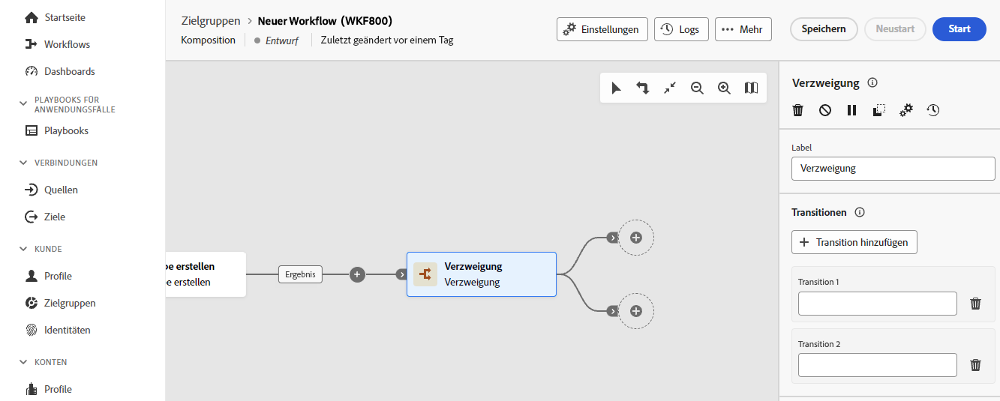

# Verzweigung {#fork}

>[!CONTEXTUALHELP]
>id="dc_orchestration_fork"
>title="Aktivität „Verzweigung“"
>abstract="Die Aktivität **Verzweigung** ermöglicht es Ihnen, ausgehende Transitionen zu erstellen, um mehrere Aktivitäten parallel zu starten."

>[!CONTEXTUALHELP]
>id="dc_orchestration_fork_transitions"
>title="Transitionen von Verzweigungsaktivitäten"
>abstract="Standardmäßig werden zwei Transitionen mit einer **Verzweigungsaktivität** erstellt. Klicken Sie auf die Schaltfläche **Transition hinzufügen**, um eine zusätzliche ausgehende Transition zu definieren, und geben Sie deren Titel ein."

Die Aktivität **Verzweigung** ermöglicht es Ihnen ausgehende Transitionen zu erstellen, um mehrere Aktivitäten parallel zu starten.

## Konfigurieren der Verzweigungsaktivität {#fork-configuration}

Führen Sie die folgenden Schritte aus, um die Aktivität **Verzweigung** zu konfigurieren:

1. Fügen Sie Ihrer Komposition die Aktivität **Verzweigung** hinzu.
1. Klicken Sie auf **Transition hinzufügen**, um eine neue ausgehende Transition hinzuzufügen. Standardmäßig sind zwei Transitionen definiert.
1. Fügen Sie jeder Ihrer Transitionen einen Titel hinzu.

   
