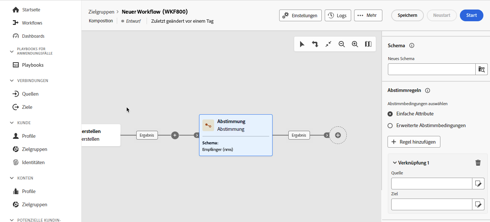
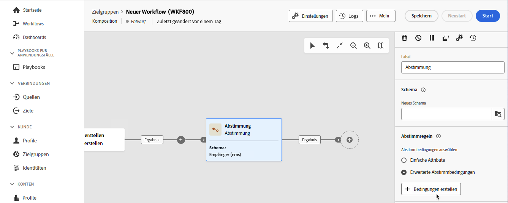

# Abstimmung {#reconciliation}

>[!CONTEXTUALHELP]
>id="dc_orchestration_reconciliation"
>title="Aktivität „Abstimmung“"
>abstract="Die **Abstimmung** ermöglicht die Definition der Relation zwischen den Daten in der Datenbank und den Daten in einer Arbeitstabelle."

>[!CONTEXTUALHELP]
>id="dc_orchestration_reconciliation_field"
>title="Abstimmung – Feld auswählen"
>abstract="Abstimmung – Feld auswählen"

>[!CONTEXTUALHELP]
>id="dc_orchestration_reconciliation_condition"
>title="Abstimmung – Bedingung erstellen"
>abstract="Abstimmung – Bedingung erstellen"

>[!CONTEXTUALHELP]
>id="dc_orchestration_reconciliation_complement"
>title="Abstimmung – Komplement erzeugen"
>abstract="Abstimmung – Komplement erzeugen"

Die **Abstimmung** ermöglicht die Definition der Relation zwischen den Daten in der Datenbank und den Daten in einer Arbeitstabelle, z. B. aus einem externen System geladenen Daten.

<!--For example, the **Reconciliation** activity can be placed after a **Load file** activity to import non-standard data into the database. In this case, the **Reconciliation** activity lets you define the link between the data in the Adobe Campaign database and the data in the work table.-->

Die **Abstimmung** ermöglicht die Verknüpfung nicht identifizierter Daten mit vorhandenen Ressourcen. Der Abstimmvorgang bedeutet, dass die Daten, denen Sie beitreten, bereits in der Datenbank vorhanden sind. Wenn Sie z. B. Kaufinformationen abstimmen möchten, die zeigen, welches Produkt wann von welchem Kunden gekauft wurde, müssen sowohl das Produkt als auch der Kunde bereits in der Datenbank vorhanden sein.

## Konfigurieren der Abstimmungsaktivität {#reconciliation-configuration}

>[!CONTEXTUALHELP]
>id="dc_orchestration_reconciliation_targeting"
>title="Schema"
>abstract="Wählen Sie das neue Schema aus, das auf die Daten angewendet werden soll. Mit einem Schema, das auch als Zielgruppendimension bezeichnet wird, können Sie die Zielpopulation definieren: Empfänger, App-Abonnenten, Benutzer, Abonnenten etc. Standardmäßig ist das aktuelle Kompositionsschema ausgewählt."

>[!CONTEXTUALHELP]
>id="dc_orchestration_reconciliation_rules"
>title="Abstimmungsregeln"
>abstract="Wählen Sie die für die Deduplizierung zu verwendenden Abstimmungsregeln aus. Um Attribute zu verwenden, wählen Sie die Option **Einfache Attribute** und dann die Quell- und Zielfelder aus. Um mithilfe des Abfrage-Modelers eine eigene Abstimmbedingung zu erstellen, wählen Sie die Option **Erweiterte Abstimmbedingungen** aus."

>[!CONTEXTUALHELP]
>id="dc_orchestration_reconciliation_targeting_selection"
>title="Auswählen der Zielgruppendimension"
>abstract="Wählen Sie das Schema aus, das als Zielgruppendimension bezeichnet wird und mit dem Ihre eingehenden Daten abgestimmt werden sollen."

>[!CONTEXTUALHELP]
>id="dc_orchestration_keep_unreconciled_data"
>title="Beibehalten nicht abgestimmter Daten"
>abstract="Standardmäßig werden nicht abgestimmte Daten in der ausgehenden Transition beibehalten und stehen in der Arbeitstabelle zur späteren Verwendung zur Verfügung. Um nicht abgestimmte Daten zu entfernen, deaktivieren Sie die Option **Nicht abgestimmte Daten beibehalten**."

>[!CONTEXTUALHELP]
>id="dc_orchestration_reconciliation_attribute"
>title="Abstimmungsattribut"
>abstract="Wählen Sie das Attribut aus, das zur Abstimmung der Daten verwendet werden soll, und bestätigen Sie Ihre Auswahl."

Gehen Sie wie folgt vor, um die Aktivität **Abstimmung** zu konfigurieren:

1. Hinzufügen einer **Abstimmung** Aktivität in Ihre Komposition ein.

1. Wählen Sie die **Neues Schema**. Mit einem Schema, das auch als Zielgruppendimension bezeichnet wird, können Sie die Zielpopulation definieren: Empfänger, App-Abonnenten, Benutzer, Abonnenten etc.

1. Wählen Sie die für Abstimmung zu verwendenden Felder aus. Es können mehrere Abstimmkriterien definiert werden.

   1. Um Attribute zur Abstimmung von Daten zu verwenden, wählen Sie die **Einfache Attribute** und klicken Sie dann auf **Regel hinzufügen** Schaltfläche.
   1. Wählen Sie die **Source** und **Ziel** für die Abstimmung. Die **Source** -Feld. Die **Ziel** den Feldern des ausgewählten Schemas entspricht.

      Daten werden abgestimmt, wenn Quelle und Ziel gleich sind. Wählen Sie beispielsweise die **E-Mail**-Felder, um Profile anhand ihrer E-Mail-Adresse zu deduplizieren.

      Um weitere Abstimmungskriterien hinzuzufügen, klicken Sie auf die Schaltfläche **Regel hinzufügen**. Wenn mehrere Bedingungen für die Verknüpfung angegeben werden, müssen ALLE erfüllt sein, damit die Relation hergestellt werden kann.

      

   1. Um andere Attribute zur Abstimmung von Daten zu verwenden, wählen Sie die **Erweiterte Abstimmungsbedingungen** und klicken Sie dann auf **Bedingungen erstellen** Schaltfläche. Anschließend können Sie mithilfe des Abfrage-Modelers eine eigene Abstimmungsbedingung erstellen. [Erfahren Sie mehr über die Arbeit mit dem Abfrage-Modeler](../../query/query-modeler-overview.md)

      

1. Mithilfe der Schaltfläche **Filter erstellen** können Sie die abzustimmenden Daten filtern. Auf diese Weise können Sie mithilfe des Abfragemodells eine benutzerdefinierte Bedingung erstellen.

Standardmäßig werden nicht abgestimmte Daten in der ausgehenden Transition beibehalten und stehen in der Arbeitstabelle zur zukünftigen Verwendung zur Verfügung. Um nicht abgestimmte Daten zu entfernen, deaktivieren Sie die Option **Nicht abgestimmte Daten beibehalten**.

<!--
## Example {#reconciliation-example}

The following example demonstrates a workflow that creates an audience of profiles directly from an imported file containing new clients. It is made up of the following activities:

The workflow is designed as follows:


 
It is built with the following activities:

* A [Load file](load-file.md) activity uploads a file containing profiles data that were extracted from an external tool.

    For example:

    ```
    lastname;firstname;email;birthdate;
    JACKMAN;Megan;megan.jackman@testmail.com;07/08/1975;
    PHILLIPS;Edward;phillips@testmail.com;09/03/1986;
    WEAVER;Justin;justin_w@testmail.com;11/15/1990;
    MARTIN;Babe;babeth_martin@testmail.net;11/25/1964;
    REESE;Richard;rreese@testmail.com;02/08/1987;
    ```

* A **Reconciliation** activity which identifies the incoming data as profiles, by using the **email** and **Date of birth** fields as reconciliation criteria.

    

* A [Save audience](save-audience.md) activity to create a new audience based on these updates. You can also replace the **Save audience** activity by an **End** activity if no specific audience needs to be created or updated. Recipient profiles are updated in any case when you run the workflow.


## Compatibility {#reconciliation-compat}

The **Reconciliation** activity does not exist in the Client console. All **Enrichments** activities created in the Client console with the reconciliation options enabled are displayed as **Reconciliation** activities in Campaign Web user interface.
-->
