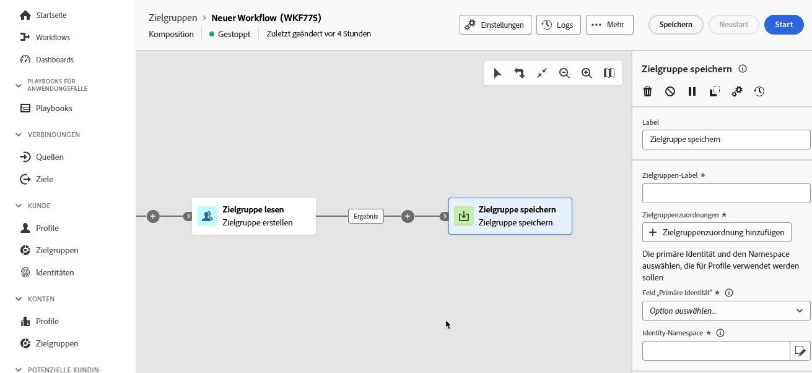

# Speichern einer Zielgruppe {#save-audience}

>[!CONTEXTUALHELP]
>id="dc_orchestration_save_audience"
>title="Speichern einer Zielgruppe"
>abstract="Mit dieser Aktivität können Sie eine neue Zielgruppe aus der Population erstellen, die im Vorfeld der Komposition ermittelt wurde. Die Zielgruppen werden zur bereits bestehenden Zielgruppenliste hinzugefügt und sind über das Menü **Zielgruppen** zugänglich."

>[!CONTEXTUALHELP]
>id="dc_orchestration_saveaudience_outbound"
>title="Ausgehende Transition generieren"
>abstract="Verwenden Sie diese Option, wenn Sie eine Transition nach der Aktivität **Zielgruppe speichern** hinzufügen möchten."

>[!CONTEXTUALHELP]
>id="dc_orchestration_save_audience_primary_identity"
>title="Feld „Primärer Identitätswert“"
>abstract="Wählen Sie die primäre Identität aus, die für Profile verwendet werden soll."
>additional-url="https://experienceleague.adobe.com/de/docs/experience-platform/xdm/ui/fields/identity#define-a-identity-field" text="Weitere Informationen finden Sie in der Dokumentation zu Adobe Experience Platform"

>[!CONTEXTUALHELP]
>id="dc_orchestration_saveaudience_namespace"
>title="Identity-Namespace"
>abstract="Wählen Sie den Namespace aus, der für Profile verwendet werden soll."
>additional-url="https://experienceleague.adobe.com/de/docs/experience-platform/identity/features/namespaces" text="Weitere Informationen finden Sie in der Dokumentation zu Adobe Experience Platform"

Mithilfe der Aktivität **Zielgruppe speichern** können Sie eine neue Zielgruppe aus der Population erstellen, die im Vorfeld der Komposition ermittelt wurde. Die erstellten Zielgruppen werden zur Liste der Adobe Experience Platform-Zielgruppen hinzugefügt und sind über das Menü **Zielgruppen** verfügbar. [Erfahren Sie, wie Sie mit Zielgruppen arbeiten](../../start/audiences.md)

Diese Aktivität dient im Wesentlichen dazu, Populationsgruppen in derselben Komposition zu berechnen, indem sie in wiederverwendbare Zielgruppen umgewandelt werden. Verbinden Sie sie mit anderen Zielgruppenbestimmungsaktivitäten, wie etwa den Aktivitäten **Zielgruppe aufbauen** oder **Kombinieren**.

Die Aktivität **[!UICONTROL Zielgruppe speichern]** generiert ein neues Zielgruppenschema und einen neuen Zielgruppendatensatz. Nachdem die Zielgruppe erstellt wurde, stimmen Sie sich mit Ihrem Admin-Team ab, um die entsprechenden Data-Governance-Label zuzuweisen. [Weitere Informationen zu Datennutzungs-Labeln](https://experienceleague.adobe.com/de/docs/experience-platform/data-governance/labels/user-guide)

>[!IMPORTANT]
>
>Die Aktivität **Zielgruppe speichern** erfordert ein profilaktiviertes Schema und einen profilaktivierten Datensatz. [Weitere Informationen](https://experienceleague.adobe.com/de/docs/experience-platform/catalog/datasets/user-guide#enable-profile){target="_blank"}.

## Konfigurieren der Aktivität „Zielgruppe speichern“ {#save-audience-configuration}

Führen Sie die folgenden Schritte aus, um die Aktivität **Zielgruppe aufbauen** zu konfigurieren:

1. Fügen Sie Ihrer Komposition die Aktivität **Zielgruppe speichern** hinzu.

   

1. Geben Sie das Label der zu erstellenden Zielgruppe an.

   >[!IMPORTANT]
   >
   >Das Zielgruppen-Label muss innerhalb der aktuellen Sandbox eindeutig sein. Es darf nicht mit dem Label einer vorhandenen Zielgruppe übereinstimmen.

1. Wählen Sie im Abschnitt „Zielgruppenzuordnungen“ die Felder aus, die Sie mit der neu erstellten Zielgruppe übernehmen möchten. Klicken Sie dazu auf **Zielgruppenzuordnung hinzufügen** und wählen Sie dann die Quell- und Zielgruppenfelder aus.

   Wiederholen Sie den Vorgang, um so viele Zielgruppenzuordnungen wie nötig hinzuzufügen.

1. Wählen Sie die primäre Identität und den Namespace zur Identifizierung der Zielprofile in der Datenbank aus:

   * **Primäres Identitätsfeld**: Wählen Sie das Feld aus, mit dem die Profile identifiziert werden sollen, beispielsweise die E-Mail-Adresse oder Telefonnummer.
   * **Identity-Namespace**: Wählen Sie den Namespace, der zur Identifizierung der Profile verwendet werden soll, d. h. die Art der Daten, die als Identifikationsschlüssel verwendet werden sollen. Wenn beispielsweise die E-Mail-Adresse als primäres Identitätsfeld ausgewählt wurde, sollte der Identity-Namespace **E-Mail** ausgewählt werden. Wenn die eindeutige Kennung die Telefonnummer ist, sollte der Identity-Namespace **Telefon** ausgewählt werden.

## Zugreifen auf Ihre Zielgruppe in Adobe Experience Platform {#access-audience}

Nach der Ausführung der Komposition wird die resultierende Zielgruppe in Adobe Experience Platform als externe Zielgruppe gespeichert und in Adobe Real-Time Customer Data Platform und/oder Adobe Journey Optimizer zur Verfügung gestellt. Sie wird im Menü **Zielgruppen** zur Verfügung gestellt. [Weitere Informationen](https://experienceleague.adobe.com/de/docs/experience-platform/segmentation/ui/audience-portal){target="_blank"}

Die erstellte Zielgruppe enthält alle Felder, die im Abschnitt „Zielgruppenzuordnungen“ ausgewählt wurden. Sie können diese Zielgruppe in Journey Optimizer als Ziel auswählen oder für ein beliebiges von Adobe Experience Platform unterstütztes Ziel aktivieren.

[Weitere Informationen hierzu finden Sie in der Dokumentation zu Adobe Experience Platform](https://experienceleague.adobe.com/de/docs/experience-platform/segmentation/ui/audience-portal){target="_blank"}.

<!--

## Example{#save-audience-example}

The following example illustrates a simple audience update from targeting. A scheduler is added to run the workflow once a month. A query recovers all the profiles subscribed to the different application services available. The **Save audience** activity updates the audience by deleting profiles that have unsubscribed from the service since the last workflow execution and by adding the newly subscribed profiles.
-->
