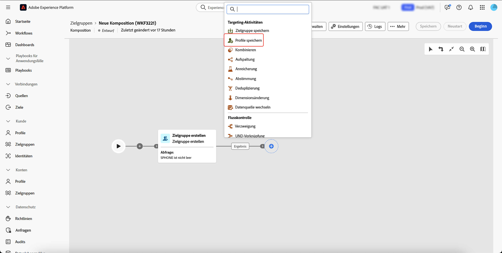
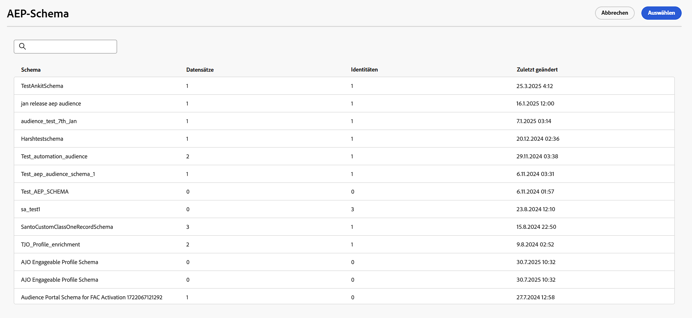
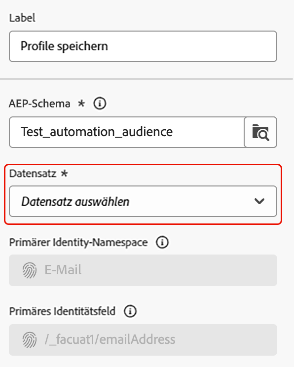
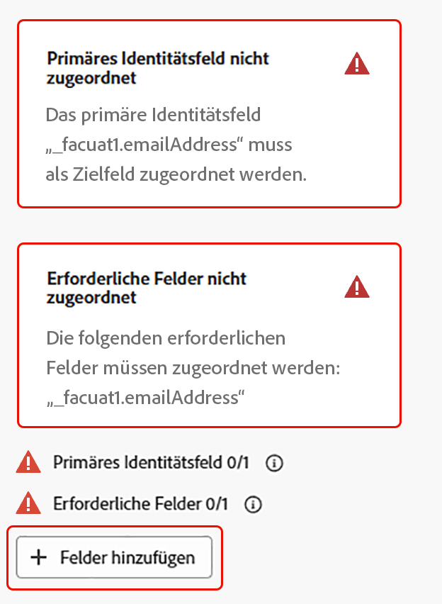
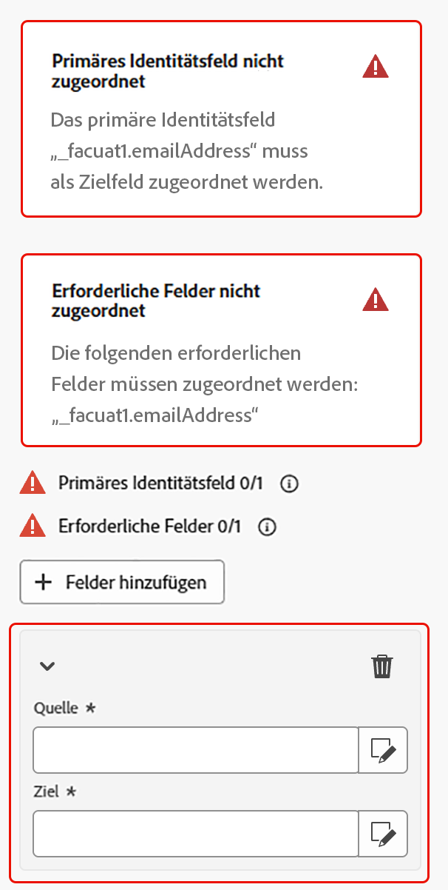
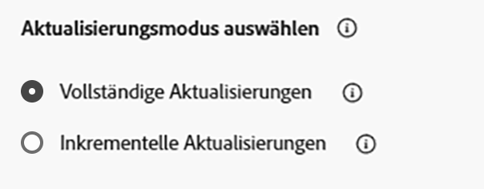

# Speichern von Profilen {#save-profile}

>[!CONTEXTUALHELP]
>id="dc_orchestration_saveprofile"
>title="Speichern von Profilen"
>abstract="Die Aktivität „Profile speichern“ ermöglicht es, Experience Platform-Profile anzureichern, indem Daten aus externen Warehouses föderiert werden, sodass Kundenprofile mit zusätzlichen Attributen erweitert werden können. "

>[!CONTEXTUALHELP]
>id="dc_orchestration_saveprofile_aepschemalist"
>title="Auswählen des Experience Platform-Schemas"
>abstract="Auswahl des Experience Platform-Schema für die Profile."

>[!CONTEXTUALHELP]
>id="dc_orchestration_saveprofile_primaryidentitynamespace"
>title="Auswählen des primären Identifizierungsfelds"
>abstract="Auswahl der primären Identität zur Identifizierung der Zielgruppenprofile in der Datenbank."

>[!CONTEXTUALHELP]
>id="dc_orchestration_saveprofile_selectaepschema"
>title="Auswählen des Experience Platform-Schemas"
>abstract="Auswahl des Experience Platform-Schema für die Profile."

>[!CONTEXTUALHELP]
>id="dc_orchestration_saveprofile_updatemode"
>title="Speichern des Aktualisierungsmodus für das Profil"
>abstract="Die verfügbaren Aktualisierungsmodi für die Aktivität „Profil speichern“ umfassen eine vollständige Aktualisierung und eine inkrementelle Aktualisierung."

>[!CONTEXTUALHELP]
>id="dc_orchestration_saveprofile_updatemode_full"
>title="Vollständige Aktualisierung"
>abstract="Der Modus „Vollständige Aktualisierung“ aktualisiert den vollständigen Satz an Profilen für die Anreicherung."

>[!CONTEXTUALHELP]
>id="dc_orchestration_saveprofile_updatemode_incremental"
>title="Inkrementelle Aktualisierung"
>abstract="Der Modus „Inkrementelle Aktualisierung“ aktualisiert die Profile, die seit der letzten Anreicherung geändert wurden."

>[!CONTEXTUALHELP]
>id="dc_orchestration_saveprofile_primaryidentityfield"
>title="Feld „Primärer Identitätswert“"
>abstract="Das Feld „Primäre Identität“ gibt beim Zusammenführen von Profilen für die Anreicherung die Datenquelle an."

>[!CONTEXTUALHELP]
>id="dc_orchestration_saveprofile_requiredfieldscheck"
>title="Kriterien für erforderliche Felder"
>abstract="Ein erforderliches Feld ist ein Attribut, das beim Exportieren von Daten für jedes Profil oder jeden Eintrag ausgefüllt werden muss. Wenn ein erforderliches Feld fehlt, ist der Export weder vollständig noch gültig."

>[!CONTEXTUALHELP]
>id="dc_orchestration_saveprofile_primaryidentitycheck"
>title="Kriterien für das Feld „Primäre Identität“"
>abstract="Die eindeutige Kennung für jedes Profil oder jeden Eintrag. Dies stellt sicher, dass jeder Eintrag eindeutig erkannt und abgeglichen werden kann, was eine Duplizierung der Daten verhindert."

Die Aktivität **[!UICONTROL Profile speichern]** ermöglicht es Ihnen, Adobe Experience Platform-Profile mit Daten anzureichern, die aus externen Warehouses zusammengeführt werden.

Diese Aktivität wird in der Regel verwendet, um Kundenprofile zu verbessern, indem zusätzliche Attribute und Einblicke eingebracht werden, ohne die Daten physisch in die Plattform zu verschieben oder zu duplizieren.

## Konfigurieren der Aktivität [!UICONTROL Profile speichern] {#save-profile-configuration}

>[!IMPORTANT]
>
>Die **Profile speichern**-Aktivität erfordert ein Profil-aktiviertes Schema und einen Datensatz. Informationen zum Aktivieren des Datensatzes für die Profilaktivierung finden Sie im [Benutzerhandbuch zum Datensatz](https://experienceleague.adobe.com/de/docs/experience-platform/catalog/datasets/user-guide#enable-profile){target="_blank"}.
>
>Wenn für den ausgewählten Datensatz **nicht** upsert aktiviert ist, werden die Daten aus den Profilen **ersetzt**. Informationen zum Aktivieren von upsert für Ihre Datensätze finden Sie im [Handbuch zur Aktivierung von upsert](https://experienceleague.adobe.com/de/docs/experience-platform/catalog/datasets/enable-upsert).

Führen Sie die folgenden Schritte aus, um die Aktivität **[!UICONTROL Profile speichern]** zu konfigurieren:

1. Fügen Sie **[!UICONTROL Komposition eine Aktivität]** Profile speichern“ hinzu.

   {width="1500" zoomable="yes"}

1. Geben Sie das Label der zu erstellenden Profile an.

   >[!IMPORTANT]
   >
   >Das Zielgruppen-Label muss innerhalb der aktuellen Sandbox eindeutig sein. Es darf nicht mit dem Label einer vorhandenen Zielgruppe übereinstimmen.

1. Wählen Sie das Adobe Experience Platform-Schema aus, das verwendet werden soll.

   {width="1500" zoomable="yes"}

1. Wählen Sie den Datensatz aus, in dem Sie die Anreicherung speichern möchten.

   {width="300" zoomable="yes"}

1. Nach Auswahl des Datensatzes können Sie das Feld für die primäre Identität sehen, das zur Identifizierung von Profilen in der Datenbank verwendet wird.

1. Wählen Sie **[!UICONTROL Felder hinzufügen]** aus, um die primären und erforderlichen Identitätsfelder hinzuzufügen.

   {width="300" zoomable="yes"}

   Sie können das Feld **Source** (externe Daten) und das Feld **Ziel** (Schemafeld) für jedes Attribut angeben, das Sie zuordnen möchten.

   {width="300" zoomable="yes"}

1. Sie können auch den Aktualisierungsmodus für die Anreicherung angeben.

   {width="300" zoomable="yes"}

   | Aktualisierungsmodus | Beschreibung |
   | ----------- | ----------- |
   | Vollständige Aktualisierungen | Der vollständige Satz von Profilen wird zur Anreicherung aktualisiert. |
   | Inkrementelle Aktualisierungen | Nur die Profile, die seit der letzten Anreicherung geändert wurden, werden für die Anreicherung aktualisiert. |

   Wenn Sie [!UICONTROL Inkrementelle Aktualisierungen] auswählen, müssen Sie auch das Datum der letzten Änderung auswählen, um zu bestimmen, welche Daten gesendet werden.

1. Wählen Sie nach der Konfiguration **Starten** aus.
