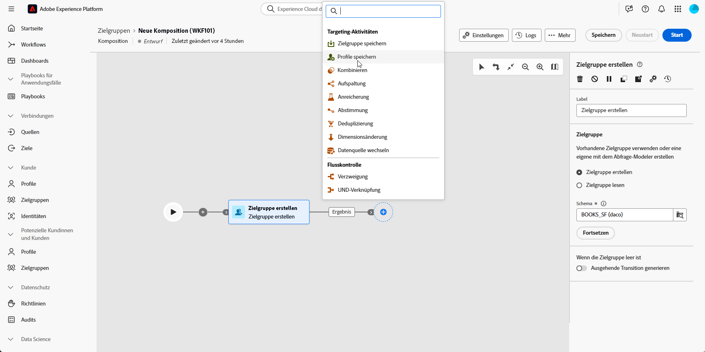
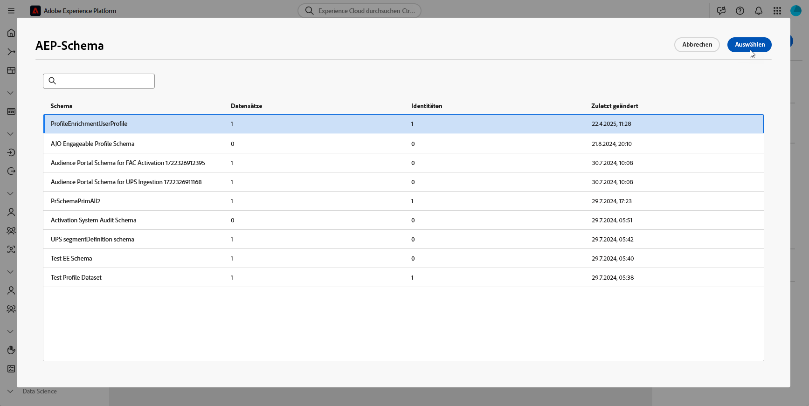
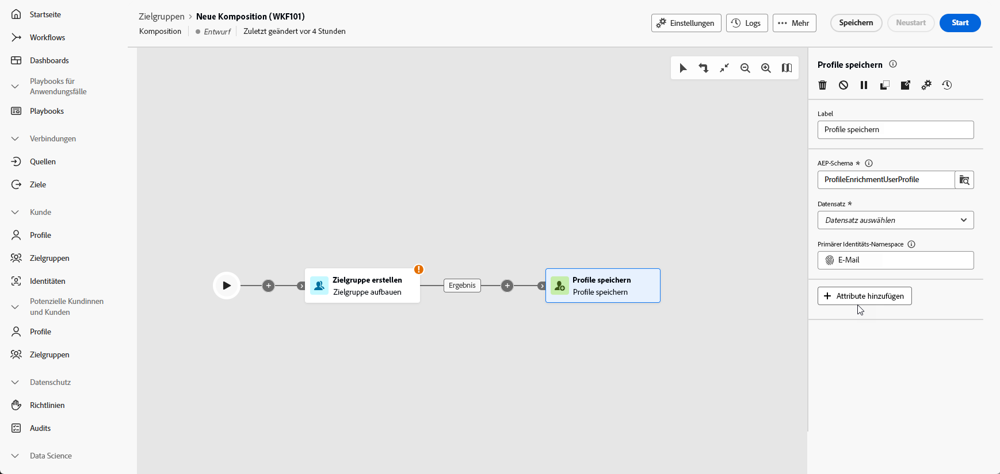

# Profile speichern {#save-profile}

>[!CONTEXTUALHELP]
>id="dc_orchestration_saveprofile"
>title="Profile speichern"
>abstract="Die Aktivität Profile speichern ermöglicht es Ihnen, Experience Platform-Profile anzureichern, indem Sie Daten aus externen Warehouses zusammenführen, wodurch Sie Kundenprofile mit zusätzlichen Attributen erweitern können. "

>[!CONTEXTUALHELP]
>id="dc_orchestration_saveprofile_aepschemalist"
>title="AEP-Schema auswählen"
>abstract="Wählen Sie das Experience Platform-Schema für die Profile aus."

>[!CONTEXTUALHELP]
>id="dc_orchestration_saveprofile_primaryidentitynamespace"
>title="Wählen Sie das Primäre Identifizierungsfeld aus"
>abstract="Wählen Sie die Primäre Identität aus, die zur Identifizierung der Zielgruppenprofile in der Datenbank verwendet werden soll."

>[!CONTEXTUALHELP]
>id="dc_orchestration_saveprofile_selectaepschema"
>title="AEP-Schema auswählen"
>abstract="Wählen Sie das Experience Platform-Schema für die Profile aus."

Die Aktivität **Profile speichern** ermöglicht es Ihnen, Adobe Experience Platform-Profile mit Daten anzureichern, die aus externen Warehouses zusammengeführt werden.

Diese Aktivität wird in der Regel verwendet, um Kundenprofile zu verbessern, indem zusätzliche Attribute und Einblicke eingebracht werden, ohne die Daten physisch in die Plattform zu verschieben oder zu duplizieren

## Konfigurieren der Aktivität Profile speichern {#save-profile-configuration}

Führen Sie die folgenden Schritte aus, um die Aktivität **Profile speichern** zu konfigurieren:

1. Fügen Sie Ihrer Komposition **Aktivität** Profile speichern“ hinzu.

   

1. Geben Sie den Titel der zu erstellenden Profile an.

   >[!IMPORTANT]
   >
   >Das Zielgruppen-Label muss innerhalb der aktuellen Sandbox eindeutig sein. Es darf nicht mit dem Label einer vorhandenen Zielgruppe übereinstimmen.

1. Wählen Sie das Adobe Experience Platform-Schema aus, das Sie verwenden möchten.

   

1. Wählen Sie das primäre Identitätsfeld aus, das zur Identifizierung von Profilen in der Datenbank verwendet wird.

1. Wenn Sie zusätzliche Datenattribute abstimmen möchten, klicken Sie auf **Attribute hinzufügen**.

   Geben Sie dann das Feld **Source** (externe Daten) und das Feld **Ziel** (Schemafeld) für jedes Attribut an, das Sie zuordnen möchten.

   

1. Klicken Sie nach der Konfiguration auf **Starten**.
