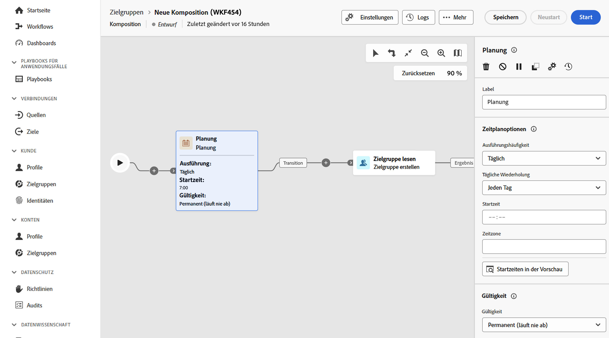

# Planung {#scheduler}

>[!CONTEXTUALHELP]
>id="dc_orchestration_scheduler"
>title="Planungsaktivität"
>abstract="Mit der Aktivität **Planung** können Sie planen, wann die Zielgruppenkomposition gestartet werden soll. Diese Aktivität sollte als geplanter Start betrachtet werden. Sie kann nur als erste Aktivität einer Komposition verwendet werden."

Die Aktivität **Planung** ist eine Aktivität zur **Flusssteuerung**. Damit können Sie planen, wann die Komposition gestartet werden soll. Diese Aktivität sollte als geplanter Start betrachtet werden. Sie kann nur als erste Aktivität der Komposition verwendet werden.

Wenn Sie eine Verbindung zum Ziel „Komposition föderierter Zielgruppen“ konfiguriert haben, können Sie mit dieser Aktivität Adobe Experience Platform-Zielgruppen in regelmäßigen Abständen versenden. [Erfahren Sie, wie Sie Adobe Experience Platform-Zielgruppen mit externen Daten anreichern](../../connections/destinations.md)

## Konfigurieren der Aktivität „Planung“ {#scheduler-configuration}

>[!CONTEXTUALHELP]
>id="dc_orchestration_schedule_validity"
>title="Gültigkeit der Planung"
>abstract="Sie können einen Gültigkeitszeitraum für die Planung definieren. Er kann dauerhaft sein (Standard) oder bis zu einem bestimmten Datum gültig sein."

>[!CONTEXTUALHELP]
>id="dc_orchestration_schedule_options"
>title="Planungsoptionen"
>abstract="Definieren Sie die Häufigkeit der Planung. Er kann zu einem bestimmten Zeitpunkt, einmal oder mehrmals pro Tag, Woche oder Monat, ausgeführt werden."

Gehen Sie folgendermaßen vor, um die Aktivität **Planung** zu konfigurieren:

1. Fügen Sie eine Aktivität **Planung** zu Ihrer Komposition hinzu.

1. Konfigurieren Sie die **Ausführungshäufigkeit**:

   * **Einmal**: Die Komposition wird nur einmal ausgeführt.
   * **Täglich**: Die Komposition wird zu einem bestimmten Zeitpunkt einmal täglich ausgeführt.
   * **Mehrmals pro Tag**: Die Komposition wird zu bestimmten Zeiten mehrmals täglich ausgeführt. Sie können Ausführungen zu bestimmten Zeiten oder in regelmäßigen Abständen einrichten.

     >[!NOTE]
     >
     >Planen Sie die Ausführung einer Komposition nicht öfter als alle 15 Minuten, da dies die Gesamtleistung des Systems beeinträchtigen und zu Blockaden in der Datenbank führen kann.

   * **Wöchentlich**: Die Komposition wird zu einem bestimmten Zeitpunkt einmal oder mehrfach wöchentlich ausgeführt.
   * **Monatlich**: Die Komposition wird zu einem bestimmten Zeitpunkt einmal oder mehrfach im Monat ausgeführt. Sie können die Monate auswählen, in denen die Komposition ausgeführt werden soll. Sie können für die Ausführung von Workflows auch bestimmte Wochentage des Monats auswählen, z. B. am zweiten Dienstag des Monats.

1. Definieren Sie die Ausführungsdetails. Je nach gewählter Frequenz sind verschiedene Parameter (Uhrzeit, Ausführungsintervall, bestimmte Tage etc.) zu konfigurieren.

1. Klicken Sie auf **Vorschau Startzeiten**, um den Zeitplan der nächsten zehn Ausführungen Ihrer Komposition zu überprüfen.

1. Definieren des Gültigkeitszeitraums des Zeitplans:

   * **Permanent (läuft nie ab)**: Die Komposition wird entsprechend der angegebenen Häufigkeit ausgeführt, ohne Begrenzung des Zeitrahmens oder der Anzahl der Iterationen.

   * **Gültigkeitszeitraum**: Die Komposition wird entsprechend der angegebenen Häufigkeit bis zu einem bestimmten Datum ausgeführt. Sie müssen Start- und Enddaten angeben.

>[!NOTE]
>
>Wenn Sie die Komposition sofort starten möchten, können Sie auf die Schaltfläche **Ausstehende Aufgabe ausführen** in der oberen Aktionsleiste der Planung klicken. Diese Schaltfläche ist nur verfügbar, wenn Sie die Komposition gestartet haben.

<!--## Example{#scheduler-example}

In the following example, the activity is configured so that the composition runs several times a day at 9 and 12 AM, every day of the week from October 1st, 2023 to January 1st, 2024.-->
