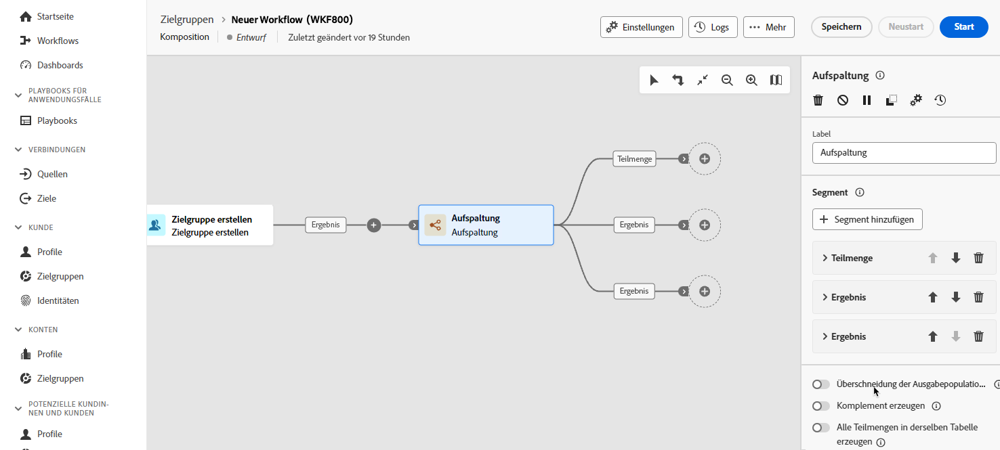
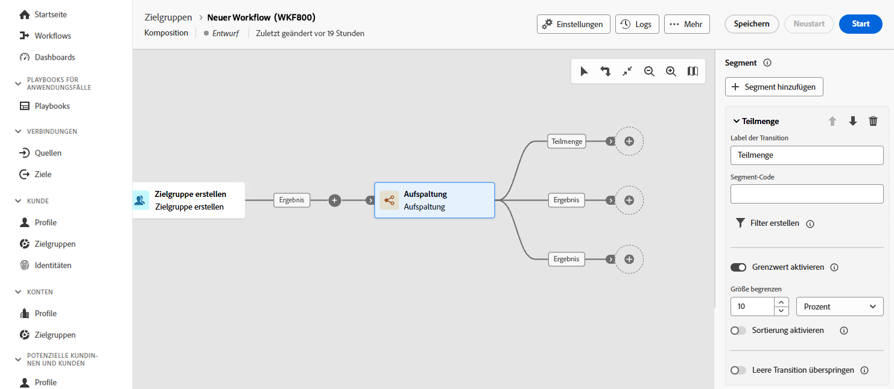

# Aufspalten {#split}

>[!CONTEXTUALHELP]
>id="dc_orchestration_split"
>title="Split-Aktivität"
>abstract="Mit der Aktivität **Aufspaltung** können Sie eingehende Populationen basierend auf unterschiedlichen Auswahlkriterien in mehrere Teilmengen segmentieren, z. B. Filterregeln oder Populationsgröße."

Mit der Aktivität **Aufspaltung** können Sie eingehende Populationen basierend auf unterschiedlichen Auswahlkriterien in mehrere Teilmengen segmentieren, z. B. Filterregeln oder Populationsgröße.

## Konfigurieren der Aufspaltungsaktivität {#split-configuration}

>[!CONTEXTUALHELP]
>id="dc_orchestration_split_segments"
>title="Segmente für die Aktivität „Aufspaltung“"
>abstract="Fügen Sie beliebig viele Teilmengen hinzu, um die eingehende Population zu segmentieren.  Bei Ausführung der Aktivität **Aufspaltung** wird die Population sukzessive in unterschiedliche Teilmengen segmentiert, und zwar in der Reihenfolge, in der diese zur Aktivität hinzugefügt werden. Bevor Sie mit der Komposition beginnen, stellen Sie mithilfe der Pfeiltasten sicher, dass Sie die Teilmengen in der Reihenfolge sortiert haben, die Ihren Anforderungen entspricht."

>[!CONTEXTUALHELP]
>id="dc_orchestration_split_filter"
>title="Filter „Aufspaltungsaktivität“"
>abstract="Um eine Filterbedingung auf die Teilmenge anzuwenden, klicken Sie auf **[!UICONTROL Filter erstellen]** und konfigurieren Sie die gewünschte Filterregel mithilfe des Abfrage-Modelers. Es können beispielsweise Profile aus der eingehenden Population eingeschlossen werden, deren E-Mail-Adresse in der Datenbank vorhanden ist."

>[!CONTEXTUALHELP]
>id="dc_orchestration_split_limit"
>title="Begrenzung der Aufspaltungsaktivität"
>abstract="Um die Anzahl der von der Teilmenge ausgewählten Profile zu begrenzen, muss **[!UICONTROL Grenzwert aktivieren]** aktiviert und die Anzahl oder der Prozentsatz der einzuschließenden Population angegeben werden."

>[!CONTEXTUALHELP]
>id="dc_orchestration_split_sorting"
>title="Sortierung der Aufspaltungsaktivität"
>abstract="Beim Festlegen einer Populationsbegrenzung für eine Teilmenge können die ausgewählten Profile anhand eines bestimmten Profilattributs in auf- oder absteigender Reihenfolge sortiert werden. Schalten Sie dazu die Option **Sortierung aktivieren** ein. Teilmengen können z. B. so eingeschränkt werden, dass nur die 50 Top-Profile mit dem höchsten Einkaufsbetrag einbezogen werden."

>[!CONTEXTUALHELP]
>id="dc_orchestration_split_complement"
>title="Aufspaltung – Komplement erzeugen"
>abstract="Nachdem Sie alle Teilmengen konfiguriert haben, kann die verbleibende Population ausgewählt werden, die keiner der Teilmengen entspricht, und in eine zusätzliche ausgehende Transition eingeschlossen werden. Schalten Sie dazu die Option **Komplement erzeugen** ein."

>[!CONTEXTUALHELP]
>id="dc_orchestration_split_generatesubsets"
>title="Alle Teilmengen in derselben Tabelle erzeugen"
>abstract="Aktivieren Sie diese Option, um alle Teilmengen in einer Ausgabetransition zusammenzufassen."

>[!CONTEXTUALHELP]
>id="dc_orchestration_split_emptytransition"
>title="Leere Transition überspringen"
>abstract="Aktivieren Sie die Option **[!UICONTROL Leere Transition überspringen]**, um die ausgehende Transition für diese Teilmenge zu deaktivieren, wenn die Eingangspopulation leer ist."

>[!CONTEXTUALHELP]
>id="dc_orchestration_split_enable_overlapping"
>title="Überlappen von Ausgabepopulationen ermöglichen"
>abstract="Die **[!UICONTROL Überlappung der Ausgabepopulationen zulassen]** verwaltet die Populationen, die zu mehreren Teilmengen gehören. Wenn das Kästchen nicht markiert wird, stellt die Aufspaltungsaktivität sicher, dass ein Empfänger nicht in mehreren ausgehenden Transitionen vorhanden sein kann, selbst wenn es die Kriterien mehrerer Teilmengen erfüllt. Sie befinden sich in der Zielgruppe des ersten Tabs mit entsprechenden Kriterien. Wenn die Option aktiviert ist, sind die Profile in allen Teilmengen enthalten, deren Kriterien sie erfüllen. Es wird jedoch empfohlen, keine Überlappungen zuzulassen."

Folgen Sie diesen Schritten, um die Aktivität **Aufspaltung** zu konfigurieren:

1. Hinzufügen einer **Aufspaltung** Aktivität zu Ihrer Komposition hinzufügen.

1. Der Konfigurationsbereich für die Aktivität wird mit einer standardmäßigen Teilmenge geöffnet. Klicken Sie auf die Schaltfläche **Segment hinzufügen**, um so viele Teilmengen wie gewünscht zum Segmentieren der eingehenden Population hinzuzufügen.

   >[!IMPORTANT]
   >
   >Bei Ausführung der Aktivität **Aufspaltung** wird die Population sukzessive in unterschiedliche Teilmengen segmentiert, und zwar in der Reihenfolge, in der diese zur Aktivität hinzugefügt werden. Wenn beispielsweise die erste Teilmenge 70 % der Anfangspopulation abruft, werden die Auswahlkriterien der nächsten hinzugefügten Teilmenge nur auf die restlichen 30 % angewendet usw.
   >
   >Bevor Sie mit der Komposition beginnen, stellen Sie sicher, dass Sie die Teilmengen in der Reihenfolge sortiert haben, die Ihren Anforderungen entspricht. Verwenden Sie dazu die Pfeilschaltflächen, um die Position einer Teilmenge zu ändern.

1. Sobald die Teilmengen hinzugefügt wurden, zeigt die Aktivität für jede Teilmenge eine ausgehende Transition. Es wird dringend empfohlen, die Beschriftung jeder Teilmenge zu ändern, um sie auf der Arbeitsfläche der Komposition leicht zu identifizieren.

   

1. Konfigurieren Sie, wie jede Teilmenge die eingehende Population filtern soll. Gehen Sie dazu wie folgt vor:

   1. Erweitern Sie die Teilmenge, um ihre Eigenschaften anzuzeigen.

      

   1. Um eine Filterbedingung auf die Teilmenge anzuwenden, klicken Sie auf **[!UICONTROL Filter erstellen]** und konfigurieren Sie die gewünschte Filterregel mithilfe des Abfrage-Modelers. Es können beispielsweise Profile aus der eingehenden Population eingeschlossen werden, deren E-Mail-Adresse in der Datenbank vorhanden ist.  [Erfahren Sie mehr über die Arbeit mit dem Abfrage-Modeler](../../query/query-modeler-overview.md)

   1. Um die Anzahl der von der Teilmenge ausgewählten Profile zu begrenzen, muss **[!UICONTROL Grenzwert aktivieren]** aktiviert und die Anzahl oder der Prozentsatz der einzuschließenden Population angegeben werden.

   1. Um eine Transition zu deaktivieren, wenn die Eingangspopulation leer ist, aktivieren Sie die Option **[!UICONTROL Leere Transition überspringen]**. Wenn kein Profil mit der Teilmenge übereinstimmt, wird die Komposition nicht zur nächsten Aktivität übergehen.

   >[!NOTE]
   >
   >Beim Festlegen einer Populationsbegrenzung für eine Teilmenge können die ausgewählten Profile anhand eines bestimmten Profilattributs in auf- oder absteigender Reihenfolge sortiert werden. Schalten Sie dazu die Option **[!UICONTROL Sortierung aktivieren]** ein. Teilmengen können z. B. so eingeschränkt werden, dass nur die 50 Top-Profile mit dem höchsten Einkaufsbetrag einbezogen werden.

1. Nachdem Sie alle Teilmengen konfiguriert haben, kann die verbleibende Population ausgewählt werden, die keiner der Teilmengen entspricht, und in eine zusätzliche ausgehende Transition eingeschlossen werden. Schalten Sie dazu die Option **[!UICONTROL Komplement erzeugen]** ein.

   >[!NOTE]
   >
   >Die Option **[!UICONTROL Alle Teilmengen in derselben Tabelle generieren]** ermöglicht die Gruppierung aller Teilmengen in einer ausgehenden Transition.

1. Die Option **[!UICONTROL Überlappung der Ausgabepopulationen zulassen]** ermöglicht den Umgang mit Profilen, die in mehreren Teilmengen enthalten sind:

   * Wenn diese Option deaktiviert ist, stellt die Aufspaltung sicher, dass ein Profil nur in einer Ergebnismenge enthalten ist, auch wenn es den Kriterien anderer Teilmengen entspricht. Das Profil ist in der ersten Teilmenge enthalten, dessen Kriterien es entspricht.
   * Wenn die Option aktiviert ist, sind die Profile in allen Teilmengen enthalten, deren Kriterien sie erfüllen. Es wird jedoch empfohlen, keine Überlappungen zuzulassen.

Der Aktivität ist jetzt konfiguriert. Bei der Ausführung wird die Population in die verschiedenen Teilmengen segmentiert, und zwar in der Reihenfolge, in der sie der Aktivität hinzugefügt wurde.

<!--
## Example{#split-example}

In the following example, the **[!UICONTROL Split]** activity is used to segment an audience into distinct subsets based on the communication channel that we want to use :

* **Subset 1 "push"**: This subset comprises all profiles who have installed our mobile application.
* **Subset 2 "sms"**: Mobile phone users: For the remaining population that did not fall into Subset 1, subset 2 applies a filtering rule to select profiles with mobile phones in the database.
* **Complement transition**: This transition captures all the remaining profiles that did not match Subset 1 or Subset 2. Specifically, it includes profiles who neither installed the mobile application nor have a mobile phone, such as users who haven't installed the mobile app or lack a registered mobile number.

-->
