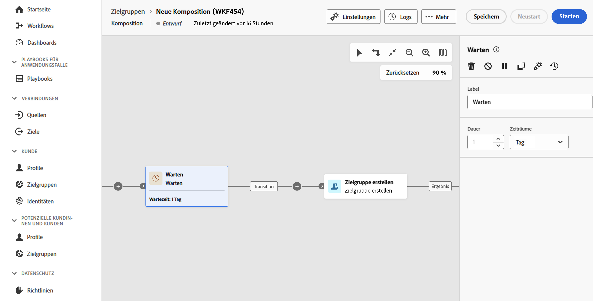

# Warten {#wait}

>[!CONTEXTUALHELP]
>id="dc_orchestration_wait"
>title="Aktivität „Warten“"
>abstract="Die Aktivität **Warten** wird verwendet, um die Transition von einer Aktivität zu einer anderen zu verzögern."

Die Aktivität **Warten** sorgt dafür, dass zwischen der Ausführung zweier Aktivitäten eine gewisse Zeit vergeht.

## Konfiguration{#wait-configuration}

Gehen Sie folgendermaßen vor, um die Aktivität **Warten** zu konfigurieren:

1. Fügen Sie eine Aktivität **Warten** zu Ihrer Komposition hinzu.

1. Geben Sie die **Dauer** der Wartezeit zwischen den eingehenden und ausgehenden Transitionen an.

1. Wählen Sie die Zeiteinheit im Feld **Zeiträume** aus: Sekunden, Minuten, Stunden, Tage.

   
