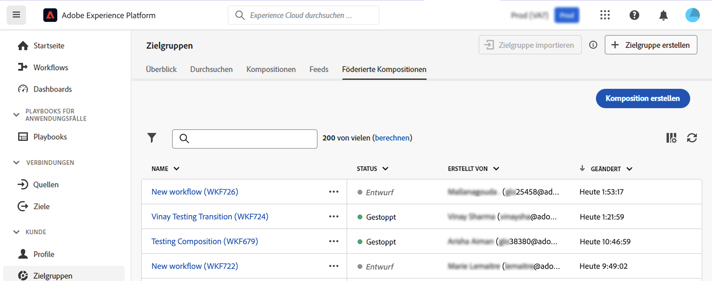
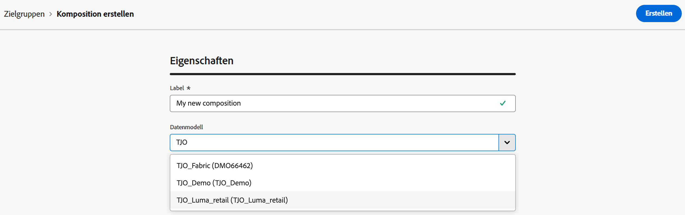
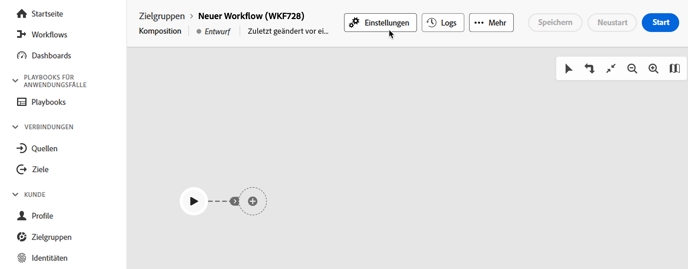

# Erstellen und Konfigurieren der Komposition {#create}

Der erste Schritt zum Erstellen einer Komposition besteht darin, das ihr Label zu definieren und ggf. weitere Einstellungen vorzunehmen.

## Erstellen der Komposition {#create-the-composition}

1. Rufen Sie das Menü **[!UICONTROL Zielgruppen]** auf und wählen Sie die Registerkarte **[!UICONTROL Föderierte Kompositionen]** aus.

1. Klicken Sie auf die Schaltfläche **[!UICONTROL Komposition erstellen]**.

   

1. Geben Sie im Abschnitt **[!UICONTROL Eigenschaften]** einen Titel für die Komposition an und wählen Sie ein Datenmodell aus. In den Aktivitäten Ihrer Komposition sind nur die mit diesem Datenmodell verknüpften Schemata verfügbar.

   

1. Klicken Sie auf **[!UICONTROL Erstellen]**. Die Arbeitsfläche der Komposition wird angezeigt. Sie können nun Ihre Komposition konfigurieren, indem Sie so viele Aktivitäten hinzufügen, wie Sie benötigen, bevor Sie sie ausführen:

   * [Erfahren Sie, wie Sie Aktivitäten orchestrieren.](orchestrate-activities.md)
   * [Erfahren Sie, wie Sie eine Komposition starten und überwachen](start-monitor-composition.md)

## Konfigurieren der Kompositionseinstellungen {#settings}

>[!CONTEXTUALHELP]
>id="dc_composition_settings_properties"
>title="Kompositionseigenschaften"
>abstract="Dieser Abschnitt enthält allgemeine Kompositionseigenschaften, auf die auch beim Erstellen der Komposition zugegriffen werden kann."

>[!CONTEXTUALHELP]
>id="dc_composition_settings_segmentation"
>title="Kompositionssegmentierung"
>abstract="Standardmäßig werden nur die Arbeitstabellen der letzten Ausführung der Komposition aufbewahrt. Sie können diese Option aktivieren, um Arbeitstabellen zu Testzwecken beizubehalten. Diese Option darf **nur** in Entwicklungs- oder Staging-Umgebungen verwendet werden. Sie darf niemals in einer Produktionsumgebung aktiviert werden."

>[!CONTEXTUALHELP]
>id="dc_composition_settings_error"
>title="Einstellungen für den Umgang mit Fehlern"
>abstract="In diesem Abschnitt können Sie definieren, wie Fehler während der Ausführung behandelt werden sollen. Sie können festlegen, dass der Prozess angehalten werden soll, dass eine bestimmte Anzahl von Fehlern ignoriert werden soll oder dass die Ausführung der Komposition gestoppt werden soll."

Beim Zugriff auf eine Komposition können Sie auf erweiterte Einstellungen zugreifen, mit denen Sie beispielsweise festlegen können, wie sich die Komposition im Falle eines Fehlers verhalten soll. Um auf diese zusätzlichen Optionen zuzugreifen, klicken Sie im oberen Bereich des Bildschirms zur Kompositionserstellung auf die Schaltfläche **[!UICONTROL Einstellungen]**.

Die verfügbaren Einstellungen lauten wie folgt:

* **[!UICONTROL Label]**: Ändern Sie das Label der Komposition.

* **[!UICONTROL Zwischen zwei Ausführungen die ermittelte Population festhalten]**: Standardmäßig werden nur die Arbeitstabellen der letzten Ausführung der Komposition beibehalten. Arbeitstabellen früherer Ausführungen werden durch eine technische Komposition bereinigt, die täglich ausgeführt wird.

  Wenn diese Option aktiviert ist, werden Arbeitstabellen auch nach Ausführung der Komposition beibehalten. Sie können sie zu Testzwecken verwenden. Daher farf sie **nur** in Entwicklungs- oder Staging-Umgebungen genutzt werden. In einer produktiven Komposition darf sie niemals aktiviert werden.

* **[!UICONTROL Umgang mit Fehlern]**: Mit dieser Option können Sie festlegen, welche Aktionen ausgeführt werden sollen, wenn eine Kompositionsaktivität Fehler aufweist. Es gibt drei mögliche Optionen:

   * **[!UICONTROL Prozess aussetzen]**: Die Komposition wird automatisch ausgesetzt und der Status wechselt zu **[!UICONTROL Fehlgeschlagen]**. Sobald das Problem behoben ist, können Sie die Komposition über die Schaltflächen **[!UICONTROL Fortsetzen]** wieder aufnehmen.
   * **[!UICONTROL Ignorieren]**: Der Status der Aufgabe, die den Fehler ausgelöst hat, ändert sich in **[!UICONTROL Fehlgeschlagen]**, die Komposition behält jedoch den Status **[!UICONTROL Gestartet]**.
   * **[!UICONTROL Vorgang abbrechen]**: Die Komposition wird automatisch gestoppt und der Status ändert sich in **[!UICONTROL Fehlgeschlagen]**. Sobald das Problem behoben ist, starten Sie die Komposition mit der Schaltfläche **[!UICONTROL Starten]** erneut.

* **[!UICONTROL Aufeinanderfolgende Fehler]**: Geben Sie die Anzahl der Fehler an, die ignoriert werden können, bevor der Prozess angehalten wird. Sobald diese Zahl erreicht ist, wechselt der Status der Komposition in **[!UICONTROL Fehlgeschlagen]**. Wenn der Wert dieses Felds 0 beträgt, wird die Komposition unabhängig von der Fehleranzahl nie angehalten.
