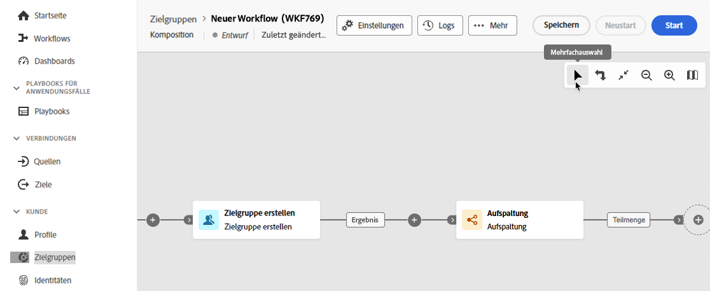
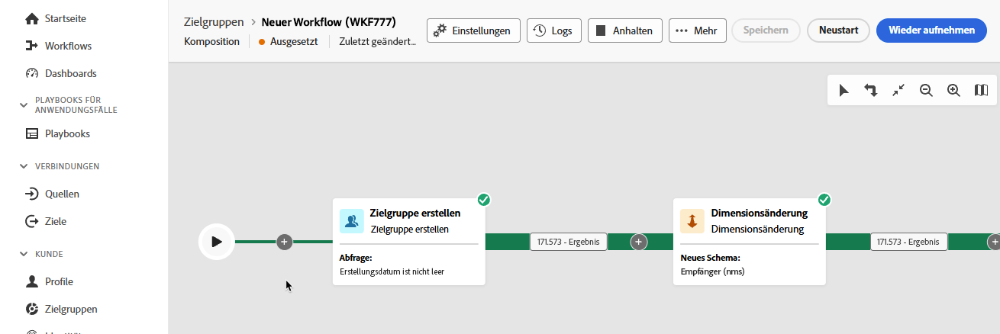
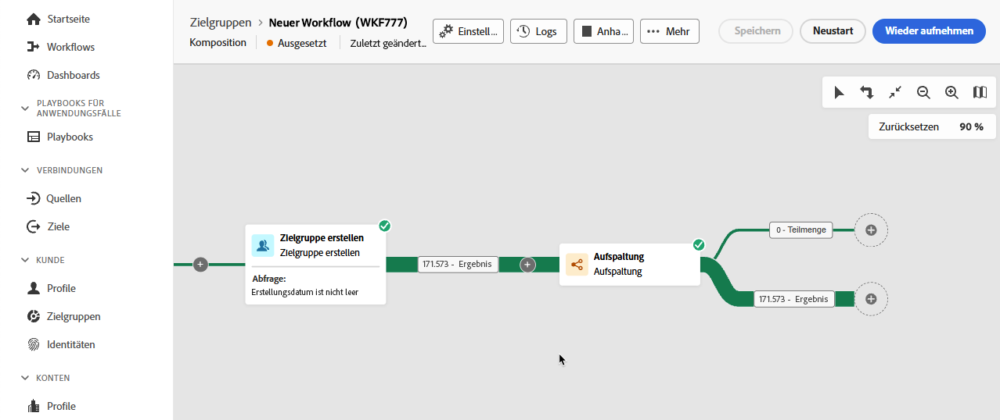
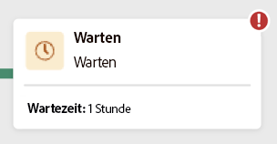
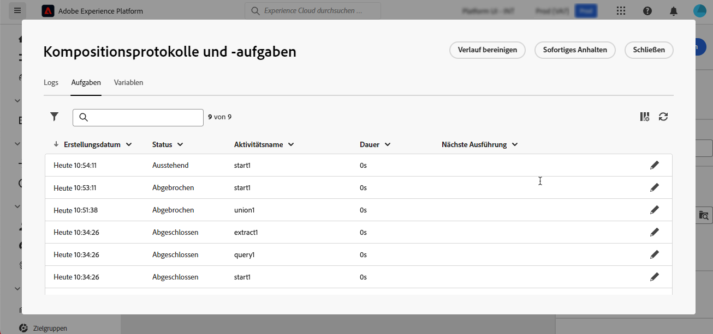

# Erstellen einer Komposition

Mit der Komposition föderierter Zielgruppen können Sie Kompositionen erstellen. Dabei können Sie verschiedene Aktivitäten in einer visuellen Arbeitsfläche nutzen, um Zielgruppen zu erstellen. Die so erstellten Zielgruppen werden in Adobe Experience Platform gespeichert und können in Experience Platform-Zielen und Adobe Journey Optimizer zum Ansprechen von Kundschaft genutzt werden. 

## Definieren der Komposition {#create}

>[!CONTEXTUALHELP]
>id="dc_composition_creation_properties"
>title="Kompositionseigenschaften"
>abstract="Wählen Sie in diesem Bildschirm die Vorlage aus, die zum Erstellen der Komposition verwendet werden soll, und geben Sie einen Titel an. Erweitern Sie den Abschnitt ZUSÄTZLICHE OPTIONEN, um weitere Einstellungen wie den internen Namen der Komposition, ihren Ordner, die Zeitzone und die Gruppe der Verantwortlichen zu konfigurieren. Es wird dringend empfohlen, eine Gruppe von Verantwortlichen auszuwählen, damit Benutzerinnen und Benutzer benachrichtigt werden, wenn Fehler auftreten."

Um eine Komposition zu erstellen, müssen Sie zunächst ihre Bezeichnung definieren und optional zusätzliche Einstellungen konfigurieren.

Zum Erstellen einer Komposition wählen Sie **[!UICONTROL Zielgruppen]** im Abschnitt **[!UICONTROL Kundin bzw. Kunde]** aus, gefolgt von der Registerkarte **[!UICONTROL Föderierte Kompositionen]**.

Die Seite zum Durchsuchen föderierter Kompositionen wird angezeigt. Wählen Sie **[!UICONTROL Komposition erstellen]** aus, um mit dem Erstellen der Komposition fortzufahren.

Geben **[!UICONTROL im Abschnitt]** einen Titel für Ihre Komposition an und wählen Sie ein Datenmodell aus. In den Aktivitäten Ihrer Komposition sind nur die mit diesem Datenmodell verknüpften Schemata verfügbar.

Wählen Sie **[!UICONTROL Erstellen]** aus. Die Arbeitsfläche der Komposition wird angezeigt. Sie können Ihre Komposition jetzt konfigurieren, indem Sie Aktivitäten und Transitionen zur Arbeitsfläche hinzufügen.

## Kompositions-Arbeitsfläche {#canvas}

Oben auf der Arbeitsfläche können Sie auf eine Symbolleiste zugreifen, die Optionen zum Verwalten und Navigieren in Ihren Aktivitäten bereitstellt.

Zu den verfügbaren Optionen gehören:

* **[!UICONTROL Mehrfachauswahl]**: Wählen Sie mehrere Aktivitäten aus, um sie alle gleichzeitig zu löschen oder zu kopieren und einzufügen.
* **[!UICONTROL Drehen]**: Wechseln Sie die Arbeitsfläche, um sie vertikal anzuzeigen.
* **[!UICONTROL An Bildschirm anpassen]**: Passen Sie den Zoom-Faktor der Arbeitsfläche an den Bildschirm an.
* **[!UICONTROL Vergrößern]**/**[!UICONTROL Verkleinern]**: Vergrößern oder Verkleinern der Arbeitsfläche.
* **[!UICONTROL Karte anzeigen]**: Öffnet einen Snapshot der Arbeitsfläche, in der Sie sich befinden.

## Hinzufügen von Aktivitäten {#add-activities}

Auf der Arbeitsfläche für die Komposition können Sie Aktivitäten und Transitionen hinzufügen, mit denen Sie Ihre Audience definieren können. Mit Aktivitäten können *die Komponenten* der Zielgruppe definieren, während Sie mit Transitionen *Fluss Ihrer Komposition* organisieren“ können.

Weiterführende Informationen zu den verfügbaren Aktivitäten und Transitionen finden Sie in der [Aktivitätsübersicht](./activities.md).

## Verwalten von Aktivitäten {#manage-activities}

Sie können Vorgänge für Ihre hinzugefügten Aktivitäten im Eigenschaftenbereich durchführen.

Zu den Optionen gehören:

* **[!UICONTROL Löschen]**: Löschen der Aktivität auf der Arbeitsfläche.
* **[!UICONTROL Deaktivieren]/[!UICONTROL Aktivieren]**: Deaktivieren oder Aktivieren der Aktivität. Wenn die Komposition ausgeführt wird, werden deaktivierte Aktivitäten und auf demselben Pfad folgende Aktivitäten nicht ausgeführt und die Komposition wird gestoppt.
* **[!UICONTROL Pause]/[!UICONTROL Fortsetzen]**: Aussetzen oder Fortsetzen der Aktivität. Wenn die Komposition ausgeführt wird, wird sie mit der Aktivität „Ahalten“ angehalten. Die entsprechende Aufgabe und alle ihr im gleichen Pfad folgenden Aufgaben werden nicht ausgeführt.
* **[!UICONTROL Kopieren]**: Kopiert die Aktivität, um sie an einer anderen Stelle in der Komposition einzufügen. Klicken Sie dazu auf die Schaltfläche **+** auf einer Transition und wählen Sie **[!UICONTROL Aktivität X einfügen]**. <!-- cannot copy multiple activities ? cannot paste in another composition?-->
* Konfigurieren Sie die **[!UICONTROL Ausführungsoptionen]** für die ausgewählte Aktivität. Zu den verfügbaren Ausführungsoptionen gehören die folgenden:
  +++Verfügbare Ausführungsoptionen

  Im Abschnitt **[!UICONTROL Eigenschaften]** können Sie allgemeine Einstellungen für die Ausführung der Aktivität konfigurieren:

   * **[!UICONTROL Ausführung]**: Definieren Sie die Aktion, die beim Start ausgeführt werden soll.
   * **[!UICONTROL Maximale Ausführungsdauer]**: Geben Sie eine Dauer an, z. B. 30 Sekunden oder 1 Stunde. Wenn die Aktivität nach Ablauf der angegebenen Dauer nicht abgeschlossen ist, wird ein Warnhinweis ausgelöst. Dies hat keine Auswirkungen auf die Funktionsweise der Komposition.
   * **[!UICONTROL Zeitzone]**: Wählen Sie die Zeitzone der Aktivität aus. Mit Kompositionen föderierter Zielgruppen können Sie die Zeitzonen mehreren Ländern in derselben Instanz verwalten. Die angewendete Einstellung wird beim Erstellen der Instanz konfiguriert.
   * **[!UICONTROL Affinität]**: Erzwingt die Ausführung einer Kompositionsaktivität auf einem bestimmten Computer. Dazu müssen Sie eine oder mehrere Affinitäten für die betreffende Aktivität angeben.
   * **[!UICONTROL Verhalten]**: Legt das Vorgehen bei der Verwendung asynchroner Aufgaben fest.

  Im Abschnitt **[!UICONTROL Umgang mit Fehlern]** können Sie die Aktion angeben, die ausgeführt werden soll, wenn bei der Aktivität ein Fehler auftritt.

  Im Abschnitt **[!UICONTROL Initialisierungsscript]** können Sie Variablen initialisieren oder Aktivitätseigenschaften ändern. Wählen Sie die **[!UICONTROL Code bearbeiten]** und geben Sie den auszuführenden Code-Ausschnitt ein. Das Skript wird aufgerufen, wenn die Aktivität ausgeführt wird. 

  +++
* **Protokolle und Aufgaben**: Anzeigen der Protokolle und Aufgaben für die ausgewählte Aktivität.

## Starten und Überwachen der Komposition {#start-and-monitor}

Nachdem Sie Ihre Aktivitäten zur Komposition hinzugefügt haben, können Sie die Ausführung der Komposition starten. Um eine Komposition zu starten, wählen **[!UICONTROL die Schaltfläche]** Starten“ in der oberen rechten Ecke des Bildschirms aus.

| Aktion | Beschreibung |
| ------ | ----------- |
| **Starten** | Startet die Ausführung der Komposition und verschiebt sie in den Status **In Bearbeitung**. |
| **Aussetzen** | Hält die Ausführung der Komposition an und setzt sie auf den Status **Paused**. Neue Aktivitäten werden erst aktiviert, wenn die Komposition fortgesetzt wird, laufende Vorgänge werden jedoch **nicht** ausgesetzt. |
| **Fortsetzen** | Setzt die Ausführung der angehaltenen Komposition fort und setzt sie auf den Status **In Bearbeitung**. |
| **Anhalten** | Hält die Ausführung der Komposition an und setzt sie auf den Status **Beendet**. Sie **die Komposition** an der Stelle fortsetzen, an der sie gestoppt wurde. |
| **Neu starten** | Hält die Ausführung der Komposition an und startet sie erneut. |

Wenn die Komposition ausgeführt wird, wird jede Aktivität auf der Arbeitsfläche in sequenzieller Reihenfolge ausgeführt, bis das Ende der Komposition erreicht ist. Anhand eines visuellen Flusses können Sie den Fortschritt von Zielgruppenprofilen in Echtzeit verfolgen. Auf diese Weise können Sie den Status jeder Aktivität und die Anzahl der Profile, die zwischen ihnen wechseln, schnell identifizieren.

Die visuellen Indikatoren in der oberen rechten Ecke jeder Aktivität zeigen den Status der Ausführung an:

| Visueller Indikator | Beschreibung |
| ---------------- | ------------|
| {zoomable="yes"}{width="70%"} | Die Aktivität wird derzeit ausgeführt. |
| {zoomable="yes"}{width="70%"} | Die Aktivität erfordert Ihre Aufmerksamkeit. Dies kann die Bestätigung eines Versands oder die Ergreifung einer notwendigen Maßnahme beinhalten. |
| {zoomable="yes"}{width="70%"} | Bei der Aktivität ist ein Fehler aufgetreten. Öffnen Sie zur Problembehebung die Kompositionsprotokolle, um weitere Informationen zu erhalten. |
| {zoomable="yes"}{width="70%"} | Die Aktivität wurde erfolgreich ausgeführt. |

### Überwachen der Protokolle und Aufgaben {#monitor-logs}

Darüber hinaus können Sie die Kompositionsprotokolle anzeigen, um sicherzustellen, dass sie ordnungsgemäß ausgeführt werden. Wählen **[!UICONTROL Protokolle]** in der Aktionssymbolleiste aus, um diese Informationen anzuzeigen.

Der **[!UICONTROL „Kompositionsprotokolle und Aufgaben]** wird angezeigt. Dies bietet einen Verlauf der Kompositionsausführung, in dem alle Benutzeraktionen und aufgetretenen Fehler aufgezeichnet werden.

Der Verlauf ist in verschiedene Registerkarten unterteilt, die nachfolgend beschrieben werden:

* Die Registerkarte **[!UICONTROL Protokoll]** enthält den Ausführungsverlauf aller Kompositionsaktivitäten. Er zeigt in chronologischer Abfolge alle Vorgänge und Ausführungsfehler.
* Der **[!UICONTROL Aufgaben]**-Tab liefert Details zur Ausführungsabfolge der Aktivitäten. Mit der Schaltfläche am Ende jeder Aufgabe können Sie die Ereignisvariablen auflisten, die durch die Aktivität übergeben werden.
* Auf der Registerkarte **[!UICONTROL Variablen]** werden alle in der Komposition übergebenen Variablen aufgelistet. Sie ist nur verfügbar, wenn Sie auf die Protokolle und Aufgaben von der Arbeitsfläche der Komposition aus zugreifen. Sie ist jetzt beim Zugriff auf die Protokolle im Eigenschaftenbereich einer Aktivität verfügbar.

Auf allen Registerkarten können Sie die angezeigten Spalten und ihre Reihenfolge auswählen, Filter anwenden und das Suchfeld verwenden, um die gewünschten Informationen schnell zu finden.

### Abonnieren von Warnhinweisen {#alerts}

Sie können auch Warnhinweise abonnieren, um Benachrichtigungen zu erhalten, wenn Ihre Ausführungen der Federated-Komposition erfolgreich waren oder fehlgeschlagen sind.

Um Warnhinweise zu abonnieren, wählen Sie  gefolgt von  aus.

{zoomable="yes"}{width="70%"}

Die Einstellungsseite für Benachrichtigungen wird angezeigt. Wählen Sie auf dieser Seite **[!UICONTROL Experience Platform]** und anschließend die gewünschten Warnhinweiskanäle aus. Um Benachrichtigungen auf der Benutzeroberfläche anzuzeigen, wählen Sie **[!UICONTROL In-App]** aus.

{zoomable="yes"}{width="50%"}

Nun, da **[!UICONTROL In-App]** ausgewählt ist, werden Sie über Erfolge und Fehler bei der Kompositionsausführung benachrichtigt.

{zoomable="yes"}{width="70%"}

## Konfigurieren der Kompositionseinstellungen {#settings}

>[!CONTEXTUALHELP]
>id="dc_composition_settings_properties"
>title="Kompositionseigenschaften"
>abstract="Dieser Abschnitt enthält allgemeine Kompositionseigenschaften, auf die auch beim Erstellen der Komposition zugegriffen werden kann."

>[!CONTEXTUALHELP]
>id="dc_composition_settings_segmentation"
>title="Kompositionssegmentierung"
>abstract="Standardmäßig werden nur die Arbeitstabellen der letzten Ausführung der Komposition aufbewahrt. Sie können diese Option aktivieren, um Arbeitstabellen zu Testzwecken beizubehalten. Diese Option darf **nur** in Entwicklungs- oder Staging-Umgebungen verwendet werden. Sie darf niemals in einer Produktionsumgebung aktiviert werden."

>[!CONTEXTUALHELP]
>id="dc_composition_settings_error"
>title="Einstellungen für den Umgang mit Fehlern"
>abstract="In diesem Abschnitt können Sie definieren, wie Fehler während der Ausführung behandelt werden sollen. Sie können festlegen, dass der Prozess angehalten werden soll, dass eine bestimmte Anzahl von Fehlern ignoriert werden soll oder dass die Ausführung der Komposition gestoppt werden soll."

Beim Zugriff auf eine Komposition können Sie auf erweiterte Einstellungen zugreifen, mit denen Sie beispielsweise festlegen können, wie sich die Komposition im Falle eines Fehlers verhalten soll. 

Um auf diese zusätzlichen Optionen zuzugreifen, wählen Sie im oberen Abschnitt des Bildschirms zur Kompositionserstellung **[!UICONTROL Einstellungen]** aus.

| Einstellungen | Beschreibung |
| -------- | ----------- |
| **[!UICONTROL Label]** | Aktualisieren Sie den Namen, der der Komposition gegeben wurde. |
| **[!UICONTROL Zwischen zwei Ausführungen die ermittelte Population festhalten]** | Wenn diese Option aktiviert ist, werden Arbeitstabellen auch nach Ausführung der Komposition beibehalten. Standardmäßig werden nur die Arbeitstabellen der letzten Ausführung der Komposition aufbewahrt. Arbeitstabellen früherer Ausführungen werden täglich entfernt. Sie sollten diese Einstellung nur in einer Entwicklungs- oder Staging-Umgebung aktivieren. Sie sollten **nie** diese Einstellung in einer Produktionsumgebung aktivieren. |
| **[!UICONTROL Umgang mit Fehlern]** | Definiert die Aktionen, die ausgeführt werden, wenn die Komposition einen Fehler aufweist. Es gibt drei mögliche Optionen: <ul><li>**[!UICONTROL Prozess aussetzen]**: Die Komposition wird automatisch ausgesetzt und der Status wechselt zu **[!UICONTROL Fehlgeschlagen]**. Sobald das Problem behoben ist, können Sie die Komposition über die Schaltflächen **[!UICONTROL Fortsetzen]** wieder aufnehmen.</li><li>**[!UICONTROL Ignorieren]**: Der Status der Aufgabe, die den Fehler ausgelöst hat, ändert sich in **[!UICONTROL Fehlgeschlagen]**, die Komposition behält jedoch den Status **[!UICONTROL Gestartet]**.</li><li>**[!UICONTROL Vorgang abbrechen]**: Die Komposition wird automatisch gestoppt und der Status ändert sich in **[!UICONTROL Fehlgeschlagen]**. Sobald das Problem behoben ist, starten Sie die Komposition mit der Schaltfläche **[!UICONTROL Starten]** neu.</li></ul> |
| **[!UICONTROL Folgefehler]** | Geben Sie die Anzahl der Fehler an, die ignoriert werden können, bevor der Prozess angehalten wird. Sobald diese Zahl erreicht ist, wechselt der Status der Komposition in **[!UICONTROL Fehlgeschlagen]**. Wenn der Wert dieses Felds 0 beträgt, wird die Komposition unabhängig von der Fehleranzahl nie angehalten. |
