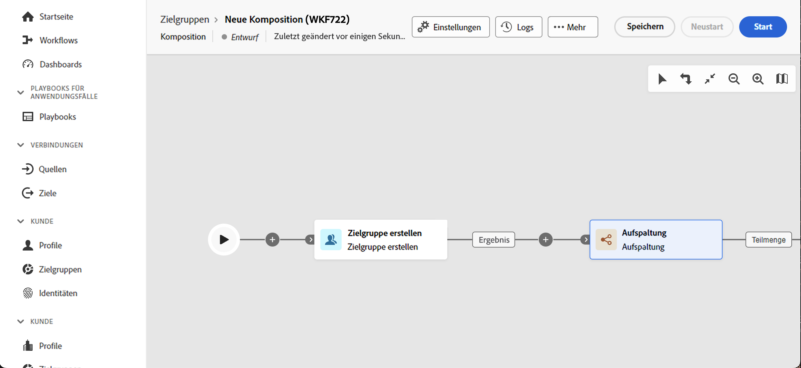

# Grundlegende Prinzipien der Kompositionserstellung {#gs-composition-creation}

>[!CONTEXTUALHELP]
>id="dc_composition_creation_properties"
>title="Kompositionseigenschaften"
>abstract="Wählen Sie in diesem Bildschirm die Vorlage aus, die zum Erstellen der Komposition verwendet werden soll, und geben Sie einen Titel an. Erweitern Sie den Abschnitt ZUSÄTZLICHE OPTIONEN, um weitere Einstellungen wie den internen Namen der Komposition, ihren Ordner, die Zeitzone und die Gruppe der Verantwortlichen zu konfigurieren. Es wird dringend empfohlen, eine Gruppe von Verantwortlichen auszuwählen, damit Benutzerinnen und Benutzer benachrichtigt werden, wenn Fehler auftreten."

## Was ist in einer Komposition? {#gs-composition-inside}

Experience Platform Federated Audience Komposition bietet eine visuelle Arbeitsfläche, mit der Sie Zielgruppen erstellen können, indem Sie verschiedene Aktivitäten nutzen (Aufspaltung, Anreicherung usw.).

Das Kompositionsdiagramm zeigt, was passieren soll. Es beschreibt die verschiedenen Aufgaben, die ausgeführt und miteinander verknüpft werden sollen.

{zoomable="yes"} {zoomable="yes"}

Jede Komposition besteht aus:

* **[!UICONTROL Aktivitäten]**: Eine Aktivität ist eine Aufgabe, die ausgeführt werden soll. Die verschiedenen verfügbaren Aktivitäten werden im Diagramm durch Symbole dargestellt. Jede Aktivität verfügt über bestimmte Eigenschaften sowie andere Eigenschaften, die für alle Aktivitäten gelten.
* **[!UICONTROL Transitionen]**: Transitionen verknüpfen eine Quellaktivität mit einer Zielaktivität und definieren deren Sequenz.
* **[!UICONTROL Arbeitstabellen]**: Die Arbeitstabelle enthält alle von der Transition übermittelten Informationen. Jede Komposition verwendet mehrere Arbeitstabellen. Die in diesen Tabellen enthaltenen Daten können während des gesamten Lebenszyklus der Komposition verwendet werden.

## Wichtige Schritte zur Erstellung einer Komposition {#gs-composition-steps}

Die wichtigsten Schritte zum Erstellen einer Komposition sind folgende:

1. [Erstellen und Konfigurieren der Komposition](../compositions/create-composition.md)
1. [Orchestrieren von Aktivitäten](../compositions/orchestrate-activities.md)
1. [Ausführen der Komposition und Überwachen der Ausführung](../compositions/start-monitor-composition.md)
