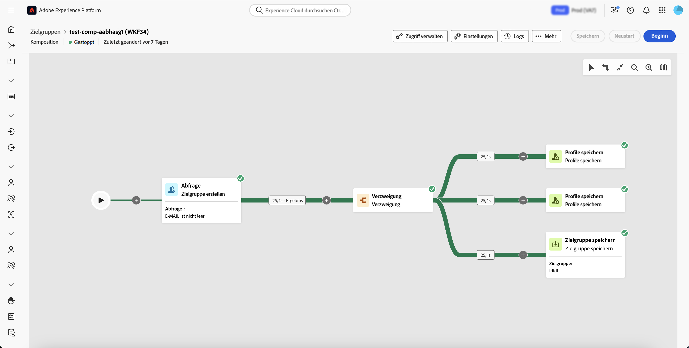
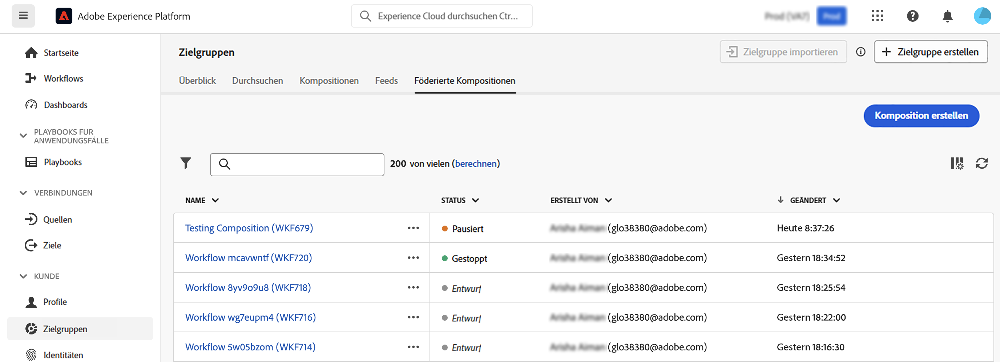
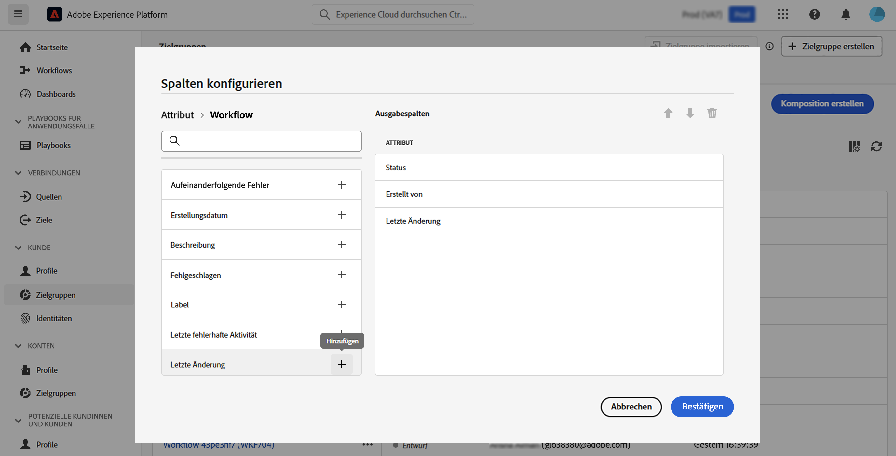
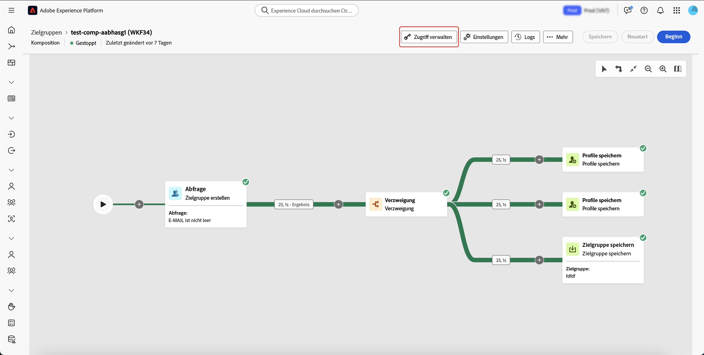
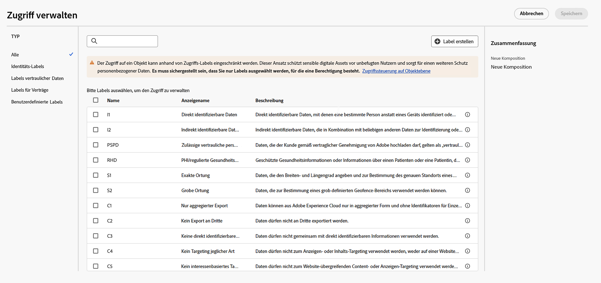

# Erste Schritte mit Kompositionen {#compositions}

>[!AVAILABILITY]
>
>Um auf Kompositionen zugreifen zu können, benötigen Sie eine der folgenden Berechtigungen:
>
>-**Föderierte Kompositionen verwalten**
>>-**Föderierte Kompositionen anzeigen**
>
>Weitere Informationen zu den erforderlichen Berechtigungen finden Sie im [Handbuch zur Zugriffssteuerung](/help/governance-privacy-security/access-control.md).

Mit der Federated Audience-Komposition können Sie Kompositionen erstellen, in denen Sie verschiedene Aktivitäten in einer visuellen Arbeitsfläche nutzen können, um Zielgruppen zu erstellen. Nach der Erstellung der Komposition werden die resultierenden Audiences in Adobe Experience Platform gespeichert und können in Experience Platform-Zielen und Adobe Journey Optimizer genutzt werden, um Kunden anzusprechen.

{zoomable="yes"}{width="70%"}

## Zugreifen auf und Verwalten von Kompositionen {#access}

>[!CONTEXTUALHELP]
>id="dc_composition_list"
>title="Kompositionen"
>abstract="Auf diesem Bildschirm können Sie auf die vollständige Liste der Kompositionen zugreifen, ihren aktuellen Status sowie das Datum der letzten/nächsten Ausführung überprüfen und eine neue Komposition erstellen."

Auf Kompositionen kann über das Adobe Experience Platform-Menü **[!UICONTROL Zielgruppen]** auf der Registerkarte **[!UICONTROL Verknüpfte Kompositionen]** im Abschnitt **[!UICONTROL Kunden]** zugegriffen werden.

Auf diesem Bildschirm können Sie neue Kompositionen erstellen und auf bestehende Kompositionen zugreifen. Sie können eine vorhandene Komposition auch duplizieren oder löschen, indem Sie auf die Schaltfläche  neben ihrem Namen klicken.

Sie können auch Informationen zu den Kompositionen anzeigen, einschließlich Name, Status, Ersteller und Datum der letzten Änderung.

| Status | Beschreibung |
| ------ | ----------- |
| **[!UICONTROL Entwurf]** | Die Komposition wurde erstellt und gespeichert. |
| **[!UICONTROL In Bearbeitung]** | Die Komposition wurde ausgeführt und wird derzeit ausgeführt. |
| **[!UICONTROL Angehalten]** | Die Ausführung der Komposition ist abgeschlossen und wurde gestoppt. |
| **[!UICONTROL Ausgesetzt]** | Die Ausführung der Komposition wurde angehalten. |
| **[!UICONTROL Fehlerhaft]** | Bei der Ausführung der Komposition ist ein Fehler aufgetreten. Um weitere Informationen zum Fehler anzuzeigen, öffnen Sie die Komposition und greifen Sie auf die Protokolle zu. |

Wie Sie eine Komposition starten oder stoppen, erfahren Sie im [Handbuch zum Starten und Überwachen der Komposition](./start-monitor-composition.md).

{zoomable="yes"}{width="70%"}{align="center"}

Um die Liste zu verfeinern und die gesuchte Komposition zu finden, können Sie die Liste durchsuchen und Kompositionen nach ihrem Status oder dem letzten Verarbeitungsdatum filtern.

Sie können die Liste auch anpassen, indem Sie Spalten hinzufügen oder entfernen. Klicken Sie dazu auf die Schaltfläche **[!UICONTROL Spalten konfigurieren]** und fügen Sie die gewünschten Ausgabespalten hinzu oder entfernen Sie diese.

{zoomable="yes"}{width="70%"}{align="center"}

### Anwenden von Zugriffsbeschriftungen  {#access-labels}

Um Zugriffsbeschriftungen auf eine bestimmte Komposition anzuwenden, wählen Sie die Komposition und dann **[!UICONTROL Zugriff verwalten]** aus.

{zoomable="yes"}{width="70%"}{align="center"}

Das **[!UICONTROL Zugriff verwalten]** wird angezeigt. Auf dieser Seite können Sie die entsprechenden Zugriffs- und Data Governance-Beschriftungen auf Ihre Komposition anwenden.

{zoomable="yes"}{width="70%"}{align="center"}

| Kennzeichnungstyp | Beschreibung |
| ---------- | ----------- |
| Vertragsbezeichnungen | Vertragskennzeichnungen („C“-Kennzeichnungen) werden verwendet, um Daten zu kategorisieren, für die vertragliche Verpflichtungen bestehen oder die mit den Data-Governance-Richtlinien Ihres Unternehmens in Zusammenhang stehen. |
| Identitätsbezeichnungen | Identitätskennzeichnungen („I“-Kennzeichnungen) werden verwendet, um Daten zu kategorisieren, mit denen eine bestimmte Person identifiziert oder kontaktiert werden kann. |
| Kennzeichnungen für sensible Daten | Sensible Kennzeichnungen („S“-Kennzeichnungen) werden verwendet, um Sie und/oder Ihr Unternehmen als sensibel zu kategorisieren. |
| Partner-Ökosystem-Kennzeichnungen | Partner-Ökosystem-Kennzeichnungen werden verwendet, um Daten aus externen Quellen in Ihrem Unternehmen zu kategorisieren. |

Weitere Informationen zu Zugriffs- und Data Governance-Beschriftungen finden Sie im [Glossar zu Datennutzungsbeschriftungen](https://experienceleague.adobe.com/en/docs/experience-platform/data-governance/labels/reference).

## Nächste Schritte

Nach dem Lesen dieses Handbuchs haben Sie gelernt, wie Sie auf Zugriffsbeschriftungen für Ihre Kompositionen zugreifen, diese verwalten und erstellen können. Weiterführende Informationen zum Arbeiten mit Audiences als Ganzes finden Sie im [Handbuch für Audiences](../start/audiences.md).
