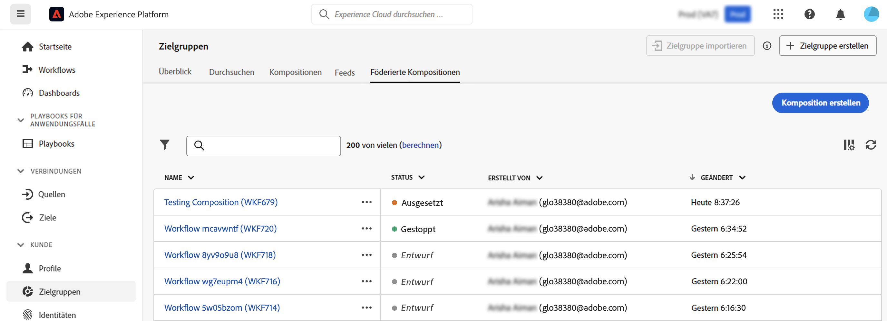
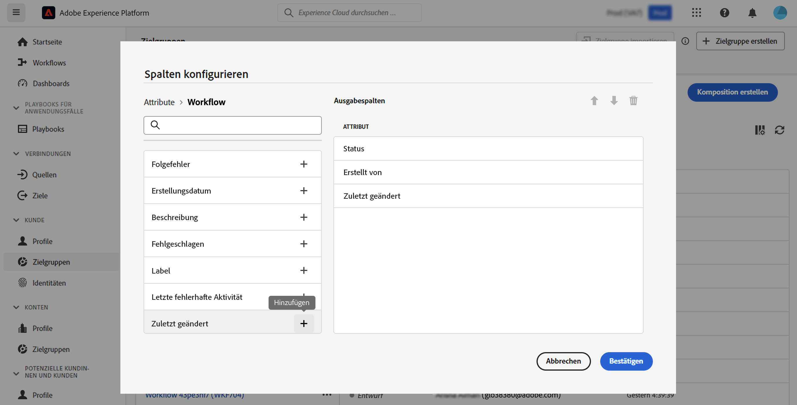

# Erste Schritte mit Kompositionen {#compositions}

## Was ist ein Aufsatz? {#what}

Mit der Adobe-Datenkomposition können Sie Kompositionen erstellen, bei denen Sie verschiedene Aktivitäten (Aufspaltung, Ausschließen...) in einer visuellen Arbeitsfläche nutzen können, um Zielgruppen zu erstellen. Danach werden die resultierenden Zielgruppen zusammen mit vorhandenen Zielgruppen in Adobe Experience Platform gespeichert und können in Zielen wie Journey Optimizer für die Kundenansprache genutzt werden.

## Zugriff auf Kompositionen {#access}

>[!CONTEXTUALHELP]
>id="dc_workflow_list"
>title="Kompositionen"
>abstract="In diesem Bildschirm können Sie die vollständige Liste der Kompositionen aufrufen, ihren aktuellen Status, das letzte/nächste Ausführungsdatum überprüfen und eine neue Komposition erstellen."

Kompositionen können über die Adobe Experience Platform aufgerufen werden **[!UICONTROL Zielgruppen]** im Menü **Zusammengestellte Kompositionen** Registerkarte.

Auf diesem Bildschirm können Sie neue Kompositionen erstellen und auf bestehende zugreifen.

Um die Liste zu verfeinern und die gesuchte Komposition einfach zu finden, können Sie die Liste durchsuchen und Kompositionen nach ihrem Status oder dem letzten Verarbeitungsdatum filtern.

Sie können die Liste auch anpassen, indem Sie Spalten hinzufügen oder entfernen. Klicken Sie dazu auf die Schaltfläche Spalten konfigurieren und verwalten

Um eine vorhandene Komposition zu duplizieren oder zu löschen, klicken Sie auf die Suchschaltfläche neben ihrem Namen und wählen Sie den gewünschten Vorgang aus.

## Status von Kompositionen {#status}

Kompositionen können mehrere Status aufweisen:

* **[!UICONTROL Entwurf]**: Die Komposition wurde erstellt und gespeichert.
* **[!UICONTROL Gestartet]**: Die Komposition wurde ausgeführt und wird derzeit ausgeführt.
* **[!UICONTROL Angehalten]**: Die Ausführung der Komposition wurde angehalten.
* **[!UICONTROL Angehalten]**: Die Ausführung der Komposition wurde angehalten.
* **[!UICONTROL Fehlerhaft]**: Bei der Ausführung der Komposition ist ein Fehler aufgetreten. Öffnen Sie die Komposition und greifen Sie auf die Protokolle und Aufgaben zu, um den Fehler zu identifizieren und zu beheben.
