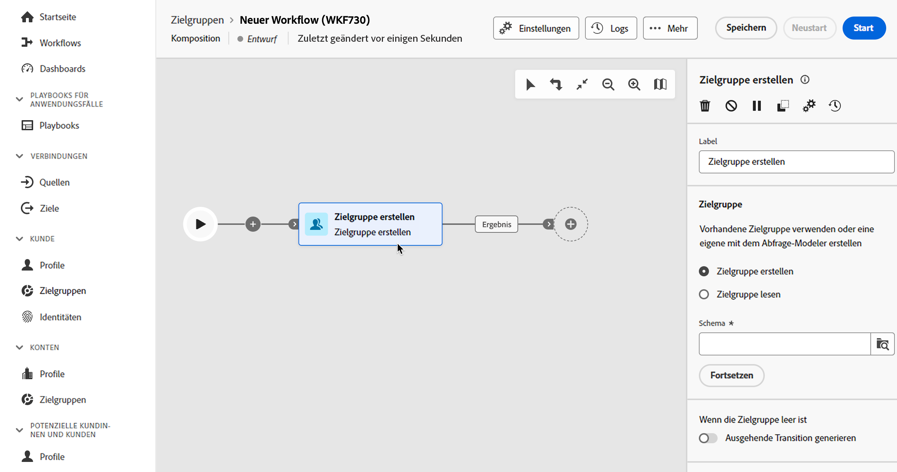
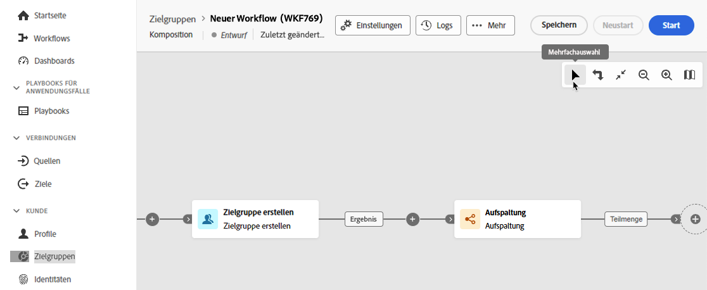
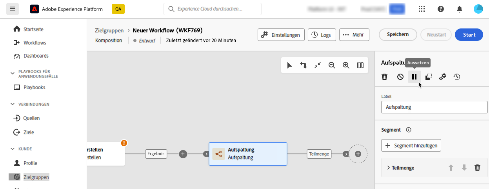

# Orchestrieren von Kompositionsaktivitäten {#activities}

Nachdem Sie eine Komposition erstellt haben, können Sie mit der Orchestrierung der verschiedenen Aufgaben beginnen, die sie ausführen wird. Zu diesem Zweck wird eine visuelle Arbeitsfläche bereitgestellt, über die Sie Ihr Zielgruppen-Kompositionsdiagramm erstellen können. Innerhalb dieses Diagramms können Sie verschiedene Aktivitäten hinzufügen und sie in einer sequentiellen Reihenfolge verbinden.

## Hinzufügen von Aktivitäten {#add}

In diesem Schritt der Konfiguration wird das Diagramm mit einem Startsymbol angezeigt, das den Anfang Ihrer Komposition darstellt. Um Ihre erste Aktivität hinzuzufügen, klicken Sie auf die Schaltfläche **+**, die mit dem Startsymbol verbunden ist.

Es erscheint eine Liste von Aktivitäten, die dem Diagramm hinzugefügt werden können. Die verfügbaren Aktivitäten hängen von Ihrer Position im Kompositionsdiagramm ab. Wenn Sie beispielsweise Ihre erste Aktivität hinzufügen, können Sie Ihre Komposition starten, indem Sie eine Zielgruppe ansprechen, den Kompositionspfad aufteilen, eine Planungs- oder **Warte-Aktivität** festlegen, um die Ausführung der Komposition zu verzögern. Andererseits können Sie nach der Aktivität **Zielgruppe erstellen** Ihre Zielgruppe mit Targeting-Aktivitäten verfeinern oder den Kompositionsvorgang mit Flusssteuerungsaktivitäten organisieren.

Sobald eine Aktivität zum Diagramm hinzugefügt wurde, erscheint rechts ein Bereich, in dem Sie die neu hinzugefügte Aktivität mit spezifischen Einstellungen konfigurieren können. Detaillierte Informationen über die Konfiguration jeder Aktivität finden Sie in [diesem Abschnitt](activities/about-activities.md).

Wiederholen Sie diesen Vorgang, um abhängig von den Aufgaben, die Ihre Komposition ausführen soll, beliebig viele Aktivitäten hinzuzufügen. Beachten Sie, dass Sie auch eine neue Aktivität zwischen zwei Aktivitäten einfügen können. Klicken Sie dazu auf die Schaltfläche **+** an der Transition zwischen den Aktivitäten, wählen Sie die gewünschte Aktivität aus und konfigurieren Sie sie im rechten Bereich.

>[!TIP]
>
>Sie haben die Möglichkeit, den Namen der Transitionen zwischen den einzelnen Aktivitäten zu personalisieren. Wählen Sie dazu die Transition aus und ändern Sie die Bezeichnung im rechten Bereich.

## Die Arbeitsflächensymbolleiste {#toolbar}

Die Symbolleiste in der oberen rechten Ecke der Arbeitsfläche bietet Optionen zum einfachen Bearbeiten der Aktivitäten und Navigieren auf der Arbeitsfläche.

Folgende Aktionen sind verfügbar: 

* **[!UICONTROL Mehrfachauswahl]**: Dient zur Auswahl mehrerer Aktivitäten, um sie alle gleichzeitig zu löschen oder zu kopieren/einzufügen. Weitere Informationen finden Sie in [diesem Abschnitt](#copy).
* **[!UICONTROL Drehen]**: Dreht die Arbeitsfläche vertikal.
* **[!UICONTROL An Bildschirm anpassen]**: Passt die Vergrößerung der Arbeitsfläche an Ihren Bildschirm an.
* **[!UICONTROL Verkleinern]**/**[!UICONTROL Vergrößern]**: Verkleinert bzw. vergrößert die Arbeitsfläche.
* **[!UICONTROL Karte anzeigen]**: Öffnet einen Snapshot der Arbeitsfläche, in der Sie sich befinden.

## Verwalten von Aktivitäten {#manage}

Beim Hinzufügen von Aktivitäten sind im Eigenschattenbereich Aktionsschaltflächen verfügbar, mit denen Sie mehrere Vorgänge ausführen können. 

Sie haben folgende Möglichkeiten:

* **[!UICONTROL Löschen]** der Aktivität von der Arbeitsfläche aus.
* **[!UICONTROL Deaktivieren]/[!UICONTROL Aktivieren]** der Aktivität. Wenn die Komposition ausgeführt wird, werden deaktivierte Aktivitäten und auf demselben Pfad folgende Aktivitäten nicht ausgeführt und die Komposition wird gestoppt.
* **[!UICONTROL Unterbrechen]/[!UICONTROL Fortsetzen]** der Aktivität. Wenn die Komposition ausgeführt wird, wird sie mit der Aktivität „Ahalten“ angehalten. Die entsprechende Aufgabe und alle ihr im gleichen Pfad folgenden Aufgaben werden nicht ausgeführt.
* **[!UICONTROL Kopieren]** Sie die Aktivität, um sie an einer anderen Stelle in der Komposition einzufügen. Klicken Sie dazu auf die Schaltfläche **+** in einer Transition und wählen Sie **[!UICONTROL Aktivität X einfügen]** aus.<!-- cannot copy multiple activities ? cannot paste in another composition?-->
* Konfigurieren Sie die **[!UICONTROL Ausführungsoptionen]** für die ausgewählte Aktivität. Erweitern Sie den folgenden Abschnitt, um mehr über die verfügbaren Optionen zu erfahren.

  +++ Verfügbare Ausführungsoptionen

  Im Abschnitt **[!UICONTROL Eigenschaften]** können Sie allgemeine Einstellungen für die Ausführung der Aktivität konfigurieren:

   * **[!UICONTROL Ausführung]**: Definieren Sie die Aktion, die beim Start ausgeführt werden soll.
   * **[!UICONTROL Maximale Ausführungsdauer]**: Geben Sie eine Dauer an, z. B. 30 Sekunden oder 1 Stunde. Wenn die Aktivität nach Ablauf der angegebenen Dauer nicht abgeschlossen ist, wird ein Warnhinweis ausgelöst. Dies hat keine Auswirkungen auf die Funktionsweise der Komposition.
   * **[!UICONTROL Zeitzone]**: Wählen Sie die Zeitzone der Aktivität aus. Mit Kompositionen föderierter Zielgruppen können Sie die Zeitzonen mehreren Ländern in derselben Instanz verwalten. Die angewendete Einstellung wird beim Erstellen der Instanz konfiguriert.
   * **[!UICONTROL Affinität]**: Erzwingt die Ausführung einer Kompositionsaktivität auf einem bestimmten Computer. Dazu müssen Sie eine oder mehrere Affinitäten für die betreffende Aktivität angeben.
   * **[!UICONTROL Verhalten]**: Legt das Vorgehen bei der Verwendung asynchroner Aufgaben fest.

  Im Abschnitt **[!UICONTROL Umgang mit Fehlern]** können Sie die Aktion angeben, die ausgeführt werden soll, wenn bei der Aktivität ein Fehler auftritt.

  Im Abschnitt **[!UICONTROL Initialisierungsscript]** können Sie Variablen initialisieren oder Aktivitätseigenschaften ändern. Klicken Sie auf die Schaltfläche **[!UICONTROL Code bearbeiten]** und geben Sie den auszuführenden Code-Ausschnitt ein. Das Skript wird aufgerufen, wenn die Aktivität ausgeführt wird. 

+++

* Greifen Sie auf die **Protokolle und Aufgaben** der Aktivität zu.
