# Starten und Überwachen der Komposition {#start-monitor}

Sobald Sie Ihre Komposition erstellt und die Aufgaben in der Arbeitsfläche geplant haben, können Sie sie starten und ihre Ausführung überwachen.

## Starten der Komposition {#start}

Um eine Komposition zu starten, klicken Sie oben rechts im Bildschirm auf die Schaltfläche **[!UICONTROL Starten]**. Beim Ausführen der Komposition wird jede Aktivität auf der Arbeitsfläche nacheinander ausgeführt, bis das Ende der Komposition erreicht ist.

Anhand eines visuellen Flusses können Sie den Fortschritt von Zielgruppenprofilen in Echtzeit verfolgen. Auf diese Weise können Sie den Status jeder Aktivität und die Anzahl der Profile, die zwischen ihnen wechseln, schnell identifizieren.

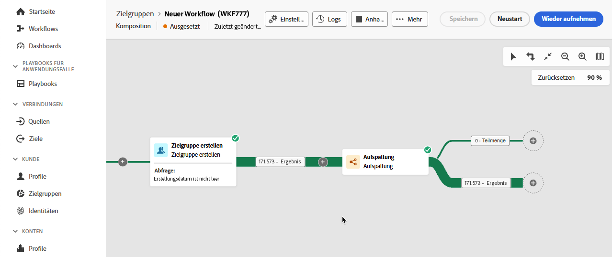

## Kompositionstransitionen {#transitions}

In Kompositionen werden Daten, die durch Transition von einer Aktivität zur nächsten übertragen werden, in einer temporären Arbeitstabelle gespeichert. Diese Daten können für jede Transition angezeigt werden. Wählen Sie dazu eine Transition aus, um ihre Eigenschaften auf der rechten Seite des Bildschirms zu öffnen.

* Klicken Sie auf **[!UICONTROL Vorschau für Schema]**, um das Schema der Arbeitstabelle anzuzeigen.
* Klicken Sie auf **[!UICONTROL Ergebnisvorschau]**, um die in der ausgewählten Transition übertragenen Daten zu visualisieren. Diese Option ist nur verfügbar, wenn die Option **[!UICONTROL Zwischen zwei Ausführungen die ermittelte Population festhalten]** aktiviert ist. [Weitere Informationen](create-composition.md#settings).

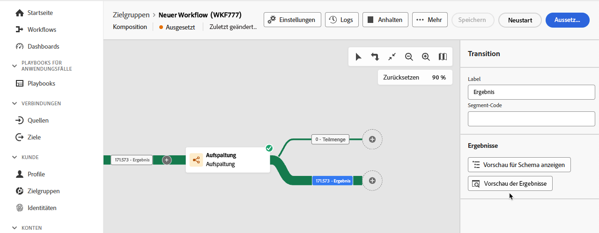

## Überwachen der Aktivitätsausführung {#activities}

Visuelle Indikatoren in der rechten oberen Ecke eines jeden Aktivitätsfeldes ermöglichen es, die Ausführung zu überprüfen:

| Visueller Indikator | Beschreibung |
|-----|------------|
| 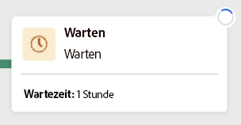{zoomable="yes"}{width="70%"} | Die Aktivität wird derzeit ausgeführt. |
| 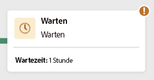{zoomable="yes"}{width="70%"} | Die Aktivität erfordert Ihre Aufmerksamkeit. Dies kann die Bestätigung eines Versands oder die Ergreifung einer notwendigen Maßnahme beinhalten. |
| 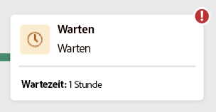{zoomable="yes"}{width="70%"} | Bei der Aktivität ist ein Fehler aufgetreten. Öffnen Sie zur Problembehebung die Kompositionsprotokolle, um weitere Informationen zu erhalten. |
| 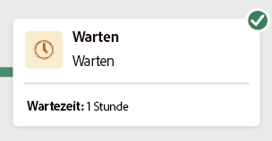{zoomable="yes"}{width="70%"} | Die Aktivität wurde erfolgreich ausgeführt. |

## Überwachen der Protokolle und Aufgaben {#logs-tasks}

Die Überwachung von Kompositionsprotokollen und -aufgaben ist ein wichtiger Schritt, um Ihre Kompositionen zu analysieren und sicherzustellen, dass sie ordnungsgemäß ausgeführt werden. Sie sind in der Aktionssymbolleiste und im Eigenschaftenbereich jeder Aktivität über die Schaltfläche **[!UICONTROL Protokolle]** zugänglich.

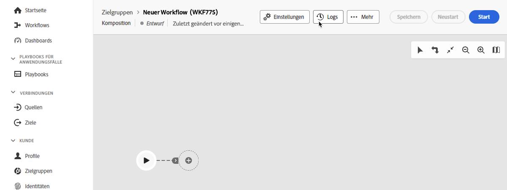

Der Bildschirm **[!UICONTROL Kompositionsprotokolle und -aufgaben]** enthält einen Verlauf der Kompositionsausführung, in dem alle Benutzeraktionen und aufgetretenen Fehler aufgezeichnet werden. 

<!-- à confirmer, pas trouvé dans les options = The workflow history is saved for the duration specified in the workflow execution options. During this duration, all the messages are therefore saved, even after a restart. If you do not want to save the messages from a previous execution, you have to purge the history by clicking the  button.-->

Der Verlauf ist in verschiedene Registerkarten unterteilt, die nachfolgend beschrieben werden:

* Die Registerkarte **[!UICONTROL Protokoll]** enthält den Ausführungsverlauf aller Kompositionsaktivitäten. Er zeigt in chronologischer Abfolge alle Vorgänge und Ausführungsfehler.
* Der **[!UICONTROL Aufgaben]**-Tab liefert Details zur Ausführungsabfolge der Aktivitäten. Mit der Schaltfläche am Ende jeder Aufgabe können Sie die Ereignisvariablen auflisten, die durch die Aktivität übergeben werden.
* Auf der Registerkarte **[!UICONTROL Variablen]** werden alle in der Komposition übergebenen Variablen aufgelistet. Sie ist nur verfügbar, wenn Sie auf die Protokolle und Aufgaben von der Arbeitsfläche der Komposition aus zugreifen. Sie ist nun beim Zugriff auf die Protokolle im Eigenschaftenbereich einer Aktivität verfügbar.  <!-- à confirmer-->

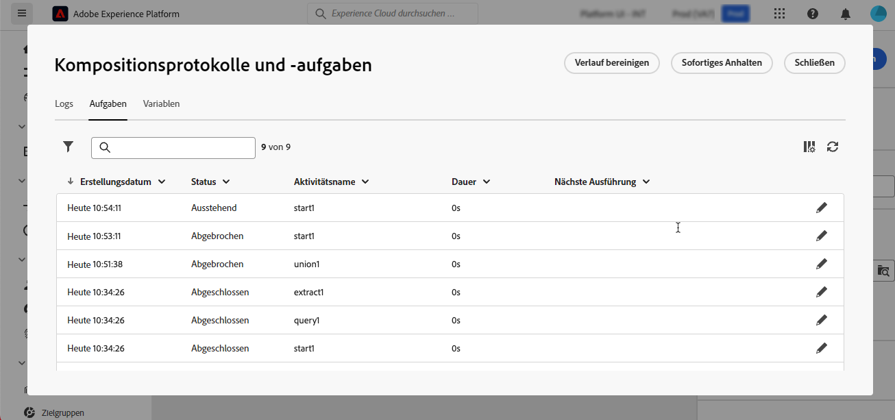

Auf allen Registerkarten können Sie die angezeigten Spalten und ihre Reihenfolge auswählen, Filter anwenden und das Suchfeld verwenden, um die gewünschten Informationen schnell zu finden.

## Abonnieren von Warnhinweisen {#alerts}

Darüber hinaus können Sie Warnhinweise abonnieren, um Benachrichtigungen zu erhalten, wenn Ihre föderierten Kompositionen erfolgreich ausgeführt wurden oder fehlgeschlagen sind.

Um Warnhinweise zu abonnieren, wählen Sie  gefolgt von  aus.

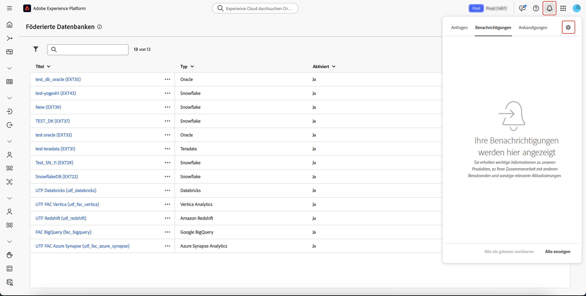{zoomable="yes"}{width="70%"}

Die Einstellungsseite für Benachrichtigungen wird angezeigt. Wählen Sie auf dieser Seite **[!UICONTROL Experience Platform]** und anschließend die gewünschten Warnhinweiskanäle aus. Um Benachrichtigungen auf der Benutzeroberfläche anzuzeigen, wählen Sie **[!UICONTROL In-App]** aus.

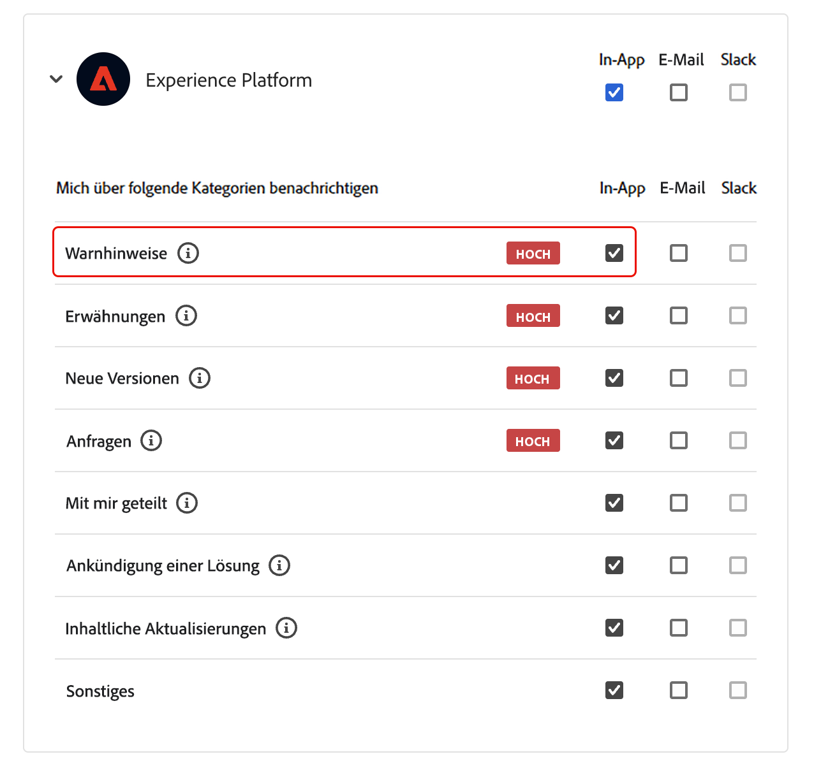{zoomable="yes"}{width="50%"}

Nun, da **[!UICONTROL In-App]** ausgewählt ist, werden Sie über Erfolge und Fehler bei der Kompositionsausführung benachrichtigt.

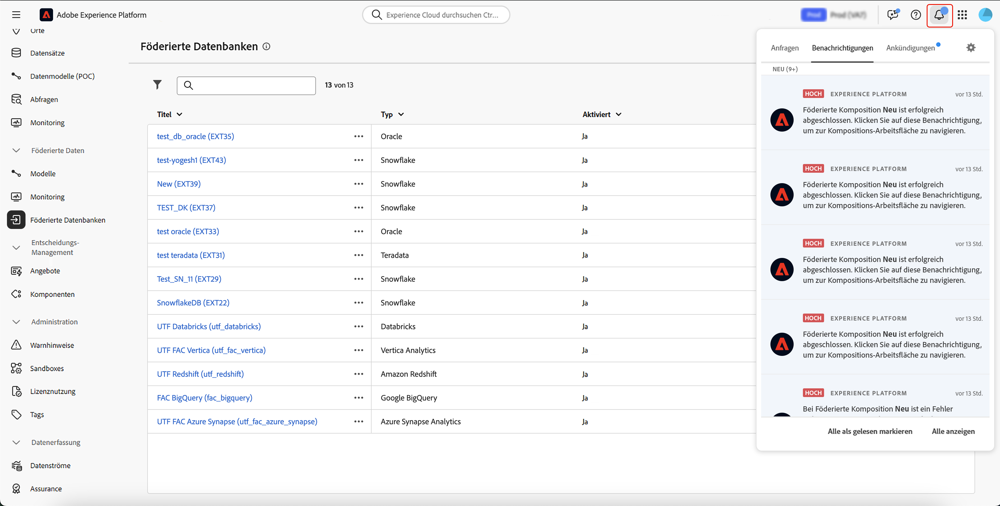{zoomable="yes"}{width="70%"}

## Befehle zur Kompositionsausführung {#execution-commands}

Die Aktionsleiste oben rechts enthält Befehle, mit denen Sie die Ausführung der Komposition verwalten können. 

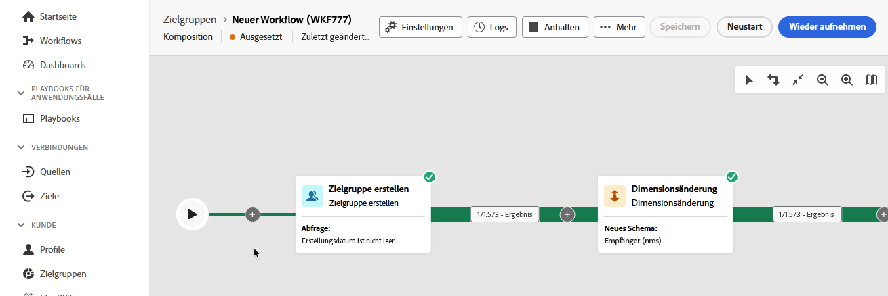

Folgende Aktionen sind verfügbar: 

* **[!UICONTROL Starten]**: Startet die Ausführung der Komposition, die daraufhin den Status **[!UICONTROL In Bearbeitung]** annimmt. Die Komposition wird gestartet und die ersten Aktivitäten werden aktiviert.

* **[!UICONTROL Fortsetzen]**: Setzt die Ausführung der angehaltenen Komposition fort. Die Komposition nimmt den Status **[!UICONTROL In Bearbeitung]** an.

* **[!UICONTROL Anhalten]**: Setzt die Ausführung der Komposition aus, die dann den Status **[!UICONTROL Angehalten]** annimmt. Bis zur Wiederaufnahme werden keine neuen Aktivitäten aktiviert, laufende Vorgänge werden jedoch nicht abgebrochen.

* **[!UICONTROL Stoppen]**: Hält die gerade ausgeführte Komposition an, die dann den Status **[!UICONTROL Beendet]** annimmt. Die laufenden Vorgänge werden nach Möglichkeit unterbrochen. Sie können die Komposition nicht an derselben Stelle fortsetzen, an der sie gestoppt wurde.

* **[!UICONTROL Neu starten]**: Stoppt die Komposition und startet sie dann neu. In den meisten Fällen ermöglicht dies einen schnelleren Neustart, da der Anhaltevorgang eine gewisse Zeit dauert und die Schaltfläche **[!UICONTROL Starten]** nur im angehaltenen Status verfügbar ist.

