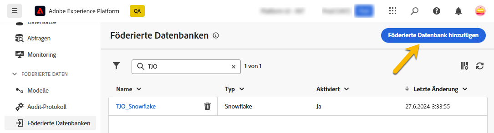
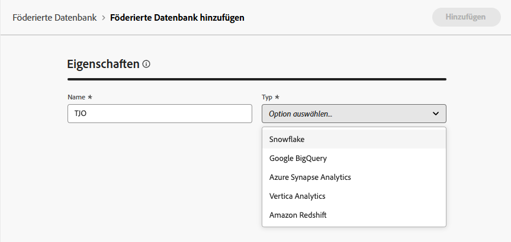
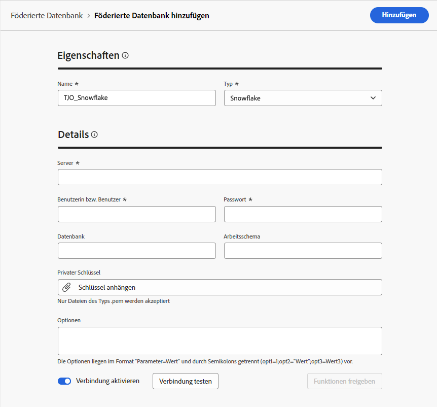
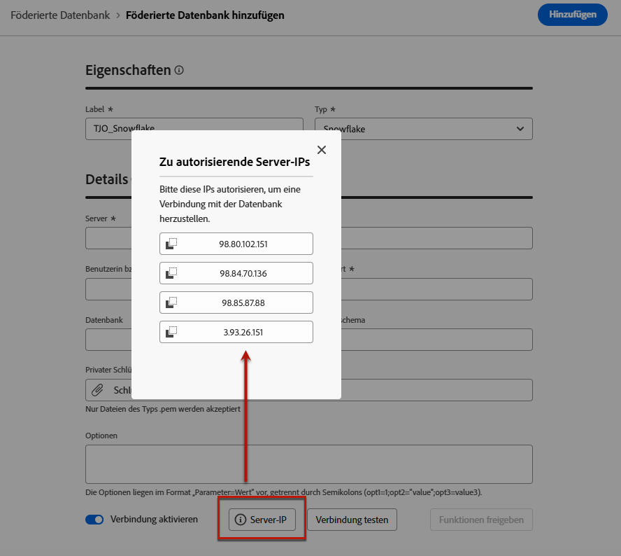
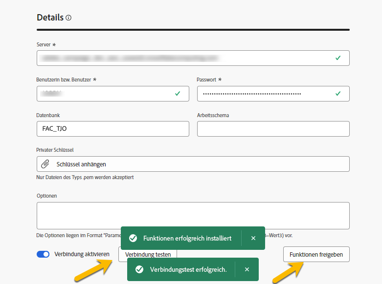
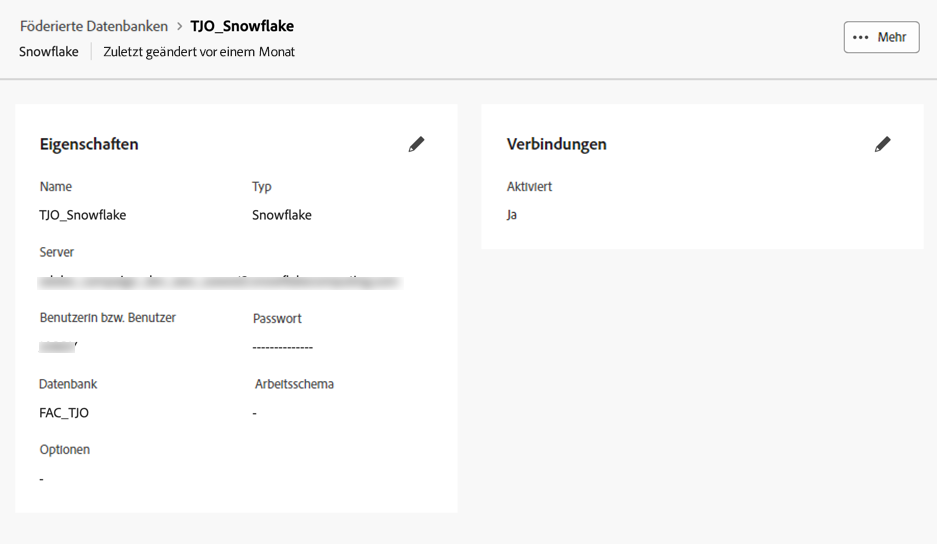

# Erstellen von Verbindungen {#connections-fdb}

>[!AVAILABILITY]
>
>Um auf Verbindungen zugreifen zu können, benötigen Sie eine der folgenden Berechtigungen:
>
>-**Föderierte Datenbank verwalten**
>&#x200B;>-**Föderierte Datenbank anzeigen**
>
>Weitere Informationen zu den erforderlichen Berechtigungen finden Sie im [Handbuch zur Zugriffssteuerung](/help/governance-privacy-security/access-control.md).

Die Komposition föderierter Zielgruppen in Experience Platform ermöglicht es Kundinnen und Kunden, Zielgruppen aus Data Warehouses von Drittanbietern zu erstellen und anzureichern und die Zielgruppen in Adobe Experience Platform zu importieren. Die unterstützten Data Warehouses sind in [diesem Abschnitt](../start/access-prerequisites.md#supported-systems) aufgeführt.

Um mit Ihrer föderierten Datenbank und Adobe Experience Platform zu arbeiten, müssen Sie zunächst eine Verbindung herstellen. Diese Verbindung wird in einer dedizierten Benutzeroberfläche eingerichtet, die in der Benutzeroberfläche von Adobe Experience Platform verfügbar ist, wie auf dieser Seite beschrieben.

Gehen Sie wie folgt vor, um eine Verbindung mit Ihrer Datenbank einzurichten:

1. Navigieren Sie in der linken Leiste zum Abschnitt **[!UICONTROL FÖDERIERTE DATEN]**.

1. Klicken Sie unter dem Link **[!UICONTROL Föderierte Datenbanken]** auf die Schaltfläche **[!UICONTROL Föderierte Datenbank hinzufügen]**.

   {zoomable="yes"}

1. Legen Sie die **[!UICONTROL Eigenschaften]** der Verbindung fest und geben Sie dabei den Namen und den Typ Ihrer Datenbank an.

   {zoomable="yes"}

   Wenn Sie den Typ auswählen, haben Sie Zugriff auf andere Eigenschaften, die Sie ausfüllen können. Weitere Informationen zu den unterstützten Datenbanken finden Sie auf [dieser Seite](federated-db.md).

   {zoomable="yes"}

   Die Konfigurationseinstellungen hängen vom Typ Ihrer Datenbank ab. Durchsuchen Sie die nachfolgenden Links, um auf Details zuzugreifen, die Sie zum Einrichten der Verbindung benötigen:

   * [Amazon Redshift](federated-db.md#amazon-redshift)
   * [Azure Synapse](federated-db.md#azure-synapse-redshift)
   * [Databricks](federated-db.md#databricks)
   * [Google BigQuery](federated-db.md#google-bigquery)
   * [Snowflake](federated-db.md#snowflake)
   * [Vertica Analytics](federated-db.md#vertica-analytics)
   * [Microsoft Fabric](federated-db.md#microsoft-fabric)

1. Wählen Sie für jede unterstützte Datenbank die Schaltfläche **[!UICONTROL Server-IP]** aus. Es wird die Liste aller IP-Adressen angezeigt, die mit den Instanzen für die Komposition föderierter Zielgruppen verknüpft sind.

   {zoomable="yes"}

   Klicken Sie in der Liste auf eine IP-Adresse, um sie in das System zu kopieren und diese IP-Adresse für die Verbindung mit der Datenbank zu autorisieren.

   >[!NOTE]
   >
   >Zum Verwenden der Komposition föderierter Zielgruppen für eine bestimmte Datenbank müssen Sie alle mit dieser Datenbank verknüpften IP-Adressen in die Zulassungsliste aufnehmen.

1. Nachdem Sie die Details eingegeben haben, klicken Sie auf die Schaltfläche **[!UICONTROL Verbindung testen]** und auf die Schaltfläche **[!UICONTROL Funktionen bereitstellen]**.

   {zoomable="yes"}

1. Schließen Sie die Einrichtung Ihrer Verbindung ab, indem Sie auf die Schaltfläche **[!UICONTROL Speichern]** klicken.

   Es ist eine Übersicht über Ihre Verbindung mit der föderierten Datenbank verfügbar, wie unten dargestellt:

   {zoomable="yes"}
