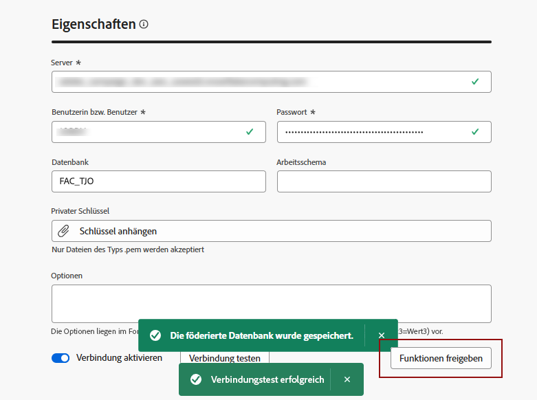

# Verbindungen erstellen {#connections-fdb}

Um eine neue Verbindung zu einer Federated-Datenbank herzustellen, gehen Sie zu **[!UICONTROL FEDERATED DATA]** und im Abschnitt **[!UICONTROL Federated Datenbanken]** Link, auf **[!UICONTROL Federated-Datenbank hinzufügen]** Schaltfläche.

{zoomable="yes"}

Sie gelangen zum Fenster für die Verbindung. **[!UICONTROL Eigenschaften]**, mit dem Namen und dem Typ Ihrer Datenbank.

{zoomable="yes"}

Wenn Sie den Typ auswählen, haben Sie Zugriff auf andere Eigenschaften, die ausgefüllt werden sollen. [Weitere Informationen](federated-db.md)

{zoomable="yes"}

Klicken Sie nach dem Ausfüllen der Details auf **[!UICONTROL Verbindung testen]** Schaltfläche und ein **[!UICONTROL Bereitstellen von Funktionen]** Schaltfläche.
Schließen Sie die Erstellung Ihrer Verbindung ab, indem Sie auf die Schaltfläche **[!UICONTROL Speichern]** Schaltfläche.

{zoomable="yes"}
