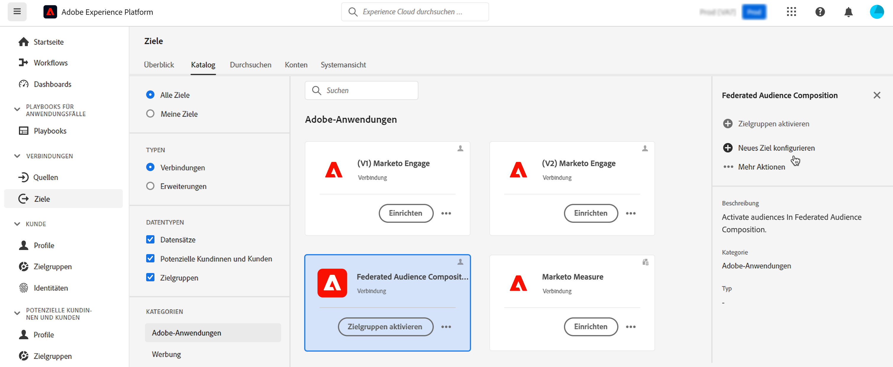
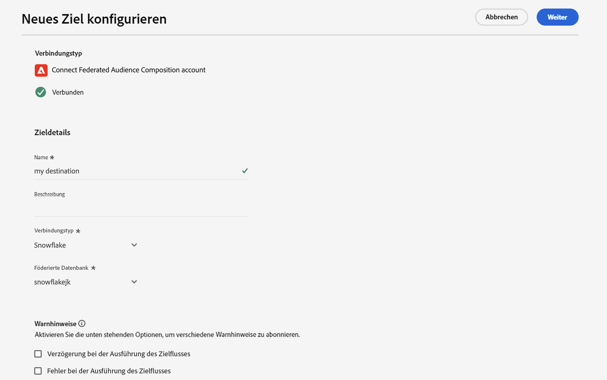
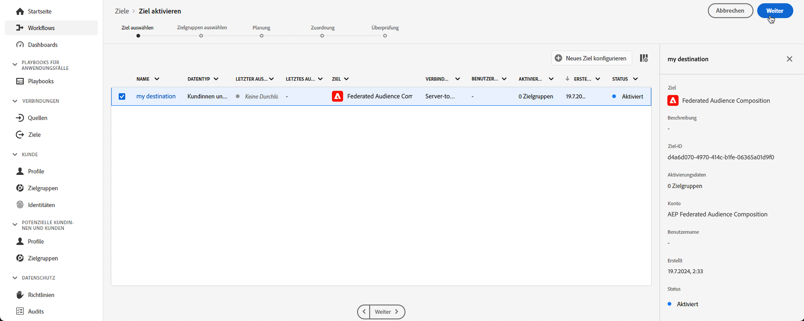
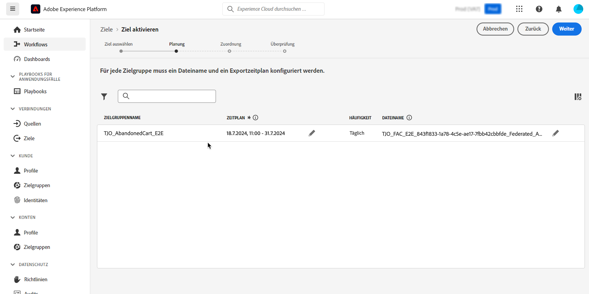
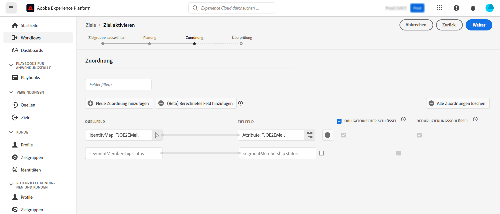
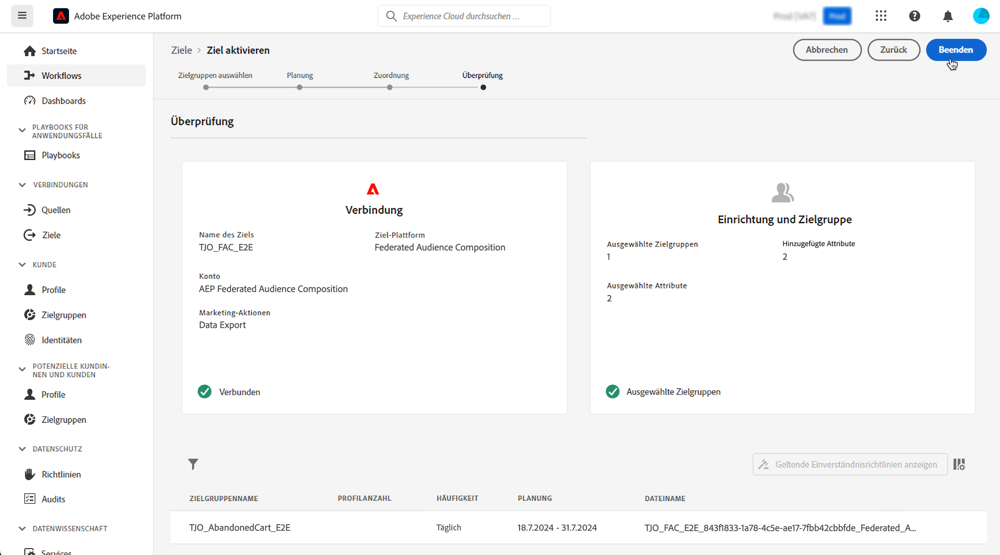

# Anreichern von Adobe Experience Platform-Zielgruppen mit externen Daten {#connect-aep-fac}

>[!CONTEXTUALHELP]
>id="dc_new_destination"
>title="Erstellen eines Ziels"
>abstract="Einstellungen für die Verbindung mit der neuen föderierten Datenbank eingeben. Klicken Sie auf die Schaltfläche **[!UICONTROL Mit Ziel verbinden]**, um Ihre Konfiguration zu validieren."

Adobe Experience Platform ermöglicht die nahtlose Integration von Zielgruppen aus dem Zielgruppenportal mit Ihren externen Datenbanken unter Verwendung des Ziels **Komposition föderierter Zielgruppen**. Mit dieser Integration können Sie vorhandene Zielgruppen in Kompositionen nutzen und sie mit Daten aus Ihren externen Datenbanken anreichern oder verfeinern, um neue Zielgruppen zu erstellen.

Dazu müssen Sie in Adobe Experience Platform eine neue Verbindung zum Ziel „Komposition föderierter Zielgruppen“ einrichten. Sie können eine Planung verwenden, um eine bestimmte Zielgruppe regelmäßig zu senden, und bestimmte einzuschließende Attribute auswählen, z. B. IDs für die Datenabstimmung. Wenn Sie Governance- und Datenschutzrichtlinien auf Ihre Zielgruppe angewendet haben, werden diese beibehalten und nach Aktualisierung der Zielgruppe an das Zielgruppenportal zurückgesendet.

Wenn Sie beispielsweise Kaufinformationen in Ihrem Data Warehouse speichern und über eine Adobe Experience Platform-Zielgruppe für die Kundinnen und Kunden verfügen, die sich in den letzten beiden Monaten für ein bestimmtes Produkt interessiert haben, können Sie mithilfe des Ziels „Komposition föderierter Zielgruppen“ Folgendes tun:

* Verfeinern der Zielgruppe auf Grundlage der Kaufinformationen. Beispielsweise können Sie die Zielgruppe filtern, um nur Kundinnen und Kunden auszuwählen, die einen Kauf von mehr als 150 US-Dollar getätigt haben.
* Reichern Sie die Zielgruppe mit Feldern an, die sich auf Käufe beziehen, wie beispielsweise den Produktnamen und die gekaufte Menge.

Die wichtigsten Schritte zum Senden von Adobe Experience Platform-Zielgruppen an die Komposition föderierter Zielgruppen von Adobe lauten wie folgt:

1. Rufen Sie den Adobe Experience Platform-Zielkatalog auf und wählen Sie das Ziel „Komposition föderierter Zielgruppen“ aus.

   Wählen Sie im rechten Bereich die Option **[!UICONTROL Neues Ziel konfigurieren]** aus.

   

1. Geben Sie einen Namen für die neue Verbindung ein und wählen Sie **[!UICONTROL Verbindungstyp]** aus den folgenden verfügbaren Verbindungen aus:

   * Amazon Redshift
   * Azure Synapse Analytics
   * Google BigQuery
   * Snowflake
   * Vertica Analytics
   * Databricks

1. Wählen Sie die **[!UICONTROL Federated Database]**, mit der Sie eine Verbindung herstellen möchten, und klicken Sie auf **[!UICONTROL Weiter]**.

   

1. Im Abschnitt **[!UICONTROL Warnhinweise]** können Sie Warnhinweise aktivieren, um Benachrichtigungen zum Status des Datenflusses zu Ihrem Ziel zu erhalten.

   Weitere Informationen zu Warnhinweisen finden Sie in der Dokumentation zu Adobe Experience Platform zum [Abonnieren von Zielwarnhinweisen über die Benutzeroberfläche](https://experienceleague.adobe.com/de/docs/experience-platform/destinations/ui/alerts){target="_blank"}.

1. Im Schritt **[!UICONTROL Governance-Richtlinien und Durchsetzungsmaßnahmen]** können Sie Ihre Data-Governance-Richtlinien definieren und sicherstellen, dass die verwendeten Daten beim Senden und Aktivieren von Zielgruppen konform sind.

   Wenn Sie die gewünschten Marketing-Aktionen für das Ziel abschließend ausgewählt haben, klicken Sie auf **[!UICONTROL Erstellen]**.

1. Die neue Verbindung zum Ziel wird erstellt. Sie können nun Zielgruppen aktivieren, um sie an das Ziel zu senden. Wählen Sie sie hierzu aus der Liste aus und klicken Sie auf **[!UICONTROL Weiter]**.

   

1. Wählen Sie die gewünschten Zielgruppen aus, die gesendet werden sollen, und klicken Sie auf **[!UICONTROL Weiter]**.

1. Konfigurieren Sie den Dateinamen und einen Exportzeitplan für die ausgewählte(n) Zielgruppe(n).

   

   >[!NOTE]
   >
   >Detaillierte Informationen zum Konfigurieren von Zeitplänen und Dateinamen finden Sie in den folgenden Abschnitten der Dokumentation zu Adobe Experience Platform:
   >
   >* [Planen eines Zielgruppenexports](https://experienceleague.adobe.com/de/docs/experience-platform/destinations/ui/activate/activate-batch-profile-destinations#scheduling){target="_blank"}
   >* [Konfigurieren von Dateinamen](https://experienceleague.adobe.com/de/docs/experience-platform/destinations/ui/activate/activate-batch-profile-destinations#configure-file-names){target="_blank"}

1. Legen Sie im Schritt **[!UICONTROL Zuordnung]** fest, welche Attribute und Identitätsfelder für Ihre Zielgruppe(n) exportiert werden sollen. Weitere Informationen finden Sie in der Dokumentation zu Adobe Experience Platform unter [Zuordnungsschritt](https://experienceleague.adobe.com/de/docs/experience-platform/destinations/ui/activate/activate-batch-profile-destinations#mapping){target="_blank"}.

   

1. Überprüfen Sie die Zielkonfiguration und die Zielgruppeneinstellungen und klicken Sie dann auf **[!UICONTROL Beenden]**.

   

Die ausgewählten Zielgruppen werden nun für die neue Verbindung aktiviert. Sie können weitere mit dieser Verbindung zu sendende Zielgruppen hinzufügen, indem Sie zur Seite **[!UICONTROL Zielgruppen aktivieren]** zurückkehren. Zielgruppen können nach ihrer Aktivierung nicht entfernt werden.
