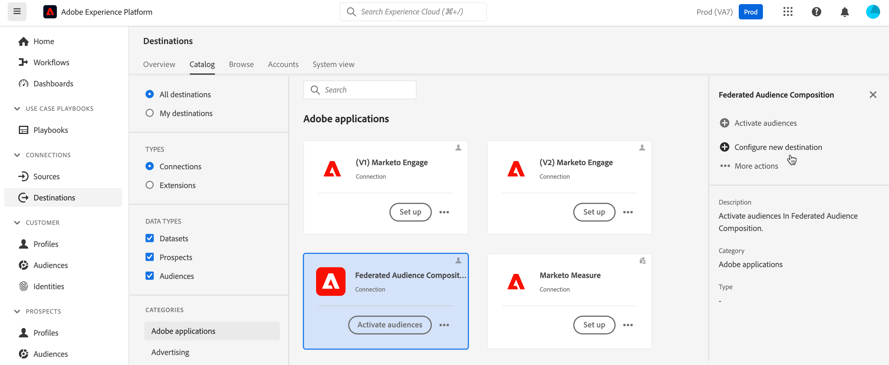
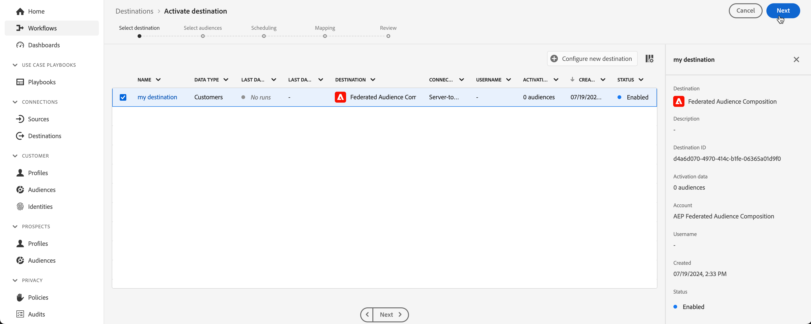

# Anreichern von Adobe Experience Platform-Zielgruppen mit externen Daten {#connect-aep-fac}

>[!CONTEXTUALHELP]
>id="dc_new_destination"
>title="Erstellen eines Ziels"
>abstract="Einstellungen für die Verbindung mit der neuen föderierten Datenbank eingeben. Klicken Sie auf die Schaltfläche **[!UICONTROL Mit Ziel verbinden]**, um Ihre Konfiguration zu validieren."

Adobe Experience Platform ermöglicht die nahtlose Integration von Zielgruppen aus dem Zielgruppenportal mit Ihren externen Datenbanken unter Verwendung des Ziels **Komposition föderierter Zielgruppen**. Mit dieser Integration können Sie vorhandene Zielgruppen in Kompositionen nutzen und sie mit Daten aus Ihren externen Datenbanken anreichern oder verfeinern, um neue Zielgruppen zu erstellen.

Dazu müssen Sie in Adobe Experience Platform eine neue Verbindung zum Ziel „Komposition föderierter Zielgruppen“ einrichten. Sie können eine Planung verwenden, um eine bestimmte Zielgruppe regelmäßig zu senden, und bestimmte einzuschließende Attribute auswählen, z. B. IDs für die Datenabstimmung. Wenn Sie Governance- und Datenschutzrichtlinien auf Ihre Zielgruppe angewendet haben, werden diese beibehalten und nach Aktualisierung der Zielgruppe an das Zielgruppenportal zurückgesendet.

Wenn Sie beispielsweise Kaufinformationen in Ihrem Data Warehouse speichern und über eine Adobe Experience Platform-Zielgruppe für die Kundinnen und Kunden verfügen, die sich in den letzten beiden Monaten für ein bestimmtes Produkt interessiert haben, können Sie mithilfe des Ziels „Komposition föderierter Zielgruppen“ Folgendes tun:

* Verfeinern der Zielgruppe auf Grundlage der Kaufinformationen. Sie können die Zielgruppe beispielsweise so filtern, dass nur Kunden angesprochen werden, die einen Kauf im Wert von mehr als 150 USD getätigt haben.
* Reichern Sie die Zielgruppe mit Feldern an, die sich auf Käufe beziehen, wie beispielsweise den Produktnamen und die gekaufte Menge.

## Zielgruppe für Ziel aktivieren {#activate}

Wählen Sie im Adobe Experience Platform-Zielkatalog das Ziel Federated Audience Composition aus. Wählen Sie im rechten Bereich die Option **[!UICONTROL Neues Ziel konfigurieren]** aus.

Die **[!UICONTROL Neues Ziel konfigurieren]** wird angezeigt. Auf dieser Seite können Sie Details zu Ihrem Ziel konfigurieren, einschließlich Name, Beschreibung, Verbindungstyp und Federated Database.

Über den Abschnitt **[!UICONTROL Warnungen]** können Sie Warnhinweise aktivieren, um Benachrichtigungen zum Status des Datenflusses zu Ihrem Ziel zu erhalten. Dazu gehören Warnhinweise für Verzögerungen bei der Ausführung von Datenflüssen, Ausführungsfehler, Ausführungserfolge, Ausführungsstarts und Aktivierungsüberspringungen.

Weitere Informationen zu Warnhinweisen finden Sie in der Adobe Experience Platform-Dokumentation unter [Abonnieren von Warnhinweisen zu Zielen über die Benutzeroberfläche](https://experienceleague.adobe.com/de/docs/experience-platform/destinations/ui/alerts){target="_blank"}.

Nachdem Sie die Details Ihres Ziels konfiguriert haben, klicken Sie auf **[!UICONTROL Weiter]**. Der **[!UICONTROL „Governance-Richtlinie und Durchsetzungsaktionen]** wird angezeigt. Auf dieser Seite können Sie Ihre Data-Governance-Richtlinien definieren und sicherstellen, dass die verwendeten Daten beim Senden aktiver Zielgruppen den Richtlinien entsprechen.

Wenn Sie die gewünschten Marketing-Aktionen für das Ziel ausgewählt haben, klicken Sie auf **[!UICONTROL Erstellen]**.

Die neue Verbindung zum Ziel wird erstellt. Sie können nun Zielgruppen aktivieren, um sie an das Ziel zu senden. Wählen Sie das Ziel aus, für das Sie die Zielgruppen aktivieren möchten, gefolgt von **[!UICONTROL Weiter]**.

Der **[!UICONTROL Zeitplan]** wird angezeigt. Sie können die gewünschten Zielgruppen auswählen, die Sie für das Ziel aktivieren möchten. Um einen Zeitplan einzurichten, klicken Sie auf , um Ihren Exportzeitplan zu bearbeiten.

Das **[!UICONTROL Planung]**-Popup wird angezeigt. In diesem Pop-up können Sie die Dateiexportoptionen und die Häufigkeit festlegen und Ihren Zeitplan einrichten.

>[!NOTE]
>
>Um die Zielgruppen schneller zu aktivieren, wählen Sie die Option **[!UICONTROL Nach der Segmentauswertung]** aus, um den Aktivierungsauftrag unmittelbar nach Abschluss des täglichen Platform-Batch-Segmentierungsauftrag auszulösen.
>
>Detaillierte Informationen zum Konfigurieren des Zeitplans und der Dateinamen finden Sie in den folgenden Abschnitten der Dokumentation zu Adobe Experience Platform:
>
>* [Planen eines Zielgruppenexports](https://experienceleague.adobe.com/de/docs/experience-platform/destinations/ui/activate/activate-batch-profile-destinations#scheduling){target="_blank"}
>* [Konfigurieren von Dateinamen](https://experienceleague.adobe.com/de/docs/experience-platform/destinations/ui/activate/activate-batch-profile-destinations#configure-file-names){target="_blank"}

Legen Sie im Schritt **[!UICONTROL Zuordnung]** fest, welche Attribute und Identitätsfelder für Ihre Zielgruppe(n) exportiert werden sollen.

>[!IMPORTANT]
>
>Sie **können** beim Aktivieren für Ziele systemgenerierte Spalten verwenden. Bei Auswahl einer systemgenerierten Spalte tritt ein Fehler auf.

Weitere Informationen finden Sie im [Abschnitt Zuordnung](https://experienceleague.adobe.com/de/docs/experience-platform/destinations/ui/activate/activate-batch-profile-destinations#mapping){target="_blank"} in der Dokumentation zu Adobe Experience Platform.

Überprüfen Sie die Zielkonfiguration und die Zielgruppeneinstellungen und klicken Sie dann auf **[!UICONTROL Beenden]**.

Die ausgewählten Zielgruppen werden nun für die neue Verbindung aktiviert. Sie können weitere mit dieser Verbindung zu sendende Zielgruppen hinzufügen, indem Sie zur Seite **[!UICONTROL Zielgruppen aktivieren]** zurückkehren. Zielgruppen können nach ihrer Aktivierung nicht entfernt werden.
