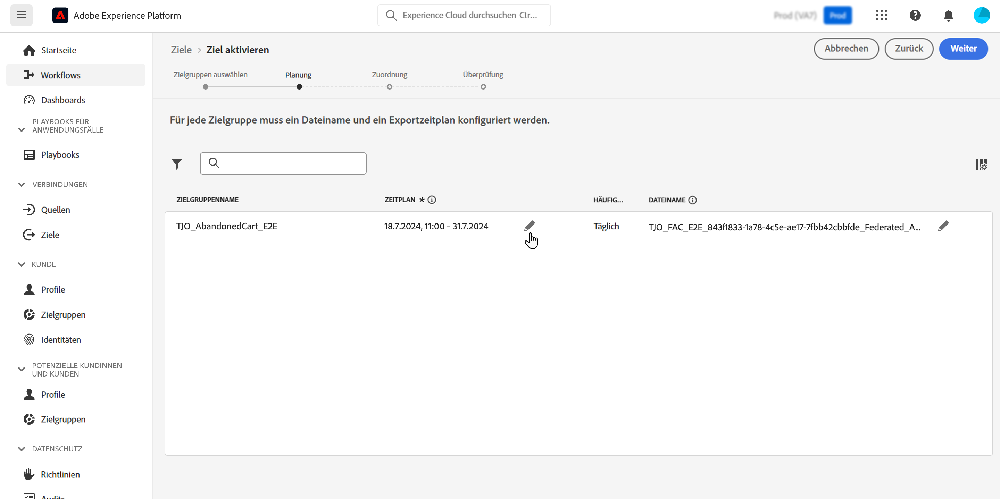

# Anreicherung von Adobe Experience Platform-Zielgruppen mit externen Daten {#connect-aep-fac}

>[!CONTEXTUALHELP]
>id="dc_new_destination"
>title="Erstellen eines Ziels"
>abstract="Geben Sie die Einstellungen für die Verbindung mit der neuen föderierten Datenbank ein. Klicken Sie auf die Schaltfläche **[!UICONTROL Mit Ziel verbinden]**, um Ihre Konfiguration zu validieren."

Adobe Experience Platform ermöglicht die nahtlose Integration von Zielgruppen aus Audience Portal in Ihre externen Datenbanken mithilfe des Ziels **Adobe Federated Audience Komposition**. Mit dieser Integration können Sie vorhandene Zielgruppen in Kompositionen nutzen und sie mithilfe von Daten aus Ihren externen Datenbanken anreichern oder verfeinern, um neue Zielgruppen zu erstellen.

Dazu müssen Sie eine neue Verbindung in Adobe Experience Platform mit dem Ziel der Adobe Federated Audience Komposition einrichten. Sie können eine Planung verwenden, um eine bestimmte Zielgruppe regelmäßig zu senden, und spezifische einzuschließende Attribute auswählen, z. B. IDs für die Datenabstimmung. Wenn Sie Governance- und Datenschutzrichtlinien auf Ihre Zielgruppe angewendet haben, werden diese beibehalten und nach Aktualisierung der Zielgruppe an das Zielgruppenportal zurückgesendet.

Wenn Sie beispielsweise Kundenkreditbewertungen in Ihrem Data Warehouse speichern und eine Adobe Experience Platform-Zielgruppe haben, die in den letzten zwei Monaten an einem bestimmten Produkt interessiert war, können Sie diese Zielgruppe anhand von Kreditbewertungen mithilfe des Ziels &quot;Zusammengestellte Zielgruppe&quot;verfeinern. Auf diese Weise können Sie die Zielgruppe so filtern, dass nur Profile mit hohen Bonitätsbewertungen einbezogen werden, ohne sensible Kreditwertdaten aus Ihrem Data Warehouse zu übertragen.

Die wichtigsten Schritte zum Senden von Adobe Experience Platform-Zielgruppen an die Adobe Federated Audience Komposition sind:

1. Rufen Sie den Adobe Experience Platform-Zielkatalog auf und wählen Sie das Ziel Zusammengestellte Zielgruppen-Komposition aus.

   Wählen Sie im rechten Bereich **[!UICONTROL Neues Ziel konfigurieren]** aus.

   

1. Geben Sie einen Namen für die neue Verbindung ein, wählen Sie den zu verwendenden **[!UICONTROL Verbindungstyp]** und die zu verwendende **[!UICONTROL Federated database]** aus und klicken Sie auf **[!UICONTROL Next]**.

   

   Im Abschnitt **[!UICONTROL Warnhinweise]** können Sie Warnhinweise aktivieren, mit denen Sie Benachrichtigungen zum Status des Datenflusses an Ihr Ziel erhalten. Weitere Informationen zu Warnhinweisen finden Sie im Handbuch zum [Abonnieren von Zielwarnhinweisen über die Benutzeroberfläche](https://experienceleague.adobe.com/en/docs/experience-platform/destinations/ui/alerts).

1. Im Schritt **[!UICONTROL Governance-Richtlinien und Durchsetzungsaktionen]** können Sie Ihre Data Governance-Richtlinien definieren und sicherstellen, dass die verwendeten Daten beim Senden und Aktivieren von Zielgruppen konform sind.

   Wenn Sie mit der Auswahl der gewünschten Marketing-Aktionen für das Ziel fertig sind, klicken Sie auf **[!UICONTROL Erstellen]**.

1. Die neue Verbindung zum Ziel wird erstellt. Sie können nun Zielgruppen aktivieren, um sie an das Ziel zu senden. Wählen Sie sie dazu aus der Liste aus und klicken Sie auf **[!UICONTROL Weiter]**

   

1. Wählen Sie die gewünschten Zielgruppen aus, die Sie senden möchten, und klicken Sie auf **[!UICONTROL Weiter]**.

1. Konfigurieren Sie den Dateinamen und einen Exportzeitplan für die ausgewählten Zielgruppen.

   

   >[!NOTE]
   >
   >Detaillierte Informationen zum Konfigurieren des Zeitplans und der Dateinamen finden Sie in der Dokumentation zu Adobe Experience Platform:
   >* [Zielgruppenexport planen](https://experienceleague.adobe.com/en/docs/experience-platform/destinations/ui/activate/activate-batch-profile-destinations#scheduling)
   >* [Dateinamen konfigurieren](https://experienceleague.adobe.com/en/docs/experience-platform/destinations/ui/activate/activate-batch-profile-destinations#configure-file-names)

1. Wählen Sie im Schritt **[!UICONTROL Zuordnung]** aus, welche Attribute und Identitätsfelder für Ihre Zielgruppe/n exportiert werden sollen. Weitere Informationen finden Sie im Schritt [Zuordnen](https://experienceleague.adobe.com/en/docs/experience-platform/destinations/ui/activate/activate-batch-profile-destinations#mapping) in der Adobe Experience Platform-Dokumentation.

   

1. Überprüfen Sie die Zielkonfiguration und die Zielgruppeneinstellungen und klicken Sie dann auf **[!UICONTROL Beenden]**.

   

Die ausgewählten Zielgruppen werden nun für die neue Verbindung aktiviert. Sie können mit dieser Verbindung weitere Zielgruppen hinzufügen, indem Sie zur Seite **[!UICONTROL Zielgruppen aktivieren]** zurückkehren. Zielgruppen können nicht entfernt werden, nachdem sie aktiviert wurden.
