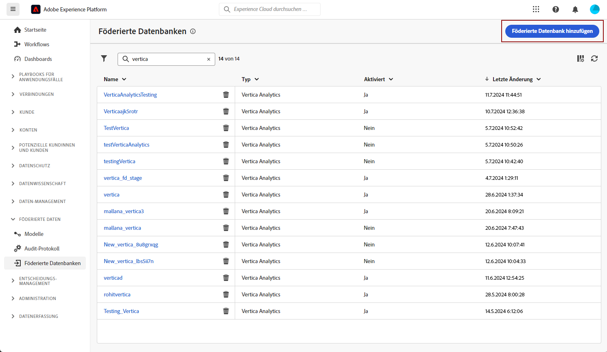
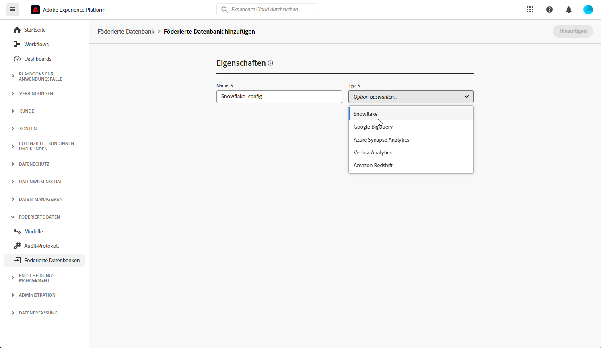
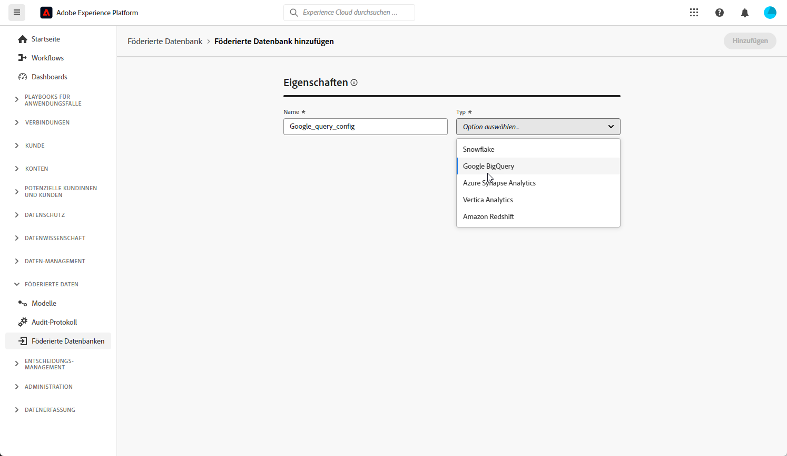
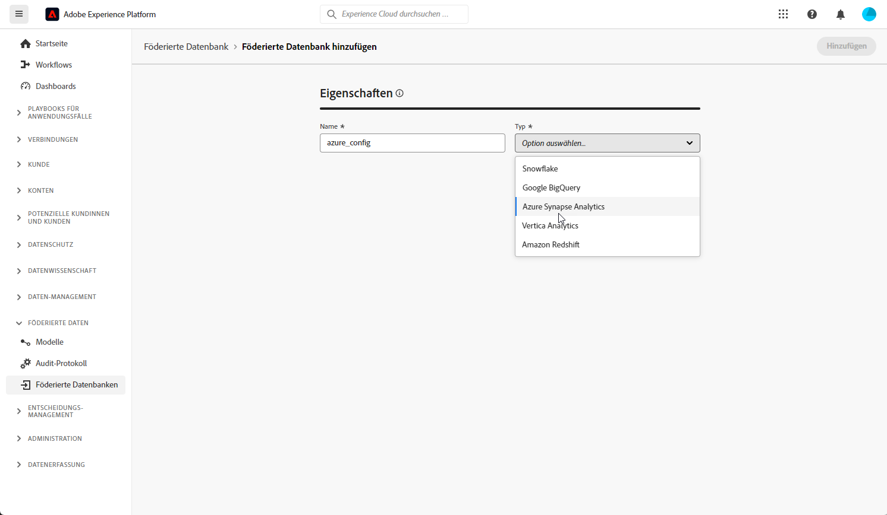
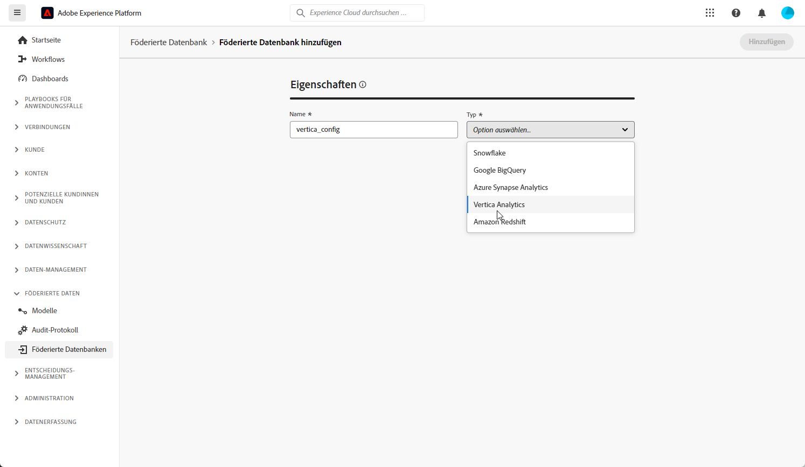
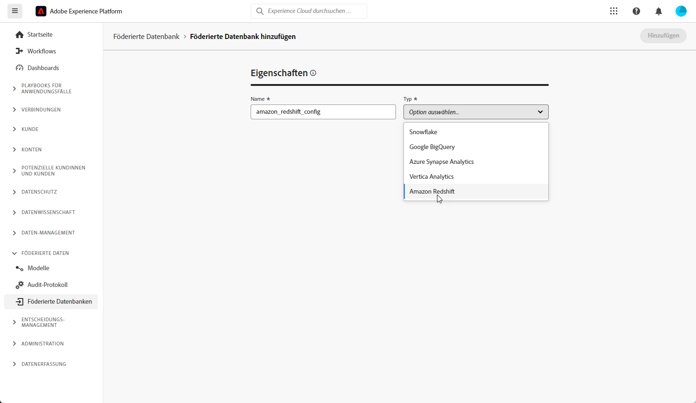

# Erste Schritte mit föderierten Datenbanken {#federated-db}

>[!CONTEXTUALHELP]
>id="dc_connection_federated_database_menu"
>title="Föderierte Datenbanken"
>abstract="Bestehende Verbindungen zu föderierten Datenbanken werden auf diesem Bildschirm angezeigt. Um eine neue Verbindung zu erstellen, klicken Sie auf die Schaltfläche **[!UICONTROL Föderierte Datenbank hinzufügen]**."

>[!CONTEXTUALHELP]
>id="dc_connection_federated_database_properties"
>title="Eigenschaften der föderierten Datenbank"
>abstract="Geben Sie den Namen der neuen föderierten Datenbank ein und wählen Sie den Typ aus."

>[!CONTEXTUALHELP]
>id="dc_connection_federated_database_details"
>title="Details zur föderierten Datenbank"
>abstract="Geben Sie die Einstellungen für die Verbindung mit der neuen föderierten Datenbank ein. Klicken Sie auf die Schaltfläche **[!UICONTROL Verbindung testen]**, um Ihre Konfiguration zu validieren."

Erstellen, konfigurieren, testen und speichern Sie die Verbindung zu einer externen Datenbank.

Unterstützte externe Datenbanken:

* Amazon Redshift
* Azure synapse
* Google BigQuery
* Snowflake
* Vertica Analytics

## Snowflake {#snowflake}

Verwenden Sie Federated Databases, um in einer externen Datenbank gespeicherte Informationen zu verarbeiten. Gehen Sie wie folgt vor, um den Zugriff auf Snowflake zu konfigurieren.

1. Wählen Sie im Menü **[!UICONTROL Federated data]** die Option **[!UICONTROL Federated database]**.

1. Klicken Sie auf **[!UICONTROL Verknüpfte Datenbank hinzufügen]**.

   

1. Geben Sie einen **[!UICONTROL Namen]** in Ihre Federate-Datenbank ein.

1. Wählen Sie aus der Dropdownliste **[!UICONTROL Typ]** die Option Snowflake aus.

   

1. Konfigurieren Sie die Snowflake-Authentifizierungseinstellungen:

   * **[!UICONTROL Server]**: Geben Sie Ihren Servernamen ein.

   * **[!UICONTROL Benutzer]**: Geben Sie Ihren Benutzernamen ein.

   * **[!UICONTROL Kennwort]**: Geben Sie Ihr Kontopasswort ein.

   * **[!UICONTROL Datenbank]** (optional): Geben Sie den Namen Ihrer Datenbank ein, falls nicht im DSN angegeben.

   * **[!UICONTROL Arbeitsschema]** (optional): Geben Sie den Namen Ihres Arbeitsschemas ein.

   * **[!UICONTROL Privater Schlüssel]**: Klicken Sie auf das Feld **[!UICONTROL Privater Schlüssel]** , um Ihre .pem-Dateien aus Ihrem Gebietsschema-Ordner auszuwählen.

   * **[!UICONTROL Optionen]**: Der Connector unterstützt die in der folgenden Tabelle aufgeführten Optionen.

1. Wählen Sie die Option **[!UICONTROL Verbindung testen]** aus, um Ihre Konfiguration zu überprüfen.

1. Klicken Sie auf die Schaltfläche **[!UICONTROL Funktionen bereitstellen]** , um die Funktionen zu erstellen.

1. Nachdem Sie die Konfiguration abgeschlossen haben, klicken Sie auf **[!UICONTROL Hinzufügen]** , um Ihre Federate-Datenbank zu erstellen.

Der Connector unterstützt die folgenden Optionen:

| Option | Beschreibung |
|---|---|
| workschema | Datenbankschema zur Verwendung mit Arbeitstabellen |
| warehouse | Name des zu verwendenden Standard-Warehouse. Dadurch wird die Standardeinstellung des Benutzers außer Kraft gesetzt. |
| TimeZoneName | Standardmäßig leer, d. h. die Systemzeitzone des Campaign Classic-App-Servers wird verwendet. Mit dieser Option können Sie den Sitzungsparameter TIMEZONE erzwingen.  Weiterführende Informationen hierzu finden Sie auf dieser [Seite](https://docs.snowflake.net/manuals/sql-reference/parameters.html#timezone). |
| WeekStart | Sitzungsparameter WEEK_START. Standardmäßig auf 0 gesetzt  Weiterführende Informationen hierzu finden Sie auf dieser [Seite](https://docs.snowflake.com/de/sql-reference/parameters.html#week-start). |
| UseCachedResult | Sitzungsparameter USE_CACHED_RESULTS. Standardmäßig ist TRUE festgelegt. Diese Option kann verwendet werden, um zwischengespeicherte Ergebnisse im Snowflake zu deaktivieren.  Weiterführende Informationen hierzu finden Sie auf dieser [Seite](https://docs.snowflake.net/manuals/user-guide/querying-persisted-results.html). |
| bulkThreads | Anzahl der Threads, die für Snowflake-Bulk-Loader verwendet werden sollen, mehr Threads bedeuten eine bessere Leistung bei größeren Bulk-Ladungen. Standardmäßig auf 1 gesetzt Die Zahl kann je nach Anzahl der Maschinenthread angepasst werden. |
| chunkSize | Bestimmt die Dateigröße des Stapels für Ladegeräte. Standardmäßig auf 128 MB eingestellt. Kann für eine optimale Leistung geändert werden, wenn BulkThreads verwendet werden. Gleichzeitigere aktive Threads bedeuten eine bessere Leistung.  Weitere Informationen hierzu finden Sie in der [Snowflake-Dokumentation](https://docs.snowflake.net/manuals/sql-reference/sql/put.html). |
| StageName | Name des vorab bereitgestellten internen Schritts. Sie wird bei Bulk Load verwendet, anstatt eine neue temporäre Phase zu erstellen. |

## Google BigQuery {#google-big-query}

Verwenden Sie Federated Databases, um in einer externen Datenbank gespeicherte Informationen zu verarbeiten. Gehen Sie wie folgt vor, um den Zugriff auf Google Big Query zu konfigurieren.

1. Wählen Sie im Menü **[!UICONTROL Federated data]** die Option **[!UICONTROL Federated database]**.

1. Klicken Sie auf **[!UICONTROL Verknüpfte Datenbank hinzufügen]**.

   

1. Geben Sie einen **[!UICONTROL Namen]** in Ihre Federate-Datenbank ein.

1. Wählen Sie aus der Dropdownliste **[!UICONTROL Typ]** die Option Google Big Query aus.

   

1. Konfigurieren Sie die Authentifizierungseinstellungen für Google Big Query:

   * **[!UICONTROL Dienstkonto]**: Geben Sie die E-Mail Ihres **[!UICONTROL Dienstkontos]** ein. Weitere Informationen hierzu finden Sie in der [Dokumentation zur Google Cloud](https://cloud.google.com/iam/docs/creating-managing-service-accounts).

   * **[!UICONTROL Projekt]**: Geben Sie den Namen Ihres **[!UICONTROL Projekts]** ein. Weitere Informationen hierzu finden Sie in der [Dokumentation zur Google Cloud](https://cloud.google.com/resource-manager/docs/creating-managing-projects).

   * **[!UICONTROL Datensatz]**: Geben Sie den Namen Ihres **[!UICONTROL Datensatzes]** ein. Weitere Informationen hierzu finden Sie in der [Dokumentation zur Google Cloud](https://cloud.google.com/bigquery/docs/datasets-intro).

   * **[!UICONTROL Pfad der Schlüsseldatei]**: Laden Sie Ihre Schlüsseldatei auf den Server hoch. Es werden nur .json-Dateien akzeptiert.

   * **[!UICONTROL Optionen]**: Der Connector unterstützt die in der folgenden Tabelle aufgeführten Optionen.

1. Wählen Sie die Option **[!UICONTROL Verbindung testen]** aus, um Ihre Konfiguration zu überprüfen.

1. Klicken Sie auf die Schaltfläche **[!UICONTROL Funktionen bereitstellen]** , um die Funktionen zu erstellen.

1. Nachdem Sie die Konfiguration abgeschlossen haben, klicken Sie auf **[!UICONTROL Hinzufügen]** , um Ihre Federate-Datenbank zu erstellen.

| Option | Beschreibung |
|:-:|:-:|
| ProxyType | Typ des Proxys, der für die Verbindung mit BigQuery über ODBC- und SDK-Connectoren verwendet wird.  HTTP (Standard), http_no_tunnel, socks4 und socks5 werden derzeit unterstützt. |
| ProxyHost | Hostname oder IP-Adresse, an der der Proxy erreicht werden kann. |
| ProxyPort | Anschlussnummer, auf der der Proxy ausgeführt wird, z. B. 8080 |
| ProxyUid | Benutzername für den authentifizierten Proxy |
| ProxyPwd | ProxyUid-Kennwort |
| bqpath | Beachten Sie, dass dies nur für Tools mit Massenladevorgang (Cloud SDK) gilt.   Um die Verwendung der PATH-Variablen zu vermeiden oder den Ordner google-cloud-sdk an einen anderen Speicherort zu verschieben, können Sie mit dieser Option den genauen Pfad zum Ordner &quot;cloud sdk bin&quot;auf dem Server angeben. |
| GCloudConfigName | Beachten Sie, dass dies ab Version 7.3.4 und nur für Tools mit Massenladevorgang (Cloud SDK) gilt.  Das Google Cloud-SDK verwendet Konfigurationen zum Laden von Daten in BigQuery-Tabellen. Die Konfiguration mit dem Namen `accfda` speichert die Parameter zum Laden der Daten. Mit dieser Option können Benutzer jedoch einen anderen Namen für die Konfiguration angeben. |
| GCloudDefaultConfigName | Beachten Sie, dass dies ab Version 7.3.4 und nur für Tools mit Massenladevorgang (Cloud SDK) gilt.  Die aktive Google Cloud SDK-Konfiguration kann nicht gelöscht werden, ohne dass das aktive Tag zuerst in eine neue Konfiguration übertragen wird. Diese temporäre Konfiguration ist erforderlich, um die Hauptkonfiguration für das Laden von Daten neu zu erstellen. Der Standardname für die temporäre Konfiguration ist `default`. Dieser kann bei Bedarf geändert werden. |
| GCloudRecreateConfig | Beachten Sie, dass dies ab Version 7.3.4 und nur für Tools mit Massenladevorgang (Cloud SDK) gilt.  Wenn der Wert auf `false` festgelegt ist, verhindert der Mechanismus zum Laden von Massengütern nicht den Versuch, die Google Cloud SDK-Konfigurationen neu zu erstellen, zu löschen oder zu ändern. Stattdessen wird das Laden der Daten mit der vorhandenen Konfiguration auf dem Computer fortgesetzt. Diese Funktion ist nützlich, wenn andere Vorgänge von Google Cloud SDK-Konfigurationen abhängig sind.   Wenn der Benutzer diese Engine-Option ohne ordnungsgemäße Konfiguration aktiviert, gibt der Massenlademechanismus eine Warnmeldung aus: `No active configuration found. Please either create it manually or remove the GCloudRecreateConfig option`. Um weitere Fehler zu vermeiden, wird dann der standardmäßige ODBC-Array-Einfügemechanismus für Massen-Ladevorgänge verwendet. |

## Azure synapse Redshift {#azure-synapse-redshift}

Verwenden Sie Federated Databases, um in einer externen Datenbank gespeicherte Informationen zu verarbeiten. Gehen Sie wie folgt vor, um den Zugriff auf Azure synapse Redshift zu konfigurieren.

1. Wählen Sie im Menü **[!UICONTROL Federated data]** die Option **[!UICONTROL Federated database]**.

1. Klicken Sie auf **[!UICONTROL Verknüpfte Datenbank hinzufügen]**.

   

1. Geben Sie einen **[!UICONTROL Namen]** in Ihre Federate-Datenbank ein.

1. Wählen Sie aus der Dropdownliste **[!UICONTROL Typ]** die Option Azure synapse Redshift aus.

   

1. Konfigurieren Sie die Authentifizierungseinstellungen für Azure synapse Redshift:

   * **[!UICONTROL Server]**: Geben Sie die URL des Azure synapse-Servers ein.

   * **[!UICONTROL Konto]**: Geben Sie den Benutzernamen ein.

   * **[!UICONTROL Kennwort]**: Geben Sie das Kontopasswort ein.

   * **[!UICONTROL Datenbank]** (optional): Geben Sie den Namen Ihrer Datenbank ein, falls nicht im DSN angegeben.

   * **[!UICONTROL Optionen]**: Der Connector unterstützt die in der folgenden Tabelle aufgeführten Optionen.

1. Wählen Sie die Option **[!UICONTROL Verbindung testen]** aus, um Ihre Konfiguration zu überprüfen.

1. Klicken Sie auf die Schaltfläche **[!UICONTROL Funktionen bereitstellen]** , um die Funktionen zu erstellen.

1. Nachdem Sie die Konfiguration abgeschlossen haben, klicken Sie auf **[!UICONTROL Hinzufügen]** , um Ihre Federate-Datenbank zu erstellen.

| Option | Beschreibung |
|:-:|:-:|
| Authentifizierung | Vom Connector unterstützte Authentifizierungstyp. Aktuell unterstützter Wert: ActiveDirectoryMSI. Weitere Informationen finden Sie unter [SQL doc](https://learn.microsoft.com/en-us/sql/connect/odbc/using-azure-active-directory?view=sql-server-ver15#example-connection-strings) (Beispiel für Verbindungszeichenfolgen n°8) |

## Vertica Analytics {#vertica-analytics}

Verwenden Sie Federated Databases, um in einer externen Datenbank gespeicherte Informationen zu verarbeiten. Gehen Sie wie folgt vor, um den Zugriff auf Vertica analytics zu konfigurieren.

1. Wählen Sie im Menü **[!UICONTROL Federated data]** die Option **[!UICONTROL Federated database]**.

1. Klicken Sie auf **[!UICONTROL Verknüpfte Datenbank hinzufügen]**.

   

1. Geben Sie einen **[!UICONTROL Namen]** in Ihre Federate-Datenbank ein.

1. Wählen Sie aus der Dropdownliste **[!UICONTROL Typ]** die Option Vertica analytics aus.

   

1. Konfigurieren Sie die Authentifizierungseinstellungen für Vertica analytics:

   * **[!UICONTROL Server]**: Fügen Sie die URL des [!DNL Vertica Analytics] -Servers hinzu.

   * **[!UICONTROL Konto]**: Fügen Sie den Benutzernamen hinzu.

   * **[!UICONTROL Kennwort]**: Fügen Sie das Kontopasswort hinzu.

   * **[!UICONTROL Datenbank]** (optional): Geben Sie den Namen Ihrer Datenbank ein, falls nicht im DSN angegeben.

   * **[!UICONTROL Arbeitsschema]** (optional): Geben Sie den Namen Ihres Arbeitsschemas ein.

   * **[!UICONTROL Optionen]**: Der Connector unterstützt die in der folgenden Tabelle aufgeführten Optionen.

1. Wählen Sie die Option **[!UICONTROL Verbindung testen]** aus, um Ihre Konfiguration zu überprüfen.

1. Klicken Sie auf die Schaltfläche **[!UICONTROL Funktionen bereitstellen]** , um die Funktionen zu erstellen.

1. Nachdem Sie die Konfiguration abgeschlossen haben, klicken Sie auf **[!UICONTROL Hinzufügen]** , um Ihre Federate-Datenbank zu erstellen.

Der Connector unterstützt die folgenden Optionen:

| Option | Beschreibung |
|---|---|
| TimeZoneName | Standardmäßig leer, d. h. die Systemzeitzone des Campaign Classic-App-Servers wird verwendet. Die Option kann verwendet werden, um den Sitzungsparameter TIMEZONE zu erzwingen. |

## Amazon Redshift {#amazon-redshift}

Verwenden Sie Federated Databases, um in einer externen Datenbank gespeicherte Informationen zu verarbeiten. Gehen Sie wie folgt vor, um den Zugriff auf Amazon Redshift zu konfigurieren.

1. Wählen Sie im Menü **[!UICONTROL Federated data]** die Option **[!UICONTROL Federated database]**.

1. Klicken Sie auf **[!UICONTROL Verknüpfte Datenbank hinzufügen]**.

   

1. Geben Sie einen **[!UICONTROL Namen]** in Ihre Federate-Datenbank ein.

1. Wählen Sie aus der Dropdownliste **[!UICONTROL Typ]** die Option Amazon Redshift aus.

   

1. Konfigurieren Sie die Amazon Redshift-Authentifizierungseinstellungen:

   * **[!UICONTROL Server]**: Fügen Sie den Namen des DNS hinzu.

   * **[!UICONTROL Konto]**: Fügen Sie den Benutzernamen hinzu.

   * **[!UICONTROL Kennwort]**: Fügen Sie das Kontopasswort hinzu.

   * **[!UICONTROL Datenbank]**: Name Ihrer Datenbank, falls nicht im DSN angegeben. Kann leer bleiben, wenn im DSN angegeben

   * **[!UICONTROL Arbeitsschema]**: Name Ihres Arbeitsschemas. [Weitere Informationen](https://docs.aws.amazon.com/redshift/latest/dg/r_Schemas_and_tables.html)

1. Wählen Sie die Option **[!UICONTROL Verbindung testen]** aus, um Ihre Konfiguration zu überprüfen.

1. Klicken Sie auf die Schaltfläche **[!UICONTROL Funktionen bereitstellen]** , um die Funktionen zu erstellen.

1. Nachdem Sie die Konfiguration abgeschlossen haben, klicken Sie auf **[!UICONTROL Hinzufügen]** , um Ihre Federate-Datenbank zu erstellen.