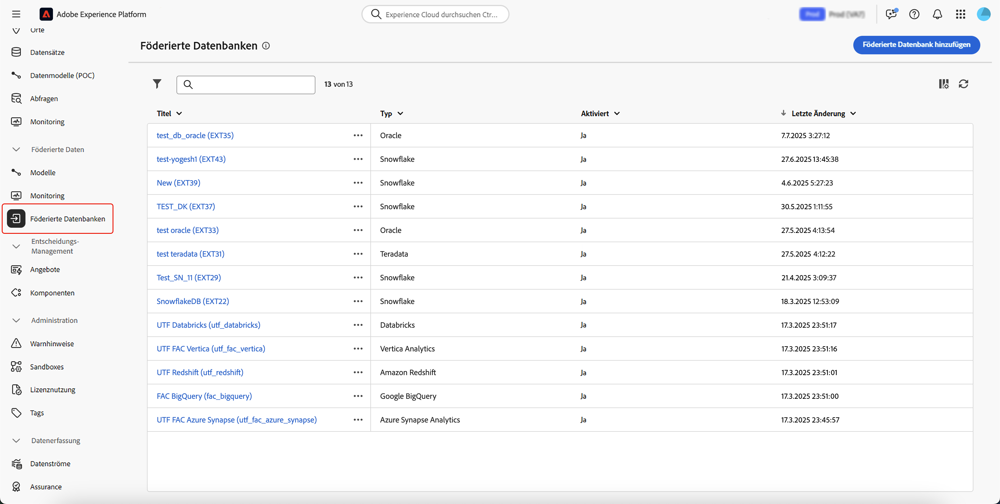
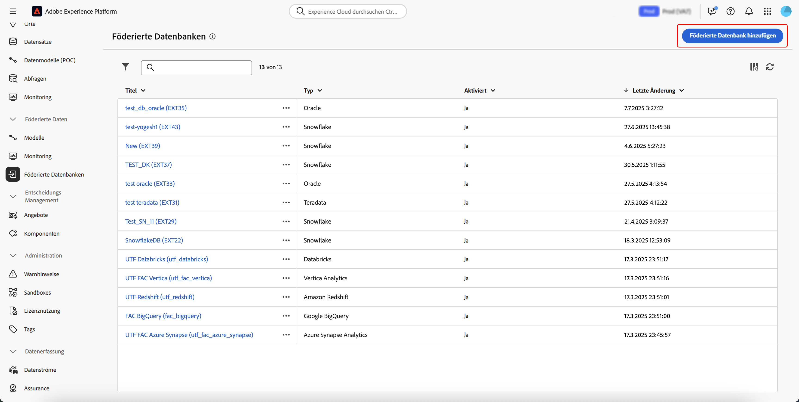
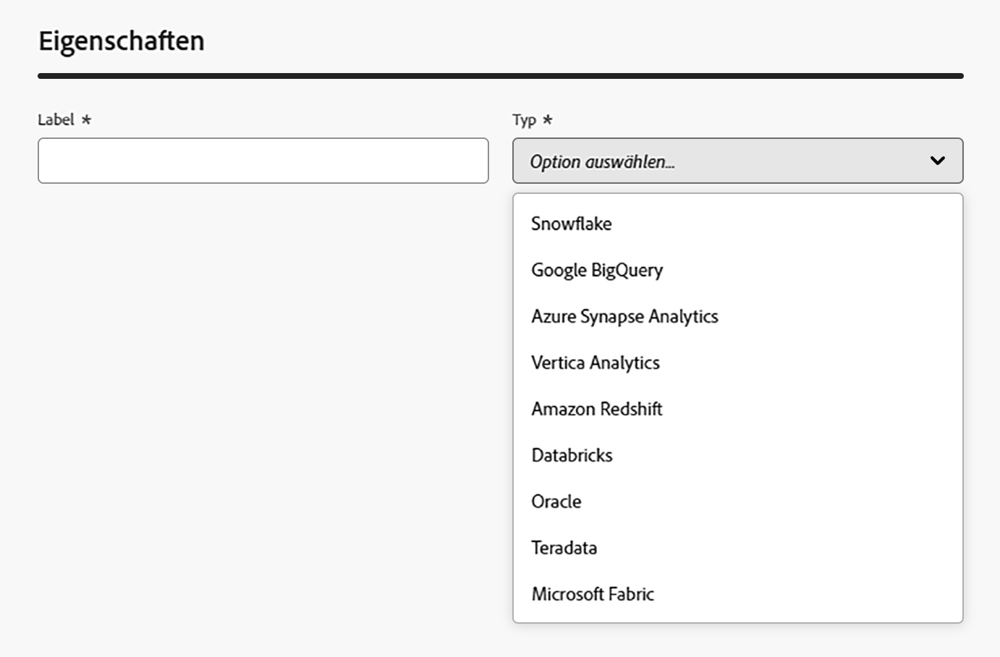

# Erstellen von Verbindungen {#connections-fdb}

>[!AVAILABILITY]
>
>Um auf Verbindungen zugreifen zu können, benötigen Sie eine der folgenden Berechtigungen:
>
>-**Föderierte Datenbank verwalten**
>>-**Föderierte Datenbank anzeigen**
>
>Weitere Informationen zu den erforderlichen Berechtigungen finden Sie im [Handbuch zur Zugriffssteuerung](/help/governance-privacy-security/access-control.md).

Die Komposition föderierter Zielgruppen in Experience Platform ermöglicht es Ihnen, Zielgruppen in Data Warehouses von Drittanbietern zu erstellen und anzureichern und die Zielgruppen in Adobe Experience Platform zu importieren.

## Unterstützte Datenbanken {#supported-databases}

Um mit Ihrer föderierten Datenbank und Adobe Experience Platform zu arbeiten, müssen Sie zunächst eine Verbindung zwischen den beiden Quellen herstellen. Mit der Komposition föderierter Zielgruppen können Sie eine Verbindung zu den folgenden Datenbanken herstellen.

* Amazon Redshift
* Azure Synapse Analytics
* Databricks
* Google BigQuery
* Microsoft Fabric
* Oracle
* Snowflake
* Vertica Analytics

## Erstellen einer Verbindung {#create}

Um eine Verbindung zu erstellen, wählen Sie im Abschnitt „Föderierte Daten“ die Option **[!UICONTROL Föderierte Datenbanken]** aus.

{zoomable="yes" width="70%" align="center"}

Der Abschnitt „Föderierte Datenbanken“ wird angezeigt. Wählen Sie **[!UICONTROL Föderierte Datenbank hinzufügen]** aus, um eine Verbindung zu erstellen.

{zoomable="yes" width="70%" align="center"}

Das Popup-Fenster mit den Verbindungseinstellungen wird angezeigt. Sie können Ihre Verbindung benennen und auswählen, welchen Datenbanktyp Sie erstellen möchten.

{zoomable="yes" width="70%" align="center"}

Nach Auswahl eines Typs wird der Abschnitt **[!UICONTROL Details]** angezeigt. Dieser Abschnitt unterscheidet sich je nach dem zuvor ausgewählten Datenbanktyp.

>[!BEGINTABS]

>[!TAB Amazon Redshift]

>[!AVAILABILITY]
>
>Es werden nur Amazon Redshift AWS, Amazon Redshift Spectrum und Amazon Redshift Serverless unterstützt.

Nach Auswahl von Amazon Redshift können Sie die folgenden Details hinzufügen:

| Feld | Beschreibung |
| ----- | ----------- |
| Server | Der Name der Datenquelle. |
| Konto | Der Benutzername des Kontos. |
| Passwort | Das Passwort des Kontos. |
| Datenbank | Der Name der Datenbank. Wenn dies im Server-Namen angegeben ist, kann dieses Feld leer gelassen werden. |
| Arbeitsschema | Name des Datenbankschemas, das für Arbeitstabellen verwendet werden soll. Weitere Informationen zu dieser Funktion finden Sie in der [Dokumentation zu Amazon-Schemata](https://docs.aws.amazon.com/de_de/redshift/latest/dg/r_Schemas_and_tables.html){target="_blank"}.  **Hinweis**: Sie können jedes Schema aus der Datenbank verwenden, einschließlich Schemata, die für die temporäre Datenverarbeitung verwendet werden, sofern Sie über die erforderliche Berechtigung zum Herstellen einer Verbindung mit diesem Schema verfügen. Sie **müssen** jedoch unterschiedliche Arbeitsschemata verwenden, wenn Sie mehrere Sandboxes mit derselben Datenbank verbinden. |

>[!TAB Azure Synapse Analytics]

>[!NOTE]
>
>Wenn Sie eine sichere Verbindung mit Azure Synapse Analytics erstellen möchten, wenden Sie sich an Ihren Adobe-Kundenbetreuer.

Nach Auswahl von Azure Synapse Analytics können Sie die folgenden Details hinzufügen:

| Feld | Beschreibung |
| ----- | ----------- |
| Server | Die URL des Azure Synapse-Servers. |
| Konto | Der Benutzername für das Azure Synapse-Konto. |
| Passwort | Das Passwort für das Azure Synapse-Konto. |
| Datenbank | Der Name der Datenbank. Wenn dies im Server-Namen angegeben ist, kann dieses Feld leer gelassen werden. |
| Optionen | Zusätzliche Optionen für die Verbindung. Für Azure Synapse Analytics können Sie den Authentifizierungstyp angeben, der vom Connector unterstützt wird. Derzeit unterstützt die Komposition föderierter Zielgruppen `ActiveDirectoryMSI`. Weitere Informationen zu Verbindungszeichenfolgen finden Sie im Abschnitt zu [Beispiel-Verbindungszeichenfolgen in der Dokumentation von Microsoft](https://learn.microsoft.com/de-de/sql/connect/odbc/using-azure-active-directory?view=sql-server-ver15#example-connection-strings){target="_blank"}. |

>[!TAB Databricks]

>[!NOTE]
>
>Sicherer Zugriff auf Ihr externes Databricks-Data-Warehouse über einen privaten Link wird unterstützt. Dazu gehören sichere Verbindungen zu Databricks-Datenbanken, die auf Amazon Web Services (AWS) über einen privaten Link gehostet werden, und Databricks-Datenbanken, die auf Microsoft Azure über VPN gehostet werden. Wenden Sie sich an den Adobe-Support, wenn Sie Hilfe benötigen, um sicheren Zugriff einzurichten.

Nach Auswahl von Databricks können Sie die folgenden Details hinzufügen:

| Feld | Beschreibung |
| ----- | ----------- |
| Server | Der Name des Databricks-Servers. |
| HTTP-Pfad | Der Pfad zu Ihrem Cluster oder Warehouse. Weitere Informationen zum Pfad finden Sie in der [Databricks-Dokumentation zu Verbindungsdetails](https://docs.databricks.com/aws/en/integrations/compute-details){target="_blank"}. |
| Passwort | Das Zugriffstoken für den Databricks-Server. Weitere Informationen zu diesem Wert finden Sie in der [Databricks-Dokumentation zu persönlichen Zugriffstoken](https://docs.databricks.com/aws/en/dev-tools/auth/pat){target="_blank"}. |
| Catalog | Der Name des Databricks-Katalogs. Weitere Informationen zu Katalogen in Databricks finden Sie in der [Databricks-Dokumentation zu Katalogen](https://docs.databricks.com/aws/en/catalogs/){target="_blank"} |
| Arbeitsschema | Der Name des Datenbankschemas, das für Arbeitstabellen verwendet werden soll.   **Hinweis**: Sie können **jedes** Schema aus der Datenbank verwenden, einschließlich Schemata, die für die temporäre Datenverarbeitung verwendet werden, sofern Sie über die erforderliche Berechtigung zum Herstellen einer Verbindung mit diesem Schema verfügen. Sie **müssen** jedoch unterschiedliche Arbeitsschemata verwenden, wenn Sie mehrere Sandboxes mit derselben Datenbank verbinden. |
| Optionen | Zusätzliche Optionen für die Verbindung. Die verfügbaren Optionen sind in der folgenden Tabelle aufgeführt. |

Für Databricks können Sie die folgenden zusätzlichen Optionen festlegen:

| Optionen | Beschreibung |
| ------- | ----------- |
| TimeZoneName | Der Name der zu verwendenden Zeitzone. Dieser Wert stellt den Sitzungsparameter `TIMEZONE` dar. Weitere Informationen zu Zeitzonen finden Sie in der [Databricks-Dokumentation zu Zeitzonen](https://docs.databricks.com/aws/en/sql/language-manual/parameters/timezone#:~:text=The%20system%20default%20is%20UTC%20.){target="_blank"}. |

>[!TAB Google BigQuery]

Nach Auswahl von Google BigQuery können Sie die folgenden Details hinzufügen:

| Feld | Beschreibung |
| ----- | ----------- |
| Service-Konto | Die E-Mail-Adresse Ihres Service-Kontos. Weitere Informationen finden Sie unter [Dokumentation zu Google Cloud-Service-Konten](https://cloud.google.com/iam/docs/service-accounts-create){target="_blank"}. |
| Projekt | Die ID Ihres Projekts. Weitere Informationen finden Sie unter [Dokumentation zu Google Cloud-Projekten](https://cloud.google.com/resource-manager/docs/creating-managing-projects){target="_blank"}. |
| Datensatz | Der Name des Datensatzes. Weitere Informationen finden Sie unter [Dokumentation zu Google Cloud-Datensätzen](https://cloud.google.com/bigquery/docs/datasets-intro){target="_blank"}. |
| Schlüsseldateipfad | Die Schlüsseldatei zum Server. Es werden nur `json`-Dateien unterstützt. |
| Optionen | Zusätzliche Optionen für die Verbindung. Die verfügbaren Optionen sind in der folgenden Tabelle aufgeführt. |

Für Google BigQuery können Sie die folgenden zusätzlichen Optionen festlegen:

| Optionen | Beschreibung |
| ------- | ----------- |
| ProxyType | Der Proxy-Typ, mit dem die Verbindung zu BigQuery hergestellt wird. Zu den unterstützten Werten gehören `HTTP`, `http_no_tunnel`, `socks4` und `socks5`. |
| ProxyHost | Der Host-Name oder die IP-Adresse, um den Proxy zu erreichen. |
| ProxyUid | Die Port-Nummer, auf der der Proxy ausgeführt wird. |
| ProxyPwd | Das Passwort für den Proxy. |
| bgpath | **Hinweis**: Dies gilt nur für das **Tool für Massenladung** (Cloud SDK).    Der Pfad zum Cloud SDK-Klassenverzeichnis am Server. Sie müssen dies nur festlegen, wenn Sie das Verzeichnis `google-cloud-sdk` an einen anderen Speicherort verschoben haben oder wenn Sie die Verwendung der Variable „PATH“ vermeiden möchten. |
| GCloudConfigName | **Hinweis:** Dies gilt nur für das **Tool für Massenladung** (Cloud SDK) ab Version 7.3.4.    Der Name der Konfiguration, die die Parameter zum Laden der Daten speichert. Standardmäßig ist dieser Wert `accfda`. |
| GCloudDefaultConfigName | **Hinweis:** Dies gilt nur für das **Tool für Massenladung** (Cloud SDK) ab Version 7.3.4.    Der Name der temporären Konfiguration, um die Hauptkonfiguration zum Laden von Daten neu zu erstellen. Standardmäßig ist dieser Wert `default`. |
| GCloudRecreateConfig | **Hinweis:** Dies gilt nur für das **Tool für Massenladung** (Cloud SDK) ab Version 7.3.4.    Ein boolescher Wert, mit dem Sie entscheiden können, ob der Massenlademechanismus die Google Cloud SDK-Konfigurationen automatisch neu erstellen, löschen oder ändern soll. Wenn dieser Wert auf `false` festgelegt ist, lädt der Massenlademechanismus Daten mit einer vorhandenen Konfiguration am Computer. Wenn dieser Wert auf `true` festgelegt ist, stellen Sie sicher, dass Ihre Konfiguration ordnungsgemäß eingerichtet ist. Andernfalls wird der Fehler `No active configuration found. Please either create it manually or remove the GCloudRecreateConfig option` angezeigt und der Lademechanismus wird auf den standardmäßigen Lademechanismus zurückgesetzt. |

>[!TAB Microsoft Fabric]

Nach Auswahl von Microsoft Fabric können Sie die folgenden Details hinzufügen:

| Feld | Beschreibung |
| ----- | ----------- |
| Server | Die URL für den Microsoft Fabric-Server. |
| Anwendungs-ID | Die Anwendungs-ID für Microsoft Fabric. Weitere Informationen zur Anwendungs-ID finden Sie in der [Microsoft Fabric-Dokumentation zum Einrichten der Anwendung](https://learn.microsoft.com/de-de/fabric/workload-development-kit/create-entra-id-app){target="_blank"}. |
| Client-Geheimnis | Das Client-Geheimnis für die Anwendung. Weitere Informationen zum Client-Geheimnis finden Sie in der [Microsoft Fabric-Dokumentation zum Einrichten der Anwendung](https://learn.microsoft.com/de-de/fabric/workload-development-kit/create-entra-id-app#step-8-generate-a-secret-for-your-application){target="_blank"}. |
| Optionen | Zusätzliche Optionen für die Verbindung. Die verfügbaren Optionen sind in der folgenden Tabelle aufgeführt. |

Für Microsoft Fabric können die folgenden zusätzlichen Optionen festlegen:

| Option | Beschreibung |
| ------ | ----------- |
| Authentifizierung | Vom Connector verwendeter Authentifizierungstyp. Zu den unterstützten Werten gehört `ActiveDirectoryMSI`. Weitere Informationen finden Sie in der [Microsoft-Dokumentation zu Warehouse-Konnektivität](https://learn.microsoft.com/de-de/fabric/data-warehouse/connectivity){target="_blank"}. |

>[!TAB Oracle]

>[!IMPORTANT]
>
>Der Oracle-Datenbank-Connector kann derzeit **nur** für Anwendungsfälle zur Erstellung und Anreicherung von Zielgruppen verwendet werden.
>
>Wenden Sie sich vor der Einrichtung Ihrer Oracle-Datenbank, einschließlich der Einrichtung Ihrer Oracle-Verbindung zur Verwendung einer sicheren Verbindung, an Ihren Adobe-Kundenbetreuer.

Nach Auswahl von Oracle können Sie die folgenden Details hinzufügen:

| Feld | Beschreibung |
| ----- | ----------- |
| Server | Die URL für den Oracle-Server. |
| Konto | Der Benutzername des Kontos. |
| Passwort | Das Passwort des Kontos. |

>[!TAB Snowflake]

>[!NOTE]
>
>Sicherer Zugriff auf Ihr externes Snowflake-Data-Warehouse über einen privaten Link wird unterstützt. Ihr Snowflake-Konto muss auf Amazon Web Services (AWS) oder Azure gehostet werden und sich in derselben Region wie Ihre Umgebung mit der Funktion „Komposition föderierter Zielgruppen“ befinden. Wenden Sie sich an den Adobe-Support, wenn Sie Hilfe benötigen, um sicheren Zugriff auf Ihr Snowflake-Konto einzurichten.

Nach Auswahl von Snowflake können Sie die folgenden Details hinzufügen:

| Feld | Beschreibung |
| ----- | ----------- |
| Server | Der Name des Servers. |
| Benutzerin bzw. Benutzer | Der Benutzername für das Konto. |
| Passwort | Das Passwort für das Konto. |
| Datenbank | Der Name der Datenbank. Wenn dies im Server-Namen angegeben ist, kann dieses Feld leer gelassen werden. |
| Arbeitsschema | Der Name des Datenbankschemas, das für Arbeitstabellen verwendet werden soll.   **Hinweis**: Sie können **jedes** Schema aus der Datenbank verwenden, einschließlich Schemata, die für die temporäre Datenverarbeitung verwendet werden, sofern Sie über die erforderliche Berechtigung zum Herstellen einer Verbindung mit diesem Schema verfügen. Sie **müssen** jedoch unterschiedliche Arbeitsschemata verwenden, wenn Sie mehrere Sandboxes mit derselben Datenbank verbinden. |
| Privater Schlüssel | Der private Schlüssel für Ihre Datenbankverbindung. Sie können eine `.pem`-Datei von Ihrem lokalen System hochladen. |
| Optionen | Zusätzliche Optionen für die Verbindung. Die verfügbaren Optionen sind in der folgenden Tabelle aufgeführt. |

Für Snowflake können Sie die folgenden zusätzlichen Optionen festlegen:

| Optionen | Beschreibung |
| ------- | ----------- |
| workschema | Name des Datenbankschemas, das für Arbeitstabellen verwendet werden soll.  |
| TimeZoneName | Der Name der zu verwendenden Zeitzone. Dieser Wert stellt den Sitzungsparameter `TIMEZONE` dar. Standardmäßig wird die Zeitzone des Systems verwendet. Weitere Informationen zu Zeitzonen finden Sie in der [Snowflake-Dokumentation zu Zeitzonen](https://docs.snowflake.com/de/sql-reference/parameters#timezone){target="_blank"}. |
| WeekStart | Der Tag, an dem die Woche beginnen soll. Dieser Wert stellt den Sitzungsparameter `WEEK_START` dar. Weitere Informationen zum Wochenstart finden Sie in der [Snowflake-Dokumentation zum Wochenstartparameter](https://docs.snowflake.com/de/sql-reference/parameters#week-start){target="_blank"} |
| UseCachedResult | Ein boolescher Wert, der bestimmt, ob die zwischengespeicherten Ergebnisse von Snowflake verwendet werden. Dieser Wert stellt den Sitzungsparameter `USE_CACHED_RESULTS` dar. Standardmäßig ist dieser Wert auf „wahr“ festgelegt. Weitere Informationen zu diesem Parameter finden Sie in der [Snowflake-Dokumentation zu gespeicherten Ergebnissen](https://docs.snowflake.com/de/user-guide/querying-persisted-results){target="_blank"}. |
| bulkThreads | Die Anzahl der Threads, die für den Massenlader von Snowflake verwendet werden sollen. Je mehr Threads hinzugefügt werden, desto besser ist die Leistung bei größeren Massenladevorgängen. Standardmäßig ist dieser Wert auf 1 festgelegt. |
| chunkSize | Die Dateigröße jedes Blocks des Massenladers. Bei gleichzeitiger Verwendung mit mehreren Threads können Sie die Leistung Ihrer Massenladevorgänge verbessern. Standardmäßig ist dieser Wert auf 128 MB festgelegt. Weitere Informationen zu Blockgrößen finden Sie in der [Snowflake-Dokumentation zum Vorbereiten von Datendateien](https://docs.snowflake.com/de/user-guide/data-load-considerations-prepare){target="_blank"}. |
| StageName | Der Name einer vorab bereitgestellten internen Staging-Umgebung. Dieser kann bei Massenladevorgängen verwendet werden, anstatt einen neuen temporären Staging-Bereich zu erstellen. |

>[!TAB Vertica Analytics]

Nach Auswahl von Vertica Analytics können Sie die folgenden Details hinzufügen:

| Feld | Beschreibung |
| ----- | ----------- |
| Server | Die URL des Vertica Analytics-Servers. |
| Konto | Der Benutzername des Kontos. |
| Passwort | Das Passwort des Kontos. |
| Datenbank | Der Name der Datenbank. Wenn dies im Server-Namen angegeben ist, kann dieses Feld leer gelassen werden. |
| Arbeitsschema | Der Name des Datenbankschemas, das für Arbeitstabellen verwendet werden soll.   **Hinweis**: Sie können **jedes** Schema aus der Datenbank verwenden, einschließlich Schemata, die für die temporäre Datenverarbeitung verwendet werden, sofern Sie über die erforderliche Berechtigung zum Herstellen einer Verbindung mit diesem Schema verfügen. Sie **müssen** jedoch unterschiedliche Arbeitsschemata verwenden, wenn Sie mehrere Sandboxes mit derselben Datenbank verbinden. |
| Optionen | Zusätzliche Optionen für die Verbindung. Die verfügbaren Optionen sind in der folgenden Tabelle aufgeführt. |

Für Vertica Analytics können Sie die folgenden zusätzlichen Optionen festlegen:

| Optionen | Beschreibung |
| ------- | ----------- |
| TimeZoneName | Der Name der zu verwendenden Zeitzone. Dieser Wert stellt den Sitzungsparameter `TIMEZONE` dar. Weitere Informationen zu Zeitzonen finden Sie in der [Vertica Analytics-Dokumentation zu Zeitzonen](https://docs.vertica.com/24.1.x/en/admin/configuring-db/config-procedure/using-time-zones-with/){target="_blank"}. |

>[!ENDTABS]

Nachdem Sie die Details der Verbindung hinzugefügt haben, beachten Sie die folgenden zusätzlichen Einstellungen:

>[!NOTE]
>
>Zum Verwenden der Komposition föderierter Zielgruppen für eine bestimmte Datenbank müssen Sie **alle** mit dieser Datenbank verknüpften IP-Adressen in die Zulassungsliste aufnehmen.

| Einstellungen | Details |
| -------- | ------- |
| Verbindung aktivieren | Ein boolescher Umschalter, der bestimmt, ob die Verbindung automatisch aktiviert wird. |
| Server-IPs | Ein Popup-Fenster, das anzeigt, welche IP-Adressen für die Verbindung mit der Datenbank auf die Zulassungsliste gesetzt werden müssen. |
| Testen der Verbindung | Ermöglicht die Überprüfung Ihrer Konfigurationsdetails. |

Sie können jetzt **[!UICONTROL Funktionen freigeben]** und anschließend **[!UICONTROL Hinzufügen]** auswählen, um die Verbindung zwischen der föderierten Datenbank und Experience Platform fertigzustellen.
