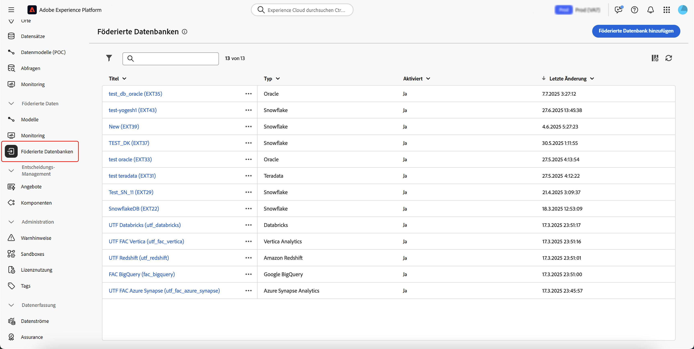
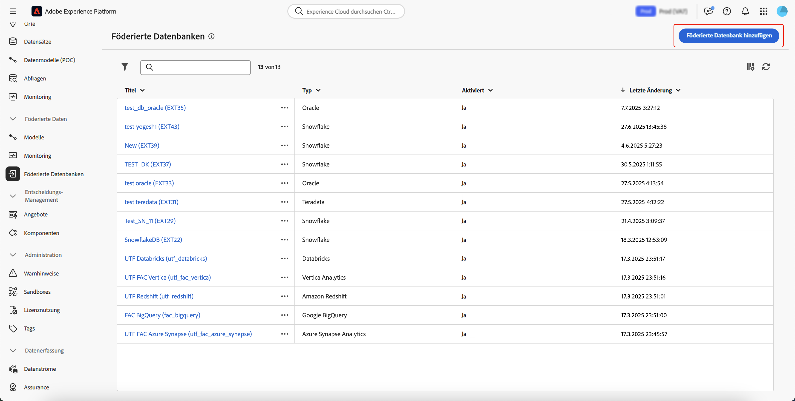
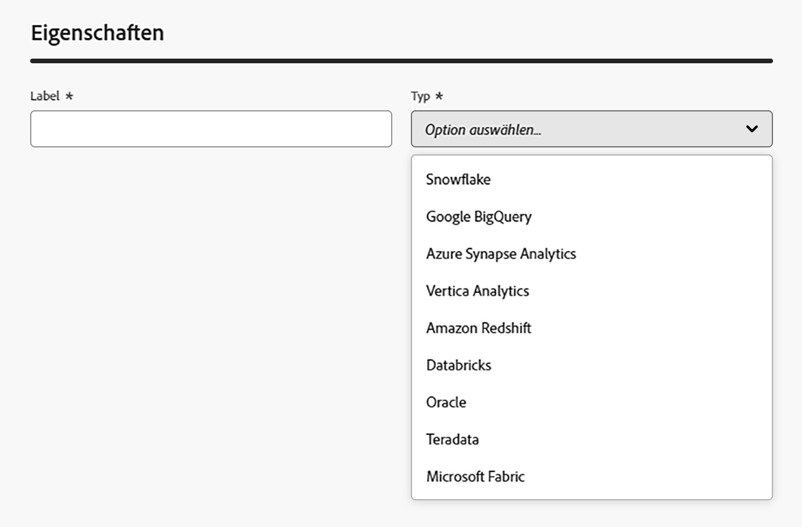

# Erstellen von Verbindungen {#connections-fdb}

>[!AVAILABILITY]
>
>Um auf Verbindungen zugreifen zu können, benötigen Sie eine der folgenden Berechtigungen:
>
>-**Föderierte Datenbank verwalten**
>-**Föderierte Datenbank anzeigen**
>
>Weitere Informationen zu den erforderlichen Berechtigungen finden Sie im [Handbuch zur Zugriffssteuerung](/help/governance-privacy-security/access-control.md).

Die Komposition föderierter Zielgruppen in Experience Platform ermöglicht es Ihnen, Zielgruppen in Data Warehouses von Drittanbietern zu erstellen und anzureichern und die Zielgruppen in Adobe Experience Platform zu importieren.

## Unterstützte Datenbanken {#supported-databases}

Um mit Ihrer föderierten Datenbank und Adobe Experience Platform zu arbeiten, müssen Sie zunächst eine Verbindung zwischen den beiden Quellen herstellen. Mit der Komposition föderierter Zielgruppen können Sie eine Verbindung zu den folgenden Datenbanken herstellen.

- Amazon Redshift
- Azure Synapse Analytics
- Databricks
- Google BigQuery
- Microsoft Fabric
- Oracle
- Snowflake
- Teradata
- Vertica Analytics

## Erstellen einer Verbindung {#create}

Um eine Verbindung zu erstellen, wählen Sie im Abschnitt „Föderierte Daten“ die Option **[!UICONTROL Föderierte Datenbanken]** aus.

{zoomable="yes" width="70%" align="center"}

Der Abschnitt „Föderierte Datenbanken“ wird angezeigt. Wählen Sie **[!UICONTROL Föderierte Datenbank hinzufügen]** aus, um eine Verbindung zu erstellen.

{zoomable="yes" width="70%" align="center"}

>[!NOTE]
>
>Um eine sichere Verbindung über einen privaten Link oder VPN anzufordern, **muss** entweder Privacy and Security Shield oder Healthcare Shield lizenziert sein.

Das Popup-Fenster mit den Verbindungseinstellungen wird angezeigt. Sie können Ihre Verbindung benennen und auswählen, welchen Datenbanktyp Sie erstellen möchten.

{zoomable="yes" width="70%" align="center"}

Nach Auswahl eines Typs wird der Abschnitt **[!UICONTROL Details]** angezeigt. Dieser Abschnitt unterscheidet sich je nach dem zuvor ausgewählten Datenbanktyp.

>[!BEGINTABS]

>[!TAB Amazon Redshift]

>[!AVAILABILITY]
>
>Es werden nur Amazon Redshift AWS, Amazon Redshift Spectrum und Amazon Redshift Serverless unterstützt.
>
>Darüber hinaus wird der sichere Zugriff auf Ihr externes Amazon Redshift-Data-Warehouse über einen privaten Link unterstützt.

Nach Auswahl von Amazon Redshift können Sie die folgenden Details hinzufügen:

| Feld | Beschreibung |
| ----- | ----------- |
| Server | Der Name der Datenquelle. |
| Konto | Der Benutzername des Kontos. |
| Passwort | Das Passwort des Kontos. |
| Datenbank | Der Name der Datenbank. Wenn dies im Server-Namen angegeben ist, kann dieses Feld leer gelassen werden. |
| Arbeitsschema | Name des Datenbankschemas, das für Arbeitstabellen verwendet werden soll. Weitere Informationen zu dieser Funktion finden Sie in der [Dokumentation zu Amazon-Schemata](https://docs.aws.amazon.com/de_de/redshift/latest/dg/r_Schemas_and_tables.html){target="_blank"}.  **Hinweis:** Sie können jedes Schema aus der Datenbank verwenden, einschließlich Schemata, die für die temporäre Datenverarbeitung verwendet werden, sofern Sie über die erforderliche Berechtigung zum Herstellen einer Verbindung mit diesem Schema verfügen. Sie **müssen** jedoch unterschiedliche Arbeitsschemata verwenden, wenn Sie mehrere Sandboxes mit derselben Datenbank verbinden. |

>[!TAB Azure Synapse Analytics]

>[!NOTE]
>
>Wenn Sie eine sichere Verbindung mit Azure Synapse Analytics einrichten möchten, wenden Sie sich an die Adobe-Kundenunterstützung.

Nach Auswahl von Azure Synapse Analytics können Sie die folgenden Details hinzufügen:

| Feld | Beschreibung |
| ----- | ----------- |
| Server | Die URL des Azure Synapse-Servers. |
| Konto | Die Anwendungs-ID (**Client-ID**) der Registrierung der Azure-App. |
| Passwort | Der **Client-Geheimnis**-Wert der Azure-App. |
| Datenbank | Der Name der Datenbank. Wenn dies im Server-Namen angegeben ist, kann dieses Feld leer gelassen werden. |
| Optionen | Zusätzliche Optionen für die Verbindung. Für Azure Synapse Analytics können Sie den Authentifizierungstyp angeben, der vom Connector unterstützt wird. Derzeit unterstützt die Komposition föderierter Zielgruppen `ActiveDirectoryMSI`. Weitere Informationen zu Verbindungszeichenfolgen finden Sie im Abschnitt zu [Beispiel-Verbindungszeichenfolgen in der Dokumentation von Microsoft](https://learn.microsoft.com/de-de/sql/connect/odbc/using-azure-active-directory?view=sql-server-ver15#example-connection-strings){target="_blank"}. |

Alternativ können Sie Ihre Azure Synapse Analytics-Verbindung sicher konfigurieren, indem Sie die Service-Prinzipal-Authentifizierung verwenden. Sie sollten die Service-Prinzipal-Authentifizierung sowohl für produktionsfähige Integrationen als auch für Automatisierungsszenarien nutzen.

+++ Voraussetzungen

Beachten Sie vor dem Einrichten der Service-Prinzipal-Authentifizierung die folgenden Voraussetzungen:

- Azure-Abonnement mit Zugriff auf Microsoft Entra ID
- Azure Synapse-Arbeitsbereich und -Datenbank
- Berechtigung zum Erstellen der App-Registrierung
- Berechtigung zum Verwalten von Azure Synapse-Datenbankrollen
- Berechtigung zum Aktualisieren von Konfigurationen föderierter Datenbanken

+++

Im Azure-Portal müssen Sie zunächst eine neue App-Registrierung erstellen. Wählen Sie **Registrieren** aus, nachdem Sie der Anwendung einen eindeutigen Namen gegeben haben. Die Seite **Überblick** wird angezeigt. Notieren Sie sich die Werte **Application (Client) ID** (Anwendungs-(Client-)ID) und **Directory (Tenant) ID** (Verzeichnis-(Mandanten-)ID).

Wählen Sie in der neu registrierten Anwendung **Zertifikate und Geheimnisse** aus. Wählen Sie von hier aus **Neues Client-Geheimnis** im Abschnitt **Client-Geheimnisse** aus, um ein neues Client-Geheimnis zu erstellen. Nachdem Sie eine Beschreibung und eine Gültigkeit angegeben haben, wählen Sie **Hinzufügen** aus, um das Client-Geheimnis zu generieren.

>[!IMPORTANT]
>
>Kopieren Sie nach dem Generieren Ihres Client-Geheimnisses den **Wert des Client-Geheimnisses** und speichern Sie ihn sicher. Dieser Wert wird **nicht** wieder angezeigt.

Nachdem Sie Ihr Client-Geheimnis generiert haben, müssen Sie prüfen, ob Sie der Ressource die Identität **Service-Prinzipal** gewährt haben.

Weitere Informationen zum Zuweisen von Identitäten zu Ressourcen finden Sie im [Handbuch zu verwalteten Identitäten für Azure Synapse Analytics](https://learn.microsoft.com/de-de/azure/synapse-analytics/synapse-service-identity).

Da Sie nun alle Azure-seitigen Konfigurationen abgeschlossen haben, können Sie jetzt Ihre Konfigurationen für die Komposition föderierter Zielgruppen einrichten.

Legen Sie innerhalb Ihrer Azure Synapse-Verbindung die folgenden Konfigurationsdetails fest:

| Feld | Beschreibung |
| ----- | ----------- |
| Server | Die URL des Azure Synapse-Servers. |
| Konto | Die Anwendungs-ID (**Client-ID**) der Registrierung der Azure-App. |
| Passwort | Der **Client-Geheimnis**-Wert der Azure-App. |
| Datenbank | Der Name der Datenbank. Wenn dies im Server-Namen angegeben ist, kann dieses Feld leer gelassen werden. |
| Optionen | Zusätzliche Optionen für die Verbindung. Um die Service-Prinzipal-Authentifizierung verwenden zu können, müssen Sie `Authentication="ActiveDirectoryServicePrincipal"` festlegen. |

>[!TAB Databricks]

>[!NOTE]
>
>Sicherer Zugriff auf Ihr externes Databricks-Data-Warehouse über einen privaten Link wird unterstützt. Dazu gehören sichere Verbindungen zu Databricks-Datenbanken, die auf Amazon Web Services (AWS) über einen privaten Link gehostet werden, und Databricks-Datenbanken, die auf Microsoft Azure über VPN gehostet werden. Wenden Sie sich an den Adobe-Support, wenn Sie Hilfe benötigen, um sicheren Zugriff einzurichten.

Nach der Auswahl von Databricks können Sie festlegen, welche Authentifizierungsmethode Sie beim Herstellen einer Verbindung mit der Komposition föderierter Zielgruppen verwenden möchten.

Wenn Sie **Authentifizierung per Konto/Passwort** auswählen, können Sie die folgenden Anmeldeinformationen hinzufügen:

| Feld | Beschreibung |
| ----- | ----------- |
| Server | Der Name des Databricks-Servers. |
| Passwort | Das Zugriffstoken für den Databricks-Server. Weitere Informationen zu diesem Wert finden Sie in der [Databricks-Dokumentation zu persönlichen Zugriffstoken](https://docs.databricks.com/aws/en/dev-tools/auth/pat){target="_blank"}. |

Wenn Sie **Service-Prinzipal-Authentifizierung** auswählen, können Sie die folgenden Informationen hinzufügen:

| Feld | Beschreibung |
| ----- | ----------- |
| Server | Der Name des Databricks-Servers. |
| Client-ID | Die Client-ID Ihres Databricks-Servers. Dieses Feld dient als Benutzername für Ihr Projekt. |
| Client-Geheimnis | Das Client-Geheimnis Ihres Databricks-Servers. Dieses Feld dient als Passwort für Ihr Projekt. |

Wenn Sie **OAuth 2.0** auswählen, können Sie die folgenden Informationen hinzufügen:

| Feld | Beschreibung |
| ----- | ----------- |
| Server | Der Name des Databricks-Servers. |
| Client-ID | Die Client-ID Ihres Databricks-Servers. Dieses Feld wird verwendet, um die Anwendung bei der OAuth 2.0-Authentifizierung zu identifizieren, und dient als Benutzername für Ihr Projekt. |
| Client-Geheimnis | Das Client-Geheimnis Ihres Databricks-Servers. Diese vertraulichen Anmeldedaten werden mit der Client-ID ausgestellt und dienen als Passwort für Ihr Projekt. |
| Zugriffsumfang | Vorausgefüllte Informationen, die die Bereiche auflisten, für die Ihr OAuth-Token in Ihrem Databricks-Server autorisiert ist. |

Nach der Eingabe Ihrer Anmeldeinformationen können Sie die folgenden Details hinzufügen:

| Feld | Beschreibung |
| ----- | ----------- |
| HTTP-Pfad | Der Pfad zu Ihrem Cluster oder Warehouse. Weitere Informationen zum Pfad finden Sie in der [Databricks-Dokumentation zu Verbindungsdetails](https://docs.databricks.com/aws/en/integrations/compute-details){target="_blank"}. |
| Catalog | Der Name des Databricks-Katalogs. Weitere Informationen zu Katalogen in Databricks finden Sie in der [Databricks-Dokumentation zu Katalogen](https://docs.databricks.com/aws/en/catalogs/){target="_blank"} |
| Arbeitsschema | Der Name des Datenbankschemas, das für Arbeitstabellen verwendet werden soll.   **Hinweis**: Sie können **jedes** Schema aus der Datenbank verwenden, einschließlich Schemata, die für die temporäre Datenverarbeitung verwendet werden, sofern Sie über die erforderliche Berechtigung zum Herstellen einer Verbindung mit diesem Schema verfügen. Sie **müssen** jedoch unterschiedliche Arbeitsschemata verwenden, wenn Sie mehrere Sandboxes mit derselben Datenbank verbinden. |
| Optionen | Zusätzliche Optionen für die Verbindung. Die verfügbaren Optionen sind in der folgenden Tabelle aufgeführt. |

Für Databricks können Sie die folgenden zusätzlichen Optionen festlegen:

| Optionen | Beschreibung |
| ------- | ----------- |
| TimeZoneName | Der Name der zu verwendenden Zeitzone. Dieser Wert stellt den Sitzungsparameter `TIMEZONE` dar. Weitere Informationen zu Zeitzonen finden Sie in der [Databricks-Dokumentation zu Zeitzonen](https://docs.databricks.com/aws/en/sql/language-manual/parameters/timezone#:~:text=The%20system%20default%20is%20UTC%20.){target="_blank"}. |

>[!TAB Google BigQuery]

>[!NOTE]
>
>Der sichere Zugriff auf Ihr externes Google BigQuery-Data-Warehouse über VPN wird unterstützt.

Nach der Auswahl von Google BigQuery können Sie festlegen, welche Authentifizierungsmethode Sie beim Herstellen einer Verbindung mit der Komposition föderierter Zielgruppen verwenden möchten.

Wenn Sie **[!UICONTROL Authentifizierung per Konto/Passwort]** auswählen, können Sie die folgenden Anmeldeinformationen hinzufügen:

| Feld | Beschreibung |
| ----- | ----------- |
| Service-Konto | Die E-Mail-Adresse Ihres Service-Kontos. Weitere Informationen finden Sie unter [Dokumentation zu Google Cloud-Service-Konten](https://cloud.google.com/iam/docs/service-accounts-create){target="_blank"}. |

Wenn Sie **[!UICONTROL OAuth 2.0]** auswählen, können Sie die folgenden Anmeldeinformationen hinzufügen:

>[!NOTE]
>
>Bevor Sie eine Verbindung zu Google BigQuery mit OAuth 2.0 herstellen, müssen Sie Ihre Umleitungs-URL in Ihrem Google Cloud-Projekt konfigurieren. Fügen Sie die Umleitungs-URL `https://fac-oauth.adobe.io/oauth` unter Ihrer OAuth 2.0-Client-ID-Konfiguration zu Ihrem Google Cloud-Projekt hinzu.

| Feld | Beschreibung |
| ----- | ----------- |
| Client-ID | Die Client-ID aus Ihrem Google BigQuery-Projekt. Dieses Feld dient als Benutzername für Ihr Projekt. |
| Client-Geheimnis | Das Client-Geheimnis aus Ihrem Google BigQuery-Projekt. Dieses Feld dient als Passwort für Ihr Projekt. |
| Zugriffsumfang | Vorausgefüllte Informationen, die die Bereiche auflisten, für die Ihr OAuth-Token in Ihren Google Cloud-Ressourcen autorisiert ist. |

Wählen Sie **[!UICONTROL Anmelden]** aus, um Ihre Authentifizierung zu beenden.

Wenn Sie **[!UICONTROL WIF]** auswählen, müssen Sie **keine** Anmeldeinformationen hinzufügen. Sie **müssen** jedoch die Konfiguration der Client-Bibliothek als **[!UICONTROL Schlüsseldateipfad]** hinzufügen. Weitere Informationen zur Konfiguration der Client-Bibliothek finden Sie im [Abschnitt zur Konfiguration für Google BigQuery (Workload Identity Federation)](#wif-configuration).

Nach der Eingabe Ihrer Anmeldeinformationen können Sie die folgenden Details hinzufügen:

| Feld | Beschreibung |
| ----- | ----------- |
| Projekt | Die ID Ihres Projekts. Weitere Informationen finden Sie unter [Dokumentation zu Google Cloud-Projekten](https://cloud.google.com/resource-manager/docs/creating-managing-projects){target="_blank"}. |
| Datensatz | Der Name des Datensatzes. Weitere Informationen finden Sie unter [Dokumentation zu Google Cloud-Datensätzen](https://cloud.google.com/bigquery/docs/datasets-intro){target="_blank"}. |
| Speicherort des Google-Buckets | Der Speicherort Ihres Google-Buckets. Sie müssen dieses Feld nur hinzufügen, wenn Sie die Aktivität **Dimension ändern** in Ihrer Komposition verwenden. Weitere Informationen finden Sie in der Dokumentation zu [Google Cloud Bucket-Speicherorten](https://docs.cloud.google.com/storage/docs/locations){target="_blank"}. |
| Schlüsseldateipfad | Die Schlüsseldatei zum Server. Es werden nur `json`-Dateien unterstützt. |
| Optionen | Zusätzliche Optionen für die Verbindung. Die verfügbaren Optionen sind in der folgenden Tabelle aufgeführt. |

Für Google BigQuery können Sie die folgenden zusätzlichen Optionen festlegen:

| Optionen | Beschreibung |
| ------- | ----------- |
| ProxyType | Der Proxy-Typ, mit dem die Verbindung zu BigQuery hergestellt wird. Zu den unterstützten Werten gehören `HTTP`, `http_no_tunnel`, `socks4` und `socks5`. |
| ProxyHost | Der Host-Name oder die IP-Adresse, um den Proxy zu erreichen. |
| ProxyUid | Die Port-Nummer, auf der der Proxy ausgeführt wird. |
| ProxyPwd | Das Passwort für den Proxy. |
| bgpath | **Hinweis**: Dies gilt nur für das **Tool für Massenladung** (Cloud SDK).    Der Pfad zum Cloud SDK-Klassenverzeichnis am Server. Sie müssen dies nur festlegen, wenn Sie das Verzeichnis `google-cloud-sdk` an einen anderen Speicherort verschoben haben oder wenn Sie die Verwendung der Variable „PATH“ vermeiden möchten. |
| GCloudConfigName | **Hinweis**: Dies gilt nur für das **Tool für Massenladung** (Cloud SDK), Version 7.3.4 oder höher.    Der Name der Konfiguration, die die Parameter zum Laden der Daten speichert. Standardmäßig ist dieser Wert `accfda`. |
| GCloudDefaultConfigName | **Hinweis**: Dies gilt nur für das **Tool für Massenladung** (Cloud SDK), Version 7.3.4 und höher.    Der Name der temporären Konfiguration, um die Hauptkonfiguration zum Laden von Daten neu zu erstellen. Standardmäßig ist dieser Wert `default`. |
| GCloudRecreateConfig | **Hinweis**: Dies gilt nur für das **Tool für Massenladung** (Cloud SDK), Version 7.3.4 und höher.    Ein boolescher Wert, mit dem Sie festlegen können, ob der Massenlademechanismus die Google Cloud SDK-Konfigurationen automatisch neu erstellen, löschen oder ändern soll. Wenn dieser Wert auf `false` festgelegt ist, lädt der Massenlademechanismus Daten mit einer vorhandenen Konfiguration am Computer. Wenn dieser Wert auf `true` festgelegt ist, stellen Sie sicher, dass Ihre Konfiguration ordnungsgemäß eingerichtet ist. Andernfalls wird der Fehler `No active configuration found. Please either create it manually or remove the GCloudRecreateConfig option` angezeigt und der Lademechanismus wird auf den standardmäßigen Lademechanismus zurückgesetzt. |
| **restEndpoint** | Der Endpunkt für Ihren Apigee-Proxy. Sie müssen dies nur verwenden, wenn Sie den REST-API-Connector mit dem Apigee-Proxy verwenden. Wenn Sie den Apigee-Proxy verwenden, aktivieren Sie die Einstellung **Verwenden des REST-API-Connectors**. Weitere Informationen zum Setup finden Sie im Abschnitt [Google BigQuery Apigee Gateway Support](#apigee). |

>[!TAB Microsoft Fabric]

Nach Auswahl von Microsoft Fabric können Sie die folgenden Details hinzufügen:

| Feld | Beschreibung |
| ----- | ----------- |
| Server | Die URL für den Microsoft Fabric-Server. |
| Anwendungs-ID | Die Anwendungs-ID für Microsoft Fabric. Weitere Informationen zur Anwendungs-ID finden Sie in der [Microsoft Fabric-Dokumentation zum Einrichten der Anwendung](https://learn.microsoft.com/de-de/fabric/workload-development-kit/create-entra-id-app){target="_blank"}. |
| Client-Geheimnis | Das Client-Geheimnis für die Anwendung. Weitere Informationen zum Client-Geheimnis finden Sie in der [Microsoft Fabric-Dokumentation zum Einrichten der Anwendung](https://learn.microsoft.com/de-de/fabric/workload-development-kit/create-entra-id-app#step-8-generate-a-secret-for-your-application){target="_blank"}. |
| Optionen | Zusätzliche Optionen für die Verbindung. Die verfügbaren Optionen sind in der folgenden Tabelle aufgeführt. |

Für Microsoft Fabric können die folgenden zusätzlichen Optionen festlegen:

| Option | Beschreibung |
| ------ | ----------- |
| Authentifizierung | Vom Connector verwendeter Authentifizierungstyp. Zu den unterstützten Werten gehört `ActiveDirectoryMSI`. Weitere Informationen finden Sie in der [Microsoft-Dokumentation zu Warehouse-Konnektivität](https://learn.microsoft.com/de-de/fabric/data-warehouse/connectivity){target="_blank"}. |

>[!TAB Oracle]

>[!NOTE]
>
>Die Komposition föderierter Zielgruppen unterstützt die Einrichtung von föderierten Verbindungen mit Oracle-Datenbanken der Version 11g oder höher, die auf AWS, Azure, Exadata oder einer privaten Cloud gehostet werden (sofern Zugriff über ein externes Netzwerk besteht). Wenn Sie weitere Fragen zur Oracle-Datenbankeinrichtung haben oder eine sichere Verbindung mit Oracle herstellen müssen, wenden Sie sich bitte an die Adobe-Kundenunterstützung.

Nach Auswahl von Oracle können Sie die folgenden Details hinzufügen:

| Feld | Beschreibung |
| ----- | ----------- |
| Server | Die URL für den Oracle-Server. |
| Konto | Der Benutzername des Kontos. |
| Passwort | Das Passwort des Kontos. |

>[!TAB Snowflake]

>[!NOTE]
>
>Sicherer Zugriff auf Ihr externes Snowflake-Data-Warehouse über einen privaten Link wird unterstützt. Ihr Snowflake-Konto muss auf Amazon Web Services (AWS) oder Azure gehostet werden und sich in derselben Region wie Ihre Umgebung mit der Funktion „Komposition föderierter Zielgruppen“ befinden. Wenden Sie sich an den Adobe-Support, wenn Sie Hilfe benötigen, um sicheren Zugriff auf Ihr Snowflake-Konto einzurichten.

Nach der Auswahl von Snowflake können Sie festlegen, welche Authentifizierungsmethode Sie beim Herstellen einer Verbindung mit der Komposition föderierter Zielgruppen verwenden möchten.

Wenn Sie **[!UICONTROL Authentifizierung per Konto/Passwort]** auswählen, können Sie die folgenden Anmeldeinformationen hinzufügen:

| Feld | Beschreibung |
| ----- | ----------- |
| Server | Der Name des Servers. |
| Benutzerin bzw. Benutzer | Der Benutzername für das Konto. |
| Passwort | Das Passwort für das Konto. |

Alternativ können Sie auch anstelle eines Passworts einen privaten Schlüssel hinzufügen. Wenn Sie einen privaten Schlüssel hinzufügen, müssen Sie die folgenden Informationen angeben:

| Feld | Beschreibung |
| ----- | ----------- |
| Server | Der Name des Servers. |
| Benutzerin bzw. Benutzer | Der Benutzername für das Konto. |
| Privater Schlüssel | Der private Schlüssel für das Konto. Es werden nur `.pem`-Dateien unterstützt. |
| Passwort | (Optional) Das Passwort für das Konto. |

Wenn Sie **[!UICONTROL OAuth 2.0]** auswählen, können Sie die folgenden Anmeldeinformationen hinzufügen:

>[!NOTE]
>
>Bevor Sie eine Verbindung zu Snowflake mit OAuth 2.0 herstellen, müssen Sie Ihre Umleitungs-URL in Ihrem Snowflake OAuth-Integrationsobjekt konfigurieren. Fügen Sie die Umleitungs-URL `https://fac-oauth.adobe.io/oauth` zu Ihrer Snowflake OAuth-Integrationskonfiguration hinzu.

| Feld | Beschreibung |
| ----- | ----------- |
| Server | Der Name des Servers. |
| Client-ID | Die Client-ID aus Ihrem Snowflake-Projekt. Dieses Feld dient als Benutzername für Ihr Projekt. |
| Client-Geheimnis | Das Client-Geheimnis aus Ihrem Snowflake-Projekt. Dieses Feld dient als Passwort für Ihr Projekt. |

Wählen Sie **[!UICONTROL Anmelden]** aus, um Ihre Authentifizierung zu beenden.

Nach der Eingabe Ihrer Anmeldeinformationen können Sie die folgenden Details hinzufügen:

| Feld | Beschreibung |
| ----- | ----------- |
| Datenbank | Der Name der Datenbank. Wenn dies im Server-Namen angegeben ist, kann dieses Feld leer gelassen werden. |
| Arbeitsschema | Der Name des Datenbankschemas, das für Arbeitstabellen verwendet werden soll.   **Hinweis**: Sie können **jedes** Schema aus der Datenbank verwenden, einschließlich Schemata, die für die temporäre Datenverarbeitung verwendet werden, sofern Sie über die erforderliche Berechtigung zum Herstellen einer Verbindung mit diesem Schema verfügen. Sie **müssen** jedoch unterschiedliche Arbeitsschemata verwenden, wenn Sie mehrere Sandboxes mit derselben Datenbank verbinden. |
| Privater Schlüssel | Der private Schlüssel für Ihre Datenbankverbindung. Sie können eine `.pem`-Datei von Ihrem lokalen System hochladen. |
| Optionen | Zusätzliche Optionen für die Verbindung. Die verfügbaren Optionen sind in der folgenden Tabelle aufgeführt. |

Für Snowflake können Sie die folgenden zusätzlichen Optionen festlegen:

| Optionen | Beschreibung |
| ------- | ----------- |
| workschema | Name des Datenbankschemas, das für Arbeitstabellen verwendet werden soll. |
| TimeZoneName | Der Name der zu verwendenden Zeitzone. Dieser Wert stellt den Sitzungsparameter `TIMEZONE` dar. Standardmäßig wird die Zeitzone des Systems verwendet. Weitere Informationen zu Zeitzonen finden Sie in der [Snowflake-Dokumentation zu Zeitzonen](https://docs.snowflake.com/de/sql-reference/parameters#timezone){target="_blank"}. |
| WeekStart | Der Tag, an dem die Woche beginnen soll. Dieser Wert stellt den Sitzungsparameter `WEEK_START` dar. Weitere Informationen zum Wochenstart finden Sie in der [Snowflake-Dokumentation zum Wochenstartparameter](https://docs.snowflake.com/de/sql-reference/parameters#week-start){target="_blank"} |
| UseCachedResult | Ein boolescher Wert, der bestimmt, ob die zwischengespeicherten Ergebnisse von Snowflake verwendet werden. Dieser Wert stellt den Sitzungsparameter `USE_CACHED_RESULTS` dar. Standardmäßig ist dieser Wert auf „wahr“ festgelegt. Weitere Informationen zu diesem Parameter finden Sie in der [Snowflake-Dokumentation zu gespeicherten Ergebnissen](https://docs.snowflake.com/de/user-guide/querying-persisted-results){target="_blank"}. |
| bulkThreads | Die Anzahl der Threads, die für den Massenlader von Snowflake verwendet werden sollen. Je mehr Threads hinzugefügt werden, desto besser ist die Leistung bei größeren Massenladevorgängen. Standardmäßig ist dieser Wert auf 1 festgelegt. |
| chunkSize | Die Dateigröße jedes Blocks des Massenladers. Bei gleichzeitiger Verwendung mit mehreren Threads können Sie die Leistung Ihrer Massenladevorgänge verbessern. Standardmäßig ist dieser Wert auf 128 MB festgelegt. Weitere Informationen zu Blockgrößen finden Sie in der [Snowflake-Dokumentation zum Vorbereiten von Datendateien](https://docs.snowflake.com/de/user-guide/data-load-considerations-prepare){target="_blank"}. |
| StageName | Der Name einer vorab bereitgestellten internen Staging-Umgebung. Dieser kann bei Massenladevorgängen verwendet werden, anstatt einen neuen temporären Staging-Bereich zu erstellen. |

>[!TAB Teradata]

>[!NOTE]
>
>Um eine Verbindung mit Teradata herzustellen, **müssen** verschiedene Voraussetzungen erfüllt sein, einschließlich der Installation von Datenbanktreibern. Bitte wenden Sie sich an die Adobe-Kundenunterstützung, um weitere Informationen zu erhalten.

Nach Auswahl von Teradata können Sie die folgenden Details hinzufügen:

| Feld | Beschreibung |
| ----- | ----------- |
| Server | Die URL des Teradata-Servers. |
| Konto | Der Benutzername, den die Datenbank für die Open Database Connectivity-Sitzung (ODBC) verwendet. |
| Passwort | Das Passwort, mit dem Sie eine Verbindung zur ODBC-Sitzung herstellen. |
| Datenbank | Der Name der Datenbank. |
| Optionen | Zusätzliche Optionen für die Verbindung. Für Teradata ist das Hinzufügen beider aufgelisteter Optionen **zwingend erforderlich**. Die verfügbaren Optionen sind in der folgenden Tabelle aufgeführt. |

Für Teradata können Sie die folgenden zusätzlichen Optionen festlegen:

| Optionen | Beschreibung |
| ------- | ----------- |
| `workTableSchema` | Der Name des Schemas für Arbeitstabellen. |
| `ODBCLib` | Der Speicherort der ODBC-Bibliothek des Systems, den Sie verwenden können, wenn Sie Teradata mit einer anderen ODBC-Verbindung kombinieren. |

>[!TAB Vertica Analytics]

Nach Auswahl von Vertica Analytics können Sie die folgenden Details hinzufügen:

| Feld | Beschreibung |
| ----- | ----------- |
| Server | Die URL des Vertica Analytics-Servers. |
| Konto | Der Benutzername des Kontos. |
| Passwort | Das Passwort des Kontos. |
| Datenbank | Der Name der Datenbank. Wenn dies im Server-Namen angegeben ist, kann dieses Feld leer gelassen werden. |
| Arbeitsschema | Der Name des Datenbankschemas, das für Arbeitstabellen verwendet werden soll.   **Hinweis**: Sie können **jedes** Schema aus der Datenbank verwenden, einschließlich Schemata, die für die temporäre Datenverarbeitung verwendet werden, sofern Sie über die erforderliche Berechtigung zum Herstellen einer Verbindung mit diesem Schema verfügen. Sie **müssen** jedoch unterschiedliche Arbeitsschemata verwenden, wenn Sie mehrere Sandboxes mit derselben Datenbank verbinden. |
| Optionen | Zusätzliche Optionen für die Verbindung. Die verfügbaren Optionen sind in der folgenden Tabelle aufgeführt. |

Für Vertica Analytics können Sie die folgenden zusätzlichen Optionen festlegen:

| Optionen | Beschreibung |
| ------- | ----------- |
| TimeZoneName | Der Name der zu verwendenden Zeitzone. Dieser Wert stellt den Sitzungsparameter `TIMEZONE` dar. Weitere Informationen zu Zeitzonen finden Sie in der [Vertica Analytics-Dokumentation zu Zeitzonen](https://docs.vertica.com/24.1.x/en/admin/configuring-db/config-procedure/using-time-zones-with/){target="_blank"}. |

>[!ENDTABS]

Nachdem Sie die Details der Verbindung hinzugefügt haben, beachten Sie die folgenden zusätzlichen Einstellungen:

>[!NOTE]
>
>Zum Verwenden der Komposition föderierter Zielgruppen für eine bestimmte Datenbank müssen Sie **alle** mit dieser Datenbank verknüpften IP-Adressen in die Zulassungsliste aufnehmen.

| Einstellungen | Details |
| -------- | ------- |
| Verbindung aktivieren | Ein boolescher Umschalter, der bestimmt, ob die Verbindung automatisch aktiviert wird. |
| Server-IPs | Ein Popup-Fenster, das anzeigt, welche IP-Adressen für die Verbindung mit der Datenbank auf die Zulassungsliste gesetzt werden müssen. |
| Testen der Verbindung | Ermöglicht die Überprüfung Ihrer Konfigurationsdetails. |

Sie können jetzt **[!UICONTROL Funktionen freigeben]** und anschließend **[!UICONTROL Hinzufügen]** auswählen, um die Verbindung zwischen der föderierten Datenbank und Experience Platform fertigzustellen.

## Anhang {#appendix}

Im folgenden Anhang wird beschrieben, wie Sie die Verbindungen aufseiten des externen Kontos einrichten.

### Konfiguration von Google BigQuery (Workload Identity Federation) {#wif-configuration}

Bevor Sie Ihre Google Cloud Platform-Einrichtung konfigurieren, benötigen Sie die folgenden Werte:

- AWS-Konto-ID
   - Wenden Sie sich an die Adobe-Kundenunterstützung, um diesen Wert zu erhalten.
- AWS IAM-Rollenname
   - Der AWS IAM-Rollenname folgt dem folgenden Format: `arn:aws:iam::<ADOBE_AWS_ACCOUNT_ID>:role/fac-<CUSTOMER_IMS_ORG_ID>`

Erstellen Sie in der Google Cloud Console einen **Workload Identity-Pool** im **Abschnitt für IAM und Administration**. Auf diese Weise können Sie externe Identitäten organisieren und verwalten.

Wählen Sie **Anbieter hinzufügen** aus, um einen Identitätsanbieter zu erstellen. Hierdurch wird ein einseitiges Vertrauensverhältnis zwischen dem Identitätsanbieter in Google Cloud und dem Workload Identity-Pool konfiguriert, indem die relevanten Metadaten über den Anbieter bereitgestellt werden.

Wenn Sie einen Anbieter erstellen, müssen Sie die folgenden Informationen angeben:

| Feld | Beschreibung |
| ----- | ----------- |
| Name | Der Name des Anbieters für den Workload Identity-Pool. |
| ID | Die ID für den Anbieter wird automatisch generiert. |
| AWS-Konto-ID | Die zuvor angegebene AWS-Konto-ID. |
| Aktivierter Anbieter | Ein boolescher Wert, der bestimmt, ob der Anbieter aktiviert oder deaktiviert ist. |
| Attributzuordnung | Die Zuordnungen, die mit den Rollen übereinstimmen müssen. Diese Informationen sind bereits vorhanden. |

Nachdem Sie den Anbieter erstellt haben, müssen Sie eine IAM-Richtlinie erstellen, damit die Identitäten des Workload Identity-Pools die Identität des Dienstkontos annehmen können. Wählen Sie **Zugriff gewähren** aus, um das Dialogfeld „Zugriff auf Dienstkonto gewähren“ zu öffnen.

Wählen Sie im Dialogfeld die Option für **Zugriff über Dienstkontosimulation gewähren** aus. Im Abschnitt **Prinzipale auswählen** müssen Sie Ihre Attributzuordnungen erstellen.

Wählen Sie **aws_role** aus und fügen Sie `arn:aws:sts::AWSAccountID:assumed-role/AWSRoleName` als Wert hinzu, wobei Sie `AWSAccountID` und `AWSRoleName` durch die zuvor bereitgestellten Werte ersetzen.

Laden Sie nach der Gewährung des Zugriffs auf das Dienstkonto die Konfiguration der Client-Bibliothek herunter.

Nach dem Herunterladen der Konfiguration der Client-Bibliothek können Sie nun eine WIF-Verbindung mit der Konfiguration föderierter Zielgruppen einrichten.

### Google BigQuery [!DNL Apigee] Gateway-Unterstützung {#apigee}

Sie können [!DNL Apigee], die native API-Verwaltungsplattform von Google Cloud, verwenden, um Ihre API-Aufrufe an Google BigQuery weiterzuleiten.

Sie müssen zunächst einen Proxy in der [!DNL Apigee]-Benutzeroberfläche erstellen. Wechseln Sie in Google Cloud zu **Apigee** gefolgt von **Proxy-**, **API-** und **Erstellen**, um das Bedienfeld **Proxy erstellen** aufzurufen. Im Bedienfeld können Sie die folgenden Details ausfüllen:

| Details | Beschreibung |
| ------- | ----------- |
| Proxy-Vorlage | Der Proxy-Typ, den Sie erstellen möchten. In diesem Anwendungsfall sollten Sie „Reverse **Proxy (am häufigsten)“**. |
| Proxy-Name | Der Name Ihres Proxys. Dieser Wert kann **nur** alphanumerische Zeichen, Bindestriche (`-`) oder Unterstriche (`_`) enthalten. |
| Basispfad | Das URI-Fragment, das die Host-Adresse für Ihren API-Proxy anzeigt. Dieser Basispfad basiert auf dem Proxy-Namen und **muss** eindeutig sein. |
| Beschreibung | Eine optionale Beschreibung für den API-Proxy. |
| Target | Die URL (die entweder HTTP oder HTTPS enthält) des Backend-Service, den der API-Proxy aufruft. |

Erstellen Sie für die Federated Audience-Komposition eine Proxy-Endpunktregel für **jeden**-Endpunkt, den der Google BigQuery-Connector verwendet, wie unten aufgeführt:

| Basispfad | Target-Endpunkt | Beschreibung |
| --------- | --------------- | ----------- |
| `/bigquery` | `https://bigquery.googleapis.com/bigquery` | Der wichtigste Endpunkt für Google BigQuery. Dieser Endpunkt wird verwendet, um Daten wie Abfragen und Listentabellen abzurufen. |
| `/token` | `https://oauth2.googleapis.com/token` | Dieser Endpunkt wird für die Authentifizierung von Service-Konten verwendet. |
| `/storage` | `https://storage.googleapis.com/storage` | Dieser Speicherendpunkt wird zum Löschen temporärer Massenladedateien verwendet. |
| `/upload` | `https://storage.googleapis.com/upload` | Dieser Speicherendpunkt wird für das Massenladen von Dateien verwendet. |
| `/v1/token` | `https://sts.googleapis.com/v1/token` | Dieser Endpunkt wird für den Workload Identity Federation (WIF)-Fluss verwendet, um das Token abzurufen. |
| `/v1/projects` | `https://iamcredentials.googleapis.com/v1/projects` | Dieser Endpunkt wird verwendet, um die Identität eines Dienstkontos im Workflow Workload Identity Federation (WIF) anzunehmen. |

Nachdem Sie Ihren Proxy erstellt haben, können Sie ihn verwenden, um eine Verbindung mit Federated Audience Composition herzustellen. Nach der Bereitstellung des Proxys finden Sie die vollständige URL für Ihren Proxy unter **Hostnamen**, wenn Sie **Umgebungen** gefolgt von **Gruppen** im Abschnitt **Admin** auswählen.
