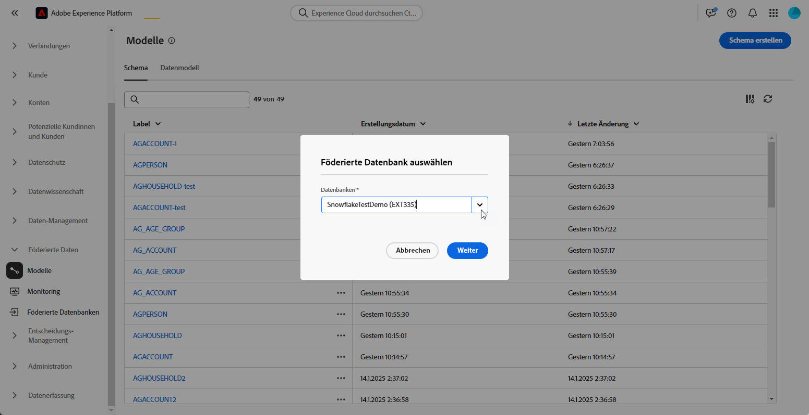

# Erste Schritte mit Schemata {#schemas}

>[!CONTEXTUALHELP]
>id="dc_schema_create_select_tables"
>title="Tabellen auswählen"
>abstract="Wählen Sie die Tabellen aus, die für das Datenmodell hinzugefügt werden sollen."

>[!CONTEXTUALHELP]
>id="dc_schema_create_key"
>title="Schlüssel"
>abstract="Wählen Sie einen Schlüssel für die Datenabstimmung aus."

>[!CONTEXTUALHELP]
>id="dc_schema_create_schema_name"
>title="Name des Schemas"
>abstract="Geben Sie den Namen des Schemas ein."

>[!CONTEXTUALHELP]
>id="dc_schema_edit_description"
>title="Beschreibung des Schemas"
>abstract="Die Beschreibung des Schemas listet Spalten, Typen und Bezeichnungen auf. Sie können auch den Abstimmschlüssel für das Schema überprüfen. Um die Definition des Schemas zu aktualisieren, klicken Sie auf das Stiftsymbol."

>[!CONTEXTUALHELP]
>id="dc_schema_filter_sources"
>title="Quelldatenbank zum Filtern auswählen"
>abstract="Sie können die Schemata nach ihrer Quelle filtern. Wählen Sie eine oder mehrere föderierte Datenbanken aus, um deren Schemata anzuzeigen."

## Was ist ein Schema? {#schema-start}

Ein Schema ist eine Darstellung einer Tabelle Ihrer Datenbank. Es ist ein Objekt innerhalb der Anwendung, das definiert, wie die Daten mit Datenbanktabellen verknüpft werden.

Durch Erstellung eines Schemas haben Sie die Möglichkeit, Ihre Tabelle in FAC zu bearbeiten:
- Geben Sie ihm einen Anzeigenamen und eine Beschreibung, um das Verständnis für den Benutzer zu vereinfachen
- die Sichtbarkeit der einzelnen Felder entsprechend ihrer tatsächlichen Nutzung bestimmen;
- Wählen Sie den Primärschlüssel aus, um Schemas wie im [Datenmodell](../data-management/gs-models.md#data-model-start) benötigt zwischen ihnen zu verknüpfen.

## Erstellen eines Schemas {#schema-create}

Gehen Sie wie folgt vor, um Schemas in FAC zu erstellen:
Wechseln Sie im Abschnitt **[!UICONTROL FEDERATED DATA]** in den Link **[!UICONTROL Modelle]** . Dort finden Sie die Registerkarte **[!UICONTROL Schema]**.
Klicken Sie auf die Schaltfläche **[!UICONTROL Schema erstellen]** .

{zoomable="yes"}

Sie haben Zugriff auf eine neue Benutzeroberfläche mit einer Dropdown-Liste, in der Sie
alle Datenbanken, die mit Ihrer Anwendung verbunden sind. Erfahren Sie mehr über die [Datenbankverbindung](../connections/connections.md#connections-fdb).
Wählen Sie Ihre Quelldatenbank in der Liste aus und klicken Sie auf die Registerkarte **[!UICONTROL Tabellen hinzufügen]** .

{zoomable="yes"}

Sie haben Zugriff auf die Liste aller Tabellen in der Datenbank.

Durch Hinzufügen der Tabellen, für die Sie das Schema erstellen möchten, haben Sie Zugriff auf die entsprechenden Felder wie unten dargestellt.

{zoomable="yes"}

Für jede Tabelle haben Sie folgende Möglichkeiten:
- Benennen Sie die angegebene Schemakennung um.
- Beschreibung hinzufügen
- benennen Sie alle Felder um und legen Sie deren Sichtbarkeit fest.
- Primärschlüssel des Schemas auswählen

Beispielsweise wird hier eine Tabelle importiert, direkt nach dem Hinzufügen :

{zoomable="yes"}

Das Schema kann wie folgt definiert werden:

{zoomable="yes"}

## Schema bearbeiten {#schema-edit}

Um ein Schema zu bearbeiten, klicken Sie auf den Namen Ihres Schemas im Ordner Schemas . Sie haben Zugriff auf die Seite unten.
Klicken Sie auf die Schaltfläche **[!UICONTROL Bearbeiten]** .

{zoomable="yes"}

Sie haben Zugriff auf die gleiche Möglichkeit wie beim Erstellen des Schemas :
- Benennen Sie die angegebene Schemakennung um.
- Beschreibung hinzufügen
- benennen Sie alle Felder um und legen Sie deren Sichtbarkeit fest.
- Primärschlüssel des Schemas auswählen

{zoomable="yes"}

## Datenvorschau in einem Schema {#schema-preview}

Um eine Vorschau der Daten in der Tabelle anzuzeigen, die durch Ihr Schema dargestellt wird, gehen Sie zur Registerkarte **[!UICONTROL Daten]** , wie unten dargestellt.
Sie können die Gesamtzahl der Aufzeichnungen anzeigen, indem Sie auf den Link **[!UICONTROL Berechnen]** klicken.

{zoomable="yes"}

Sie können die Datenübersicht durch Klicken auf die Schaltfläche **[!UICONTROL Spalten konfigurieren]** ändern.

{zoomable="yes"}

## Löschen eines Schemas {#schema-delete}

Um ein Schema zu löschen, klicken Sie auf die Schaltfläche **[!UICONTROL Mehr]** und dann auf **[!UICONTROL Löschen]**.

{zoomable="yes"}