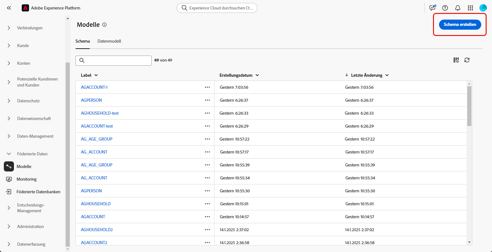

# Erste Schritte mit Schemata {#schemas}

>[!AVAILABILITY]
>
>Um auf Schemata zugreifen zu können, benötigen Sie eine der folgenden Berechtigungen:
>
>-**Föderiertes Schema verwalten**
>>-**Föderiertes Schema anzeigen**
>
>Weitere Informationen zu den erforderlichen Berechtigungen finden Sie im [Handbuch zur Zugriffssteuerung](/help/governance-privacy-security/access-control.md).

>[!CONTEXTUALHELP]
>id="dc_schema_create_select_tables"
>title="Tabellen auswählen"
>abstract="Die Tabellen auswählen, die für das Datenmodell hinzugefügt werden sollen."

>[!CONTEXTUALHELP]
>id="dc_schema_create_key"
>title="Schlüssel"
>abstract="Einen Schlüssel für die Datenabstimmung auswählen."

>[!CONTEXTUALHELP]
>id="dc_schema_create_schema_name"
>title="Name des Schemas"
>abstract="Den Namen des Schemas eingeben."

>[!CONTEXTUALHELP]
>id="dc_schema_edit_description"
>title="Beschreibung des Schemas"
>abstract="Die Beschreibung des Schemas listet Spalten, Typen und Bezeichnungen auf. Man kann auch den Abstimmschlüssel für das Schema überprüfen. Um die Definition des Schemas zu aktualisieren, auf das Stiftsymbol klicken."

>[!CONTEXTUALHELP]
>id="dc_schema_filter_sources"
>title="Quelldatenbank zum Filtern auswählen"
>abstract="Sie können die Schemata nach ihrer Quelle filtern. Wählen Sie eine oder mehrere föderierte Datenbanken aus, um deren Schemata anzuzeigen."

## Was ist ein Schema {#schema-start}

Ein Schema ist eine Darstellung einer Tabelle Ihrer Datenbank. Es ist ein Objekt innerhalb der Anwendung, das definiert, wie die Daten mit Datenbanktabellen verknüpft werden.

Durch Erstellung eines Schemas können Sie eine Darstellung Ihrer Tabelle in der Komposition föderierter Zielgruppen in Experience Platform definieren:

* Geben Sie einen Anzeigenamen und eine gute Beschreibung ein, um das Verständnis für Benutzende zu erleichtern
* Bestimmen Sie die Sichtbarkeit der einzelnen Felder entsprechend ihrer tatsächlichen Verwendung.
* Wählen Sie den Primärschlüssel, um die Schemata untereinander zu verknüpfen, wie es im [Datenmodell](../data-management/gs-models.md#data-model-start) erforderlich ist.

>[!CAUTION]
>
>Wenn Sie mehrere Sandboxes mit derselben Datenbank verbinden, müssen Sie unterschiedliche Arbeitsschemata verwenden.

## Erstellen eines Schemas {#schema-create}

Um ein Schema in Federated Audience Composition zu erstellen, wählen Sie **[!UICONTROL Modelle]** im Abschnitt **[!UICONTROL Federated Data]** aus. Wählen Sie auf der **[!UICONTROL Schema]** die Option **[!UICONTROL Schema erstellen]** aus.

{zoomable="yes"}

Das **[!UICONTROL Federated Database auswählen]**-Popover wird angezeigt. In diesem Popover können Sie die [Quelldatenbank](/help/connections/home.md) gefolgt von &quot;**[!UICONTROL &quot;]**.

{zoomable="yes"}

Das **Tabelle auswählen**-Popover wird angezeigt. In diesem Pop-up können Sie die Tabellen auswählen, die Sie zum Erstellen des Schemas verwenden möchten.

{zoomable="yes"}

Jede ausgewählte Tabelle generiert ein Schema mit den ausgewählten Spalten. Für jede Tabelle können Sie die Bezeichnung des Schemas ändern, eine Beschreibung hinzufügen, die Feldbezeichnung umbenennen, die Sichtbarkeit der Feldbezeichnung festlegen und den Schema-Primärschlüssel auswählen.

{zoomable="yes"}

>[!NOTE]
>
>Wenn Sie **[!UICONTROL Zusammengesetzten Schlüssel verwenden]** aber nur einen zu verwendenden Schlüssel auswählen, wird der Schlüssel wie ein standardmäßiger Schema-Primärschlüssel behandelt.

Darüber hinaus können Sie einen Schlüssel erstellen, der aus mehreren Schemaspalten besteht. Aktivieren Sie **[!UICONTROL Zusammengesetzten Schlüssel verwenden]** und markieren Sie die Schlüssel, die Sie als zusammengesetzten Schlüssel verwenden möchten.

{zoomable="yes"}

Wählen Sie nach Abschluss der Konfiguration **[!UICONTROL Fertig]**, um die Erstellung Ihres Schemas abzuschließen.

## Bearbeiten eines Schemas {#schema-edit}

Um ein Schema zu bearbeiten, wählen Sie das zuvor erstellte Schema auf der Seite **Schemata** aus.

Die Seite mit den Schemadetails wird angezeigt. Wählen Sie das  aus, um das Schema zu bearbeiten.

{zoomable="yes"}

Im Fenster **[!UICONTROL Schema bearbeiten]** können Sie dieselben Optionen aufrufen und konfigurieren wie beim [Erstellen eines Schemas](#schema-create).

{zoomable="yes"}

## Vorschau von Daten in einem Schema {#schema-preview}

Um eine Vorschau der Daten in der Tabelle anzuzeigen, die durch Ihr Schema dargestellt wird, gehen Sie zur Registerkarte **[!UICONTROL Daten]**, wie unten dargestellt.

Wählen Sie **[!UICONTROL Link]** Berechnen“, um eine Vorschau der Gesamtzahl der Aufzeichnungen anzuzeigen.

{zoomable="yes"}

Wählen Sie die **[!UICONTROL Spalten konfigurieren]**, um die Datenanzeige zu ändern.

{zoomable="yes"}

## Aktualisieren eines Schemas {#schema-refresh}

Tabellen in einer föderierten Datenbank können aktualisiert, hinzugefügt oder entfernt werden. Sie müssen dann das Schema in Adobe Experience Platform aktualisieren, um es an die neuesten Änderungen anzupassen. Wählen Sie dazu das Symbol  neben dem Namen des Schemas und dann **[!UICONTROL Schema aktualisieren]**.

Sie können die Schemadefinition auch bei der Bearbeitung aktualisieren.

{zoomable="yes"}

## Löschen eines Schemas {#schema-delete}

Um ein Schema zu löschen, wählen Sie das  und dann **[!UICONTROL Löschen]** aus.

{zoomable="yes"}
