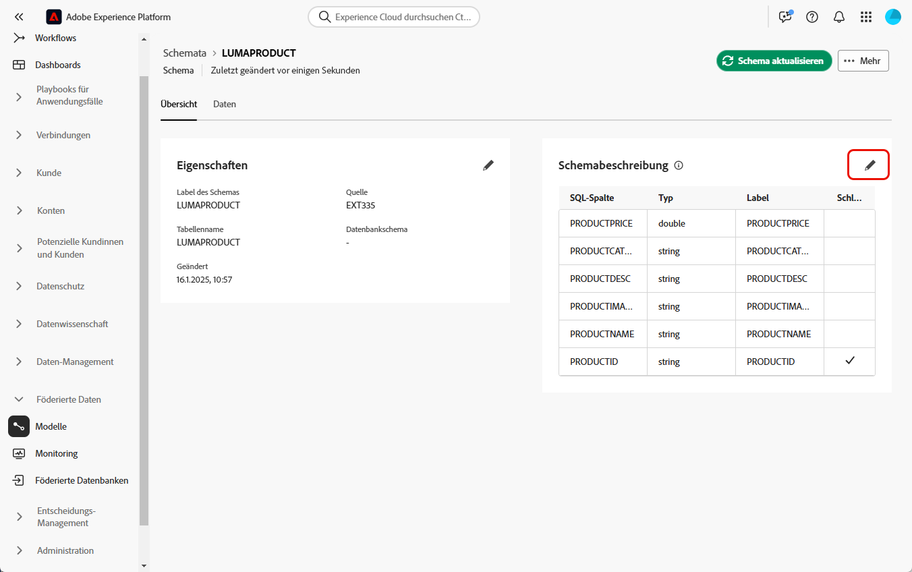

# Erste Schritte mit Schemata {#schemas}

>[!AVAILABILITY]
>
>Um auf Schemata zugreifen zu können, benötigen Sie eine der folgenden Berechtigungen:
>
>-**Föderiertes Schema verwalten**
>&#x200B;>-**Föderiertes Schema anzeigen**
>
>Weitere Informationen zu den erforderlichen Berechtigungen finden Sie im [Handbuch zur Zugriffssteuerung](/help/governance-privacy-security/access-control.md).

>[!CONTEXTUALHELP]
>id="dc_schema_create_select_tables"
>title="Tabellen auswählen"
>abstract="Die Tabellen auswählen, die für das Datenmodell hinzugefügt werden sollen."

>[!CONTEXTUALHELP]
>id="dc_schema_create_key"
>title="Schlüssel"
>abstract="Einen Schlüssel für die Datenabstimmung auswählen."

>[!CONTEXTUALHELP]
>id="dc_schema_create_schema_name"
>title="Name des Schemas"
>abstract="Den Namen des Schemas eingeben."

>[!CONTEXTUALHELP]
>id="dc_schema_edit_description"
>title="Beschreibung des Schemas"
>abstract="Die Beschreibung des Schemas listet Spalten, Typen und Bezeichnungen auf. Man kann auch den Abstimmschlüssel für das Schema überprüfen. Um die Definition des Schemas zu aktualisieren, auf das Stiftsymbol klicken."

>[!CONTEXTUALHELP]
>id="dc_schema_filter_sources"
>title="Quelldatenbank zum Filtern auswählen"
>abstract="Sie können die Schemata nach ihrer Quelle filtern. Wählen Sie eine oder mehrere föderierte Datenbanken aus, um deren Schemata anzuzeigen."

## Was ist ein Schema {#schema-start}

Ein Schema ist eine Darstellung einer Tabelle Ihrer Datenbank. Es ist ein Objekt innerhalb der Anwendung, das definiert, wie die Daten mit Datenbanktabellen verknüpft werden.

Durch Erstellung eines Schemas können Sie eine Darstellung Ihrer Tabelle in der Komposition föderierter Zielgruppen in Experience Platform definieren:

* Geben Sie einen Anzeigenamen und eine gute Beschreibung ein, um das Verständnis für Benutzende zu erleichtern
* Bestimmen Sie die Sichtbarkeit der einzelnen Felder entsprechend ihrer tatsächlichen Verwendung.
* Wählen Sie den Primärschlüssel, um die Schemata untereinander zu verknüpfen, wie es im [Datenmodell](../data-management/gs-models.md#data-model-start) erforderlich ist.

>[!CAUTION]
>
>Wenn Sie mehrere Sandboxes mit derselben Datenbank verbinden, müssen Sie unterschiedliche Arbeitsschemata verwenden.
>

## Erstellen eines Schemas {#schema-create}

Gehen Sie wie folgt vor, um Schemata in der Komposition föderierter Zielgruppen zu erstellen:

1. Rufen Sie im Abschnitt **[!UICONTROL Föderierte Daten]** das Menü **[!UICONTROL Modelle]** auf. Navigieren Sie zur Registerkarte **[!UICONTROL Schema]** und klicken Sie auf **[!UICONTROL Schema erstellen]**.

   {zoomable="yes"}

   Mit diesem Schritt erhalten Sie Zugang zu einem neuen Bildschirm mit einer Dropdown-Liste, in der Sie die mit Ihrer Umgebung verbundene(n) Datenbank(en) finden. Weiterführende Informationen zur Verbindung von Datenbanken finden Sie in [diesem Abschnitt](../connections/connections.md#connections-fdb)

1. Wählen Sie Ihre Quelldatenbank in der Liste aus und klicken Sie auf **[!UICONTROL Weiter]**.

   {zoomable="yes"}

   Anschließend sehen Sie die Liste aller Tabellen in der Datenbank.

1. Wählen Sie die Tabellen aus, für die dieses Schema erstellt werden soll.

1. Jede ausgewählte Tabelle generiert ein Schema mit den ausgewählten Spalten. Konfigurieren Sie das Schema und seine Spalten nach Bedarf.

   {zoomable="yes"}

   Für jede Tabelle können Sie folgende Vorgänge durchführen:

   * Ändern des Schema-Labels
   * Hinzufügen einer Beschreibung
   * Umbenennen aller Feldtitel und Festlegen ihrer Sichtbarkeit
   * Auswählen des Primärschlüssels des Schemas

   Das Schema kann wie folgt definiert werden:

   

1. Klicken Sie nach Abschluss der Konfiguration auf **[!UICONTROL Fertig]**.

## Bearbeiten eines Schemas {#schema-edit}

Gehen Sie wie folgt vor, um ein Schema zu bearbeiten:

1. Greifen Sie auf Ihr zuvor erstelltes Schema zu.

1. Klicken Sie auf die Schaltfläche **[!UICONTROL Bearbeiten]**.

   {zoomable="yes"}

1. Im Fenster **[!UICONTROL Schemabearbeitung]** können Sie auf die gleichen Optionen zugreifen und sie konfigurieren wie beim [Erstellen eines Schemas](#schema-create).

   {zoomable="yes"}

## Vorschau von Daten in einem Schema {#schema-preview}

Um eine Vorschau der Daten in der Tabelle anzuzeigen, die durch Ihr Schema dargestellt wird, gehen Sie zur Registerkarte **[!UICONTROL Daten]**, wie unten dargestellt.

Klicken Sie auf den Link **[!UICONTROL Berechnen]**, um eine Vorschau der Gesamtzahl der Aufzeichnungen anzuzeigen.

{zoomable="yes"}

Klicken Sie auf die Schaltfläche **[!UICONTROL Spalten konfigurieren]**, um die Datenanzeige zu ändern.

{zoomable="yes"}

## Aktualisieren eines Schemas {#schema-refresh}

Tabellen in einer föderierten Datenbank können aktualisiert, hinzugefügt oder entfernt werden. Sie müssen dann das Schema in Adobe Experience Platform aktualisieren, um es an die neuesten Änderungen anzupassen. Klicken Sie dazu auf die drei Punkte neben dem Namen des zu aktualisierenden Schemas und wählen Sie **Schema aktualisieren** aus.

Sie können die Schemadefinition auch bei der Bearbeitung aktualisieren.

{zoomable="yes"}

## Löschen eines Schemas {#schema-delete}

Klicken Sie zum Löschen eines Schemas auf die Schaltfläche **[!UICONTROL Mehr]** und dann auf **[!UICONTROL Löschen]**.

{zoomable="yes"}
