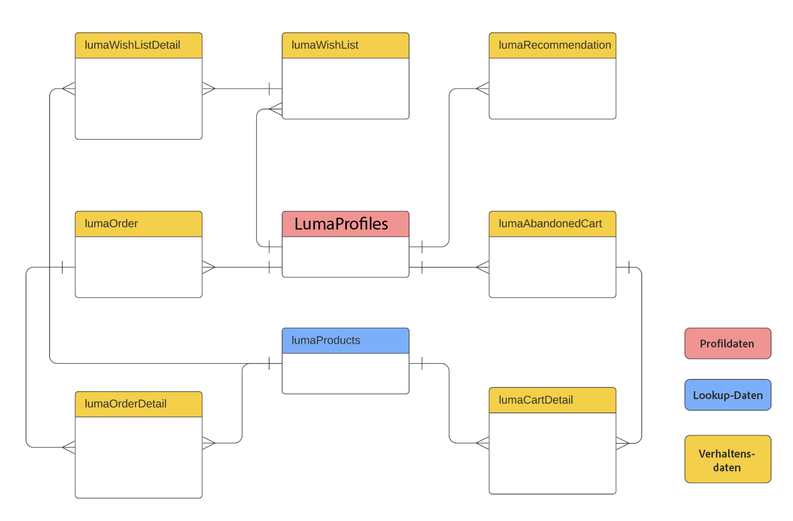
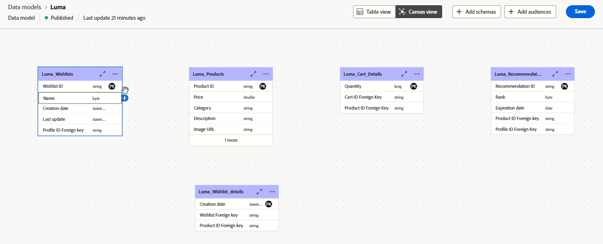
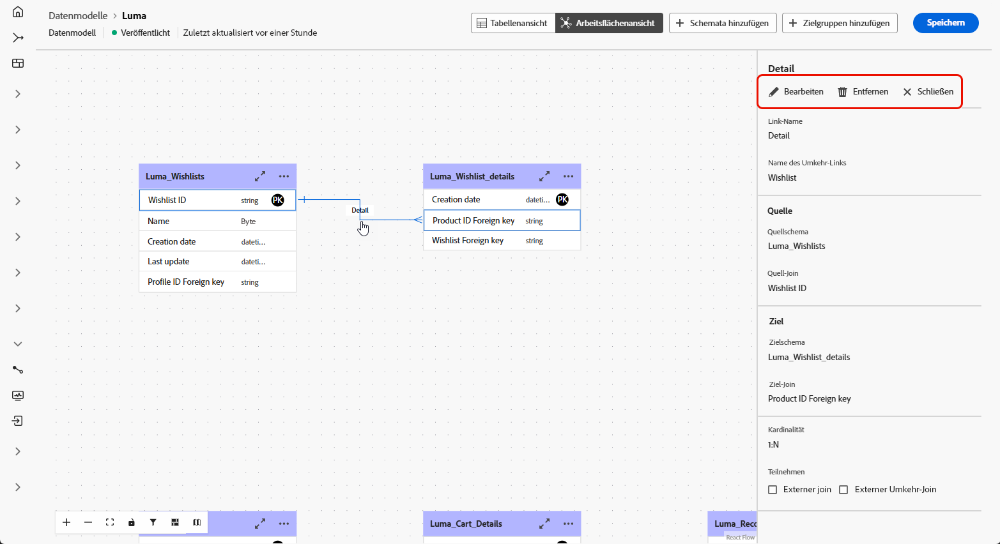

# Erste Schritte mit Datenmodellen {#data-model-beta}

>[!AVAILABILITY]
>
>Datenmodell mit Arbeitsfläche -Ansicht ist derzeit nur als Beta-Version für ausgewählte Benutzer verfügbar.

## Was ist ein Datenmodell? {#data-model-start}

Ein Datenmodell ist ein Satz von Schemata, Zielgruppen und den Verknüpfungen zwischen ihnen. Es wird verwendet, um Zielgruppen mit Daten aus Datenbanken zu verbinden.

Weitere Informationen zu [Schemata](../customer/schemas.md#schema-start) und [Audiences](../start/audiences.md).

Unten sehen Sie beispielsweise die Darstellung eines Datenmodells: die Tabellen mit ihrem Namen und die Verknüpfungen zwischen ihnen.

{zoomable="yes"}

In der Komposition föderierter Zielgruppen können zahlreiche Datenmodelle erstellt werden.

Die Erstellung erfolgt anhand des Anwendungsbeispiels: Sie wählen die erforderlichen Tabellen aus und verknüpfen sie entsprechend Ihren Anforderungen.

## Erstellen eines Datenmodells {#data-model-create}

Gehen Sie wie folgt vor, um ein Datenmodell zu erstellen:

1. Rufen Sie im **[!UICONTROL Federated Data]** das Menü **[!UICONTROL Modelle]** auf und navigieren Sie zur Registerkarte **[!UICONTROL Datenmodell]** .

   Klicken Sie auf die **[!UICONTROL Datenmodell erstellen]**.

   {zoomable="yes"}

1. Definieren Sie den Namen Ihres Datenmodells und klicken Sie auf die Schaltfläche **[!UICONTROL Erstellen]**.

1. Klicken Sie im Dashboard Ihres Datenmodells auf **[!UICONTROL Schemata hinzufügen]**, um das mit Ihrem Datenmodell verknüpfte Schema auszuwählen.

   {zoomable="yes"}

1. Klicken Sie **[!UICONTROL Zielgruppen hinzufügen]**, um Ihre Zielgruppen zu definieren.

1. Stellen Sie Verbindungen zwischen Tabellen in Ihrem Datenmodell her, um genaue Datenbeziehungen sicherzustellen. [Weitere Informationen](#data-model-links)

1. Klicken Sie nach Abschluss der Konfiguration auf **[!UICONTROL Speichern]**, um Ihre Änderungen anzuwenden.

## Links erstellen {#data-model-links}

>[!BEGINTABS]

>[!TAB Tabellenansicht]

Gehen Sie wie folgt vor, um auf der Registerkarte „Tabellenansicht“ Verknüpfungen zwischen Tabellen Ihres Datenmodells zu erstellen:

1. Klicken Sie auf das Menü **[!UICONTROL Link erstellen]** einer Tabelle oder auf die Schaltfläche **[!UICONTROL Links erstellen]** und wählen Sie die beiden Tabellen aus:

   {zoomable="yes"}

1. Füllen Sie das angegebene Formular aus, um den Link zu definieren:

   {zoomable="yes"}

   **Kardinalität**

   * **1-N**: Eine Entität in der Quelltabelle kann mit mehreren Entitäten in der Zieltabelle in Beziehung stehen, aber eine Entität in der Zieltabelle kann nur maximal mit einer Entität in der Quelltabelle in Beziehung stehen.

   * **N-1**: Eine Entität in der Zieltabelle kann mit mehreren Entitäten in der Quelltabelle in Beziehung stehen, aber eine Entität in der Quelltabelle kann mit höchstens einer Entität in der Zieltabelle in Beziehung stehen.

   * **1-1**: Eine Entität in der Quelltabelle kann maximal mit einer Entität in der Zieltabelle in Beziehung stehen.

Alle für Ihr Datenmodell definierten Links werden wie folgt aufgeführt:

{zoomable="yes"}

>[!TAB Arbeitsflächen-Ansicht]

Gehen Sie wie folgt vor, um auf der Registerkarte „Arbeitsfläche-Ansicht“ Verknüpfungen zwischen Tabellen Ihres Datenmodells zu erstellen:

1. Rufen Sie die Arbeitsfläche der Ansicht Ihres Datenmodells auf und wählen Sie die beiden Tabellen aus, die Sie verknüpfen möchten

1. Klicken Sie auf die Schaltfläche  neben dem Source-Join und ziehen Sie den Pfeil in Richtung Ziel-Join, um die Verbindung herzustellen.

   {zoomable="yes"}

1. Füllen Sie das Formular aus, um den Link zu definieren, und klicken Sie nach der Konfiguration **[!UICONTROL Anwenden]**.

   {zoomable="yes"}

   **Kardinalität**

   * **1-N**: Eine Entität in der Quelltabelle kann mit mehreren Entitäten in der Zieltabelle in Beziehung stehen, aber eine Entität in der Zieltabelle kann nur maximal mit einer Entität in der Quelltabelle in Beziehung stehen.

   * **N-1**: Eine Entität in der Zieltabelle kann mit mehreren Entitäten in der Quelltabelle in Beziehung stehen, aber eine Entität in der Quelltabelle kann mit höchstens einer Entität in der Zieltabelle in Beziehung stehen.

   * **1-1**: Eine Entität in der Quelltabelle kann maximal mit einer Entität in der Zieltabelle in Beziehung stehen.

1. Alle im Datenmodell definierten Links werden in der Arbeitsfläche als Pfeile dargestellt. Klicken Sie auf einen Pfeil zwischen zwei Tabellen, um Details anzuzeigen, Änderungen vorzunehmen oder den Link nach Bedarf zu entfernen.

   {zoomable="yes"}

1. Verwenden Sie die Symbolleiste, um die Arbeitsfläche anzupassen und anzupassen.

   

   * **[!UICONTROL Einzoomen]**: Vergrößern Sie die Arbeitsfläche, um Details zu Ihrem Datenmodell deutlicher zu sehen.
   * **[!UICONTROL Verkleinern]**: Verkleinern Sie die Arbeitsfläche, um eine breitere Ansicht Ihres Datenmodells zu erhalten.
   * **[!UICONTROL Ansicht anpassen]**: Passen Sie den Zoom an alle Schemata und/oder Zielgruppen im sichtbaren Bereich an.
   * **[!UICONTROL Interaktivität ein/aus]**: Aktivieren oder Deaktivieren der Benutzerinteraktion mit der Arbeitsfläche.
   * **[!UICONTROL Filter]**: Wählen Sie aus, welches Schema auf der Arbeitsfläche angezeigt werden soll.
   * **[!UICONTROL Automatisches Layout erzwingen]**: Automatische Anordnung von Schemata und/oder Audiences zur besseren Organisation.

>[!ENDTABS]

## Anleitungsvideo {#data-model-video}

In diesem Video erfahren Sie, wie Sie ein Datenmodell erstellen:

>[!VIDEO](https://video.tv.adobe.com/v/3432020)
