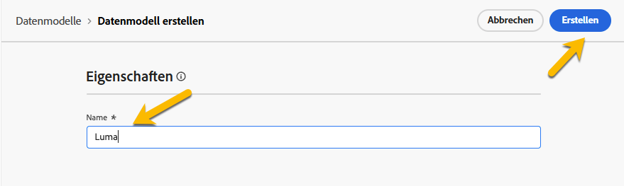
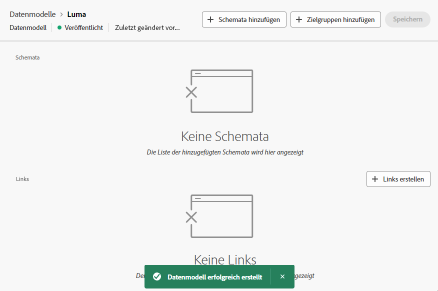

# Erste Schritte mit Datenmodellen {#data-model}

>[!CONTEXTUALHELP]
>id="dc_model_menu"
>title="Arbeiten mit Modellen"
>abstract="Dieser Bildschirm enthält eine Liste der Schemata und Datenmodelle. Sie können Schemata und Datenmodelle über die Schaltfläche **Erstellen** erstellen."

>[!CONTEXTUALHELP]
>id="dc_datamodel_add_schema"
>title="Schemata auswählen"
>abstract="Wählen Sie die Schemata für das Datenmodell aus."

>[!CONTEXTUALHELP]
>id="dc_datamodel_add_audience"
>title="Zielgruppe auswählen"
>abstract="Wählen Sie die Zielgruppe für das Datenmodell aus."

>[!CONTEXTUALHELP]
>id="dc_datamodel_properties"
>title="Datenmodelleigenschaften"
>abstract="Geben Sie den Titel des Datenmodells ein."

## Was ist ein Datenmodell? {#data-model-start}

Ein Datenmodell ist ein Satz von Schemas, Zielgruppen und Verknüpfungen zwischen ihnen.

Weitere Informationen [Schemas](../customer/schemas.md).

Weitere Informationen [Zielgruppen](../customer/audiences.md).

## Wie erstelle ich ein Datenmodell? {#data-model-create}

In **[!UICONTROL FEDERATED DATA]** im Abschnitt **[!UICONTROL Modelle]** -Link. Dort finden Sie die **[!UICONTROL Datenmodell]** Registerkarte.

{zoomable="yes"}

Durch Klicken auf die **[!UICONTROL Datenmodell erstellen]** -Schaltfläche können Sie Ihr Datenmodell benennen und auf die **[!UICONTROL Erstellen]** Schaltfläche.

{zoomable="yes"}

Sie gelangen in das Fenster, in dem Sie die Schemas, die Zielgruppen und die Links Ihres Datenmodells hinzufügen können.

{zoomable="yes"}

{zoomable="yes"}

