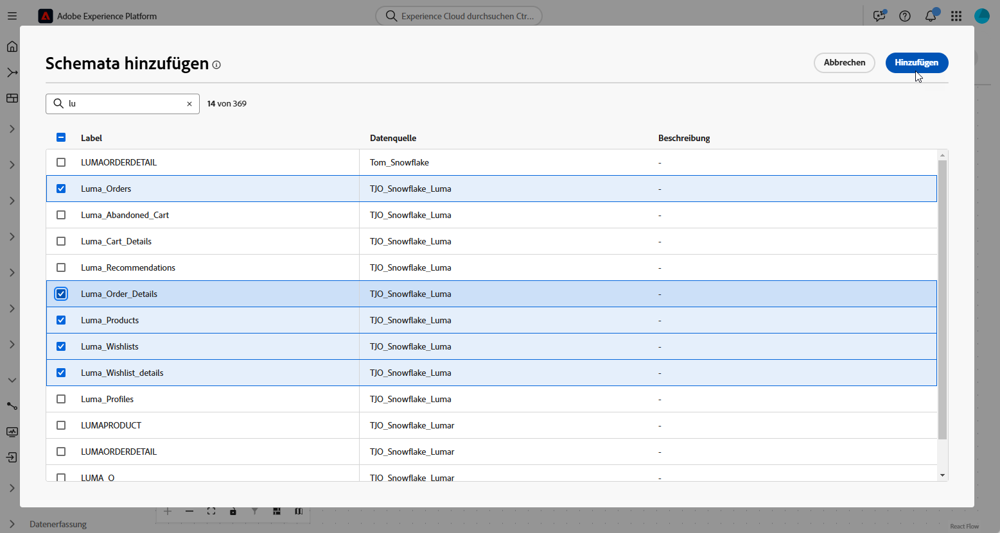

# Erste Schritte mit Datenmodellen {#data-model}

>[!CONTEXTUALHELP]
>id="dc_model_menu"
>title="Arbeiten mit Modellen"
>abstract="Dieser Bildschirm enthält eine Liste der Schemata und Datenmodelle. Schemata und Datenmodelle können über die Schaltfläche **Erstellen** erstellt werden."

>[!CONTEXTUALHELP]
>id="dc_datamodel_add_schema"
>title="Schemata auswählen"
>abstract="Die Schemata für das Datenmodell auswählen."

>[!CONTEXTUALHELP]
>id="dc_datamodel_add_audience"
>title="Zielgruppe auswählen"
>abstract="Wählen Sie die Zielgruppe für das Datenmodell aus."

>[!CONTEXTUALHELP]
>id="dc_datamodel_properties"
>title="Datenmodelleigenschaften"
>abstract="Label des Datenmodells eingeben."

## Was ist ein Datenmodell? {#data-model-start}

Ein Datenmodell ist ein Satz von Schemata, Zielgruppen und den Verknüpfungen zwischen ihnen. Es wird verwendet, um Zielgruppen mit Daten aus Datenbanken zu verbinden.

Weitere Informationen zu [Schemata](../customer/schemas.md#schema-start).

Weitere Informationen zu [Zielgruppen](../start/audiences.md).

Unten sehen Sie beispielsweise die Darstellung eines Datenmodells: die Tabellen mit ihrem Namen und die Verknüpfungen zwischen ihnen.

{zoomable="yes"}

In der Komposition föderierter Zielgruppen können zahlreiche Datenmodelle erstellt werden.

Die Erstellung erfolgt anhand des Anwendungsbeispiels: Sie wählen die erforderlichen Tabellen aus und verknüpfen sie entsprechend Ihren Anforderungen.

## Erstellen eines Datenmodells {#data-model-create}

Gehen Sie wie folgt vor, um ein Datenmodell zu erstellen:

1. Greifen Sie im Abschnitt **[!UICONTROL Föderierte Daten]** auf das Menü **[!UICONTROL Modelle]** zu und gehen Sie zur Registerkarte **[!UICONTROL Datenmodell]**.

   Klicken Sie auf die Schaltfläche **[!UICONTROL Datenmodell erstellen]**.

   {zoomable="yes"}

1. Definieren Sie den Namen Ihres Datenmodells und klicken Sie auf die Schaltfläche **[!UICONTROL Erstellen]**.

1. Klicken Sie im Dashboard Ihres Datenmodells auf **[!UICONTROL Schemata hinzufügen]**, um das mit Ihrem Datenmodell verknüpfte Schema auszuwählen.

   {zoomable="yes"}

1. Klicken Sie auf **[!UICONTROL Zielgruppen hinzufügen]**, um Ihre Zielgruppen zu definieren.

1. Stellen Sie Verbindungen zwischen Tabellen in Ihrem Datenmodell her, um genaue Datenbeziehungen sicherzustellen. [Weitere Informationen](#data-model-links)

1. Klicken Sie nach Abschluss der Konfiguration auf **[!UICONTROL Speichern]**, um Ihre Änderungen anzuwenden.

## Erstellen von Links {#data-model-links}

Gehen Sie wie folgt vor, um Links zwischen Tabellen Ihres Datenmodells zu erstellen:

1. Klicken Sie auf das Menü **[!UICONTROL Link erstellen]** einer Tabelle oder auf die Schaltfläche **[!UICONTROL Links erstellen]** und wählen Sie die beiden Tabellen aus:

   {zoomable="yes"}

1. Füllen Sie das angegebene Formular aus, um den Link zu definieren:

   {zoomable="yes"}

   **Kardinalität**

   * **1:N**: Eine Entität in der Quelltabelle kann mit mehreren Entitäten in der Zieltabelle in Beziehung stehen, aber eine Entität in der Zieltabelle kann nur maximal mit einer Entität in der Quelltabelle in Beziehung stehen.

   * **N:1**: Eine Entität in der Zieltabelle kann mit mehreren Entitäten in der Quelltabelle in Beziehung stehen, aber eine Entität in der Quelltabelle kann nur maximal mit einer Entität in der Zieltabelle in Beziehung stehen.

   * **1:1**: Eine Entität in der Quelltabelle kann maximal mit einer Entität in der Zieltabelle in Beziehung stehen.

Alle für Ihr Datenmodell definierten Links werden wie folgt aufgeführt:

{zoomable="yes"}

## Anleitungsvideo {#data-model-video}

In diesem Video erfahren Sie, wie Sie ein Datenmodell erstellen:

>[!VIDEO](https://video.tv.adobe.com/v/3432020)
