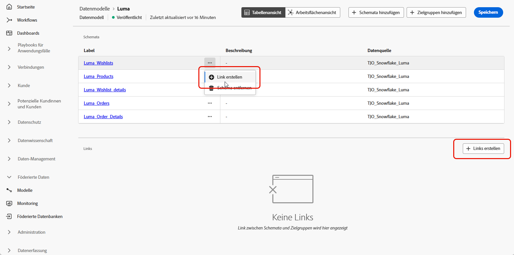

# Erste Schritte mit Datenmodellen {#data-model}

>[!CONTEXTUALHELP]
>id="dc_model_menu"
>title="Arbeiten mit Modellen"
>abstract="Dieser Bildschirm enthält eine Liste der Schemata und Datenmodelle. Sie können Schemata und Datenmodelle über die Schaltfläche **Erstellen** erstellen."

>[!CONTEXTUALHELP]
>id="dc_datamodel_add_schema"
>title="Schemata auswählen"
>abstract="Wählen Sie die Schemata für das Datenmodell aus."

>[!CONTEXTUALHELP]
>id="dc_datamodel_add_audience"
>title="Zielgruppe auswählen"
>abstract="Wählen Sie die Zielgruppe für das Datenmodell aus."

>[!CONTEXTUALHELP]
>id="dc_datamodel_properties"
>title="Datenmodelleigenschaften"
>abstract="Geben Sie den Titel des Datenmodells ein."

## Was ist ein Datenmodell? {#data-model-start}

Ein Datenmodell ist ein Satz von Schemas, Zielgruppen und Verknüpfungen zwischen ihnen.

Erfahren Sie mehr über [Schemas](../customer/schemas.md#schema-start).

Erfahren Sie mehr über [Zielgruppen](../start/audiences.md).

## Erstellen eines Datenmodells {#data-model-create}

Wechseln Sie im Abschnitt **[!UICONTROL FEDERATED DATA]** in den Link **[!UICONTROL Modelle]** . Dort finden Sie die Registerkarte **[!UICONTROL Datenmodell]** .

{zoomable="yes"}

Durch Klicken auf die Schaltfläche **[!UICONTROL Datenmodell erstellen]** können Sie Ihr Datenmodell benennen und auf die Schaltfläche **[!UICONTROL Erstellen]** klicken.

{zoomable="yes"}

Sie gelangen in das Fenster, in dem Sie die Schemas, die Zielgruppen und die Links Ihres Datenmodells hinzufügen können.

{zoomable="yes"}

{zoomable="yes"}

### Links erstellen {#data-model-links}

Das Erstellen von Relationen zwischen Tabellen Ihres Datenmodells kann auf zwei Arten durchgeführt werden:
- Klicken Sie direkt auf das Menü **[!UICONTROL Link erstellen]** einer der Tabellen.
- Klicken Sie auf die Schaltfläche **[!UICONTROL Links erstellen]** und wählen Sie die beiden Tabellen aus.

{zoomable="yes"}

Füllen Sie das angegebene Formular aus, um den Link zu definieren:

{zoomable="yes"}

Alle für Ihr Datenmodell definierten Links werden wie folgt aufgeführt:

{zoomable="yes"}