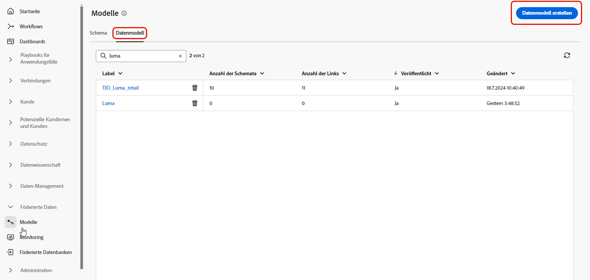

# Erste Schritte mit Datenmodellen {#data-model-beta}

>[!AVAILABILITY]
>
>Um auf Datenmodelle zugreifen zu können, benötigen Sie eine der folgenden Berechtigungen:
>
>-**Föderiertes Datenmodell verwalten**
>>-**Föderiertes Datenmodell anzeigen**
>
>Weitere Informationen zu den erforderlichen Berechtigungen finden Sie im [Handbuch zur Zugriffssteuerung](/help/governance-privacy-security/access-control.md).

## Was ist ein Datenmodell? {#data-model-start}

Ein Datenmodell ist ein Satz von Schemata, Zielgruppen und den Verknüpfungen zwischen ihnen. Es wird verwendet, um Zielgruppen mit Daten aus Datenbanken zu verbinden.

Bei der Komposition föderierter Zielgruppen können Sie Datenmodelle direkt in der Arbeitsflächenansicht erstellen und verwalten. Dazu gehört das Hinzufügen von Schemata und Zielgruppen sowie das Definieren der Verknüpfungen zwischen ihnen auf Grundlage Ihres Anwendungsfalls.

Weitere Informationen zu [Schemata](../customer/schemas.md#schema-start) und [Zielgruppen](../start/audiences.md).

Unten sehen Sie beispielsweise die Darstellung eines Datenmodells: die Tabellen mit ihrem Namen und die Verknüpfungen zwischen ihnen.

{zoomable="yes"}

## Erstellen eines Datenmodells {#data-model-create}

Gehen Sie wie folgt vor, um ein Datenmodell zu erstellen:

1. Greifen Sie im Abschnitt **[!UICONTROL Föderierte Daten]** auf das Menü **[!UICONTROL Modelle]** zu und gehen Sie zur Registerkarte **[!UICONTROL Datenmodell]**.

   Klicken Sie auf die Schaltfläche **[!UICONTROL Datenmodell erstellen]**.

   {zoomable="yes"}

1. Definieren Sie den Namen Ihres Datenmodells und klicken Sie auf die Schaltfläche **[!UICONTROL Erstellen]**.

1. Klicken Sie im Dashboard Ihres Datenmodells auf **[!UICONTROL Schemata hinzufügen]**, um das mit Ihrem Datenmodell verknüpfte Schema auszuwählen.

   {zoomable="yes"}

1. Außerdem können Sie Zielgruppen zu Ihrem Datenmodell hinzufügen. Wählen Sie **[!UICONTROL Zielgruppen hinzufügen]** aus, um Ihre Zielgruppen zu definieren.

   {zoomable="yes"}

1. Stellen Sie Verbindungen zwischen Tabellen in Ihrem Datenmodell her, um genaue Datenbeziehungen sicherzustellen. [Weitere Informationen](#data-model-links)

1. Klicken Sie nach Abschluss der Konfiguration auf **[!UICONTROL Speichern]**, um Ihre Änderungen anzuwenden.

## Erstellen von Links {#data-model-links}

>[!BEGINTABS]

>[!TAB Tabellenansicht]

Gehen Sie wie folgt vor, um Links zwischen Tabellen Ihres Datenmodells über die Registerkarte „Tabellenansicht“ zu erstellen:

1. Klicken Sie auf das Menü **[!UICONTROL Link erstellen]** einer Tabelle oder auf die Schaltfläche **[!UICONTROL Links erstellen]** und wählen Sie die beiden Tabellen aus:

   {zoomable="yes"}

1. Füllen Sie das angegebene Formular aus, um den Link zu definieren:

   {zoomable="yes"}

   **Kardinalität**

   * **1:N**: Eine Entität in der Quelltabelle kann mit mehreren Entitäten in der Zieltabelle in Beziehung stehen, aber eine Entität in der Zieltabelle kann nur maximal mit einer Entität in der Quelltabelle in Beziehung stehen.

   * **N:1**: Eine Entität in der Zieltabelle kann mit mehreren Entitäten in der Quelltabelle in Beziehung stehen, aber eine Entität in der Quelltabelle kann nur maximal mit einer Entität in der Zieltabelle in Beziehung stehen.

   * **1:1**: Eine Entität in der Quelltabelle kann maximal mit einer Entität in der Zieltabelle in Beziehung stehen.

Alle für Ihr Datenmodell definierten Links werden wie folgt aufgeführt:

{zoomable="yes"}

>[!TAB Arbeitsflächenansicht]

Gehen Sie wie folgt vor, um Links zwischen Tabellen Ihres Datenmodells über die Registerkarte „Arbeitsflächenansicht“ zu erstellen:

1. Rufen Sie die Arbeitsflächenansicht Ihres Datenmodells auf und wählen Sie die beiden Tabellen aus, die Sie verknüpfen möchten.

1. Klicken Sie auf die Schaltfläche  neben dem Quellen-Join und ziehen Sie den Pfeil in Richtung Ziel-Join, um die Verbindung herzustellen.

   {zoomable="yes"}

1. Füllen Sie das angegebene Formular aus, um den Link zu definieren, und klicken Sie nach der Konfiguration auf **[!UICONTROL Anwenden]**.

   {zoomable="yes"}

   **Kardinalität**

   * **1:N**: Eine Entität in der Quelltabelle kann mit mehreren Entitäten in der Zieltabelle in Beziehung stehen, aber eine Entität in der Zieltabelle kann nur maximal mit einer Entität in der Quelltabelle in Beziehung stehen.

   * **N:1**: Eine Entität in der Zieltabelle kann mit mehreren Entitäten in der Quelltabelle in Beziehung stehen, aber eine Entität in der Quelltabelle kann nur maximal mit einer Entität in der Zieltabelle in Beziehung stehen.

   * **1:1**: Eine Entität in der Quelltabelle kann maximal mit einer Entität in der Zieltabelle in Beziehung stehen.

1. Alle in Ihrem Datenmodell definierten Links werden in der Arbeitsflächenansicht als Pfeile dargestellt. Klicken Sie auf einen Pfeil zwischen zwei Tabellen, um je nach Bedarf Details anzuzeigen, Änderungen vorzunehmen oder den Link zu entfernen.

   {zoomable="yes"}

1. Verwenden Sie die Symbolleiste, um die Arbeitsfläche anzupassen.

   

   * **[!UICONTROL Vergrößern]**: Vergrößert die Arbeitsfläche, um Details zu Ihrem Datenmodell deutlicher zu sehen.
   * **[!UICONTROL Verkleinern]**: Verkleinert die Arbeitsfläche, um eine erweiterte Ansicht Ihres Datenmodells zu erhalten.
   * **[!UICONTROL Ansicht anpassen]**: Passt den Zoom so an, dass alle Schemata und/oder Zielgruppen in den sichtbaren Bereich passen.
   * **[!UICONTROL Interaktivität ein/ausschalten]**: Aktiviert oder deaktiviert die Benutzerinteraktion mit der Arbeitsfläche.
   * **[!UICONTROL Filter]**: Wählen Sie aus, welches Schema auf der Arbeitsfläche angezeigt werden soll.
   * **[!UICONTROL Automatisches Layout erzwingen]**: Lassen Sie Schemata und/oder Zielgruppen zur besseren Organisation automatisch anordnen.

>[!ENDTABS]

## Anleitungsvideo {#data-model-video}

In diesem Video erfahren Sie, wie Sie ein Datenmodell erstellen:

>[!VIDEO](https://video.tv.adobe.com/v/3432020)
