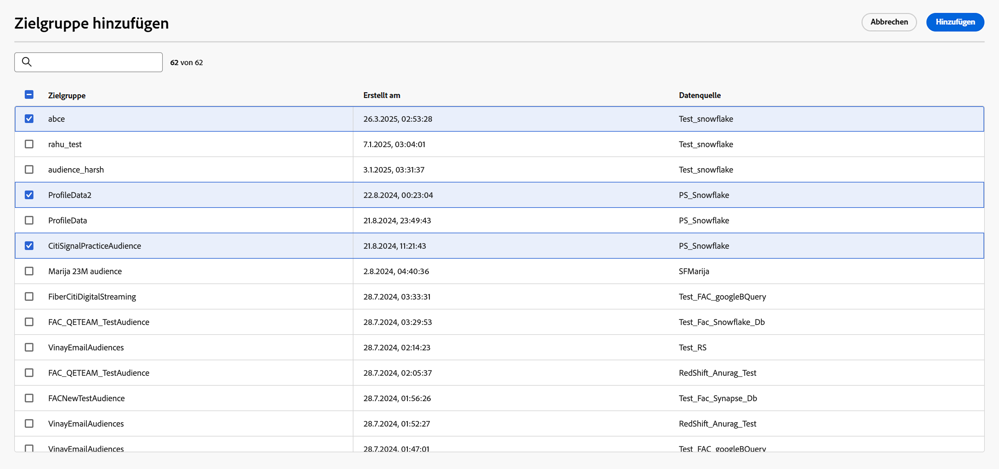
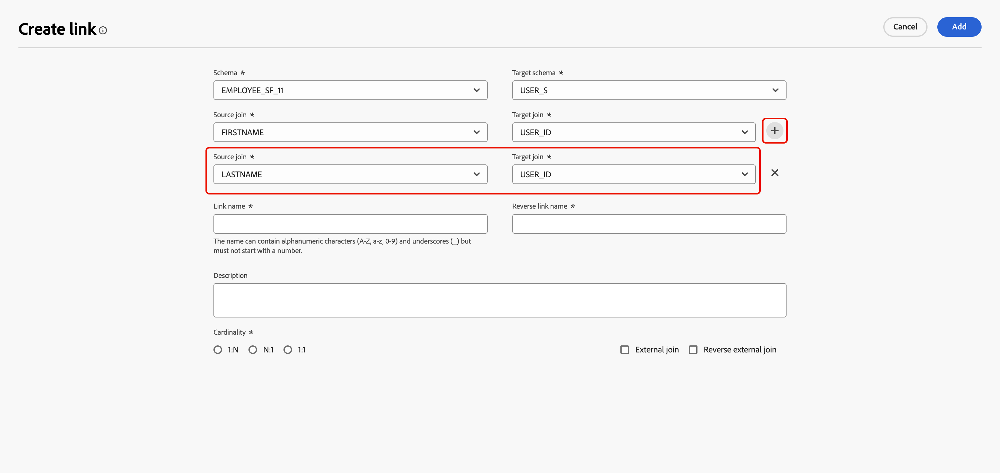

# Erste Schritte mit Datenmodellen {#data-model-beta}

>[!AVAILABILITY]
>
>Um auf Datenmodelle zugreifen zu können, benötigen Sie eine der folgenden Berechtigungen:
>
>-**Föderiertes Datenmodell verwalten**
>>-**Föderiertes Datenmodell anzeigen**
>
>Weitere Informationen zu den erforderlichen Berechtigungen finden Sie im [Handbuch zur Zugriffssteuerung](/help/governance-privacy-security/access-control.md).

## Was ist ein Datenmodell? {#data-model-start}

Ein Datenmodell ist ein Satz von Schemata, Zielgruppen und den Verknüpfungen zwischen ihnen. Es wird verwendet, um Zielgruppen mit Daten aus Datenbanken zu verbinden.

Bei der Komposition föderierter Zielgruppen können Sie Datenmodelle direkt in der Arbeitsflächenansicht erstellen und verwalten. Dazu gehört das Hinzufügen von Schemata und Zielgruppen sowie das Definieren der Verknüpfungen zwischen ihnen auf Grundlage Ihres Anwendungsfalls.

Weitere Informationen zu [Schemata](../customer/schemas.md#schema-start) und [Zielgruppen](../start/audiences.md).

Unten sehen Sie beispielsweise die Darstellung eines Datenmodells: die Tabellen mit ihrem Namen und die Verknüpfungen zwischen ihnen.

{zoomable="yes"}

## Erstellen eines Datenmodells {#data-model-create}

Gehen Sie wie folgt vor, um ein Datenmodell zu erstellen:

1. Greifen Sie im Abschnitt **[!UICONTROL Föderierte Daten]** auf das Menü **[!UICONTROL Modelle]** zu und gehen Sie zur Registerkarte **[!UICONTROL Datenmodell]**.

   Klicken Sie auf **[!UICONTROL Schaltfläche „Datenmodell erstellen]**.

   {zoomable="yes"}

2. Definieren Sie den Namen Ihres Datenmodells und wählen Sie die Schaltfläche **[!UICONTROL Erstellen]** aus.

3. Wählen Sie im Dashboard Ihres Datenmodells die Option **[!UICONTROL Schemata hinzufügen]** aus, um das mit Ihrem Datenmodell verknüpfte Schema auszuwählen.

   {zoomable="yes"}

4. Außerdem können Sie Zielgruppen zu Ihrem Datenmodell hinzufügen. Wählen Sie **[!UICONTROL Zielgruppen hinzufügen]** aus, um Ihre Zielgruppen zu definieren.

   {zoomable="yes"}

5. Stellen Sie Verbindungen zwischen Tabellen in Ihrem Datenmodell her, um genaue Datenbeziehungen sicherzustellen. Weitere Informationen finden Sie im Abschnitt [Erstellen von Links](#data-model-links).

6. Wählen Sie nach Abschluss der Konfiguration **[!UICONTROL Speichern]**, um Ihre Änderungen anzuwenden.

## Erstellen von Links {#data-model-links}

>[!NOTE]
>
>Wenn Sie eine Relation mit mehreren Joins erstellen, können Sie dieselbe Kombination aus Quell- und Zielschemata nur einmal verwenden.

>[!BEGINTABS]

>[!TAB Tabellenansicht]

Gehen Sie wie folgt vor, um auf der Registerkarte „Tabellenansicht“ Verknüpfungen zwischen Tabellen Ihres Datenmodells zu erstellen:

1. Wählen Sie das  gefolgt von **[!UICONTROL Link erstellen]** neben einer der Tabellen aus oder wählen Sie **[!UICONTROL Links erstellen]** im Abschnitt **[!UICONTROL Links]** aus:

   {zoomable="yes"}

2. Füllen Sie das angegebene Formular aus, um den Link zu definieren:

   {zoomable="yes"}

   **Kardinalität**

   * **1:N**: Eine Entität in der Quelltabelle kann mit mehreren Entitäten in der Zieltabelle in Beziehung stehen, aber eine Entität in der Zieltabelle kann nur maximal mit einer Entität in der Quelltabelle in Beziehung stehen.

   * **N:1**: Eine Entität in der Zieltabelle kann mit mehreren Entitäten in der Quelltabelle in Beziehung stehen, aber eine Entität in der Quelltabelle kann nur maximal mit einer Entität in der Zieltabelle in Beziehung stehen.

   * **1:1**: Eine Entität in der Quelltabelle kann maximal mit einer Entität in der Zieltabelle in Beziehung stehen.

   Um einen Link mit mehreren Verknüpfungen zu erstellen, klicken Sie auf das Pluszeichen. Sie können jetzt mehrere Joins zwischen den Schemafeldern erstellen.

   {zoomable="yes"}

Alle für Ihr Datenmodell definierten Links werden wie folgt aufgelistet:

{zoomable="yes"}

>[!TAB Arbeitsflächenansicht]

Gehen Sie wie folgt vor, um auf der Registerkarte „Arbeitsfläche-Ansicht“ Verknüpfungen zwischen Tabellen Ihres Datenmodells zu erstellen:

1. Rufen Sie die Arbeitsflächenansicht Ihres Datenmodells auf und wählen Sie die beiden Tabellen aus, die Sie verknüpfen möchten.

2. Klicken Sie auf die Schaltfläche  neben dem Source-Join und ziehen Sie den Pfeil in Richtung Ziel-Join, um die Verbindung herzustellen.

   {zoomable="yes"}

3. Füllen Sie das Formular aus, um den Link zu definieren, und wählen Sie **[!UICONTROL Anwenden]** aus, sobald er konfiguriert ist.

   {zoomable="yes"}

   **Kardinalität**

   * **1:N**: Eine Entität in der Quelltabelle kann mit mehreren Entitäten in der Zieltabelle in Beziehung stehen, aber eine Entität in der Zieltabelle kann nur maximal mit einer Entität in der Quelltabelle in Beziehung stehen.

   * **N:1**: Eine Entität in der Zieltabelle kann mit mehreren Entitäten in der Quelltabelle in Beziehung stehen, aber eine Entität in der Quelltabelle kann nur maximal mit einer Entität in der Zieltabelle in Beziehung stehen.

   * **1:1**: Eine Entität in der Quelltabelle kann maximal mit einer Entität in der Zieltabelle in Beziehung stehen.

4. Alle in Ihrem Datenmodell definierten Links werden in der Arbeitsflächenansicht als Pfeile dargestellt. Wählen Sie einen Pfeil zwischen zwei Tabellen aus, um Details anzuzeigen, Änderungen vorzunehmen oder die Relation nach Bedarf zu entfernen.

   {zoomable="yes"}

5. Verwenden Sie die Symbolleiste, um die Arbeitsfläche anzupassen.

   

   * **[!UICONTROL Vergrößern]**: Vergrößert die Arbeitsfläche, um Details zu Ihrem Datenmodell deutlicher zu sehen.
   * **[!UICONTROL Verkleinern]**: Verkleinert die Arbeitsfläche, um eine erweiterte Ansicht Ihres Datenmodells zu erhalten.
   * **[!UICONTROL Ansicht anpassen]**: Passt den Zoom so an, dass alle Schemata und/oder Zielgruppen in den sichtbaren Bereich passen.
   * **[!UICONTROL Interaktivität ein/ausschalten]**: Aktiviert oder deaktiviert die Benutzerinteraktion mit der Arbeitsfläche.
   * **[!UICONTROL Filter]**: Wählen Sie aus, welches Schema auf der Arbeitsfläche angezeigt werden soll.
   * **[!UICONTROL Automatisches Layout erzwingen]**: Lassen Sie Schemata und/oder Zielgruppen zur besseren Organisation automatisch anordnen.

>[!ENDTABS]

## Anleitungsvideo {#data-model-video}

In diesem Video erfahren Sie, wie Sie ein Datenmodell erstellen:

>[!VIDEO](https://video.tv.adobe.com/v/3432020)
