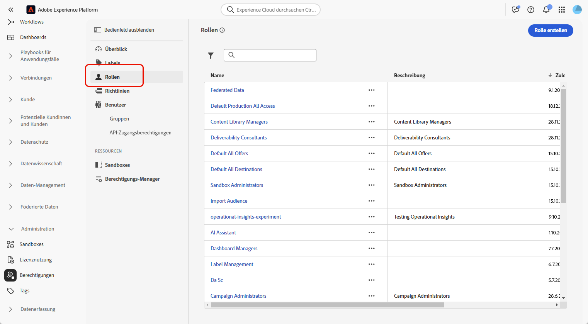
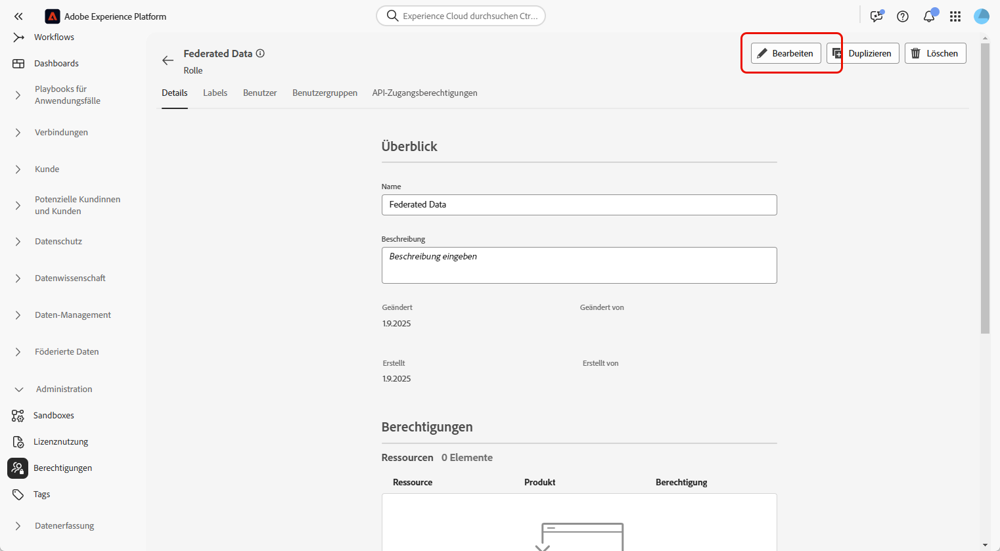
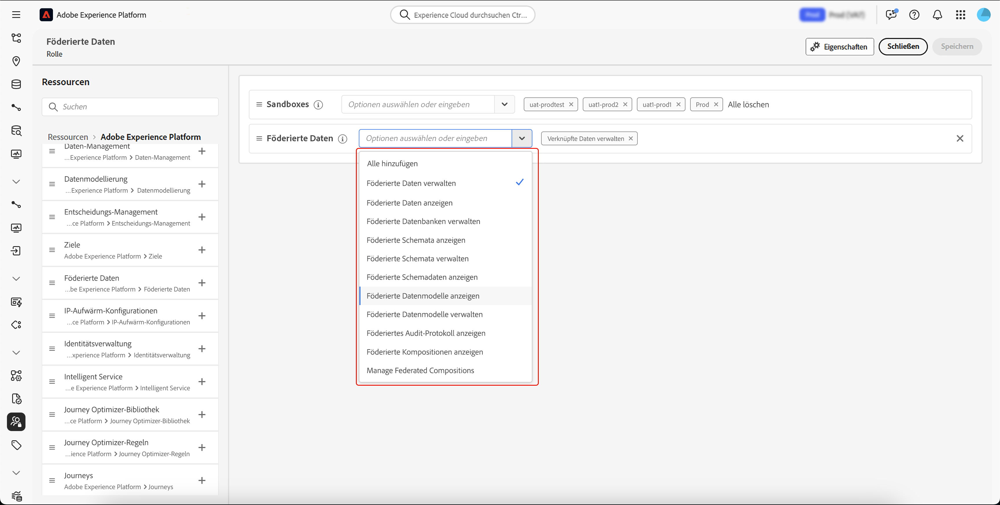
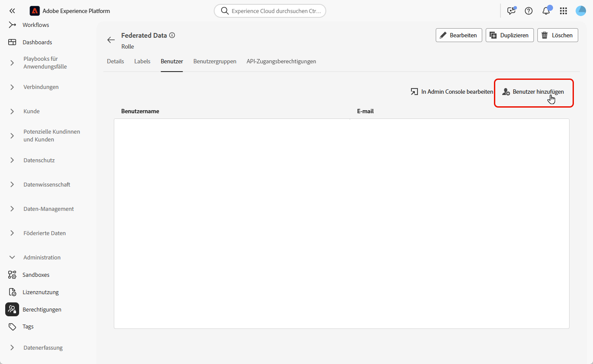

# Zugriffssteuerung in der Komposition föderierter Zielgruppen

Sie können die Zugriffssteuerung nutzen, um rollenbasierten Zugriff auf Sandboxes und die Komposition föderierter Zielgruppen bereitzustellen.

## Verwalten des Zugriffs auf Sandboxes {#access-sandboxes}

Wenn Sie die Komposition föderierter Zielgruppen innerhalb von Adobe Experience Platform erwerben, wird zu diesem Zeitpunkt für jede aktive Sandbox ein Produktprofil erstellt. Dieses Produktprofil wird in der Admin Console unter der Produktkarte **Adobe Experience Platform** erstellt und folgt dieser Namenskonvention: `ACP_FAC - <<SandboxName>> - admin.` Für den Zugriff auf die Komposition föderierter Zielgruppen für eine bestimmte Sandbox müssen Benutzende zum Produktprofil hinzugefügt werden, das für diese Sandbox erstellt wurde.

Wirds beispielsweise eine neue Sandbox mit dem Namen „fac-test“ aktiviert, wird das entsprechende Produktprofil „ACP_FAC – fac-test – admin“ erstellt. Um mit dieser Sandbox auf die Komposition föderierter Zielgruppen zugreifen zu können, müssen Benutzende diesem Produktprofil hinzugefügt werden.

## Verwalten des Zugriffs auf die Komposition föderierter Zielgruppen

Sie können Zugriff verwalten, indem Sie die erforderlichen Berechtigungen für den Zugriff auf verschiedene Aspekte der Komposition föderierter Zielgruppen zuweisen. Diese Berechtigungen müssen mittels Rollen Benutzenden zugewiesen werden, die Zugriff auf die **Komposition föderierter Zielgruppen** benötigen.

>[!NOTE]
>
>Nur Admins können anderen Benutzenden Berechtigungen zuweisen.

1. Navigieren Sie zum Menü **[!UICONTROL Berechtigungen]**.
1. Wählen Sie im Menü **[!UICONTROL Rollen]** die **[!UICONTROL Rolle]** aus, die Sie aktualisieren möchten.

   

1. Wählen Sie **[!UICONTROL Bearbeiten]** aus, um die Berechtigungen Ihrer Rolle zu ändern.

   

1. Fügen Sie die erforderlichen Berechtigungen für die Benutzerin bzw. den Benutzer hinzu. Sie können die folgenden Zugriffsberechtigungen für die Komposition föderierter Zielgruppen hinzufügen:

   | Berechtigung | Beschreibung |
   | ---------- | ----------- |
   | Föderierte Daten verwalten | Verwenden Sie diese Berechtigung, um alle Aspekte der Komposition föderierter Zielgruppen zu verwalten. Diese Berechtigung umfasst die Berechtigungen „Föderierte Datenbank verwalten“, „Föderiertes Schema verwalten“, „Föderiertes Datenmodell verwalten“ und „Föderierte Kompositionen verwalten“. |
   | Föderierte Datenbank verwalten | Verwenden Sie diese Berechtigung, um Verbindungen zu föderierten Datenbanken hinzuzufügen, diese anzuzeigen, zu aktualisieren und zu löschen. |
   | Föderierte Datenbank anzeigen | Verwenden Sie diese Berechtigung, um Ihre Verbindungen zu föderierten Datenbanken anzuzeigen. |
   | Föderiertes Schema verwalten | Verwenden Sie diese Berechtigung, um Schemata zu erstellen, anzuzeigen, zu ändern, zu löschen und zu aktualisieren. |
   | Föderierte Schemadaten anzeigen | Verwenden Sie diese Berechtigung, um die Registerkarte „Daten“ im Abschnitt „Schema“ anzuzeigen. |
   | Föderiertes Schema anzeigen | Verwenden Sie diese Berechtigung, um Schematabellen anzuzeigen. |
   | Föderiertes Datenmodell verwalten | Verwenden Sie diese Berechtigung, um Datenmodelle zu erstellen, anzuzeigen, zu aktualisieren und zu löschen. |
   | Föderiertes Datenmodell anzeigen | Verwenden Sie diese Berechtigung, um Datenmodelle anzuzeigen. |
   | Audit-Protokoll der Föderation anzeigen | Verwenden Sie diese Berechtigung, um das Audit-Protokoll für die Komposition föderierter Zielgruppen anzuzeigen. |
   | Föderierte Kompositionen verwalten | Verwenden Sie diese Berechtigung, um föderierte Kompositionen zu erstellen, anzuzeigen, zu aktualisieren und zu löschen. |
   | Föderierte Kompositionen anzeigen | Verwenden Sie diese Berechtigung, um föderierte Kompositionen anzuzeigen. |

   

1. Nachdem Sie die erforderlichen Änderungen vorgenommen haben, wählen Sie **[!UICONTROL Speichern]** aus.

Für alle Benutzenden, die dieser Rolle bereits zugewiesen sind, werden die Berechtigungen automatisch aktualisiert und sie erhalten Zugriff auf die Komposition föderierter Zielgruppen.

So weisen Sie diese Rolle neuen Benutzenden zu:

1. Navigieren Sie im Dashboard für Ihre Rolle zur Registerkarte **[!UICONTROL Benutzer]** und wählen Sie **[!UICONTROL Benutzer hinzufügen]** aus.

   

1. Geben Sie den Namen oder die E-Mail-Adresse der Person ein oder wählen Sie sie aus der verfügbaren Liste aus. Wenn Sie fertig sind, wählen Sie **[!UICONTROL Speichern]** aus.

Sie können den Benutzenden auch abhängig von den jeweils benötigten Berechtigungen eine der bereits vorhandenen Rollen zuweisen. Weitere Informationen zum Zuweisen bereits vorhandener Rollen zu Benutzenden finden Sie im [Handbuch zur Benutzerverwaltung für ein Produktprofil](https://experienceleague.adobe.com/de/docs/experience-platform/access-control/ui/users).

| Rollenname | Berechtigungen |
| --------- | ----------- |
| Komposition föderierter Zielgruppen – Daten-Managerinnen und -Manager | <ul><li>Föderierte Kompositionen verwalten</li><li>Föderierte Datenbanken anzeigen</li><li>Föderierte Schemata anzeigen</li><li>Föderierte Schemadaten anzeigen</li><li>Föderierte Datenmodelle anzeigen</li></ul> |
| Komposition föderierter Zielgruppen – Kompositions-Managerinnen und -Manager | <ul><li>Föderierte Kompositionen verwalten</li></ul> |
| Komposition föderierter Zielgruppen – Administratorinnen und Administratoren | <ul><li>Föderierte Daten verwalten</li></ul> |

Die Person erhält dann eine E-Mail mit Anweisungen zum Zugriff auf Ihre Instanz. Wenn die Benutzerin bzw. der Benutzer vorher noch nicht erstellt wurde, lesen Sie [diese Dokumentation](https://experienceleague.adobe.com/de/docs/experience-platform/access-control/abac/permissions-ui/users).

## Verwalten von Zugriff auf bestimmte Kompositionen

Sie können den Zugriff auf eine bestimmte Komposition verwalten, indem Sie Zugriffs-Labels anwenden.

Weiterführende Informationen zum Anwenden von Zugriffs-Labels auf eine Komposition finden Sie im Abschnitt [Anwenden von Zugriffs-Labels](/help/compositions/home.md#access-labels) des Kompositionshandbuchs.
