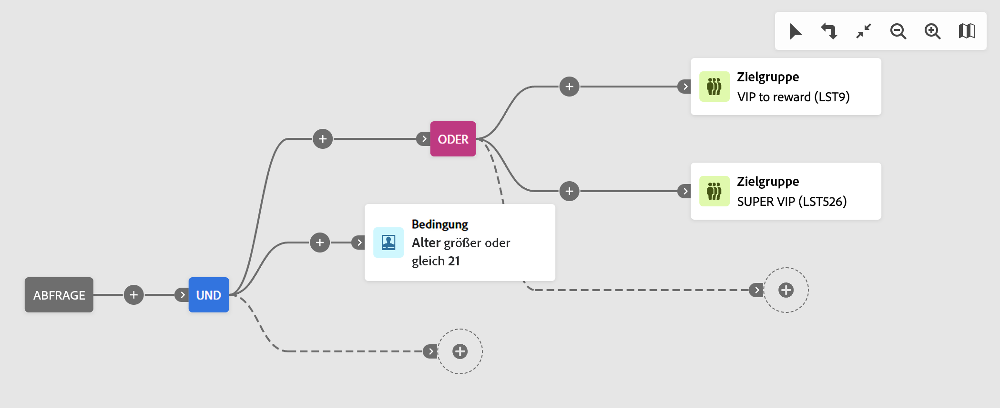

# Erstellen Ihrer ersten Abfrage {#build-query}

Um mit der Erstellung einer Abfrage zu beginnen, greifen Sie je nach der Aktion, die Sie ausführen wollen, vom gewünschten Speicherort aus auf den Abfrage-Modeler zu. Der Abfrage-Modeler wird mit einer leeren Arbeitsfläche geöffnet. Klicken Sie auf die Schaltfläche **+**, um den ersten Knoten der Abfrage zu konfigurieren.

Sie können zwei Elementtypen hinzufügen:

* **Komponenten filtern** (Benutzerdefinierte Bedingung, Zielgruppe auswählen) ermöglicht es Ihnen, eigene Regeln zu erstellen oder eine Zielgruppe auszuwählen, um Ihre Abfrage zu verfeinern. Sie werden zu Beginn Ihrer Abfrage und bei gepunkteten Transitionen hinzugefügt. [Erfahren Sie, wie Sie mit Filterkomponenten arbeiten können](#filtering)

  Beispiel: *Empfängerinnen und Empfänger, die den Newsletter „Sport“ abonniert haben*. *Empfängerinnen und Empfänger mit Wohnsitz in New York*, *Empfängerinnen und Empfänger mit Wohnsitz in San Francisco*

  {zoomable="yes"}

* **Gruppenoperatoren** (UND, ODER, AUSSER) ermöglichen es Ihnen, die Filterkomponenten im Diagramm zu gruppieren. Sie werden bei vorhandenen Transitionen vor einer Filterkomponente hinzugefügt. [Erfahren Sie, wie man mit Operatoren arbeitet](#filtering)

  Beispiel: *Empfängerinnen und Empfänger, die den Newsletter „Sport“ abonniert haben **UND**in New York **ODER**San Francisco leben*

  {zoomable="yes"}

## Hinzufügen von Filterkomponenten {#filtering}

Filterkomponenten ermöglichen es Ihnen, eine Abfrage mithilfe von folgenden Filtern zu verfeinern:

* **[Benutzerdefinierte Bedingungen](#custom-condition)**: Filtern Sie eine Abfrage, indem Sie Ihre eigene Bedingung mit Attributen aus der Datenbank und erweiterten Ausdrücken erstellen.
* **[Zielgruppen](#audiences)**: Filtern Sie eine Abfrage, indem Sie eine vorhandene Zielgruppe verwenden.

### Konfigurieren einer benutzerdefinierten Bedingung {#custom-condition}

>[!CONTEXTUALHELP]
>id="dc_orchestration_querymodeler_customcondition"
>title="Benutzerdefinierte Bedingung"
>abstract="Bei benutzerdefinierten Bedingungen handelt es sich um Filterkomponenten zum Filtern einer Abfrage, mit der Sie Ihre eigene Bedingung mit Attributen aus der Datenbank und erweiterten Ausdrücken erstellen."

Gehen Sie wie folgt vor, um Ihre Abfrage mit einer benutzerdefinierten Bedingung zu filtern:

1. Klicken Sie auf die Schaltfläche **+** auf dem gewünschten Knoten und wählen Sie **[!UICONTROL Benutzerdefinierte Bedingung]** aus. Der Bereich mit den benutzerdefinierten Bedingungseigenschaften wird auf der rechten Seite geöffnet.

1. Wählen Sie im Feld **[!UICONTROL Attribut]** das Attribut aus der Datenbank aus, das Sie zum Erstellen Ihrer Bedingung verwenden möchten. Die Attributliste enthält alle Attribute aus Ihrer Datenbank, einschließlich Attributen aus verknüpften Tabellen.

   {zoomable="yes"}

   >[!NOTE]
   >
   >Über die Schaltfläche **[!UICONTROL Ausdruck bearbeiten]** können Sie den Ausdruckseditor starten, um einen Ausdruck manuell mithilfe von Feldern aus der Datenbank und Hilfsfunktionen zu definieren. [Erfahren Sie, wie Sie Ausdrücke bearbeiten](expression-editor.md)

1. Wählen Sie in der Dropdown-Liste den anzuwendenden Operator aus. Es stehen verschiedene Operatoren zur Verfügung. Beachten Sie, dass die in der Dropdown-Liste verfügbaren Operatoren vom Datentyp des Attributs abhängen.

   +++Liste der verfügbaren Operatoren

   | Operator | Zweck | Beispiel |
   |  ---  |  ---  |  ---  |
   | Gleich | Die zurückgegebenen Daten stimmen vollständig mit dem in der zweiten Spalte angegebenen Wert überein. | Nachname (@lastName) gleich &#39;Müller&#39; gibt nur die Empfängerinnen und Empfänger mit dem Nachnamen „Müller“ unter Beachtung der genauen Schreibung zurück. |
   | Ungleich | Die ausgegebenen Daten unterscheiden sich vom angegebenen Wert. | Sprache (@language) ungleich &#39;Englisch&#39; |
   | Größer als | Die ausgegebenen Daten übersteigen den angegebenen Wert. | Alter (@age) größer als &#39;50&#39;</strong> gibt nur die Werte von mehr als &#39;50&#39; Jahren zurück (also &#39;51&#39;, &#39;52&#39; usw.). |
   | Kleiner als | Der ausgegebene Wert unterschreitet den eingegebenen Wert. | Erstellungsdatum (@created) weniger als &#39;DaysAgo(100)&#39;</strong> gibt alle Kontakte zurück, die vor weniger als 100 Tagen angelegt wurden. |
   | Größer oder gleich | Die ausgegebenen Daten sind identisch mit oder übersteigen den angegebenen Wert. | Alter (@age) größer oder gleich &#39;30&#39;</strong> gibt alle Empfängerinnen und Empfänger ab 30 Jahre zurück. |
   | Kleiner oder gleich | Die ausgegebenen Daten sind identisch mit oder unterschreiten den angegebenen Wert. | Alter (@age) kleiner oder gleich &#39;60&#39;</strong> gibt alle Empfängerinnen und Empfänger unter 60 Jahren zurück. |
   | Eingeschlossen in | Die ausgegebenen Daten sind in den angegebenen Werten enthalten. Die Werte werden durch Kommata getrennt. | Geburtsdatum (@birthDate) ist enthalten in &#39;12/10/1979,12/10/1984&#39; gibt die Empfängerinnen und Empfänger zurück, die zwischen diesen beiden Daten geboren wurden. |
   | Ist nicht enthalten in | Funktioniert wie der Operators „Ist enthalten in“. Die den angegebenen Werten entsprechenden Daten werden aus dem Ergebnis ausgeschlossen. | Das Geburtsdatum (@birthDate) ist nicht in &#39;12/10/1979,12/10/1984&#39; enthalten. Im Gegensatz zum vorherigen Beispiel werden zwischen diesen beiden Daten geborene Empfängerinnen und Empfänger nicht zurückgegeben. |
   | Ist leer | Die ausgegebenen Daten enthalten keinen Wert in der entsprechenden Spalte. | „Mobiltelefon (@mobilePhone) ist leer“ gibt alle Empfängerinnen und Empfänger zurück, die keine Mobiltelefonnummer haben. |
   | Ist nicht leer | Negative Form des Operators „Ist leer“. Es ist nicht nötig, Daten in die zweite Wert-Spalte einzugeben. | E-Mail (@email) ist nicht leer. |
   | Beginnt mit | Die ausgegebenen Daten beginnen mit dem angegebenen Wert. | Kundennummer (@account) beginnt mit &#39;32010&#39;. |
   | Beginnt nicht mit | Die ausgegebenen Daten beginnen nicht mit dem angegebenen Wert. | Kundennummer (@account) beginnt nicht mit &#39;20&#39; |
   | Enthält | Die zurückgegebenen Daten enthalten den angegebenen Wert. | E-Mail-Domain (@domain) enthält &#39;mail&#39;</strong> gibt alle Domain-Namen zurück, die „mail“ enthalten. Die Domain „gmail.com“ wird daher auch zurückgegeben. |
   | Enthält nicht | Die ausgegebenen Daten enthalten den angegebenen Wert nicht. | E-Mail-Domain (@domain) enthält nicht „oo“</strong>. E-Mail-Domains, die den Wert „oo“ enthalten, werden nicht zurückgegeben (z. B. „google.com“ oder „yahoo.de“ zählen nicht zu den Ergebnissen). |
   | Ist wie | „Ist wie“ ist dem Operator „Enthält“ sehr ähnlich. er erlaubt jedoch das Einfügen des Platzhalters „%“ im Wert. | Nachname (@lastName) ist wie &#39;Me%er&#39;. Der Platzhalter wird hier wie ein „Joker“ verwendet. In diesem Fall werden alle Empfängerinnen und Empfänger ausgegeben, deren Nachname z. B. „Meyer“ oder „Meier“ lautet. |
   | Ist nicht wie | „Ist wie“ ist dem Operator „Enthält“ sehr ähnlich. er erlaubt jedoch das Einfügen des Platzhalters „%“ im Wert. | Nachname (@lastName) nicht wie „Schmi%t“. Hier werden die Empfängerinnen und Empfänger, deren Nachname „Schmi%t“ lautet, also etwa „Schmidt“ oder „Schmitt“, nicht zurückgegeben. |

+++

1. Legen Sie im Feld **[!UICONTROL Wert]** den erwarteten Wert fest. Sie können auch den Ausdruckseditor verwenden, um mithilfe von Feldern aus der Datenbank und Hilfsfunktionen manuell einen Ausdruck zu definieren. Klicken Sie dazu auf die Schaltfläche **[!UICONTROL Ausdruck bearbeiten]**. [Erfahren Sie, wie Sie Ausdrücke bearbeiten](expression-editor.md)

   *Abfragebeispiel, in dem alle Profile im Alter von 21 Jahren oder älter zurückgegeben werden:*

   {zoomable="yes"}

#### Benutzerdefinierte Bedingungen für verknüpfte Tabellen (1:1- und 1:n-Relation){#links}

Mit benutzerdefinierten Bedingungen können Sie Tabellen abfragen, die mit der aktuell von Ihrer Regel verwendeten Tabelle verknüpft sind. Dazu gehören Tabellen mit einer 1:1-Relation oder Sammlungstabellen (1:n-Relation).

Navigieren Sie bei einer **1:1-Relation** zur verknüpften Tabelle, wählen Sie das gewünschte Attribut aus und definieren Sie den erwarteten Wert.

Sie können auch direkt eine Tabellenverknüpfung in der Auswahl **[!UICONTROL Wert]** auswählen und bestätigen. In diesem Fall müssen die für die ausgewählte Tabelle verfügbaren Werte mit einer speziellen Auswahl ausgewählt werden, wie im folgenden Beispiel gezeigt.

+++Abfragebeispiel

Hier geht es bei der Abfrage um Marken mit der Bezeichnung „Laufen“.

1. Navigieren Sie durch die Tabelle **[!UICONTROL Marke]** und wählen Sie das Attribut **[!UICONTROL Titel]**.

   {zoomable="yes"}{width="85%" align="center"}

1. Definieren Sie den erwarteten Wert für das Attribut.

   {zoomable="yes"}{width="85%" align="center"}

Hier ist ein Abfragebeispiel, bei dem eine Tabellenverknüpfung direkt ausgewählt wurde. Die verfügbaren Werte für diese Tabelle müssen über eine spezielle Auswahl ausgewählt werden.

{zoomable="yes"}{width="85%" align="center"}

+++

Für eine **1:n-Relation** können Sie Unterbedingungen definieren, um Ihre Abfrage zu verfeinern, wie im folgenden Beispiel gezeigt.

+++Abfragebeispiel

In unserem Beispiel zielt die Abfrage auf Empfängerinnen und Empfänger ab, die im Zusammenhang mit dem BrewMaster-Produkt Einkäufe getätigt haben, und zwar für einen Gesamtbetrag von mindestens 100 USD.

1. Wählen Sie die Tabelle **[!UICONTROL Käufe]** und bestätigen Sie.

   {zoomable="yes"}{width="50%" align="center"}

1. Es wird eine ausgehende Transition hinzugefügt, die die Erstellung von Unterbedingungen ermöglicht.

   {zoomable="yes"}{width="85%" align="center"}

1. Wählen Sie das Attribut **[!UICONTROL Preis]** und Zielkäufe von 1000 USD oder mehr

   {zoomable="yes"}{width="85%" align="center"}

1. Fügen Sie Unterbedingungen hinzu, die Ihren Anforderungen entsprechen. In unserem Beispiel haben wir eine Bedingung für Profile hinzugefügt, die ein BrewMaster-Produkt erworben haben.

   {zoomable="yes"}{width="85%" align="center"}

+++

#### Arbeiten mit aggregierten Daten {#aggregate}

Mit benutzerdefinierten Bedingungen können Sie Aggregierungsvorgänge ausführen. Wählen Sie dazu direkt ein Attribut aus einer Sammlungstabelle aus:

1. Navigieren Sie durch die gewünschte Sammlungstabelle und wählen Sie das Attribut aus, für das Sie einen Aggregierungsvorgang durchführen möchten.

   {zoomable="yes"}{width="85%" align="center"}

1. Aktivieren Sie im Eigenschaften-Fenster die Option **[!UICONTROL Daten aggregieren]** und wählen Sie die gewünschte Aggregierungsfunktion aus.

   {zoomable="yes"}{width="85%" align="center"}

### Zielgruppe auswählen {#audiences}

>[!CONTEXTUALHELP]
>id="dc_orchestration_querymodeler_selectaudience"
>title="Zielgruppe auswählen"
>abstract="Mit der Option **[!UICONTROL Zielgruppe auswählen]** können Sie die Zielgruppe auswählen, die Sie zum Filtern Ihrer Abfrage verwenden möchten."

Gehen Sie wie folgt vor, um Ihre Abfrage mithilfe einer vorhandenen Zielgruppe zu filtern:

1. Klicken Sie auf die Schaltfläche **+** auf dem gewünschten Knoten und wählen Sie **[!UICONTROL Zielgruppe auswählen]** aus.

1. Der Bereich mit den Eigenschaften **[!UICONTROL Zielgruppe auswählen]** wird auf der rechten Seite geöffnet. Wählen Sie die Zielgruppe aus, die Sie zum Filtern Ihrer Abfrage verwenden möchten.

   *Abfragebeispiel, in dem alle Profile der Zielgruppe „Festivalbesuchende“ zurückgegeben werden:*

   {zoomable="yes"}

### Verwenden eines vordefinierten Filters {#predefined-filters}

>[!CONTEXTUALHELP]
>id="dc_orchestration_querymodeler_predefinedfilter"
>title="Vordefinierter Filter"
>abstract="Mit der Option **[!UICONTROL Vordefinierter Filter]** können Sie einen vordefinierten Filter aus der Liste der benutzerdefinierten Filter oder aus den Favoriten auswählen."

Gehen Sie wie folgt vor, um Ihre Abfrage mithilfe eines vordefinierten Filters zu filtern:

1. Klicken Sie auf die Schaltfläche **+** auf dem gewünschten Knoten und wählen Sie **[!UICONTROL Vordefinierter Filter]** aus.

1. Der Bereich mit den Eigenschaften **[!UICONTROL Vordefinierter Filter]** wird auf der rechten Seite geöffnet. Wählen Sie einen Filter aus der Liste der vordefinierten Filter oder aus den Favoriten aus.

   *Abfragebeispiel, in dem alle Profile zurückgegeben werden, die dem vordefinierten Filter „Inaktive Kunden“ entsprechen:*

   {zoomable="yes"}

### Kopieren und Einfügen von Komponenten {#copy}

Mithilfe des Abfrage-Modelers können Sie eine oder mehrere Filterkomponenten kopieren und am Ende einer Transition einfügen. Dieser Vorgang kann in der aktuellen Abfragearbeitsfläche oder in einer beliebigen Arbeitsfläche innerhalb Ihrer Instanz ausgeführt werden.

>[!NOTE]
>
>Die kopierte Auswahl wird beibehalten, solange Sie in Ihrer Instanz arbeiten. Wenn Sie sich abmelden und wieder anmelden, steht Ihre Auswahl nicht mehr zum Einfügen zur Verfügung.

Gehen Sie wie folgt vor, um Filterkomponenten zu kopieren und einzufügen:

1. Klicken Sie in der Abfragearbeitsfläche auf die Filterkomponente, die Sie kopieren möchten. Um mehrere Komponenten auszuwählen, verwenden Sie das Tool zur Mehrfachauswahl in der Symbolleiste oben rechts auf der Arbeitsfläche.

1. Klicken Sie auf die Schaltfläche **[!UICONTROL Kopieren]** im Eigenschaften-Fenster der Komponente oder in der blauen Leiste unten im Bildschirm, wenn Sie mehrere Komponenten ausgewählt haben.

   | Kopieren einer einzelnen Komponente | Kopieren mehrerer Komponenten |
   |  ---  |  ---  |
   | {zoomable="yes"}{width="200" align="center" zoomable="yes"} | {zoomable="yes"}{width="200" align="center" zoomable="yes"} |

1. Um die Komponente(n) einzufügen, klicken Sie auf die Schaltfläche „+“ am Ende der gewünschten Transition und wählen Sie **[!UICONTROL (n) Elemente einfügen]**.

   {zoomable="yes"}

## Kombinieren von Filterkomponenten mit Operatoren {#operators}

>[!CONTEXTUALHELP]
>id="dc_orchestration_querymodeler_group"
>title="Gruppe"
>abstract="In diesem Bereich können Sie den Operator ändern, der zur Verknüpfung der Filterbedingungen verwendet wird."

Jedes Mal, wenn Sie zu Ihrer Abfrage eine neue Filterkomponente hinzufügen, wird diese automatisch durch einen **UND**-Operator mit der anderen Komponente verknüpft. Dadurch werden die Ergebnisse der beiden Filterkomponenten kombiniert.

In diesem Beispiel haben wir für die zweite Transition neue Zielgruppentyp-Filterkomponenten hinzugefügt. Die Komponente ist mit der vordefinierten Filterbedingung durch einen **UND**-Operator verknüpft, d. h., die Abfrageergebnisse enthalten Empfängerinnen und Empfänger, auf die der vordefinierte Filter „Wohnhaft in Madrid“ zutrifft UND die zur Zielgruppe „Rabattjäger“ gehören.

{zoomable="yes"}

Um den Operator für die Verknüpfung der Filterbedingungen zu ändern, klicken Sie darauf und wählen Sie den gewünschten Operator im Bereich **[!UICONTROL Gruppe]** aus, der sich rechts öffnet.

Die folgenden Operatoren sind verfügbar:

* **UND (Schnittmenge)**: Kombiniert Ergebnisse, die allen Filterkomponenten in den ausgehenden Transitionen entsprechen.
* **ODER (Vereinigung)**: Umfasst Ergebnisse, die mindestens einer der Filterkomponenten in den ausgehenden Transitionen entsprechen.
* **AUSSER (Ausschluss)**: Schließt Ergebnisse aus, die allen Filterkomponenten in der ausgehenden Transition entsprechen.

{zoomable="yes"}

Darüber hinaus können Sie Zwischengruppen von Komponenten erstellen, indem Sie auf die Schaltfläche **+** auf einer Transition klicken. Auf diese Weise können Sie einen Operator an dieser bestimmten Stelle hinzufügen, um mehrere Komponenten zu gruppieren und Ihre Abfrage zu verfeinern.

Im folgenden Beispiel haben wir eine Zwischengruppe erstellt, um Ergebnisse aus den Zielgruppen „Zu belohnende VIP“ oder „Super VIP“ einzubeziehen.

{zoomable="yes"}

## Überprüfen und Validieren einer Abfrage

>[!CONTEXTUALHELP]
>id="dc_orchestration_querymodeler_ruleproperties"
>title="Regeleigenschaften"
>abstract="Nachdem Sie Ihre Abfrage auf der Arbeitsfläche erstellt haben, können Sie sie rechts im Bereich **[!UICONTROL Regeleigenschaften]** überprüfen. In diesem Bereich können Sie die resultierenden Daten anzeigen, eine SQL-Code-Version der Abfrage abrufen und die Anzahl der Zieldatensätze überprüfen. Über die Schaltfläche **[!UICONTROL Filter auswählen oder speichern]** können Sie Ihre Abfrage als vordefinierten Filter speichern oder den Arbeitsflächeninhalt durch einen vorhandenen Filter ersetzen."

Sobald Sie Ihre Abfrage auf der Arbeitsfläche erstellt haben, können Sie diese im Bereich **[!UICONTROL Regeleigenschaften]** auf der rechten Seite überprüfen. Dieser Bereich wird angezeigt, wenn Sie eine Abfrage zum Erstellen einer Zielgruppe erstellen. Verfügbare Vorgänge sind:

* **[!UICONTROL Ergebnisse anzeigen]:** Zeigt die Daten an, die sich aus Ihrer Abfrage ergeben.
* **[!UICONTROL Code-Ansicht]**: Zeigt eine Code-basierte Version der Abfrage in SQL an.
* **[!UICONTROL Berechnen]**: Aktualisiert und zeigt die Anzahl der Einträge an, auf die Ihre Abfrage abzielt.
* **[!UICONTROL Filter auswählen oder speichern]**: Wählen Sie einen vorhandenen vordefinierten Filter zur Verwendung in der Arbeitsfläche aus, oder speichern Sie Ihre Abfrage als vordefinierten Filter zur späteren Wiederverwendung ab. 

  >[!IMPORTANT]
  >
  >Wählen Sie im Bereich „Regeleigenschaften“ einen vordefinierten Filter aus, der die in der Arbeitsfläche erstellte Abfrage ersetzt.

Wenn Ihre Abfrage fertig ist, klicken Sie auf die Schaltfläche **[!UICONTROL Bestätigen]** in der rechten oberen Ecke, um sie zu speichern.

Sie können Ihre Abfrage jederzeit ändern, indem Sie sie öffnen. Beachten Sie, dass beim Öffnen einer vorhandenen Abfrage diese in einer vereinfachten Ansicht angezeigt wird, ohne dass die Schaltflächen **+** angezeigt werden. Um der Abfrage neue Elemente hinzuzufügen, wählen Sie eine Komponente oder einen Operator auf der Arbeitsfläche aus, um die Schaltflächen **+** anzuzeigen.

{zoomable="yes"}
