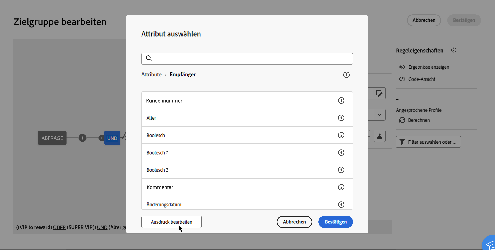
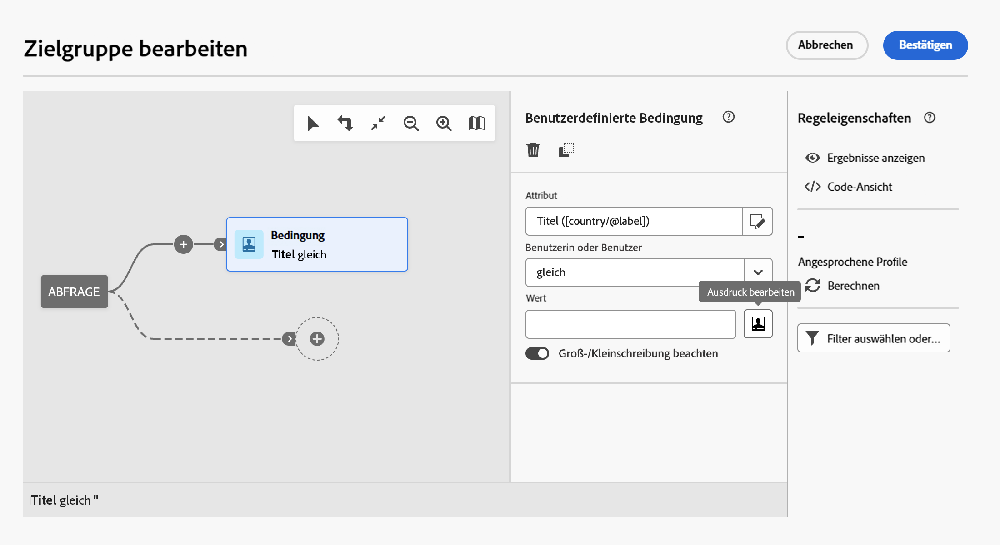
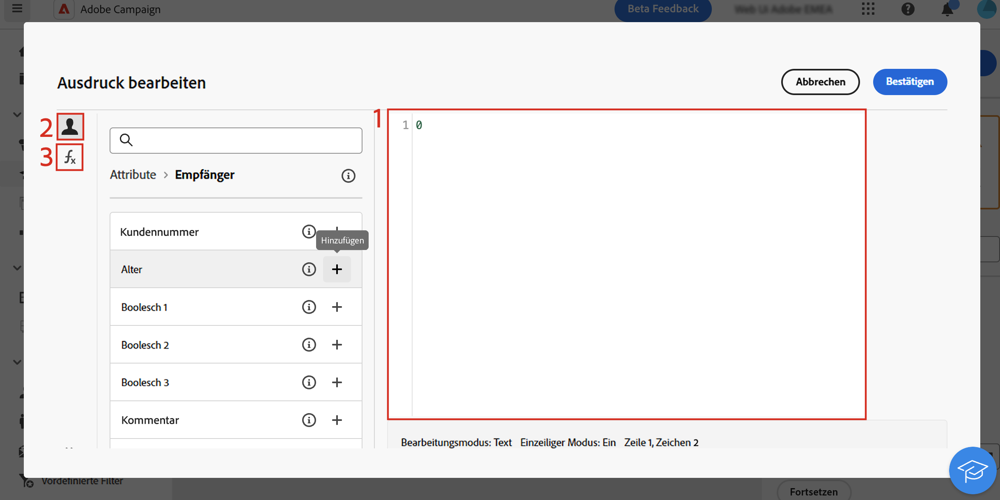
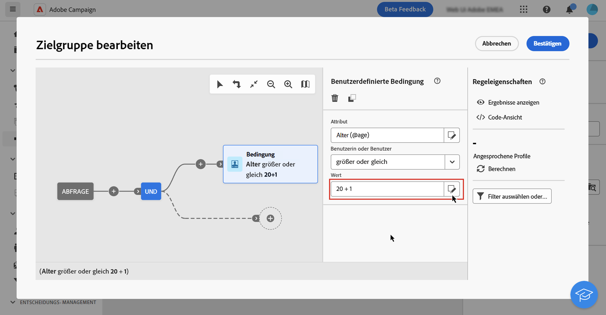

# Bearbeiten von Ausdrücken {#expression}

Die Bearbeitung von Ausdrücken erfolgt durch die manuelle Eingabe von Bedingungen, die in ihrer Gesamtheit eine Regel bilden. Dieser Modus bietet erweiterte Funktionen, mit denen Sie die Werte zur Durchführung bestimmter Abfragen ändern können, z. B. Bearbeitung von Daten, Zeichenfolgen, Nummernfeldern, Sortierungen, usw.

## Arbeiten mit dem Ausdruckseditor {#edit}

Der Ausdruckseditor steht bei der Konfiguration einer benutzerdefinierten Bedingung im Abfrage-Modeler unter **[!UICONTROL Ausdruck bearbeiten]** für die Felder **[!UICONTROL Attribut]** und **[!UICONTROL Wert]** zur Verfügung.

| Zugriff über das Feld **[!UICONTROL Attribut]** | Zugriff über das Feld **[!UICONTROL Wert]** |
|  ---  |  ---  |
| {zoomable="yes"}{width="200" align="center" zoomable="yes"} | {zoomable="yes"}{width="200" align="center" zoomable="yes"} |

Der Ausdruckseditor bietet Folgendes:

* Ein **Eingabefeld (1)**, in dem der Ausdruck definiert wird.
* Die Liste der verfügbaren **Felder (2)**, die im Ausdruck verwendet werden können und dem Schema, auch bekannt als Zielgruppendimension, der Abfrage entsprechen.
* **Hilfsfunktionen (3)**, sortiert nach Kategorie.

Bearbeiten Sie den Ausdruck, indem Sie ihn direkt in das Eingabefeld eingeben. Um ein Feld oder eine Hilfsfunktion hinzuzufügen, gehen Sie mit dem Cursor zu dem Ausdruck, zu dem Sie es/sie hinzufügen möchten, und klicken Sie auf die Schaltfläche „+“.

{zoomable="yes"}

Wenn Ihr Ausdruck fertig ist, klicken Sie auf **[!UICONTROL Bestätigen]**. Der Ausdruck wird im ausgewählten Feld angezeigt. Öffnen Sie zum Bearbeiten den Ausdruckseditor und nehmen Sie die gewünschten Änderungen vor.

Das folgende Beispiel zeigt einen für das Feld **[!UICONTROL Wert]** konfigurierten Ausdruck. Um ihn zu bearbeiten, müssen Sie den Ausdruckseditor über die Schaltfläche **[!UICONTROL Ausdruck bearbeiten]** öffnen.

{zoomable="yes"}

## Hilfsfunktionen

Der Abfrageeditor bietet fortgeschrittene Funktionen zur Erstellung komplexer Filter, je nach den gewünschten Ergebnissen und der Art der bearbeiteten Daten. Folgende Funktionen stehen zur Verfügung:

### Aggregat

Die Aggregatfunktionen dienen der Durchführung von Berechnungen zu einer Reihe von Werten.

<table> 
 <tbody> 
  <tr> 
   <td> <strong>Name</strong>  </td> 
   <td> <strong>Beschreibung</strong>  </td> 
   <td> <strong>Syntax</strong>  </td> 
  </tr> 
  <tr> 
   <td> <strong>Avg</strong>  </td> 
   <td> Gibt den Durchschnittswert einer Spalte vom Typ Zahl aus  </td> 
   <td> Avg(&lt;Wert&gt;) </td> 
  </tr> 
  <tr> 
   <td> <strong>Count</strong>  </td> 
   <td> Zählt die Werte ungleich null einer Spalte  </td> 
   <td> Count(&lt;Wert&gt;) </td>  
  </tr> 
  <tr> 
   <td> <strong>CountAll</strong>  </td> 
   <td> Zählt die ausgegebenen Werte (alle Felder)  </td> 
   <td> CountAll()  </td> 
  </tr> 
  <tr> 
   <td> <strong>Countdistinct</strong>  </td> 
   <td> Zählt die unterschiedlichen Werte ungleich null einer Spalte  </td> 
   <td> Countdistinct(&lt;Wert&gt;) </td> 
  </tr> 
  <tr> 
   <td> <strong>Max</strong>  </td> 
   <td> Gibt den Höchstwert einer Spalte vom Typ Zahl, String oder Datum aus  </td> 
   <td> Max(&lt;Wert&gt;) </td>  
  </tr> 
  <tr> 
   <td> <strong>Min</strong>  </td> 
   <td> Gibt den Mindestwert einer Spalte vom Typ Zahl, String oder Datum aus  </td> 
   <td> Min(&lt;Wert&gt;) </td> 
  </tr> 
  <tr> 
   <td> <strong>StdDev</strong>  </td> 
   <td> Gibt die Standardabweichung einer Zahl, Zeichenfolge oder Datumsspalte aus  </td> 
   <td> StdDev(&lt;Wert&gt;) </td> 
  </tr>
  <tr> 
   <td> <strong>StringAgg</strong>  </td> 
   <td> Gibt die Verkettung der Werte einer Spalte vom Typ „String“ zurück, getrennt durch das Zeichen im zweiten Argument  </td> 
   <td> StringAgg(&lt;Wert&gt;, &lt;String&gt;) </td> 
  </tr> 
  <tr> 
   <td> <strong>Sum</strong>  </td> 
   <td> Gibt die Summe der Werte einer Spalte vom Typ Zahl, String oder Datum aus  </td> 
   <td> Sum(&lt;Wert&gt;) </td> 
  </tr> 
 </tbody> 
</table>

### Datum

Die Datumsfunktionen dienen der Manipulation von Datums- oder Uhrzeitwerten.

<table> 
 <tbody> 
  <tr> 
   <td> <strong>Name</strong>  </td> 
   <td> <strong>Beschreibung</strong>  </td> 
   <td> <strong>Syntax</strong>  </td> 
  </tr> 
  <tr> 
   <td> <strong>AddDays</strong>  </td> 
   <td> Fügt dem Datum eine Anzahl an Tagen hinzu  </td> 
   <td> AddDays(&lt;Datum&gt;, &lt;Zahl&gt;)  </td>  
  </tr> 
  <tr> 
   <td> <strong>AddHours</strong>  </td> 
   <td> Fügt dem Datum eine Anzahl an Stunden hinzu  </td> 
   <td> AddHours(&lt;Datum&gt;, &lt;Zahl&gt;)  </td>  
  </tr> 
  <tr> 
   <td> <strong>AddMinutes</strong>  </td> 
   <td> Fügt dem Datum eine Anzahl an Minuten hinzu  </td> 
   <td> AddMinutes(&lt;Datum&gt;, &lt;Zahl&gt;)  </td>  
  </tr> 
  <tr> 
   <td> <strong>AddMonths</strong>  </td> 
   <td> Fügt dem Datum eine Anzahl an Monaten hinzu  </td> 
   <td> AddMonths(&lt;Datum&gt;, &lt;Zahl&gt;)  </td>  
  </tr> 
  <tr> 
   <td> <strong>AddSeconds</strong>  </td> 
   <td> Fügt dem Datum eine Anzahl an Sekunden hinzu  </td> 
   <td> AddSeconds(&lt;Datum&gt;, &lt;Zahl&gt;)  </td>  
  </tr> 
  <tr> 
   <td> <strong>AddYears</strong>  </td> 
   <td> Fügt dem Datum eine Anzahl an Jahren hinzu  </td> 
   <td> AddYears(&lt;Datum&gt;, &lt;Zahl&gt;)  </td>  
  </tr>
  <tr> 
   <td> <strong>ConvertNTZ</strong>  </td> 
   <td> Konvertiert NTZ-Zeitstempel (Zeitstempel ohne Zeitzone) in TZ (Zeitstempel mit Zeitzone) unter Anwendung der definierten Sitzungs-Zeitzone  </td> 
   <td> ConvertNTZ (&lt;date+time&gt;)  </td>  
  </tr>
  <tr> 
   <!--<td> <strong>ConvertTimezone</strong>  </td> 
   <td>   </td> 
   <td> ConvertNTZ (&lt;date+time&gt;)  </td>  
  </tr>-->
  <tr> 
   <td> <strong>DateCmp</strong>  </td> 
   <td> Vergleicht zwei Daten  </td> 
   <td> DateCmp(&lt;Datum&gt;,&lt;Datum&gt;)  </td>  
  </tr>
  <tr> 
   <td> <strong>DateOnly</strong>  </td> 
   <td> Gibt nur das Datum aus (mit Uhrzeit = 00:00 Uhr)*  </td> 
   <td> DateOnly(&lt;Datum&gt;)  </td>  
  </tr> 
  <tr> 
   <td> <strong>Day</strong>  </td> 
   <td> Gibt die Zahl aus, die dem Tag des Datums entspricht  </td> 
   <td> Day(&lt;Datum&gt;)  </td>  
  </tr> 
  <tr> 
   <td> <strong>DayOfYear</strong>  </td> 
   <td> Gibt die Zahl des Tages im Jahr des angegebenen Datums aus  </td> 
   <td> DayOfYear(&lt;Datum&gt;)  </td>  
  </tr> 
  <tr> 
   <td> <strong>DaysAgo</strong>  </td> 
   <td> Gibt das Datum aus, das dem aktuellen Datum abzüglich n Tage entspricht  </td> 
   <td> DaysAgo(&lt;Zahl&gt;)  </td>  
  </tr> 
  <tr> 
   <td> <strong>DaysAgoInt</strong>  </td> 
   <td> Gibt das Datum (Integer JJJJMMTT) aus, das dem aktuellen Datum abzüglich n Tage entspricht  </td> 
   <td> DaysAgoInt(&lt;Zahl&gt;)  </td>  
  </tr> 
  <tr> 
   <td> <strong>DaysDiff</strong>  </td> 
   <td> Anzahl von Tagen zwischen zwei Daten  </td> 
   <td> DaysDiff(&lt;Enddatum&gt;, &lt;Startdatum&gt;)  </td>  
  </tr> 
  <tr> 
   <td> <strong>DaysOld</strong>  </td> 
   <td> Gibt das Alter in Tagen in Bezug auf ein Datum aus  </td> 
   <td> DaysOld(&lt;Datum&gt;)  </td>  
  </tr> 
  <tr> 
   <td> <strong>GetDate</strong>  </td> 
   <td> Gibt das aktuelle Systemdatum des Servers aus  </td> 
   <td> GetDate()  </td> 
  </tr> 
  <tr> 
   <td> <strong>Hour</strong>  </td> 
   <td> Gibt die Stunde der im Datum angegebenen Uhrzeit aus  </td> 
   <td> Hour(&lt;Datum&gt;)  </td>  
  </tr> 
  <tr> 
   <td> <strong>HoursDiff</strong>  </td> 
   <td> Gibt die Anzahl von Stunden zwischen zwei Daten aus  </td> 
   <td> HoursDiff(&lt;Enddatum&gt;, &lt;Startdatum&gt;)  </td>  
  </tr> 
  <tr> 
   <td> <strong>Minute</strong>  </td> 
   <td> Gibt die Minuten der im Datum angegebenen Uhrzeit aus  </td> 
   <td> Minute(&lt;Datum&gt;)  </td>  
  </tr> 
  <tr> 
   <td> <strong>MinutesDiff</strong>  </td> 
   <td> Gibt die Anzahl von Minuten zwischen zwei Daten aus  </td> 
   <td> MinutesDiff(&lt;Enddatum&gt;, &lt;Startdatum&gt;)  </td>  
  </tr> 
  <tr> 
   <td> <strong>Month</strong>  </td> 
   <td> Gibt die Zahl aus, die dem Monat des Datums entspricht  </td> 
   <td> Month(&lt;Datum&gt;)  </td>  
  </tr> 
  <tr> 
   <td> <strong>MonthsAgo</strong>  </td> 
   <td> Gibt das Datum aus, das dem aktuellen Datum abzüglich n Monate entspricht  </td> 
   <td> MonthsAgo(&lt;Zahl&gt;)  </td>  
  </tr> 
  <tr> 
   <td> <strong>MonthsDiff</strong>  </td> 
   <td> Gibt die Anzahl von Monaten zwischen zwei Daten aus  </td> 
   <td> MonthsDiff(&lt;Enddatum&gt;, &lt;Startdatum&gt;)  </td>  
  </tr> 
  <tr> 
   <td> <strong>MonthsOld</strong>  </td> 
   <td> Gibt das Alter in Monaten in Bezug auf ein Datum aus  </td> 
   <td> MonthsOld(&lt;Datum&gt;)  </td>  
  </tr> 
  <tr> 
   <td> <strong>Oldest</strong>  </td> 
   <td> Gibt das älteste Datum in einem Bereich zurück  </td> 
   <td> Oldest(&lt;Datum, Datum&gt;)  </td>  
  </tr> 
  <tr> 
   <td> <strong>Second</strong>  </td> 
   <td> Gibt die Sekunden der im Datum angegebenen Uhrzeit aus  </td> 
   <td> Second(&lt;Datum&gt;)  </td>  
  </tr> 
  <tr> 
   <td> <strong>SecondsDiff</strong>  </td> 
   <td> Gibt die Anzahl von Sekunden zwischen zwei Daten aus  </td> 
   <td> SecondsDiff(&lt;Enddatum&gt;, &lt;Startdatum&gt;)  </td>  
  </tr> 
  <tr> 
   <td> <strong>SubDays</strong>  </td> 
   <td> Zieht die angegebene Anzahl von Tagen vom Datum ab  </td> 
   <td> SubDays(&lt;Datum&gt;, &lt;Zahl&gt;)  </td>  
  </tr> 
  <tr> 
   <td> <strong>SubHours</strong>  </td> 
   <td> Zieht die angegebene Anzahl von Stunden vom Datum ab  </td> 
   <td> SubHours(&lt;Datum&gt;, &lt;Zahl&gt;)  </td>  
  </tr> 
  <tr> 
   <td> <strong>SubMinutes</strong>  </td> 
   <td> Zieht die angegebene Anzahl von Minuten vom Datum ab  </td> 
   <td> SubMinutes(&lt;Datum&gt;, &lt;Zahl&gt;)  </td>  
  </tr> 
  <tr> 
   <td> <strong>SubMonths</strong>  </td> 
   <td> Zieht die angegebene Anzahl von Monaten vom Datum ab  </td> 
   <td> SubMonths(&lt;Datum&gt;, &lt;Zahl&gt;)  </td>  
  </tr> 
  <tr> 
   <td> <strong>SubSeconds</strong>  </td> 
   <td> Zieht die angegebene Anzahl von Sekunden vom Datum ab  </td> 
   <td> SubSeconds(&lt;Datum&gt;, &lt;Zahl&gt;)  </td>  
  </tr> 
  <tr> 
   <td> <strong>SubYears</strong>  </td> 
   <td> Zieht die angegebene Anzahl von Jahren vom Datum ab  </td> 
   <td> SubYears(&lt;Datum&gt;, &lt;Zahl&gt;)  </td>  
  </tr> 
  <tr> 
   <td> <strong>ToDate</strong>  </td> 
   <td> Konvertiert eine Angabe Datum+Uhrzeit in Datum alleine  </td> 
   <td> ToDate(&lt;Datum + Uhrzeit&gt;)  </td>  
  </tr> 
  <tr> 
   <td> <strong>ToDateTime</strong>  </td> 
   <td> Konvertiert einen String in Datum+Uhrzeit  </td> 
   <td> ToDateTime(&lt;String&gt;)  </td>  
  </tr> 
  <tr> 
   <td> <strong>ToTimestamp</strong>  </td> 
   <td> Konvertiert einen String in einen Zeitstempel  </td> 
   <td> ToTimestamp(&lt;String&gt;)  </td>  
  </tr> 
  <tr> 
   <td> <strong>ToTimeZone</strong>  </td> 
   <td> Konvertiert Datum + Uhrzeit in eine Zeitzone  </td> 
   <td> ToTimeZone(&lt;Datum&gt;,&lt;time zone&gt;)  </td>  
  </tr> 
  <tr> 
   <td> <strong>TruncDate</strong>  </td> 
   <td> Kürzt die Angabe Datum+Uhrzeit auf Sekunden  </td> 
   <td> TruncDate(@lastModified, &lt;Anzahl Sekunden&gt;)  </td> 
  </tr> 
  <tr> 
   <td> <strong>TruncDateTZ</strong>  </td> 
   <td> Kürzt die Angabe Datum+Uhrzeit auf Sekunden  </td> 
   <td> TruncDateTZ(&lt;Datum&gt;, &lt;Anzahl Sekunden&gt;, &lt;Zeitzone&gt;)  </td> 
  </tr> 
  <tr> 
   <td> <strong>TruncQuarter</strong>  </td> 
   <td> Kürzt die Angabe des Datums auf den ersten Tag des Quartals  </td> 
   <td> TruncQuarter(&lt;Datum&gt;)  </td>  
  </tr> 
  <tr> 
   <td> <strong>TruncTime</strong>  </td> 
   <td> Kürzt die Uhrzeitangabe auf Sekunden  </td> 
   <td> TruncTime(&lt;Datum&gt;, &lt;Anzahl Sekunden&gt;)  </td>  
  </tr> 
  <tr> 
   <td> <strong>TruncWeek</strong>  </td> 
   <td> Kürzt ein Datum auf die Woche  </td> 
   <td> TruncWeek(&lt;Datum&gt;)  </td>  
  </tr> 
  <tr> 
   <td> <strong>TruncYear</strong>  </td> 
   <td> Kürzt die Angabe Datum+Uhrzeit auf den ersten Januar des Jahres  </td> 
   <td> TruncYear(&lt;Datum&gt;)  </td>  
  </tr> 
  <tr> 
   <td> <strong>WeekDay</strong>  </td> 
   <td> Gibt die Zahl des Wochentages in Bezug auf das Datum aus (0=Montag, 6=Sonntag)  </td> 
   <td> WeekDay(&lt;Datum&gt;)  </td>  
  </tr> 
  <tr> 
   <td> <strong>Year</strong>  </td> 
   <td> Gibt die Zahl aus, die dem Jahr des Datums entspricht  </td> 
   <td> Year(&lt;Datum&gt;)  </td>  
  </tr> 
  <tr> 
   <td> <strong>YearAndMonth</strong>  </td> 
   <td> Gibt Jahr und Monat eines Datums aus  </td> 
   <td> YearAndMonth(&lt;Datum&gt;)  </td>  
  </tr>
  <tr> 
   <td> <strong>YearsAgo</strong>  </td> 
   <td> Gibt die Anzahl von Jahren zwischen einem bestimmten Datum und dem aktuellen Datum wieder  </td> 
   <td> YearsAgo(&lt;date&gt;)  </td>  
  </tr> 
  <tr> 
   <td> <strong>YearsDiff</strong>  </td> 
   <td> Gibt die Anzahl von Jahren zwischen zwei Daten aus  </td> 
   <td> YearsDiff(&lt;Enddatum&gt;, &lt;Startdatum&gt;)  </td>  
  </tr> 
  <tr> 
   <td> <strong>YearsOld</strong>  </td> 
   <td> Gibt das Alter in Jahren in Bezug auf ein Datum aus  </td> 
   <td> YearsOld(&lt;Datum&gt;)  </td>  
  </tr> 
 </tbody> 
</table>

>[!NOTE]
>
>Beachten Sie, dass die Funktion **Dateonly** nicht die Zeitzone des Benutzers, sondern des Servers verwendet.

### Geomarketing

Die Geomarketing-Funktionen dienen der Manipulation von geografischen Werten.

<table> 
 <tbody> 
  <tr> 
   <td> <strong>Name</strong>  </td> 
   <td> <strong>Beschreibung</strong>  </td> 
   <td> <strong>Syntax</strong>  </td> 
  </tr> 
  <tr> 
   <td> <strong>Distance</strong>  </td> 
   <td> Gibt die Entfernung zwischen zwei durch Längen- und Breitengrad bezeichneten Punkten aus (in Grad).  </td> 
   <td> Distance(&lt;Längengrad A&gt;, &lt;Breitengrad A&gt;, &lt;Längengrad B&gt;, &lt;Breitengrad B&gt;)  </td>  
  </tr> 
 </tbody> 
</table>

### Numerisch

Die numerischen Funktionen dienen der Konversion von Text in Zahlen.

<table> 
 <tbody> 
  <tr> 
   <td> <strong>Name</strong>  </td> 
   <td> <strong>Beschreibung</strong>  </td> 
   <td> <strong>Syntax</strong>  </td> 
  </tr> 
  <tr> 
   <td> <strong>Abs</strong>  </td> 
   <td> Gibt den absoluten Wert einer Zahl aus  </td> 
   <td> Abs(&lt;Zahl&gt;)  </td>  
  </tr> 
  <tr> 
   <td> <strong>Ceil</strong>  </td> 
   <td> Gibt die kleinste ganze Zahl aus, die größer oder gleich der angegebenen Zahl ist  </td> 
   <td> Ceil(&lt;Zahl&gt;)  </td>  
  </tr> 
  <tr> 
   <td> <strong>Floor</strong>  </td> 
   <td> Gibt die größte ganze Zahl aus, die kleiner oder gleich der angegebenen Zahl ist  </td> 
   <td> Floor(&lt;Zahl&gt;)  </td>  
  </tr> 
  <tr> 
   <td> <strong>Greatest</strong>  </td> 
   <td> Gibt die größere von zwei Zahlen aus  </td> 
   <td> Greatest(&lt;Zahl 1&gt;, &lt;Zahl 2&gt;)  </td>  
  </tr> 
  <tr> 
   <td> <strong>Least</strong>  </td> 
   <td> Gibt die kleinere von zwei Zahlen aus  </td> 
   <td> Least(&lt;Zahl 1&gt;, &lt;Zahl 2&gt;)  </td>  
  </tr> 
  <tr> 
   <td> <strong>Mod</strong>  </td> 
   <td> Gibt den Rest der ganzzahligen Division von n1 durch n2 aus  </td> 
   <td> Mod(&lt;Zahl 1&gt;, &lt;Zahl 2&gt;)  </td>  
  </tr> 
  <tr> 
   <td> <strong>Percent</strong>  </td> 
   <td> Gibt das Verhältnis zwischen zwei Werten in Prozent aus  </td> 
   <td> Percent(&lt;Zahl 1&gt;, &lt;Zahl 2&gt;)  </td>  
  </tr> 
  <tr> 
   <td> <strong>Random</strong>  </td> 
   <td> Gibt einen Zufallswert aus  </td> 
   <td> Random()  </td> 
  </tr> 
  <tr> 
   <td> <strong>Round</strong>  </td> 
   <td> Rundet eine Zahl auf n Dezimalstellen  </td> 
   <td> Round(&lt;Zahl&gt;, &lt;Anzahl Dezimalstellen&gt;)  </td>  
  </tr> 
  <tr> 
   <td> <strong>Sign</strong>  </td> 
   <td> Gibt das Vorzeichen einer Zahl aus  </td> 
   <td> Sign(&lt;Zahl&gt;)  </td>  
  </tr> 
  <tr> 
   <td> <strong>ToDouble</strong>  </td> 
   <td> Konvertiert einen Integer in einen Real  </td> 
   <td> ToDouble(&lt;Zahl&gt;)  </td>  
  </tr> 
  <tr> 
   <td> <strong>ToInt64</strong>  </td> 
   <td> Konvertiert einen Real in einen 64-Bit-Integer  </td> 
   <td> ToInt64(&lt;Zahl&gt;)  </td>  
  </tr> 
  <tr> 
   <td> <strong>ToInteger</strong>  </td> 
   <td> Konvertiert einen Real in einen Integer  </td> 
   <td> ToInteger(&lt;Zahl&gt;)  </td>  
  </tr> 
  <tr> 
   <td> <strong>Trunc</strong>  </td> 
   <td> Kürzt n1 auf n2 Dezimalstellen  </td> 
   <td> Trunc(&lt;n1&gt;, &lt;n2&gt;)  </td>  
  </tr> 
 </tbody> 
</table>

### Sonstige

In dieser Tabelle sind die restlichen verfügbaren Funktionen enthalten.

<table> 
 <tbody> 
  <tr> 
   <td> <strong>Name</strong>  </td> 
   <td> <strong>Beschreibung</strong>  </td> 
   <td> <strong>Syntax</strong>  </td> 
  </tr> 
  <tr> 
   <td> <strong>AESEncrypt</strong>  </td> 
   <td> Verschlüsselt den im Argument angegebenen String  </td> 
   <td> AESEncrypt(&lt;Wert&gt;)  </td> 
  </tr>
  <tr> 
   <td> <strong>Case</strong>  </td> 
   <td> Gibt Wert 1 zurück, wenn die Bedingung zutrifft. Wenn nicht, wird Wert 2 zurückgegeben.  </td> 
   <td> Case(When(&lt;Bedingung&gt;, &lt;Wert 1&gt;), Else(&lt;Wert 2&gt;))  </td> 
  </tr> 
  <tr> 
   <td> <strong>ClearBit</strong>  </td> 
   <td> Löscht das Flag aus dem Wert  </td> 
   <td> ClearBit(&lt;Kennung&gt;, &lt;Flag&gt;)  </td>  
  </tr> 
  <tr> 
   <td> <strong>Coalesce</strong>  </td> 
   <td> Gibt den Wert 2 aus, wenn der Wert 1 gleich null oder leer ist, sonst den Wert 1  </td> 
   <td> Coalesce(&lt;Wert 1&gt;, &lt;Wert 2&gt;)  </td>  
  </tr> 
  <tr> 
   <td> <strong>Decode</strong>  </td> 
   <td> Gibt Wert 3 zurück, wenn Wert 1 = Wert 2 ist. Wenn nicht, wird Wert 4 zurückgegeben.  </td> 
   <td> Decode(&lt;Wert 1&gt;, &lt;Wert 2&gt;, &lt;Wert 3&gt;, &lt;Wert 4&gt;)  </td>  
  </tr> 
  <!--<tr> 
   <td> <strong>DefaultFolder</strong>  </td> 
   <td> Returns value 3 if value 1 = value 2. If not returns value 4.  </td> 
   <td> Decode(&lt;value 1&gt;, &lt;value 2&gt;, &lt;value 3&gt;, &lt;value 4&gt;)  </td>  
  </tr> -->
  <tr> 
   <td> <strong>Else</strong>  </td> 
   <td> Gibt den Wert 1 aus (kann nur als Parameter der 'Case'-Funktion verwendet werden)  </td> 
   <td> Else(&lt;Wert 1&gt;, &lt;Wert 2&gt;)  </td>  
  </tr> 
  <tr> 
   <td> <strong>GetEmailDomain</strong>  </td> 
   <td> Extrahiert die Domain einer E-Mail-Adresse  </td> 
   <td> GetEmailDomain(&lt;Wert&gt;)  </td>  
  </tr> 
  <tr> 
   <td> <strong>GetMirrorURL</strong>  </td> 
   <td> Ruft die URL des Mirrorseiten-Servers ab  </td> 
   <td> GetMirrorURL(&lt;Wert&gt;)  </td>  
  </tr> 
  <tr> 
   <td> <strong>Iif</strong>  </td> 
   <td> Gibt Wert 1 aus, wenn die Bedingung zutrifft. Wenn nicht, wird Wert 2 zurückgegeben  </td> 
   <td> Iif(&lt;Bedingung&gt;, &lt;Wert 1&gt;, &lt;Wert 2&gt;)  </td>  
  </tr> 
  <tr> 
   <td> <strong>IsBitSet</strong>  </td> 
   <td> Gibt an, ob das Flag im Wert vorkommt  </td> 
   <td> IsBitSet(&lt;Kennung&gt;, &lt;Flag&gt;)  </td>  
  </tr> 
  <tr> 
   <td> <strong>IsEmptyString</strong>  </td> 
   <td> Gibt den Wert 2 aus, wenn der String 1 leer ist, sonst den Wert 3  </td> 
   <td> IsEmptyString(&lt;Wert 1&gt;, &lt;Wert 2&gt;, &lt;Wert 3&gt;)  </td>  
  </tr> 
  <tr> 
   <td> <strong>NewUUID</strong>  </td> 
   <td> Gibt eine eindeutige ID zurück  </td> 
   <td> NewUUID()  </td>  
  </tr> 
  <tr> 
   <td> <strong>NoNull</strong>  </td> 
   <td> Gibt einen Leerstring aus, wenn das Argument gleich null ist  </td> 
   <td> NoNull(&lt;Wert&gt;)  </td>   
  </tr> 
  <tr> 
   <td> <strong>RowId</strong>  </td> 
   <td> Gibt die Zeilennummer aus  </td> 
   <td> RowId  </td> 
  </tr> 
  <tr> 
   <td> <strong>SetBit</strong>  </td> 
   <td> Setzt das Flag im Wert  </td> 
   <td> SetBit(&lt;Kennung&gt;, &lt;Flag&gt;)  </td>  
  </tr> 
  <tr> 
   <td> <strong>ToBoolean</strong>  </td> 
   <td> Konvertiert eine Zahl in einen booleschen Wert  </td> 
   <td> ToBoolean(&lt;Zahl&gt;)  </td>   
  </tr> 
  <tr> 
   <td> <strong>When</strong>  </td> 
   <td> Gibt Wert 1 aus, wenn die Bedingung zutrifft. Falls nicht, wird Wert 2 zurückgegeben (kann nur als Parameter der Case-Funktion verwendet werden)  </td> 
   <td> When(&lt;Bedingung&gt;, &lt;Wert 1&gt;)  </td>  
  </tr> 
 </tbody> 
</table>

### String

Die String-Funktionen dienen der Manipulation einer Reihe von Strings.

<table> 
 <tbody> 
  <tr> 
   <td> <strong>Name</strong>  </td> 
   <td> <strong>Beschreibung</strong>  </td> 
   <td> <strong>Syntax</strong>  </td> 
  </tr> 
  <tr> 
   <td> <strong>AllNonNull2</strong>  </td> 
   <td> Gibt an, ob alle Parameter ungleich null und nicht leer sind  </td> 
   <td> AllNonNull2(&lt;String&gt;, &lt;String&gt;) </td> 
  </tr> 
  <tr> 
   <td> <strong>AllNonNull3</strong>  </td> 
   <td> Gibt an, ob alle Parameter ungleich null und nicht leer sind  </td> 
   <td> AllNonNull3(&lt;String&gt;, &lt;String&gt;, &lt;String&gt;) </td> 
  </tr> 
  <tr> 
   <td> <strong>Ascii</strong>  </td> 
   <td> Gibt den ASCII-Wert des ersten Zeichens des Strings aus.  </td> 
   <td> Ascii(&lt;String&gt;) </td> 
  </tr> 
  <tr> 
   <td> <strong>Char</strong>  </td> 
   <td> Gibt das ASCII-Code-Zeichen 'n' aus  </td> 
   <td> Char(&lt;Zahl&gt;) </td>  
  </tr> 
  <tr> 
   <td> <strong>Charindex</strong>  </td> 
   <td> Gibt die Position von Zeichenfolge 2 in Zeichenfolge 1 zurück.  </td> 
   <td> Charindex(&lt;string&gt;, &lt;string&gt;) </td> 
  </tr> 
  <tr> 
   <td> <strong>dataLength</strong>  </td> 
   <td> Gibt die Größe der Zeichenfolge in Bytes zurück  </td> 
   <td> dataLength(&lt;string&gt;) </td> 
  </tr> 
  <tr> 
   <td> <strong>GetLine</strong>  </td> 
   <td> Gibt die n-te Zeile (beginnend bei 1) des Strings aus  </td> 
   <td> GetLine(&lt;String&gt;) </td> 
  </tr> 
  <tr> 
   <td> <strong>IfEquals</strong>  </td> 
   <td> Gibt den dritten Parameter zurück, wenn die ersten beiden Parameter identisch sind. Wenn nicht, wird der letzte Parameter zurückgegeben  </td> 
   <td> IfEquals(&lt;String&gt;, &lt;String&gt;, &lt;String&gt;, &lt;String&gt;) </td> 
  </tr> 
  <tr> 
   <td> <strong>IsMemoNull</strong>  </td> 
   <td> Gibt an, ob das als Parameter ausgegebene Memo gleich null ist  </td> 
   <td> IsMemoNull(&lt;Memo&gt;) </td> 
  </tr> 
  <tr> 
   <td> <strong>JuxtWords</strong>  </td> 
   <td> Verkettet die zwei als Parameter übergebenen Zeichenfolgen. Fügt bei Bedarf Leerzeichen zwischen den Zeichenfolgen hinzu.  </td> 
   <td> JuxtWords(&lt;String&gt;, &lt;String&gt;) </td> 
  </tr> 
  <tr> 
   <td> <strong>JuxtWords3</strong>  </td> 
   <td> Verkettet die zwei als Parameter übergebenen Zeichenfolgen. Fügt bei Bedarf Leerzeichen zwischen den Zeichenfolgen hinzu  </td> 
   <td> JuxtWords3(&lt;string&gt;, &lt;string&gt;, &lt;string&gt;) </td>  
  </tr> 
  <tr> 
   <td> <strong>Left</strong>  </td> 
   <td> Gibt die n ersten Zeichen des Strings aus  </td> 
   <td> Left(&lt;String&gt;, &lt;Zahl&gt;) </td> 
  </tr> 
  <tr> 
   <td> <strong>Length</strong>  </td> 
   <td> Gibt die Länge des Strings aus  </td> 
   <td> Length(&lt;String&gt;) </td> 
  </tr> 
  <tr> 
   <td> <strong>Zeile</strong>  </td> 
   <td> Extrahiert Zeile n aus dem String  </td> 
   <td> Line(&lt;String&gt;,&lt;Zahl&gt;) </td> 
  </tr>
  <tr> 
   <td> <strong>Lower</strong>  </td> 
   <td> Gibt den String in Kleinbuchstaben aus  </td> 
   <td> Lower(&lt;String&gt;) </td> 
  </tr> 
  <tr> 
   <td> <strong>LPad</strong>  </td> 
   <td> Gibt den String linksseitig aufgefüllt aus  </td> 
   <td> LPad (&lt;String&gt;, &lt;Number&gt;, &lt;Char&gt;) </td> 
  </tr> 
  <tr> 
   <td> <strong>Ltrim</strong>  </td> 
   <td> Löscht die Leerstellen links vom String  </td> 
   <td> Ltrim(&lt;String&gt;) </td> 
  </tr> 
  <tr> 
   <td> <strong>Md5Digest</strong>  </td> 
   <td> Gibt eine hexadezimale Darstellung des MD5-Schlüssels eines Strings aus  </td> 
   <td> Md5Digest(&lt;String&gt;) </td> 
  </tr> 
  <tr> 
   <td> <strong>MemoContains</strong>  </td> 
   <td> Gibt an, ob das Memo den als Parameter übergebenen String enthält  </td> 
   <td> MemoContains(&lt;Memo&gt;, &lt;String&gt;) </td> 
  </tr> 
  <tr> 
   <td> <strong>NodeValue</strong>  </td> 
   <td> Extrahiert den Wert eines XML-Felds aus seinem XPath und den Felddaten  </td> 
   <td> NodeValue (&lt;String&gt;, &lt;String&gt;) </td> 
  </tr> 
  <tr> 
   <td> <strong>Replace</strong>  </td> 
   <td> Ersetzt alle Vorkommen eines angegebenen String-Werts durch einen anderen String-Wert.  </td> 
   <td> Replace(&lt;String&gt;,&lt;String&gt;,&lt;String&gt;) </td> 
  </tr> 
  <tr> 
   <td> <strong>Right</strong>  </td> 
   <td> Gibt die n letzten Zeichen des Strings aus  </td> 
   <td> Right(&lt;String&gt;)  </td> 
  </tr> 
  <tr> 
   <td> <strong>RPad</strong>  </td> 
   <td> Gibt den String rechtsseitig aufgefüllt aus  </td> 
   <td> RPad(&lt;String&gt;, &lt;Zahl&gt;, &lt;Zeichen&gt;) </td> 
  </tr> 
  <tr> 
   <td> <strong>Rtrim</strong>  </td> 
   <td> Löscht die Leerstellen rechts vom String  </td> 
   <td> Rtrim(&lt;String&gt;)  </td> 
  </tr> 
  <tr> 
   <td> <strong>Sha256Digest</strong>  </td> 
   <td> Hexadezimale Darstellung des SHA256-Schlüssels einer Zeichenfolge.  </td> 
   <td> Sha256Digest (&lt;String&gt;)  </td> 
  </tr> 
  <tr> 
   <td> <strong>Sha512Digest</strong>  </td> 
   <td> Hexadezimale Darstellung des SHA512-Schlüssels einer Zeichenfolge.  </td> 
   <td> Sha512Digest (&lt;String&gt;)  </td> 
  </tr> 
  <tr> 
   <td> <strong>Smart</strong>  </td> 
   <td> Gibt jedes Wort des Strings beginnend mit einem Großbuchstaben aus  </td> 
   <td> Smart(&lt;String&gt;)  </td> 
  </tr> 
  <tr> 
   <td> <strong>Substring</strong>  </td> 
   <td> Extrahiert aus dem String den Teilstring, der mit dem Zeichen n1 beginnt und die Länge n2 aufweist  </td> 
   <td> Substring(&lt;String&gt;, &lt;Start&gt;, &lt;Länge&gt;)  </td>  
  </tr> 
  <tr> 
   <td> <strong>ToString</strong>  </td> 
   <td> Konvertiert eine Zahl in einen String  </td> 
   <td> ToString(&lt;Zahl&gt;, &lt;Zahl&gt;)  </td>  
  </tr> 
  <tr> 
   <td> <strong>Upper</strong>  </td> 
   <td> Gibt den String in Großbuchstaben aus  </td> 
   <td> Upper(&lt;String&gt;)  </td>  
  </tr> 
  <tr> 
   <td> <strong>VirtualLink</strong>  </td> 
   <td> Gibt den Fremdschlüssel einer als erster Parameter übergebenen Relation aus, wenn die beiden anderen Parameter identisch sind  </td> 
   <td> VirtualLink(&lt;Zahl&gt;, &lt;Zahl&gt;, &lt;Zahl&gt;)  </td>  
  </tr> 
  <tr> 
   <td> <strong>VirtualLinkStr</strong>  </td> 
   <td> Gibt den Fremdschlüssel (Text) einer als erster Parameter übergebenen Relation aus, wenn die beiden anderen Parameter identisch sind  </td> 
   <td> VirtualLinkStr(&lt;String&gt;, &lt;Zahl&gt;, &lt;Zahl&gt;)  </td>  
  </tr> 
 </tbody> 
</table>

### Fenster

<table> 
 <tbody> 
  <tr> 
   <td> <strong>Name</strong>  </td> 
   <td> <strong>Beschreibung</strong>  </td> 
   <td> <strong>Syntax</strong>  </td> 
  </tr> 
  <tr> 
   <td> <strong>_Over__</strong>  </td> 
   <td> Ruft die als ersten Parameter eingegebene SQL-Funktion über die als zweiten Parameter eingegebenen Felder „Partition“ oder „Anordnen nach“ aus  </td> 
   <td> _Over_ (&lt;Value&gt;, &lt;Value&gt;)  </td>  
  </tr> 
  <tr> 
   <td> <strong>Desc</strong>  </td> 
   <td> Absteigende Sortierung  </td> 
   <td> Desc(&lt;Wert 1&gt;)  </td>  
  </tr> 
  <tr> 
   <td> <strong>OrderBy</strong>  </td> 
   <td> Sortiert das Ergebnis innerhalb der Partition  </td> 
   <td> OrderBy(&lt;Wert 1&gt;)  </td>  
  </tr> 
  <tr> 
   <td> <strong>PartitionBy</strong>  </td> 
   <td> Partitioniert das Ergebnis einer Abfrage  </td> 
   <td> PartitionBy(&lt;Wert 1&gt;)  </td>  
  </tr> 
  <tr> 
   <td> <strong>RowNum</strong>  </td> 
   <td> Erzeugt eine Zeilennummer in Abhängigkeit von der Tabellenpartition und der Sortierreihenfolge  </td> 
   <td> RowNum(PartitionBy(&lt;Wert 1&gt;), OrderBy(&lt;Wert 1&gt;))  </td> 
  </tr> 
 </tbody> 
</table>
