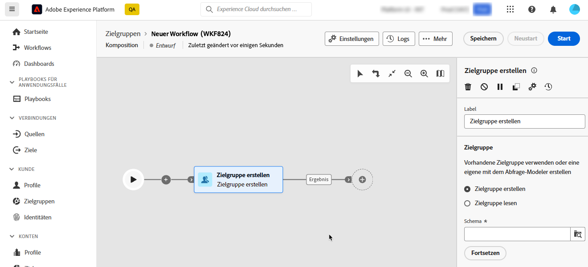
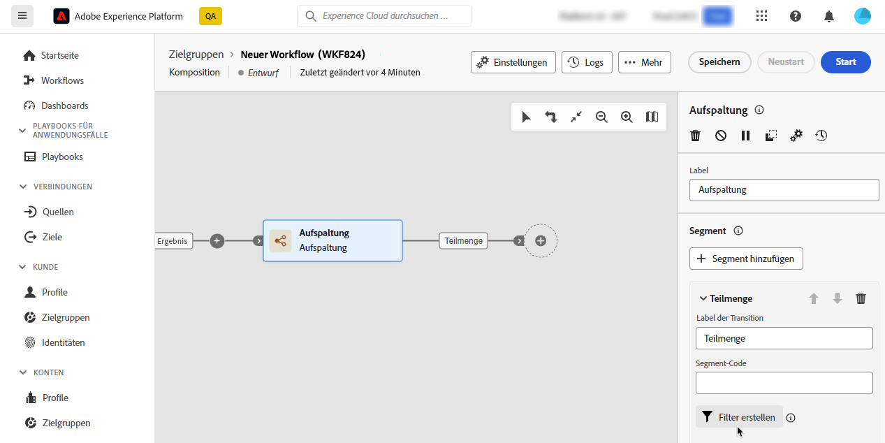
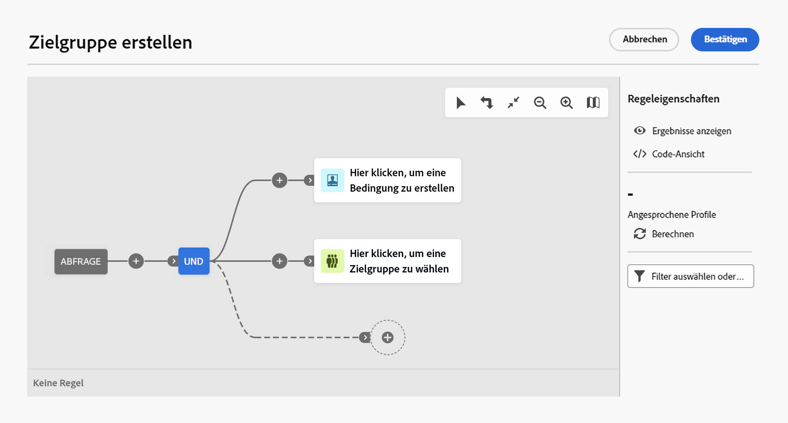

# Arbeiten mit dem Abfrage-Modeler {#segment-builder}

>[!CONTEXTUALHELP]
>id="dc_orchestration_querymodeler_querymessage"
>title="Abfrage-Modeler"
>abstract="Definieren Sie Filterkriterien für Empfängerinnen und Empfänger oder ein beliebiges anderes Schema, auch bekannt als Zielgruppendimension, aus der Datenbank."

Der Abfrage-Modeler vereinfacht die Filterung der Datenbank anhand verschiedener Kriterien. Außerdem kann der Abfrage-Modeler sehr komplexe und lange Abfragen effizient verwalten – und das bei höherer Flexibilität und Genauigkeit. Darüber hinaus werden vordefinierte Filter in Bedingungen unterstützt, sodass Sie Ihre Abfragen mühelos verfeinern und gleichzeitig erweiterte Ausdrücke und Operatoren für umfassende Zielgruppenbestimmung und Segmentierungsstrategien nutzen können.

## Zugreifen auf den Abfrage-Modeler

Der Abfrage-Modeler ist in jedem Kontext verfügbar, in dem Sie Regeln zum Filtern von Daten definieren müssen.

| Nutzung | Beispiel |
|  ---  |  ---  |
| **Zielgruppen definieren**: Geben Sie die Population an, die Sie in Ihren Kompositionen ansprechen möchten, und erstellen Sie mühelos neue Zielgruppen, die auf Ihre Anforderungen zugeschnitten sind.  | {zoomable="yes"}{width="200" align="center" zoomable="yes"} |
| **Aktivitäten anpassen**: Wenden Sie Regeln innerhalb von Kompositionsktivitäten an, z. B. **Aufspaltung** und **Abstimmung**, um sie an Ihre spezifischen Anforderungen anzupassen.  [Erfahren Sie mehr zu Kompositionsaktivitäten](../compositions/activities/about-activities.md). | {zoomable="yes"}{width="200" align="center" zoomable="yes"} |

## Benutzeroberfläche des Abfrage-Modelers {#interface}

Der Abfrage-Modeler bietet eine zentrale Arbeitsfläche, auf der Sie Ihre Abfrage erstellen, sowie einen rechten Bereich mit Informationen zu Ihrer Abfrage.

{zoomable="yes"}

### Die zentrale Arbeitsfläche {#canvas}

Der Abfrage-Modeler bietet eine zentrale Arbeitsfläche, auf der Sie die verschiedenen Komponenten hinzufügen und kombinieren können, um Ihre Abfrage zu erstellen. [So erstellen Sie eine Abfrage](build-query.md)

Die Symbolleiste oben rechts in der Arbeitsfläche bietet Optionen zum einfachen Bearbeiten der Abfragekomponenten und Navigieren auf der Arbeitsfläche:

* **[!UICONTROL Mehrfachauswahl-Modus]**: Wählen Sie mehrere Filterkomponenten aus, um sie zu kopieren und am gewünschten Ort einzufügen.
* **[!UICONTROL Drehen]**: Dreht die Arbeitsfläche vertikal.
* **[!UICONTROL An Bildschirm anpassen]**: Passt die Vergrößerung der Arbeitsfläche an Ihren Bildschirm an.
* **[!UICONTROL Verkleinern]**/**[!UICONTROL Vergrößern]**: Verkleinert bzw. vergrößert die Arbeitsfläche.
* **[!UICONTROL Karte anzeigen]**: Öffnet einen Snapshot der Arbeitsfläche, in der Sie sich befinden.

### Das Fenster „Regeleigenschaften“ {#rule-properties}

Das Fenster **[!UICONTROL Regeleigenschaften]** rechts enthält Informationen zu Ihrer Abfrage. Damit können Sie verschiedene Vorgänge ausführen, um Ihre Abfrage zu überprüfen und sicherzustellen, dass sie Ihren Anforderungen entspricht. Dieser Bereich wird angezeigt, wenn Sie eine Abfrage zum Erstellen einer Zielgruppe erstellen. [So überprüfen und validieren Sie Ihre Abfrage](build-query.md#check-and-validate-your-query)
