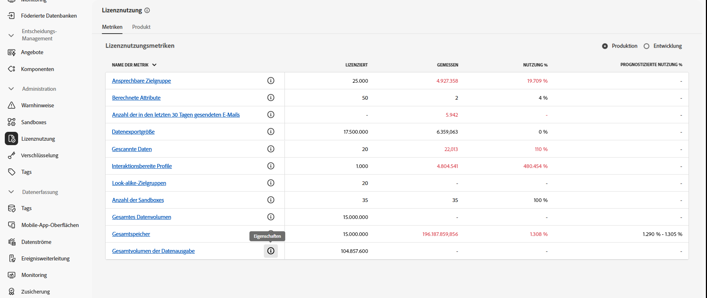
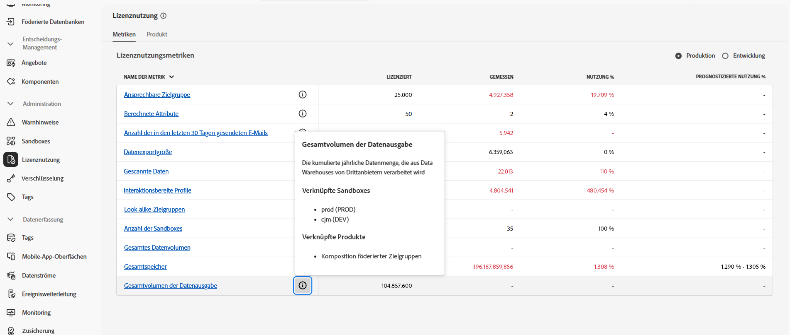

# Voraussetzungen und Leitlinien {#fac-access}

Die Komposition föderierter Zielgruppen erfordert Adobe Real-Time Customer Data Platform und/oder die Pakete **Prime** oder **Ultimate** von Adobe Journey Optimizer. Um auf diese Funktion zugreifen zu können, müssen Sie das Add-on „Komposition föderierter Zielgruppen“ gekauft haben.

>[!AVAILABILITY]
>
>Nachdem Sie die Begrüßungs-E-Mail von Adobe erhalten haben, kann es noch einige Stunden dauern, bis die Benutzeroberfläche aktualisiert ist und Ihnen die Funktionen zur Verfügung stehen.

## Unterstützte Systeme {#supported-systems}

Die Komposition föderierter Zielgruppen unterstützt die folgenden Cloud-Warehouses:

* Amazon Redshift
* Azure Synapse
* Databricks
* Google BigQuery
* Snowflake
* Vertica Analytics
* Microsoft Fabric

Auf [dieser Seite](../connections/connections.md) erfahren Sie, wie Sie eine Verbindung mit diesen Systemen herstellen.

## Sandboxes

Beim Erwerb der Komposition föderierter Zielgruppen haben Sie Anspruch auf zwei Sandboxes. Wenden Sie sich bei Anfragen für die Bereitstellung weiterer Sandboxes an Ihren Kontakt beim Adobe-Support.

Gehen Sie wie folgt vor, um die Liste Ihrer aktiven Sandboxes für die Komposition föderierter Zielgruppen anzuzeigen:

1. Rufen Sie in der Komposition föderierter Zielgruppen das Menü **[!UICONTROL Lizenznutzung]** unter **[!UICONTROL Administration]** auf.

1. Klicken Sie auf das Symbol  unter **[!UICONTROL Gesamtvolumen der Datenausgabe]**, um auf Ihre Sandbox-Eigenschaften zuzugreifen.

   

1. Informationen über Ihre Sandbox werden im Popup-Fenster „Eigenschaften“ angezeigt.

   

## Berechtigungen {#permissions}

Um auf die Komposition föderierter Zielgruppen zugreifen zu können, müssen Benutzende dem beim Kauf erstellten Sandbox-spezifischen Produktprofil hinzugefügt werden und ihnen muss die Berechtigung **[!UICONTROL Föderierte Daten verwalten]** zugewiesen werden. [Weitere Informationen](/help/governance-privacy-security/access-control.md)

## IP-Zulassungsauflistung {#ip}

Damit die Komposition föderierter Zielgruppen sicher auf Ihre Datenbanken zugreifen kann, müssen Sie die IP-Adressen der Server für die Komposition föderierter Zielgruppen autorisieren, die darauf zugreifen werden. Diese IP-Adressen werden angezeigt, wenn in der Benutzeroberfläche von Adobe Experience Platform eine föderierte Datenbank hinzugefügt wird. [Weitere Informationen](../connections/connections.md)

Fügen Sie diese IP-Adressen zu Ihrer Zulassungsliste hinzu, um der Komposition föderierter Zielgruppen Zugriff zu gewähren.

## Zusammenführungsrichtlinien {#merge-policies}

Wenn Ihre Zielgruppe eine **Datensatzpriorität**-Zusammenführungsrichtlinie verwendet, wenden Sie sich an die Adobe-Kundenunterstützung, um den `Halos UPS` Datensatz zu Ihrer Zusammenführungsrichtlinie hinzuzufügen.

Weitere Informationen zu Zusammenführungsrichtlinien finden Sie unter [Übersicht über Zusammenführungsrichtlinien](https://experienceleague.adobe.com/de/docs/experience-platform/profile/merge-policies/overview).

## Leitlinien und Einschränkungen {#fac-guardrails}

* Für die Komposition föderierter Zielgruppen gelten die Berechtigungen, Produktbeschränkungen und Leistungsleitlinien, die in der [Dokumentation zu Adobe Real-Time Customer Data Platform](https://experienceleague.adobe.com/de/docs/experience-platform/profile/guardrails){target="_blank"} aufgeführt sind.

* Die Funktion „Komposition föderierter Zielgruppen“ unterstützt den Export großer Zielgruppen mit Dateigrößen von mehr als 1 GB. Für optimale Leistung wird eine maximale Dateigröße von 20 GB empfohlen.
