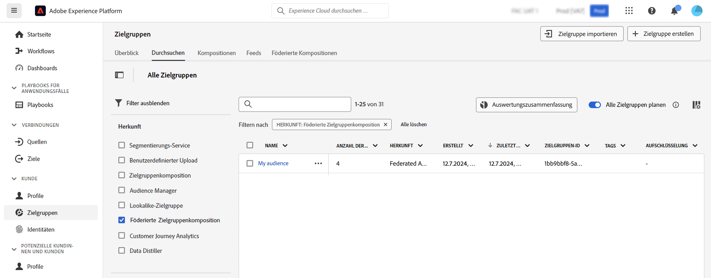

# Arbeiten mit Zielgruppen {#gs-audiences}

Mit der Komposition föderierter Zielgruppen in Experience Platform können Sie [Kompositionen erstellen](../compositions/gs-compositions.md). Dabei können Sie verschiedene Aktivitäten in einer visuellen Arbeitsfläche nutzen, um Zielgruppen zu erstellen und sie im Adobe Experience Platform Audience Portal zu speichern.

Anschließend können Sie können diese Zielgruppe in Journey Optimizer als Ziel auswählen oder für ein beliebiges von Adobe Experience Platform unterstütztes Ziel aktivieren.

## Zielgruppenerstellung mit Kompositionen {#creation}

Um Zielgruppen mithilfe der Komposition föderierter Zielgruppen zu erstellen, müssen Sie eine Komposition einschließlich einer Aktivität **[!UICONTROL Zielgruppe speichern]** erstellen. Mit dieser Aktivität können Sie die Zielgruppe in Audience Portal speichern und Felder aus Ihren externen Datenbanken auswählen, die in die Zielgruppe aufgenommen werden sollen. [Erfahren Sie, wie Sie eine Aktivität „Zielgruppe speichern“ konfigurieren können](../compositions/activities/save-audience.md)

Zielgruppen, die mithilfe der Komposition föderierter Daten von Adobe erstellt wurden, enthalten alle in der Aktivität **[!UICONTROL Zielgruppe speichern]** ausgewählten Felder und werden im Zielgruppenportal zusammen mit allen Adobe Experience Platform-Zielgruppen gespeichert. 

Nach der Ausführung der Komposition wird die resultierende Zielgruppe in Adobe Experience Platform als externe Zielgruppe gespeichert und in Adobe Real-Time Customer Data Platorm und/oder Adobe Journey Optimizer zur Verfügung gestellt. 

Sie können diese Zielgruppen für jedes von Adobe Experience Platform unterstützte Ziel aktivieren. Informationen zur Arbeit mit Zielen in [Adobe Experience Platform](https://experienceleague.adobe.com/de/docs/experience-platform/destinations/home){target="_blank"}

>[!NOTE]
>
>Zielgruppen, die mithilfe der Komposition föderierter Zielgruppen erstellt wurden, können nicht bearbeitet werden. Um Änderungen an einer dieser Zielgruppen vorzunehmen, müssen Sie mithilfe einer Komposition eine neue Zielgruppe erstellen.

## Zugreifen auf Ihre Zielgruppe in Adobe Experience Platform {#access-audience}

Zielgruppen, die mit der Komposition föderierter Zielgruppen erstellt wurden, sind im Zielgruppenportal zugänglich, auf das Sie über das Menü **Zielgruppen** zugreifen können.

Auf der Registerkarte **[!UICONTROL Durchsuchen]** werden alle in Adobe Experience Platform gespeicherten Zielgruppen aufgelistet. Sie können die Zielgruppen der Komposition föderierter Zielgruppen in der Liste mithilfe der Spalte **[!UICONTROL Herkunft]** oder der im linken Bereich verfügbaren Filter identifizieren.

Weitere Informationen zum Arbeiten mit Zielgruppen in Adobe Experience Platform finden Sie in der [Dokumentation zum Zielgruppenportal](https://experienceleague.adobe.com/de/docs/experience-platform/segmentation/ui/audience-portal){target="_blank"}.

<!-- add link to this donc once published: https://jira.corp.adobe.com/browse/PLAT-198674-->