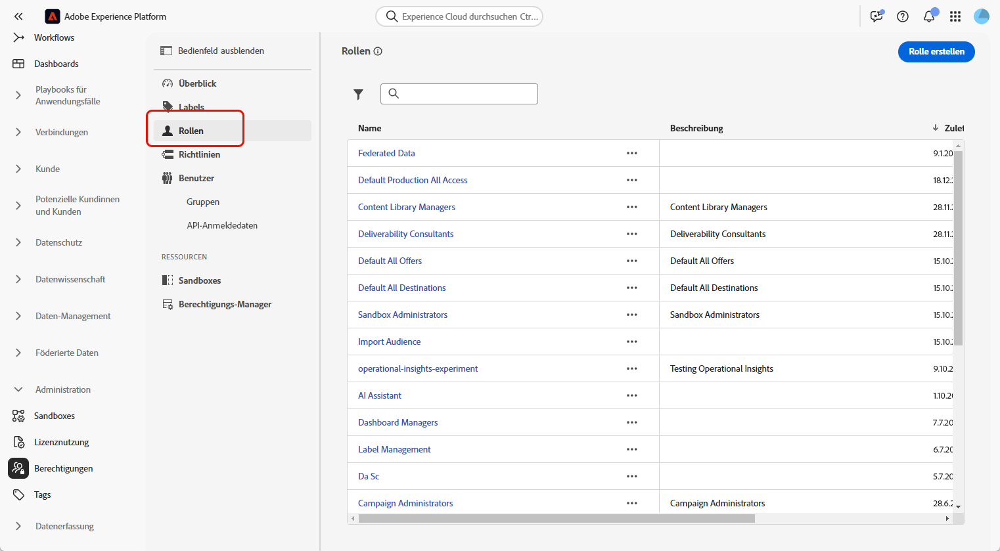
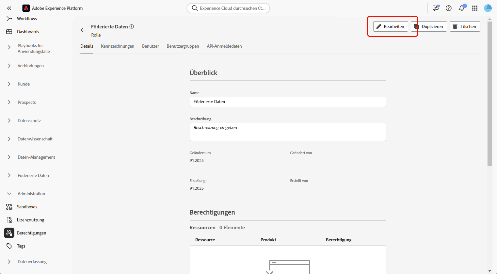
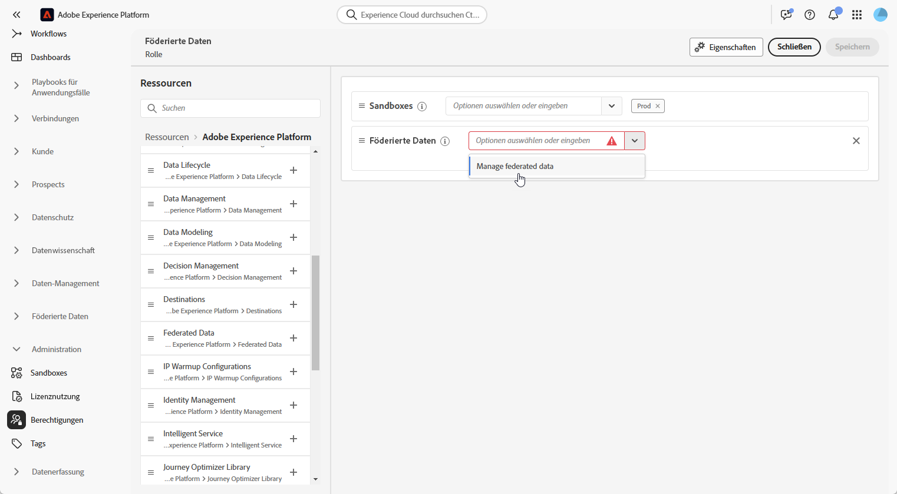
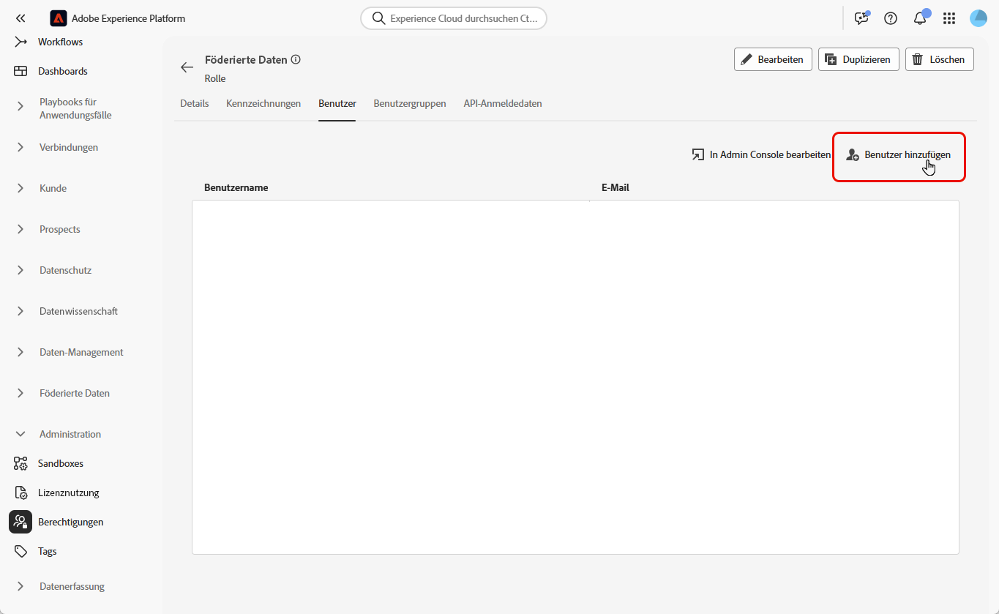

# Zugreifen auf die Komposition föderierter Zielgruppen {#feature-access}

## Verwalten des Zugriffs auf Sandboxes {#access-sandboxes}

Wenn Sie die Komposition föderierter Zielgruppen innerhalb von Adobe Experience Platform erwerben, wird zu diesem Zeitpunkt für jede aktive Sandbox ein Produktprofil erstellt. Dieses Produktprofil wird in der Admin Console unter der Produktkarte **Adobe Experience Platform** erstellt und folgt dieser Namenskonvention: `ACP_FAC - <<SandboxName>> - admin.` Für den Zugriff auf die Komposition föderierter Zielgruppen für eine bestimmte Sandbox müssen Benutzende zum Produktprofil hinzugefügt werden, das für diese Sandbox erstellt wurde.

Wirds beispielsweise eine neue Sandbox mit dem Namen „fac-test“ aktiviert, wird das entsprechende Produktprofil „ACP_FAC – fac-test – admin“ erstellt. Um mit dieser Sandbox auf die Komposition föderierter Zielgruppen zugreifen zu können, müssen Benutzende diesem Produktprofil hinzugefügt werden.

## Verwalten des Zugriffs auf die Komposition föderierter Zielgruppen

Um auf die **Komposition föderierter Zielgruppen** zugreifen zu können, müssen Sie zunächst sicherstellen, dass die Berechtigung für **Föderierte Daten verwalten** den entsprechenden Rollen zugewiesen wurde. Diese Rollen müssen dann Benutzenden zugewiesen werden, die Zugriff auf die **Komposition föderierter Zielgruppen** benötigen.

Beachten Sie, dass Berechtigungen nur von Admins zugewiesen werden können.

1. Navigieren Sie zum Menü **[!UICONTROL Berechtigungen]**.

1. Wählen Sie im Menü **[!UICONTROL Rollen]** die **[!UICONTROL Rolle]** aus, die Sie aktualisieren möchten.

   

1. Klicken Sie auf **[!UICONTROL Bearbeiten]**, um die Berechtigungen Ihrer Rolle zu ändern.

   

1. Fügen Sie die Ressource **Föderierte Daten** hinzu und wählen Sie dann aus dem Dropdown-Menü die Option **[!UICONTROL Föderierte Daten verwalten]** aus.

   

1. Nachdem Sie die erforderlichen Änderungen vorgenommen haben, klicken Sie auf **[!UICONTROL Speichern]**.

Für alle Benutzenden, die dieser Rolle bereits zugewiesen sind, werden die Berechtigungen automatisch aktualisiert und sie erhalten Zugriff auf die Komposition föderierter Zielgruppen.

So weisen Sie diese Rolle neuen Benutzenden zu:

1. Navigieren Sie zur Registerkarte **[!UICONTROL Benutzer]** in Ihrem Rollen-Dashboard und klicken Sie auf **[!UICONTROL Benutzer hinzufügen]**.

   

1. Geben Sie den Namen oder die E-Mail-Adresse der Person ein oder wählen Sie sie aus der verfügbaren Liste aus. Wenn Sie fertig sind, klicken Sie auf **[!UICONTROL Speichern]**.

Die Person erhält dann eine E-Mail mit Anweisungen zum Zugriff auf Ihre Instanz. Wenn die Person vorher noch nicht erstellt wurde, lesen Sie [diese Dokumentation](https://experienceleague.adobe.com/de/docs/experience-platform/access-control/abac/permissions-ui/users).
