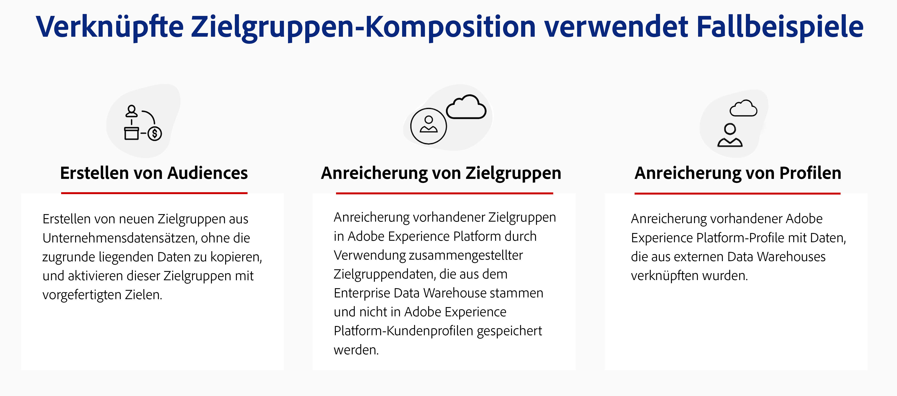
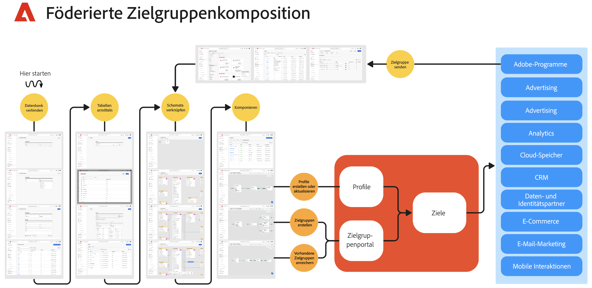

# Erste Schritte mit der Komposition föderierter Zielgruppen {#gs-fac}

Die Komposition föderierter Zielgruppen ist für [Adobe Real-Time Customer Data Platform](https://experienceleague.adobe.com/de/docs/experience-platform/segmentation/home){target="_blank"}- und [Adobe Journey Optimizer](https://experienceleague.adobe.com/de/docs/journey-optimizer/using/ajo-home){target="_blank"}-Umgebungen verfügbar. Die Komposition föderierter Zielgruppen ermöglicht es Ihnen, Zielgruppen aus Data Warehouses anderer Drittanbieter zu erstellen und anzureichern und die Zielgruppen in Adobe Experience Platform zu importieren. Die Komposition föderierter Zielgruppen bietet eine einfache und leistungsstarke Lösung, um Ihr Unternehmens-Data Warehouse direkt in Adobe Real-Time Customer Data Platform und/oder Adobe Journey Optimizer zu verbinden und Abfragen über die Tabellen in Ihrem Data Warehouse durchzuführen.

Mit der Komposition föderierter Zielgruppen von Adobe können Benutzerinnen und Benutzer von Adobe Experience Platform-Apps auf ihre Kundendaten zugreifen, die in ihren Data Warehouses und auf Cloud-Speicherplattformen wie Amazon Redshift, Azure Synapse Analytics usw. gespeichert sind. Kundendaten können in mehreren Data Warehouses gespeichert werden und sind jetzt ohne Replikation sofort verfügbar. Welche Plattformen unterstützt werden, erfahren Sie auf [dieser Seite](../connections/federated-db.md#supported-db).

>[!INFO]
>
>In dieser [schrittweisen Anleitung](https://experienceleague.adobe.com/de/docs/platform-learn/tutorial-comprehensive-technical/datacollection/module13/fac) erfahren Sie, wie Sie Zielgruppen mit der Komposition föderierter Zielgruppen erstellen.

## Funktionen {#rn-capabilities}

Die Komposition föderierter Zielgruppen steigert den Wert von Real-Time CDP und Adobe Journey Optimizer mit einem umfassenden Ansatz für die Kuration und Aktivierung von Zielgruppen:

* Erweitern Sie den Zugriff auf kritische Warehouse-basierte Datensätze, um hochwertige Zielgruppen zu erstellen: Nutzen Sie vorhandene Data Warehouses als Hauptaufzeichnungssystem und nutzen Sie gleichzeitig marktführende Anwendungen, um großartige Kundenerlebnisse zu erzielen.

* Umfassende Unterstützung für Anwendungsfälle zur Interaktion: Die Komposition föderierter Zielgruppen in Verbindung mit Real-Time CDP oder Journey Optimizer unterstützt markeninitiierte, personalisierte Erlebnisse mit föderierten Zielgruppen und bietet durch Echtzeitereignisse ausgelöste Ad-hoc-Erlebnisse, in Kombination mit Attributen zu Personen, um die Anforderungen an Anwendungsfälle über alle Teams hinweg zu erfüllen.

* Minimieren der Datenbewegung und -duplizierung: Erstellen Sie Zielgruppen aus Datensätzen, die in einem Unternehmens-Data Warehouse gespeichert sind, ohne die zugrunde liegenden Daten zu kopieren, um umsetzbare Marketing-Profile und -Zielgruppen zu verwalten.

* Verwenden Sie ein einziges System für erlebnisgesteuerte Workflows: Kuratieren Sie aufgenommene und föderierte Zielgruppen in Adobe Experience Platform und koordinieren Sie ausgehende Erlebnisse über alle Kanäle hinweg.

* B2C- und B2B-CDP-Kundschaft kann jetzt die Komposition föderierter Zielgruppen nutzen, um personenbasierte Zielgruppen zu erstellen, indem sie Daten aus unterstützten Unternehmens-Data-Warehouses integriert. Darüber hinaus besteht die Möglichkeit, bestehende, personenbasierte Zielgruppen von AEP anzureichern, indem relevante Attribute, die im Unternehmens-Data-Warehouse verfügbar sind, integriert werden und die Zielgruppenprofile so verbessert werden, um eine personalisiertere und zielgerichtetere Interaktion zu ermöglichen.

## Anwendungsfälle {#rn-uc}

Erstellen Sie über eine Marketing-freundliche Benutzeroberfläche Segmentregeln, mit denen in Ihrem Data Warehouse eine Liste der Benutzenden abgefragt wird, die für ein bestimmtes, für Marketing-Kampagnen benötigtes Segment infrage kommen. Greifen Sie zur Aktivierung auf vorhandene Zielgruppen im Warehouse zu oder reichern Sie Adobe Experience Platform-Zielgruppen mit zusätzlichen Datenpunkten aus dem Warehouse an.

In dieser Version sind zwei Anwendungsfälle verfügbar:

1. Zielgruppenerstellung: Erstellen Sie neue Zielgruppen aus Unternehmensdatensätzen, ohne die zugrunde liegenden Daten zu kopieren, und aktivieren Sie diese Zielgruppen mit vorkonfigurierten Zielen.

1. Zielgruppenanreicherung: Reichern Sie vorhandene Zielgruppen in Adobe Experience Platform an, indem Sie zusammengestellte Zielgruppendaten verwenden, die mit dem Unternehmens-Data Warehouse föderiert wurden. Diese Daten werden nicht in Adobe Experience Platform-Kundenprofilen beibehalten.

{zoomable="yes"}{width="75%" align="center"}

## Die wichtigsten Schritte {#gs-steps}

Mit der Komposition föderierter Zielgruppen von Adobe können Sie Adobe Experience Platform-Zielgruppen direkt aus Ihrer Datenbank erstellen und aktualisieren, ohne dass ein Aufnahmevorgang erforderlich ist.

<!--{zoomable="yes"}{width="85%" align="center"}-->

Die wichtigsten Schritte:

1. **Datenintegration**: Führen Sie Daten aus verschiedenen Quellen zu einem einheitlichen Datensatz zusammen. Informationen zum Verbinden von Adobe Experience Platform-Apps mit Ihrem Unternehmens-Data Warehouse, den unterstützten Datenbanken und deren Konfiguration finden Sie in [diesem Abschnitt](../connections/federated-db.md).

1. **Datenmodellierung**: Entwerfen und erstellen Sie Datenmodelle und -schemata, welche die Struktur, die Beziehungen und Einschränkungen der Daten definieren. Weitere Informationen zu Schemata finden Sie auf [dieser Seite](../customer/schemas.md). Wie Sie Links für Ihr Datenmodell erstellen, erfahren Sie auf [dieser Seite](../data-management/gs-models.md).

1. **Datenumwandlung**: Wenden Sie Datenbearbeitungsmethoden an, um das Format, die Struktur oder die Werte von Datenelementen zu ändern, damit sie kompatibel oder für bestimmte Analysen oder Anwendungen geeignet sind.

1. **Datennutzung**: Erstellen, orchestrieren und bauen Sie Zielgruppen auf. Wie Sie Zielgruppen erstellen, erfahren Sie auf [dieser Seite](../compositions/gs-compositions.md). Sie können vorhandene Zielgruppen auch über das Zielgruppenportal und die Ziele von Adobe Experience Platform aktualisieren oder wiederverwenden. Weitere Informationen finden Sie auf [dieser Seite](../connections/destinations.md).

>[!NOTE]
>
>Nach der Ausführung der Komposition wird die resultierende Zielgruppe in Adobe Experience Platform als externe Zielgruppe gespeichert und in Adobe Real-Time Customer Data Platform und/oder Adobe Journey Optimizer zur Verfügung gestellt. Sie wird im Menü **Zielgruppen** zur Verfügung gestellt. [Weitere Informationen](https://experienceleague.adobe.com/de/docs/experience-platform/segmentation/ui/audience-portal){target="_blank"}

## Verwaltung, Datenschutz und Sicherheit {#governance-privacy-security}

### Datenschutzanfragen {#gov-privacy-requests}

Nachdem Sie eine Komposition erstellt haben, werden die resultierenden Zielgruppen in Adobe Experience Platform gespeichert.

Anschließend können Sie Datenschutzanfragen stellen, um auf Profildaten, die diesen Zielgruppen entsprechen, zuzugreifen und/oder sie zu löschen. Verwenden Sie dazu Adobe Experience Platform **Privacy Service**, das eine [Benutzeroberfläche](https://experienceleague.adobe.com/docs/experience-platform/privacy/ui/user-guide.html?lang=de){target="_blank"} und ein [RESTful-API](https://experienceleague.adobe.com/de/docs/experience-platform/privacy/api/overview){target="_blank"} bereitstellt, um Sie bei der Verwaltung von Kundendatenanfragen zu unterstützen.

>[!NOTE]
>
>Weitere Informationen zu Privacy Service finden Sie in der [Dokumentation zu Adobe Experience Platform](https://experienceleague.adobe.com/docs/experience-platform/privacy/home.html?lang=de){target="_blank"}.

Sie können individuelle Anfragen für den Zugriff auf und die Löschung von Kundendaten aus der Komposition föderierter Zielgruppen von Adobe erstellen und verwalten. Die Schritte zum Senden von **Zugriffsanfragen** und **Löschanfragen** werden in der [Dokumentation zum Echtzeit-Kundenprofil](https://experienceleague.adobe.com/de/docs/experience-platform/profile/privacy){target="_blank"} beschrieben.

### Audit-Protokoll {#gov-audit-trail}

Die Funktion „Audit-Protokoll“ bietet eine detaillierte und chronologische Übersicht aller Aktionen und Ereignisse, die in Echtzeit an Ihrer Umgebung durchgeführt wurden. [Weitere Informationen](../admin/audit-trail.md)

## Weitere Informationen {#learn}

<!-- Workflow + Workflow activities-->

Auf [dieser Seite](access-prerequisites.md) erfahren Sie, wie Sie auf die Funktion „Komposition föderierter Zielgruppen“, Leitlinien und Einschränkungen zugreifen können.

Sehen Sie sich auch die häufig gestellten Fragen auf [dieser Seite](faq.md) an.

>[!CONTEXTUALHELP]
>id="dc_workflow_settings_execution"
>title="Ausführungseinstellungen"
>abstract="In diesem Abschnitt können Sie Einstellungen für die Ausführung der Komposition konfigurieren, beispielsweise für wie viele Tage der Kompositionsverlauf gespeichert wird."

>[!CONTEXTUALHELP]
>id="dc_orchestration_query_enrichment_noneditable"
>title="Aktivität nicht bearbeitbar"
>abstract="Wenn eine **Abfrage** oder **Anreicherung** mit zusätzlichen Daten in der Konsole konfiguriert wird, werden die Anreicherungsdaten berücksichtigt und an die ausgehende Transition übergeben. Sie können jedoch nicht bearbeitet werden."

<!-- Create a link -->

>[!CONTEXTUALHELP]
>id="dc_federated_database_create_link"
>title="Link erstellen"
>abstract="Die Link-Einstellungen definieren."

<!-- incremental query IDs -->

>[!CONTEXTUALHELP]
>id="dc_orchestration_incrementalquery"
>title="Inkrementelle Abfrage"
>abstract="Mit der Aktivität **Inkrementelle Abfrage** können Sie die Datenbank mithilfe des Abfrage-Modelers abfragen. Bei jeder neuen Ausführung dieser Aktivität werden die Ergebnisse der vorangehenden Ausführungen ausgeschlossen. Dadurch lassen sich ausschließlich neue Elemente abrufen."

>[!CONTEXTUALHELP]
>id="dc_orchestration_incrementalquery_history"
>title="Inkrementeller Abfrageverlauf"
>abstract="Inkrementeller Abfrageverlauf"

>[!CONTEXTUALHELP]
>id="dc_orchestration_incrementalquery_processeddata"
>title="Inkrementelle Abfrage – Verarbeitete Daten"
>abstract="Inkrementelle Abfrage – Verarbeitete Daten"

>[!CONTEXTUALHELP]
>id="dc_orchestration_incrementalmode_standard"
>title="Modus „Inkrementelle Abfrage“"
>abstract="Die inkrementelle Abfrage ermöglicht es Ihnen, dieselbe Abfrage mehrmals auszuführen, indem die Ergebnisse früherer Ausführungen für jede neue Ausführung ausgeschlossen werden."

>[!CONTEXTUALHELP]
>id="dc_orchestration_incrementalmode_custom"
>title="Modus „Inkrementelle Abfrage“"
>abstract="Die inkrementelle Abfrage ermöglicht es Ihnen, dieselbe Abfrage mehrmals auszuführen, indem nur die Ergebnisse berücksichtigt werden, bei denen das Datum im Datumsfeld nach oder an dem Datum der letzten Ausführung der inkrementellen Abfrage liegt."

>[!CONTEXTUALHELP]
>id="dc_orchestration_build_audience_dimension"
>title="Auswählen der Zielgruppendimension"
>abstract="Die Zielgruppendimension ermöglicht die Bestimmung der vom Vorgang betroffenen Population: Empfängerinnen und Empfänger, Vertragsbegünstigte, Benutzerinnen und Benutzer, Abonnentinnen und Abonnenten usw. Standardmäßig wird die Zielgruppe für E-Mails und SMS in der integrierten Tabelle der Empfängerinnen und Empfänger ausgewählt. Bei Push-Benachrichtigungen ist die Standard-Zielgruppendimension „Abonnierte Anwendungen“."

<!-- save profile IDs-->

>[!CONTEXTUALHELP]
>id="dc_orchestration_saveprofile"
>title="Profil speichern"
>abstract="Profil speichern"

>[!CONTEXTUALHELP]
>id="dc_orchestration_saveprofile_aepschemalist"
>title="Profil speichern – AEP-Schema-Liste"
>abstract="Profil speichern – AEP-Schema-Liste"

>[!CONTEXTUALHELP]
>id="dc_orchestration_saveprofile_selectaepattribute"
>title="Profil speichern – AEP-Schemaattribut"
>abstract="Profil speichern – AEP-Schemaattribut"

>[!CONTEXTUALHELP]
>id="dc_orchestration_saveprofile_primaryidentitynamespace"
>title="Primäres Identifizierungsfeld auswählen"
>abstract="Primäres Identifizierungsfeld zur Verwendung für Profile."

>[!CONTEXTUALHELP]
>id="ddc_orchestration_saveprofile_selectdataset"
>title="AEP-Datensatz"
>abstract="Wählen Sie den AEP-Datensatz aus, der für Profile verwendet werden soll."

>[!CONTEXTUALHELP]
>id="dc_orchestration_saveprofile_selectaepschema"
>title="Profil speichern – AEP-Schema auswählen"
>abstract="Wählen Sie das AEP-Schema aus, das für Profile verwendet werden soll."
